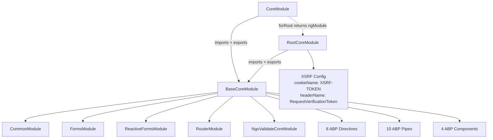

ABP's Angular UI is delivered as a set of scoped npm packages under `@abp/ng.*`. Each package is a standalone Angular library that maps to a specific ABP module or concern. The packages live in the ABP monorepo under `npm/ng-packs/packages/`.

## Package Inventory

```
npm/ng-packs/packages/
├── core/                    @abp/ng.core
├── theme-shared/            @abp/ng.theme.shared
├── theme-basic/             @abp/ng.theme.basic
├── account/                 @abp/ng.account
├── account-core/            @abp/ng.account.core
├── identity/                @abp/ng.identity
├── tenant-management/       @abp/ng.tenant-management
├── permission-management/   @abp/ng.permission-management
├── feature-management/      @abp/ng.feature-management
├── setting-management/      @abp/ng.setting-management
├── oauth/                   @abp/ng.oauth
├── components/              @abp/ng.components
├── cms-kit/                 @abp/ng.cms-kit
├── schematics/              @abp/ng.schematics
└── generators/              Internal code generators
```

<CardGroup cols={2}>
  <Card title="@abp/ng.core" icon="cube">
    The foundation package. Provides HTTP interceptors, localization pipes, permission directives, state management, proxy types, config services, and the `CoreModule`/`provideAbpCore` function.
  </Card>
  <Card title="@abp/ng.oauth" icon="lock">
    OIDC / OAuth 2.0 integration using `angular-oauth2-oidc`. Configures discovery document fetching, token storage, and silent refresh. Provides `OAuthGuard` and auth interceptors.
  </Card>
  <Card title="@abp/ng.theme.shared" icon="palette">
    Shared theme infrastructure: confirmation modals, loader indicators, breadcrumbs, toast notifications, form validation integration, and `ThemeSharedModule`.
  </Card>
  <Card title="@abp/ng.theme.basic" icon="paintbrush">
    The Basic Theme Angular implementation: application layout, account layout, nav menu, breadcrumbs, and the top toolbar. Depends on `@abp/ng.theme.shared`.
  </Card>
  <Card title="@abp/ng.identity" icon="id-card">
    Angular UI for the Identity module: user management, role management, claim management, and organization units.
  </Card>
  <Card title="@abp/ng.account" icon="user">
    Account pages: login, registration, forgot password, email confirmation, profile management. Uses `@abp/ng.account.core` for the service layer.
  </Card>
  <Card title="@abp/ng.tenant-management" icon="building">
    Multi-tenant management UI: tenant CRUD, connection string management.
  </Card>
  <Card title="@abp/ng.permission-management" icon="shield-check">
    Permission management modal component used by Identity and Tenant Management.
  </Card>
  <Card title="@abp/ng.feature-management" icon="sliders">
    Feature management modal for enabling/disabling feature flags per tenant or edition.
  </Card>
  <Card title="@abp/ng.setting-management" icon="gear">
    Settings UI: email settings, account settings, timezone/language configuration.
  </Card>
  <Card title="@abp/ng.components" icon="window">
    Reusable UI components: extensible table, password strength indicator, form element helpers.
  </Card>
  <Card title="@abp/ng.schematics" icon="terminal">
    Angular schematics for `ng add`, `ng generate abp-proxy`, and module scaffolding. See the generate-proxy CLI command.
  </Card>
</CardGroup>

## CoreModule Architecture

`@abp/ng.core` ships three Angular module classes and two provider functions:

```typescript
// Full module (exported from @abp/ng.core)
export class CoreModule {
  /**
   * @deprecated Use provideAbpCore() instead.
   */
  static forRoot(options = {} as ABP.Root): ModuleWithProviders<RootCoreModule> {
    return {
      ngModule: RootCoreModule,
      providers: [provideAbpCore(withOptions(options))],
    };
  }

  /**
   * @deprecated Use provideAbpCoreChild() instead.
   */
  static forChild(options = {} as ABP.Child): ModuleWithProviders<RootCoreModule> {
    return {
      ngModule: RootCoreModule,
      providers: [provideAbpCoreChild(options)],
    };
  }
}
```

### Module Hierarchy



**`BaseCoreModule`** holds all imports, declarations, and exports. It is the module imported and re-exported by all other CoreModule variants, giving feature modules access to ABP directives, pipes, and components without re-registering root-level providers.

**`RootCoreModule`** imports and exports `BaseCoreModule`, and additionally provides XSRF configuration:

```typescript
@NgModule({
  exports: [BaseCoreModule],
  imports: [BaseCoreModule],
  providers: [
    provideHttpClient(
      withXsrfConfiguration({
        cookieName: 'XSRF-TOKEN',
        headerName: 'RequestVerificationToken',
      }),
    ),
  ],
})
export class RootCoreModule {}
```

`CoreModule.forRoot()` returns `{ ngModule: RootCoreModule, ... }`, so `RootCoreModule` — not `CoreModule` itself — is the actual module bootstrapped at the application root. `CoreModule` exists solely as the public API class with the deprecated `forRoot`/`forChild` static methods.

**`CoreModule`** is the public API for consumers. New Angular applications should use the standalone provider functions instead.

### Modern Provider API (Angular 14+)

```typescript
// app.config.ts
import { provideAbpCore, withOptions } from '@abp/ng.core';

export const appConfig: ApplicationConfig = {
  providers: [
    provideAbpCore(
      withOptions({
        environment,
        // Optional overrides:
        registerLocaleFn: registerLocale,
      })
    ),
    // ...
  ],
};
```

`provideAbpCore` replaces `CoreModule.forRoot()`. `withOptions` accepts the same `ABP.Root` options object.

## Directives Exported by CoreModule

| Directive | Selector | Purpose |
|---|---|---|
| `PermissionDirective` | `[abpPermission]` | Show/hide element based on policy name |
| `ReplaceableTemplateDirective` | `[abpReplaceableTemplate]` | Replace a template from a module |
| `ForDirective` | `[abpFor]` | Enhanced `*ngFor` with index tracking |
| `InitDirective` | `[abpInit]` | Trigger action on element initialization |
| `AutofocusDirective` | `[abpAutoFocus]` | Autofocus an element when rendered |
| `InputEventDebounceDirective` | `[abpDebounce]` | Debounce input events |
| `StopPropagationDirective` | `[abpStopPropagation]` | Stop click/event propagation |
| `FormSubmitDirective` | `[abpFormSubmit]` | Validate form on submit |

## Pipes Exported by CoreModule

| Pipe | Name | Purpose |
|---|---|---|
| `LocalizationPipe` | `abpLocalization` | `'ResourceName::Key' \| abpLocalization` |
| `AsyncLocalizationPipe` | `abpAsyncLocalization` | Async variant of localization pipe |
| `LazyLocalizationPipe` | `abpLazyLocalization` | Deferred localization (for large resources) |
| `SafeHtmlPipe` | `abpSafeHtml` | Bypass Angular's HTML sanitizer safely |
| `ShortDatePipe` | `abpShortDate` | Locale-aware short date format |
| `ShortTimePipe` | `abpShortTime` | Locale-aware short time format |
| `ShortDateTimePipe` | `abpShortDateTime` | Combined short date+time |
| `SortPipe` | `abpSort` | Sort array by property |
| `UtcToLocalPipe` | `abpUtcToLocal` | Convert UTC datetime to local timezone |
| `ToInjectorPipe` | `abpToInjector` | Convert value to Angular `Injector` |

## Components Exported by CoreModule

| Component | Purpose |
|---|---|
| `DynamicLayoutComponent` | Renders layout components resolved from `IThemeSelector` |
| `ReplaceableRouteContainerComponent` | Allows routes to be replaced by external modules |
| `RouterOutletComponent` | Wrapper for `<router-outlet>` with ABP lifecycle hooks |
| `AbstractNgModelComponent` | Base class for custom form controls implementing `ControlValueAccessor` |

## Public API Surface

`@abp/ng.core`'s `public-api.ts` exports these categories (shown verbatim from source):

```typescript
// export * from './lib/handlers';  // intentionally commented out in source
export * from './lib/abstracts';
export * from './lib/components';
export * from './lib/constants';
export * from './lib/core.module';
export * from './lib/directives';
export * from './lib/enums';
export * from './lib/guards';
export * from './lib/localization.module';
export * from './lib/models';
export * from './lib/pipes';
export * from './lib/providers';

// Generated proxy types (bundled into the core package)
export * from './lib/proxy/pages/abp/multi-tenancy';
export * from './lib/proxy/volo/abp/asp-net-core/mvc/api-exploring';
export * from './lib/proxy/volo/abp/asp-net-core/mvc/application-configurations';
export * from './lib/proxy/volo/abp/asp-net-core/mvc/application-configurations/object-extending';
export * from './lib/proxy/volo/abp/asp-net-core/mvc/multi-tenancy';
export * from './lib/proxy/volo/abp/multi-tenancy';
export * from './lib/proxy/volo/abp/http/modeling';
export * from './lib/proxy/volo/abp/localization';
export * from './lib/proxy/volo/abp/models';

export * from './lib/services';
export * from './lib/strategies';
export * from './lib/tokens';
export * from './lib/utils';
export * from './lib/validators';
export * from './lib/interceptors';
export * from './lib/clients';
```

## ABP.Root Configuration Options

```typescript
export interface ABP {
  Root: {
    environment: Environment;           // API URLs, OAuth config, app info
    registerLocaleFn?: RegisterLocale;  // Angular locale registration function
    // See also: withOptions() in provideAbpCore
  };
}

export interface Environment {
  production: boolean;
  application: ApplicationInfo;
  oAuthConfig: AuthConfig;           // angular-oauth2-oidc config
  apis: {
    default: ApiConfig;              // { url: string; rootNamespace: string }
    [key: string]: ApiConfig;        // Named API configs for microservices
  };
}
```

The `environment` object drives everything: where to find the API, how to authenticate via OAuth, and how to map application namespaces to API URLs for proxy generation.
