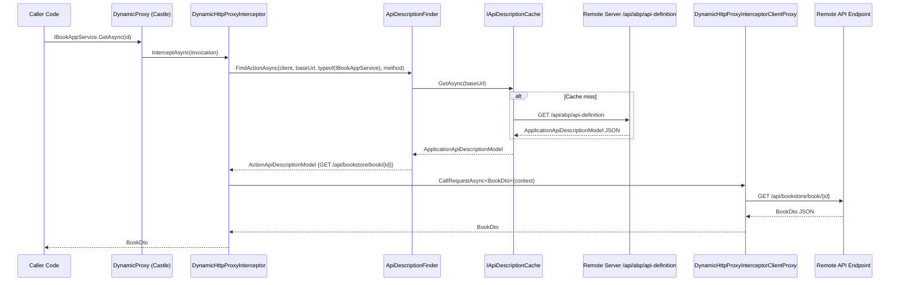

ABP provides two mechanisms for calling remote services: a runtime dynamic proxy (for .NET-to-.NET calls) and a code-generated static proxy (for Angular and other clients). Both share the same underlying API description model sourced from `/api/abp/api-definition`.

## .NET Dynamic HTTP Proxy

The dynamic proxy system intercepts calls to application service interfaces and routes them as HTTP requests to the remote server — no hand-written `HttpClient` code needed.

### Registration

```csharp
// In the consuming module (e.g., an API gateway or client microservice)
context.Services.AddHttpClientProxies(
    typeof(BookStoreApplicationContractsModule).Assembly,
    remoteServiceConfigurationName: "BookStore"
);
```

`AddHttpClientProxies` scans the assembly for types implementing `IRemoteService` (which `IApplicationService` extends) and registers a dynamic proxy for each one using Castle.DynamicProxy.

### DynamicHttpProxyInterceptor&lt;TService&gt;

```csharp
public class DynamicHttpProxyInterceptor<TService> : AbpInterceptor, ITransientDependency
{
    protected IApiDescriptionFinder ApiDescriptionFinder { get; }
    protected DynamicHttpProxyInterceptorClientProxy<TService> InterceptorClientProxy { get; }

    public override async Task InterceptAsync(IAbpMethodInvocation invocation)
    {
        var context = new ClientProxyRequestContext(
            await GetActionApiDescriptionModel(invocation),
            invocation.ArgumentsDictionary,
            typeof(TService));

        if (invocation.Method.ReturnType.GenericTypeArguments.IsNullOrEmpty())
        {
            using (await InterceptorClientProxy.CallRequestAsync(context)) { }
        }
        else
        {
            var returnType = invocation.Method.ReturnType.GenericTypeArguments[0];
            var result = (Task)CallRequestAsyncMethod
                .MakeGenericMethod(returnType)
                .Invoke(this, new object[] { context })!;
            invocation.ReturnValue = await GetResultAsync(result, returnType);
        }
    }

    protected virtual async Task<ActionApiDescriptionModel> GetActionApiDescriptionModel(
        IAbpMethodInvocation invocation)
    {
        var clientConfig = ClientOptions.HttpClientProxies.GetOrDefault(typeof(TService))
            ?? throw new AbpException($"Could not get DynamicHttpClientProxyConfig for {typeof(TService).FullName}.");

        var remoteServiceConfig = await RemoteServiceConfigurationProvider
            .GetConfigurationOrDefaultAsync(clientConfig.RemoteServiceName);

        var client = HttpClientFactory.Create(clientConfig.RemoteServiceName);

        return await ApiDescriptionFinder.FindActionAsync(
            client,
            remoteServiceConfig.BaseUrl,
            typeof(TService),
            invocation.Method
        );
    }
}
```

The interceptor:
1. Finds the `DynamicHttpClientProxyConfig` for `TService` (set during `AddHttpClientProxies`).
2. Resolves the remote service base URL from `AbpRemoteServiceOptions`.
3. Calls `ApiDescriptionFinder.FindActionAsync` to get the `ActionApiDescriptionModel` (HTTP method, URL template, parameter locations).
4. Delegates the actual HTTP call to `DynamicHttpProxyInterceptorClientProxy`, which handles body serialization, URL building, and response deserialization.
5. Unwraps the `Task<T>` result via reflection (since the return type is only known at runtime).

### ApiDescriptionFinder

`ApiDescriptionFinder` fetches and caches the full API description from the remote server's `/api/abp/api-definition` endpoint:

```csharp
public class ApiDescriptionFinder : IApiDescriptionFinder, ITransientDependency
{
    protected IApiDescriptionCache Cache { get; }

    public async Task<ActionApiDescriptionModel> FindActionAsync(
        HttpClient client,
        string baseUrl,
        Type serviceType,
        MethodInfo method)
    {
        var apiDescription = await GetApiDescriptionAsync(client, baseUrl);

        var methodParameters = method.GetParameters().ToArray();

        foreach (var module in apiDescription.Modules.Values)
        {
            foreach (var controller in module.Controllers.Values)
            {
                if (!controller.Implements(serviceType)) continue;

                foreach (var action in controller.Actions.Values)
                {
                    if (action.Name == method.Name &&
                        action.ParametersOnMethod.Count == methodParameters.Length)
                    {
                        // Verify parameter types match
                        bool found = true;
                        for (int i = 0; i < methodParameters.Length; i++)
                        {
                            if (!TypeMatches(action.ParametersOnMethod[i], methodParameters[i]))
                            {
                                found = false;
                                break;
                            }
                        }
                        if (found) return action;
                    }
                }
            }
        }

        throw new AbpException(
            $"Could not find remote action for method: {method} on the URL: {baseUrl}");
    }

    protected virtual async Task<ApplicationApiDescriptionModel>
        GetApiDescriptionFromServerAsync(HttpClient client, string baseUrl)
    {
        var requestMessage = new HttpRequestMessage(
            HttpMethod.Get,
            baseUrl.EnsureEndsWith('/') + "api/abp/api-definition"
        );

        AddHeaders(requestMessage); // CorrelationId, TenantId, Accept-Language
        var response = await client.SendAsync(requestMessage, ...);
        return JsonSerializer.Deserialize<ApplicationApiDescriptionModel>(
            await response.Content.ReadAsStringAsync(), DeserializeOptions)!;
    }
}
```

The `ApplicationApiDescriptionModel` is a hierarchical model:
- `Modules` → `Controllers` → `Actions` → `Parameters`

Each `ActionApiDescriptionModel` contains `HttpMethod`, `Url` (template with `{id}` etc.), and per-parameter binding sources (`body`, `query`, `route`, `header`).

### Request Headers Added

```csharp
protected virtual void AddHeaders(HttpRequestMessage requestMessage)
{
    // Distributed tracing
    requestMessage.Headers.Add(AbpCorrelationIdOptions.HttpHeaderName, correlationId);

    // Multi-tenancy
    if (CurrentTenant.Id.HasValue)
        requestMessage.Headers.Add(TenantResolverConsts.DefaultTenantKey,
            CurrentTenant.Id.Value.ToString());

    // Localization
    var currentCulture = CultureInfo.CurrentUICulture.Name ?? CultureInfo.CurrentCulture.Name;
    requestMessage.Headers.AcceptLanguage.Add(new StringWithQualityHeaderValue(currentCulture));
}
```

### API Description Cache

`IApiDescriptionCache` caches the `ApplicationApiDescriptionModel` per base URL. The cache prevents fetching `/api/abp/api-definition` on every intercepted call. By default the cache is held in memory for the application lifetime. In microservice scenarios where the remote API may change, the cache can be invalidated by restarting the client process.

## Proxy Call Flow



## Static Client Proxy Generation

For Angular, ABP generates static TypeScript service classes using the `generate-proxy` CLI command:

```bash
abp generate-proxy -t ng --module bookstore
```

This command:
1. Reads the `environment.ts` to find the API base URL
2. Fetches `/api/abp/api-definition` from the running API server
3. Generates TypeScript service classes, model interfaces, and enum types into `src/app/proxy/`

### Generated Proxy Structure

```
src/app/proxy/
├── books/
│   ├── book.service.ts           # Generated Angular service
│   ├── models.ts                 # DTOs as TypeScript interfaces
│   └── index.ts
└── index.ts
```

Example generated service:

```typescript
// Auto-generated by 'abp generate-proxy'
@Injectable({
  providedIn: 'root',
})
export class BookService {
  apiName = 'BookStore'; // Maps to environment.apis.BookStore.url

  create = (input: CreateBookDto) =>
    this.restService.request<any, BookDto>({
      method: 'POST',
      url: '/api/bookstore/book',
      body: input,
    },
    { apiName: this.apiName });

  get = (id: string) =>
    this.restService.request<any, BookDto>({
      method: 'GET',
      url: `/api/bookstore/book/${id}`,
    },
    { apiName: this.apiName });

  getList = (input: PagedAndSortedResultRequestDto) =>
    this.restService.request<any, PagedResultDto<BookDto>>({
      method: 'GET',
      url: '/api/bookstore/book',
      params: { ... },
    },
    { apiName: this.apiName });

  constructor(private restService: RestService) {}
}
```

### RestService

`RestService` (from `@abp/ng.core`) handles:
- URL resolution from `apiName` → `environment.apis[apiName].url`
- Authorization header injection (from `OAuthService`)
- XSRF token header injection
- Tenant header injection
- Error response mapping to `HttpErrorResponse` with ABP error DTO

```typescript
// RestService reads the API URL from environment
request<T, R>(requestArgs: Rest.Request<T>, config?: Partial<Rest.Config>): Observable<R> {
  const url = this.getApiUrl(config?.apiName ?? 'default') + requestArgs.url;
  return this.http.request<R>(requestArgs.method, url, {
    body: requestArgs.body,
    params: requestArgs.params,
  });
}
```

## Static vs Dynamic Proxy Comparison

| Aspect | Dynamic (.NET) | Static Angular |
|---|---|---|
| Generation | Runtime (Castle DynamicProxy) | Build-time (`abp generate-proxy`) |
| Discovery | `/api/abp/api-definition` at runtime | `/api/abp/api-definition` at build time |
| Type safety | Reflection-based | Full TypeScript types |
| Update on API change | Automatic (cache flush + restart) | Requires re-running `generate-proxy` |
| Auth headers | Via `DynamicHttpProxyInterceptorClientProxy` | Via `RestService` + interceptors |
| Use case | .NET microservices, module APIs | Angular SPA clients |

## Authentication Header Injection (.NET)

The `DynamicHttpProxyInterceptorClientProxy` adds authentication headers for secured API calls. The `IProxyHttpClientFactory` creates named `HttpClient` instances registered with `AddHttpClientProxies`. These clients can be configured with a `DelegatingHandler` that reads the current bearer token:

```csharp
// In AbpHttpClientBuilderOptions
options.ProxyClientBuildActions.Add((name, builder) =>
{
    builder.AddHttpMessageHandler<AbpBearerTokenHttpClientHandler>();
});
```

`AbpBearerTokenHttpClientHandler` reads from `IAccessTokenProvider` — in server scenarios, this reads the token from the current HTTP context's access token; in background services, it may use client credentials flow.
