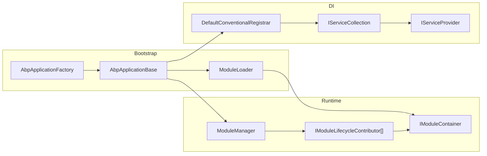
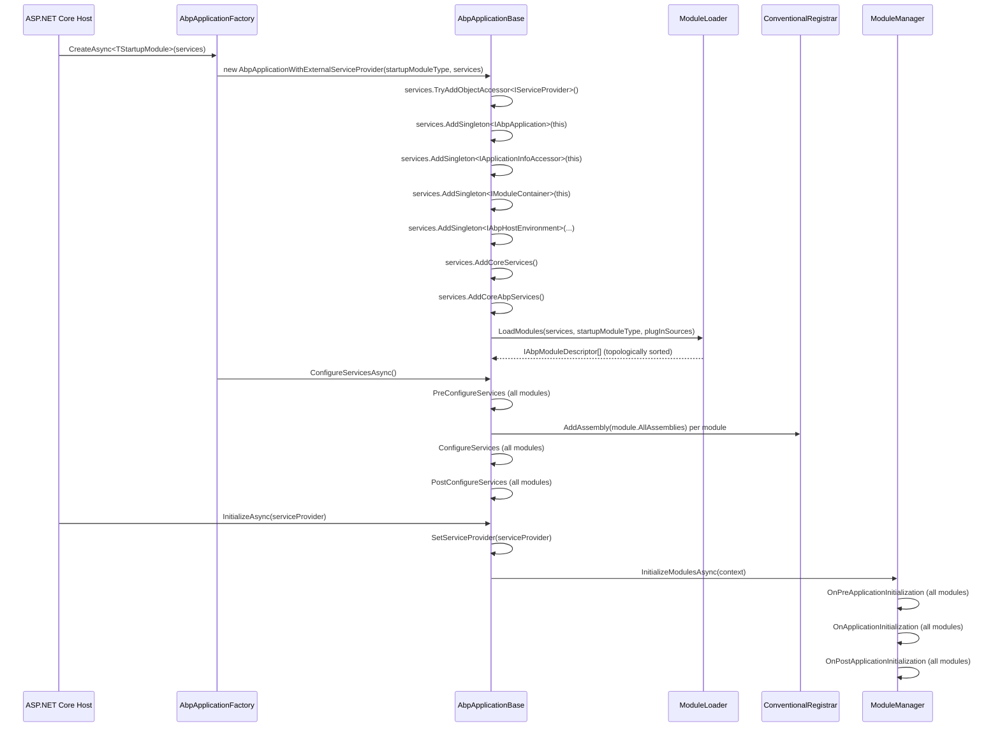
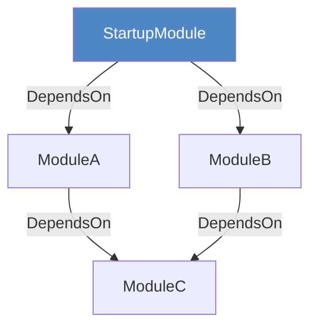
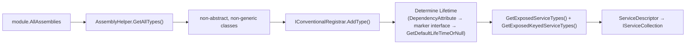

ABP Framework's runtime architecture is built around three interlocking systems: a **module graph** that replaces flat assembly registration, a **lifecycle engine** that drives deterministic startup and shutdown, and a **conventional DI registrar** that automates service registration from each module's assemblies. This page traces how those systems fit together from the first line of application code to the moment the HTTP pipeline is ready.

## High-Level Component Map



## Application Variants

`AbpApplicationBase` (`Volo/Abp/AbpApplicationBase.cs`) is abstract (`internal` constructor). Two `internal` concrete subclasses cover the two common hosting patterns:

| Subclass | Interface | `IServiceProvider` source | Typical use |
|---|---|---|---|
| `AbpApplicationWithInternalServiceProvider` | `IAbpApplicationWithInternalServiceProvider` | Built from `IServiceCollection` via `Services.BuildServiceProviderFromFactory().CreateScope()` | Console apps, integration tests |
| `AbpApplicationWithExternalServiceProvider` | `IAbpApplicationWithExternalServiceProvider` | Passed in by the ASP.NET Core host via `InitializeAsync(IServiceProvider)` | ASP.NET Core web apps |

### `IAbpApplicationWithInternalServiceProvider`

Defined in `Volo/Abp/IAbpApplicationWithInternalServiceProvider.cs`:

```csharp
public interface IAbpApplicationWithInternalServiceProvider : IAbpApplication
{
    // Creates the service provider without initializing modules.
    // Subsequent calls return the same instance.
    IServiceProvider CreateServiceProvider();

    Task InitializeAsync();   // creates SP + runs module lifecycle
    void Initialize();        // sync equivalent
}
```

### `IAbpApplicationWithExternalServiceProvider`

Defined in `Volo/Abp/IAbpApplicationWithExternalServiceProvider.cs`:

```csharp
public interface IAbpApplicationWithExternalServiceProvider : IAbpApplication
{
    // Stores the provider without initializing modules.
    void SetServiceProvider(IServiceProvider serviceProvider);

    Task InitializeAsync(IServiceProvider serviceProvider);  // set + run lifecycle
    void Initialize(IServiceProvider serviceProvider);       // sync equivalent
}
```

### `AbpApplicationFactory` — All Overloads

`AbpApplicationFactory` (`Volo/Abp/AbpApplicationFactory.cs`) is the recommended entry point. It exposes eight static methods: four synchronous `Create` variants and four asynchronous `CreateAsync` variants. The async overloads set `SkipConfigureServices = true` before passing options to the constructor, then call `ConfigureServicesAsync()` after construction:

```csharp
// AbpApplicationFactory.cs
public async static Task<IAbpApplicationWithInternalServiceProvider> CreateAsync<TStartupModule>(
    Action<AbpApplicationCreationOptions>? optionsAction = null)
    where TStartupModule : IAbpModule
{
    var app = Create(typeof(TStartupModule), options =>
    {
        options.SkipConfigureServices = true;   // defer to async path
        optionsAction?.Invoke(options);
    });
    await app.ConfigureServicesAsync();
    return app;
}
```

The same `SkipConfigureServices = true` + `ConfigureServicesAsync()` pattern is applied by all four `CreateAsync` overloads (both `<TStartupModule>` generic and `Type startupModuleType` non-generic, for both internal and external SP variants). The four sync `Create` overloads construct directly without calling `ConfigureServicesAsync`.

## Startup Sequence



### Phase 1 — Construction (`AbpApplicationBase` constructor)

The constructor (`Volo/Abp/AbpApplicationBase.cs`) performs these registrations synchronously before any `ConfigureServices` call:

```csharp
// AbpApplicationBase.cs — constructor body
services.TryAddObjectAccessor<IServiceProvider>();
services.AddSingleton<IAbpApplication>(this);
services.AddSingleton<IApplicationInfoAccessor>(this);
services.AddSingleton<IModuleContainer>(this);
services.AddSingleton<IAbpHostEnvironment>(new AbpHostEnvironment()
{
    EnvironmentName = options.Environment
});

ApplicationName = GetApplicationName(options);  // options > IConfiguration > entry assembly name

services.AddCoreServices();           // Options, Logging, Localization
services.AddCoreAbpServices(this, options);  // ModuleLoader, AssemblyFinder, lifecycle contributor wiring

Modules = LoadModules(services, options);    // calls ModuleLoader

if (!options.SkipConfigureServices)
{
    ConfigureServices();   // sync fast-path; skipped when using CreateAsync
}
```

`AddCoreServices` (in `Volo/Abp/Internal/InternalServiceCollectionExtensions.cs`) calls `services.AddOptions()`, `services.AddLogging()`, and `services.AddLocalization()`.

`AddCoreAbpServices` (same file) registers `IModuleLoader`, `IAssemblyFinder`, `IInitLoggerFactory`, `ITypeFinder`, and the four default lifecycle contributors:

```csharp
// InternalServiceCollectionExtensions.cs
services.Configure<AbpModuleLifecycleOptions>(options =>
{
    options.Contributors.Add<OnPreApplicationInitializationModuleLifecycleContributor>();
    options.Contributors.Add<OnApplicationInitializationModuleLifecycleContributor>();
    options.Contributors.Add<OnPostApplicationInitializationModuleLifecycleContributor>();
    options.Contributors.Add<OnApplicationShutdownModuleLifecycleContributor>();
});
```

### Phase 2 — ConfigureServices

`ConfigureServicesAsync` (`Volo/Abp/AbpApplicationBase.cs`) iterates `Modules` in three passes. Between the Pre pass and the main ConfigureServices pass, each module's assemblies are registered with the conventional registrar (unless `SkipAutoServiceRegistration` is set). A `HashSet<Assembly>` guards against double-registration when two modules share an assembly:

```csharp
// AbpApplicationBase.ConfigureServicesAsync — abridged
var context = new ServiceConfigurationContext(Services);
Services.AddSingleton(context);

// Inject context into every AbpModule instance (only valid during this phase)
foreach (var module in Modules)
    if (module.Instance is AbpModule abpModule)
        abpModule.ServiceConfigurationContext = context;

// PreConfigureServices pass
foreach (var module in Modules.Where(m => m.Instance is IPreConfigureServices))
    await ((IPreConfigureServices)module.Instance).PreConfigureServicesAsync(context);

var assemblies = new HashSet<Assembly>();

// Auto-register assemblies, then ConfigureServices pass
foreach (var module in Modules)
{
    if (module.Instance is AbpModule abpModule && !abpModule.SkipAutoServiceRegistration)
        foreach (var assembly in module.AllAssemblies)
            if (assemblies.Add(assembly))             // HashSet.Add returns false if already present
                Services.AddAssembly(assembly);       // → DefaultConventionalRegistrar

    await module.Instance.ConfigureServicesAsync(context);
}

// PostConfigureServices pass
foreach (var module in Modules.Where(m => m.Instance is IPostConfigureServices))
    await ((IPostConfigureServices)module.Instance).PostConfigureServicesAsync(context);

// Nullify context — accessing it outside ConfigureServices throws AbpException
foreach (var module in Modules)
    if (module.Instance is AbpModule abpModule)
        abpModule.ServiceConfigurationContext = null!;
```

<Note>
`ServiceConfigurationContext` is injected into each `AbpModule` instance only for the duration of the ConfigureServices phase and set to `null` afterwards. Accessing `ServiceConfigurationContext` outside `PreConfigureServices`, `ConfigureServices`, or `PostConfigureServices` throws `AbpException`.
</Note>

### Phase 3 — Initialize

After the host builds `IServiceProvider`, the concrete application variant's `InitializeAsync` is called. For the external-SP variant this is `InitializeAsync(IServiceProvider)`, which calls `SetServiceProvider` then `InitializeModulesAsync`:

```csharp
// AbpApplicationBase.cs
protected virtual async Task InitializeModulesAsync()
{
    using (var scope = ServiceProvider.CreateScope())
    {
        WriteInitLogs(scope.ServiceProvider);
        await scope.ServiceProvider
            .GetRequiredService<IModuleManager>()
            .InitializeModulesAsync(new ApplicationInitializationContext(scope.ServiceProvider));
    }
}
```

`WriteInitLogs` flushes all entries buffered by `IInitLoggerFactory` (used during bootstrap before a proper `ILoggerFactory` is available) into the real logger.

`ModuleManager` (`Volo/Abp/Modularity/ModuleManager.cs`) resolves its lifecycle contributors from `AbpModuleLifecycleOptions` at construction time via `serviceProvider.GetRequiredService` for each contributor type, then runs them over the module list:

```csharp
// ModuleManager.cs — constructor
_lifecycleContributors = options.Value
    .Contributors
    .Select(serviceProvider.GetRequiredService)
    .Cast<IModuleLifecycleContributor>()
    .ToArray();

// ModuleManager.InitializeModulesAsync
public virtual async Task InitializeModulesAsync(ApplicationInitializationContext context)
{
    foreach (var contributor in _lifecycleContributors)
    {
        foreach (var module in _moduleContainer.Modules)
        {
            await contributor.InitializeAsync(context, module.Instance);
        }
    }
    _logger.LogInformation("Initialized all ABP modules.");
}
```

Each contributor checks via `is` cast whether the module implements the relevant interface, so modules that do not override `OnApplicationInitialization` incur no overhead.

### Phase 4 — Shutdown

Shutdown reverses the module list so the startup module shuts down first and its deepest dependencies last:

```csharp
// ModuleManager.cs — ShutdownModulesAsync
public virtual async Task ShutdownModulesAsync(ApplicationShutdownContext context)
{
    var modules = _moduleContainer.Modules.Reverse().ToList();
    foreach (var contributor in _lifecycleContributors)
        foreach (var module in modules)
            await contributor.ShutdownAsync(context, module.Instance);
}
```

`AbpApplicationBase.ShutdownAsync` creates a fresh DI scope for shutdown, matching the scope created for initialization:

```csharp
// AbpApplicationBase.cs
public virtual async Task ShutdownAsync()
{
    using (var scope = ServiceProvider.CreateScope())
    {
        await scope.ServiceProvider
            .GetRequiredService<IModuleManager>()
            .ShutdownModulesAsync(new ApplicationShutdownContext(scope.ServiceProvider));
    }
}
```

Sync equivalents (`Shutdown()`, `ShutdownModules(context)`) exist on both `IAbpApplication` and `ModuleManager` and follow the same pattern without `await`.

## Module Graph and Ordering

`ModuleLoader.LoadModules` (`Volo/Abp/Modularity/ModuleLoader.cs`) builds the descriptor list in two steps: `GetDescriptors` then `SortByDependency`.

**`GetDescriptors`** calls `FillModules` (which uses `AbpModuleHelper.FindAllModuleTypes` for the static graph and iterates `PlugInSourceList` for plugins), then `SetDependencies` to wire `IAbpModuleDescriptor.Dependencies`:

```csharp
// ModuleLoader.cs
protected virtual void FillModules(
    List<AbpModuleDescriptor> modules,
    IServiceCollection services,
    Type startupModuleType,
    PlugInSourceList plugInSources)
{
    // Static dependency graph
    foreach (var moduleType in AbpModuleHelper.FindAllModuleTypes(startupModuleType, logger))
        modules.Add(CreateModuleDescriptor(services, moduleType));

    // Plugin modules (deduped against static set)
    foreach (var moduleType in plugInSources.GetAllModules(logger))
    {
        if (modules.Any(m => m.Type == moduleType)) continue;
        modules.Add(CreateModuleDescriptor(services, moduleType, isLoadedAsPlugIn: true));
    }
}
```

`CreateAndRegisterModule` instantiates each module via `Activator.CreateInstance` and registers it as a singleton in `IServiceCollection`, making module instances resolvable from DI.

**`SortByDependency`** calls `modules.SortByDependencies(m => m.Dependencies)` (a topological sort extension using Kahn's algorithm) and then moves the startup module to the **last** position:

```csharp
// ModuleLoader.cs
protected virtual List<IAbpModuleDescriptor> SortByDependency(
    List<IAbpModuleDescriptor> modules, Type startupModuleType)
{
    var sortedModules = modules.SortByDependencies(m => m.Dependencies);
    sortedModules.MoveItem(m => m.Type == startupModuleType, modules.Count - 1);
    return sortedModules;
}
```

This guarantees that a module's `ConfigureServices` and all lifecycle hooks execute **after** all of its declared dependencies.



After sort: `[C, A, B, StartupModule]`. Lifecycle runs left-to-right; shutdown runs right-to-left.

## Lifecycle Contributor Detail

The four default contributors are defined in `Volo/Abp/Modularity/DefaultModuleLifecycleContributor.cs`. Each implements `IModuleLifecycleContributor` (`Volo/Abp/Modularity/IModuleLifecycleContributor.cs`):

```csharp
public interface IModuleLifecycleContributor : ITransientDependency
{
    Task InitializeAsync(ApplicationInitializationContext context, IAbpModule module);
    void Initialize(ApplicationInitializationContext context, IAbpModule module);
    Task ShutdownAsync(ApplicationShutdownContext context, IAbpModule module);
    void Shutdown(ApplicationShutdownContext context, IAbpModule module);
}
```

| Contributor | Triggers when module implements |
|---|---|
| `OnPreApplicationInitializationModuleLifecycleContributor` | `IOnPreApplicationInitialization` |
| `OnApplicationInitializationModuleLifecycleContributor` | `IOnApplicationInitialization` |
| `OnPostApplicationInitializationModuleLifecycleContributor` | `IOnPostApplicationInitialization` |
| `OnApplicationShutdownModuleLifecycleContributor` | `IOnApplicationShutdown` |

Because `AbpModule` implements all four interfaces (with empty default bodies), every module participates in every phase unless `ModuleLifecycleContributorBase` short-circuits via the `is` cast. Additional contributors can be added to `AbpModuleLifecycleOptions.Contributors` from any module's `ConfigureServices`.

## DI Registration Pipeline



`DefaultConventionalRegistrar.AddType` (`Volo/Abp/DependencyInjection/DefaultConventionalRegistrar.cs`) applies these rules in order:

1. `[DisableConventionalRegistration]` on the type → skip entirely
2. `[Dependency(Lifetime = …)]` attribute → use that `ServiceLifetime`
3. `ITransientDependency` / `ISingletonDependency` / `IScopedDependency` marker interface → corresponding lifetime
4. `GetDefaultLifeTimeOrNull` returns `null` → skip (no registration)

After lifetime is determined, `GetExposedServiceTypes` and `GetExposedKeyedServiceTypes` resolve the set of interfaces/types to register for. For `Singleton` and `Scoped` registrations with multiple exposed types, `CreateServiceDescriptor` creates **redirect descriptors** (factory lambdas forwarding to the implementation type's registration) so all exposed interfaces resolve to the same underlying instance.

`[Dependency]` also supports `ReplaceServices = true` (calls `services.Replace`) and `TryRegister = true` (calls `services.TryAdd`) for fine-grained registration control.

## `AbpModule` Helper Methods

`AbpModule` exposes several protected helpers that make `ConfigureServices` implementations concise:

| Method | Delegates to |
|---|---|
| `Configure<TOptions>(Action<TOptions>)` | `ServiceConfigurationContext.Services.Configure(...)` |
| `Configure<TOptions>(IConfiguration)` | `ServiceConfigurationContext.Services.Configure<TOptions>(configuration)` |
| `PreConfigure<TOptions>(Action<TOptions>)` | `ServiceConfigurationContext.Services.PreConfigure(...)` |
| `PostConfigure<TOptions>(Action<TOptions>)` | `ServiceConfigurationContext.Services.PostConfigure(...)` |
| `PostConfigureAll<TOptions>(Action<TOptions>)` | `ServiceConfigurationContext.Services.PostConfigureAll(...)` |

All of these throw `AbpException` if called outside the `ConfigureServices` phase because they access `ServiceConfigurationContext`.

## Telemetry

Both concrete application classes call `SetupTelemetryTrackingAsync()` (or the sync variant) immediately after `InitializeModulesAsync`. This is gated by `ShouldSendTelemetryData()`, which returns `true` only when:

- The OS is Windows, macOS, or Linux
- `IAbpHostEnvironment.IsDevelopment()` is `true`
- `IConfiguration["Abp:Telemetry:IsEnabled"]` is not explicitly `false`

The actual tracking is performed by `ITelemetryService.AddActivityAsync` resolved from a fresh DI scope. Any exception during telemetry is swallowed and logged at `Trace` level via `IInitLoggerFactory`.

## Subsystem Cross-Links

<CardGroup cols={2}>
  <Card title="Module System" icon="cubes" href="modularity/module-system">
    AbpModule, DependsOnAttribute, ModuleLoader internals, plugin sources.
  </Card>
  <Card title="Module Lifecycle" icon="rotate" href="modularity/module-lifecycle">
    The six lifecycle interfaces, contributor pattern, and ordering guarantees.
  </Card>
  <Card title="Dependency Injection" icon="inject" href="modularity/dependency-injection">
    Conventional registrar, marker interfaces, ExposeServicesAttribute, Autofac.
  </Card>
  <Card title="Introduction" icon="book" href="introduction">
    Framework classification and package layer overview.
  </Card>
</CardGroup>
