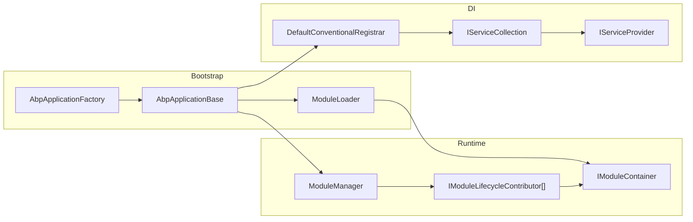
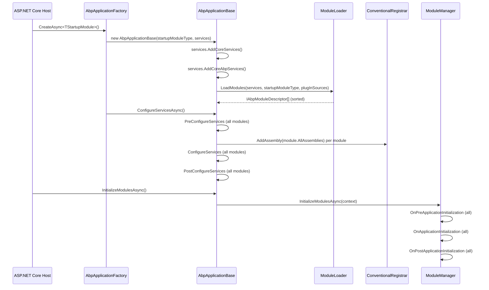
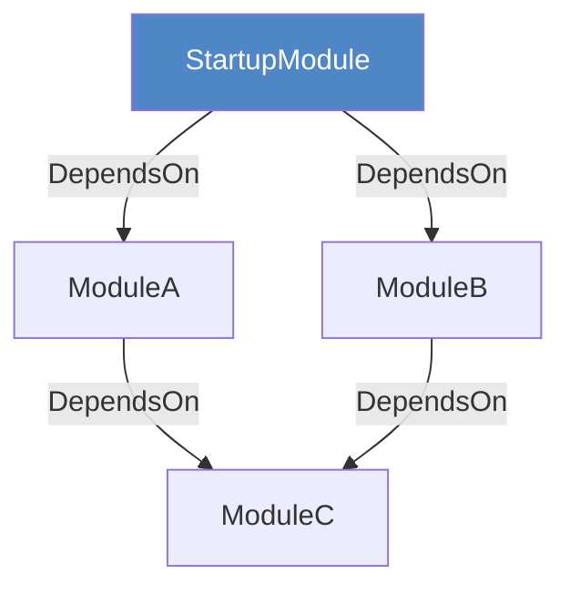
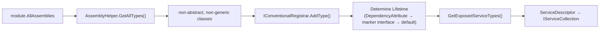

ABP Framework's runtime architecture is built around three interlocking systems: a **module graph** that replaces flat assembly registration, a **lifecycle engine** that drives deterministic startup and shutdown, and a **conventional DI registrar** that automates service registration from each module's assemblies. This page traces how those systems fit together from the first line of application code to the moment the HTTP pipeline is ready.

## High-Level Component Map



## Application Variants

`AbpApplicationBase` is abstract. Two concrete subclasses cover the two common hosting patterns:

| Subclass | `IServiceProvider` source | Typical use |
|---|---|---|
| `AbpApplicationWithInternalServiceProvider` | Built internally from `IServiceCollection` | Console apps, tests |
| `AbpApplicationWithExternalServiceProvider` | Passed in from ASP.NET Core host | ASP.NET Core web apps |

`AbpApplicationFactory` is the recommended entry point; it handles the `SkipConfigureServices` flag and calls `ConfigureServicesAsync` after construction so callers always get a fully configured object:

```csharp
// AbpApplicationFactory.cs (simplified)
public async static Task<IAbpApplicationWithInternalServiceProvider> CreateAsync<TStartupModule>(
    Action<AbpApplicationCreationOptions>? optionsAction = null)
    where TStartupModule : IAbpModule
{
    var app = Create(typeof(TStartupModule), options =>
    {
        options.SkipConfigureServices = true;   // defer to async path
        optionsAction?.Invoke(options);
    });
    await app.ConfigureServicesAsync();
    return app;
}
```

## Startup Sequence



### Phase 1 — Construction (`AbpApplicationBase` constructor)

```csharp
// AbpApplicationBase.cs (constructor body)
services.TryAddObjectAccessor<IServiceProvider>();
services.AddSingleton<IAbpApplication>(this);
services.AddSingleton<IApplicationInfoAccessor>(this);
services.AddSingleton<IModuleContainer>(this);
services.AddCoreServices();          // Options, Logging, Localization
services.AddCoreAbpServices(this, options);  // ModuleLoader, AssemblyFinder, lifecycle contributor wiring
Modules = LoadModules(services, options);    // calls ModuleLoader
if (!options.SkipConfigureServices)
{
    ConfigureServices();             // synchronous fast-path
}
```

`AddCoreAbpServices` (in `InternalServiceCollectionExtensions`) is where the four default lifecycle contributors are registered against `AbpModuleLifecycleOptions`:

```csharp
services.Configure<AbpModuleLifecycleOptions>(options =>
{
    options.Contributors.Add<OnPreApplicationInitializationModuleLifecycleContributor>();
    options.Contributors.Add<OnApplicationInitializationModuleLifecycleContributor>();
    options.Contributors.Add<OnPostApplicationInitializationModuleLifecycleContributor>();
    options.Contributors.Add<OnApplicationShutdownModuleLifecycleContributor>();
});
```

### Phase 2 — ConfigureServices

`AbpApplicationBase.ConfigureServicesAsync` iterates `Modules` three times — Pre, Main, Post — and auto-registers assemblies between Pre and Main:

```csharp
// PreConfigureServices pass
foreach (var module in Modules.Where(m => m.Instance is IPreConfigureServices)) { ... }

// Auto-register assemblies, then ConfigureServices pass
foreach (var module in Modules)
{
    if (module.Instance is AbpModule abpModule && !abpModule.SkipAutoServiceRegistration)
    {
        foreach (var assembly in module.AllAssemblies)
        {
            Services.AddAssembly(assembly);   // calls DefaultConventionalRegistrar
        }
    }
    await module.Instance.ConfigureServicesAsync(context);
}

// PostConfigureServices pass
foreach (var module in Modules.Where(m => m.Instance is IPostConfigureServices)) { ... }
```

<Note>
`ServiceConfigurationContext` is injected into each `AbpModule` instance only during the ConfigureServices phase and set to `null` afterwards. Accessing it outside that window throws `AbpException`.
</Note>

### Phase 3 — Initialize

After `IServiceProvider` is built by the host, `InitializeModulesAsync` creates a DI scope and hands it to `ModuleManager`:

```csharp
// AbpApplicationBase.cs
protected virtual async Task InitializeModulesAsync()
{
    using (var scope = ServiceProvider.CreateScope())
    {
        WriteInitLogs(scope.ServiceProvider);
        await scope.ServiceProvider
            .GetRequiredService<IModuleManager>()
            .InitializeModulesAsync(new ApplicationInitializationContext(scope.ServiceProvider));
    }
}
```

`ModuleManager` runs each `IModuleLifecycleContributor` over every module in dependency order:

```csharp
// ModuleManager.cs
public virtual async Task InitializeModulesAsync(ApplicationInitializationContext context)
{
    foreach (var contributor in _lifecycleContributors)
    {
        foreach (var module in _moduleContainer.Modules)
        {
            await contributor.InitializeAsync(context, module.Instance);
        }
    }
}
```

### Phase 4 — Shutdown

Shutdown reverses the module list and drives `ShutdownModulesAsync`:

```csharp
// ModuleManager.cs
public virtual async Task ShutdownModulesAsync(ApplicationShutdownContext context)
{
    var modules = _moduleContainer.Modules.Reverse().ToList();
    foreach (var contributor in _lifecycleContributors)
        foreach (var module in modules)
            await contributor.ShutdownAsync(context, module.Instance);
}
```

## Module Graph and Ordering

`ModuleLoader` builds the descriptor list with `GetDescriptors`, then sorts it with `SortByDependency`:



After topological sort, the startup module is moved to the **last** position so its `ConfigureServices` and lifecycle hooks run after all dependencies. `SortByDependencies` (an extension on `IEnumerable`) implements Kahn's algorithm on `m.Dependencies`.

## DI Registration Pipeline



The conventional registrar checks:
1. `[DisableConventionalRegistration]` — skip entirely
2. `[Dependency(Lifetime = …)]` — explicit lifetime
3. `ITransientDependency` / `ISingletonDependency` / `IScopedDependency` — marker interface
4. Custom registrar's `GetDefaultLifeTimeOrNull` — returns `null` to skip

For Singleton and Scoped registrations with multiple exposed service types, ABP creates **redirect descriptors** so that resolving any of the exposed interfaces returns the same underlying instance (no duplicated object graph).

## Subsystem Cross-Links

<CardGroup cols={2}>
  <Card title="Module System" icon="cubes" href="modularity/module-system">
    AbpModule, DependsOnAttribute, ModuleLoader internals, plugin sources.
  </Card>
  <Card title="Module Lifecycle" icon="rotate" href="modularity/module-lifecycle">
    The six lifecycle interfaces, contributor pattern, and ordering guarantees.
  </Card>
  <Card title="Dependency Injection" icon="inject" href="modularity/dependency-injection">
    Conventional registrar, marker interfaces, ExposeServicesAttribute, Autofac.
  </Card>
  <Card title="Introduction" icon="book" href="introduction">
    Framework classification and package layer overview.
  </Card>
</CardGroup>
