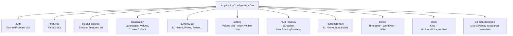

The application configuration endpoint (`GET /api/abp/application-configuration`) is the backbone of ABP's client-side initialization. It delivers a single JSON payload that Angular and Blazor WASM clients use to bootstrap themselves: current user identity, permission grants, feature flags, settings, localization resources, multi-tenancy state, and timezone information.

## Controller Definition

```csharp
[Area("abp")]
[RemoteService(Name = "abp")]
[Route("api/abp/application-configuration")]
public class AbpApplicationConfigurationController : AbpControllerBase,
    IAbpApplicationConfigurationAppService
{
    protected readonly IAbpApplicationConfigurationAppService ApplicationConfigurationAppService;
    protected readonly IAbpAntiForgeryManager AntiForgeryManager;

    [HttpGet]
    public virtual async Task<ApplicationConfigurationDto> GetAsync(
        ApplicationConfigurationRequestOptions options)
    {
        AntiForgeryManager.SetCookie();
        return await ApplicationConfigurationAppService.GetAsync(options);
    }
}
```

The controller is a thin HTTP adapter. Every request causes `AntiForgeryManager.SetCookie()` to refresh the XSRF token cookie, which front-end clients (Angular in particular) then read and include in subsequent mutating requests. The real work is in `AbpApplicationConfigurationAppService`.

### Request Options

`ApplicationConfigurationRequestOptions` has one notable flag:

```csharp
// When false, localization string values are not included in the response.
// Angular/Blazor WASM make a separate call to /api/abp/application-localization
// for the actual string dictionaries.
options.IncludeLocalizationResources // bool
```

## ApplicationConfigurationDto Anatomy

The response DTO (`ApplicationConfigurationDto`) contains these top-level sections:



## Building the Response

`AbpApplicationConfigurationAppService.GetAsync()` builds each section in parallel (conceptually — each is a `virtual` method called sequentially):

### Auth Configuration

```csharp
protected virtual async Task<ApplicationAuthConfigurationDto> GetAuthConfigAsync()
{
    var authConfig = new ApplicationAuthConfigurationDto();

    var policyNames = await _abpAuthorizationPolicyProvider.GetPoliciesNamesAsync();

    // Separate ABP permission-backed policies from raw ASP.NET Core policies
    var permissionNameSet = new HashSet<string>(
        (await _permissionDefinitionManager.GetPermissionsAsync()).Select(p => p.Name));

    foreach (var policyName in otherPolicyNames)
    {
        if (await _authorizationService.IsGrantedAsync(policyName))
            authConfig.GrantedPolicies[policyName] = true;
    }

    // Batch check ABP permissions
    var result = await _permissionChecker.IsGrantedAsync(abpPolicyNames.ToArray());
    foreach (var (key, value) in result.Result)
    {
        if (value == PermissionGrantResult.Granted)
            authConfig.GrantedPolicies[key] = true;
    }

    return authConfig;
}
```

`GrantedPolicies` is a `Dictionary<string, bool>` — only *granted* entries are included (value is always `true`). The client checks for key existence rather than value.

ABP distinguishes between:
- **ABP permission-backed policies** — checked efficiently via `IPermissionChecker.IsGrantedAsync(string[])` (batch).
- **Standard ASP.NET Core policies** — checked one at a time via `IAuthorizationService.IsGrantedAsync`.

### Current User

```csharp
protected virtual CurrentUserDto GetCurrentUser()
{
    return new CurrentUserDto
    {
        IsAuthenticated = _currentUser.IsAuthenticated,
        Id = _currentUser.Id,
        TenantId = _currentUser.TenantId,
        ImpersonatorUserId = _currentUser.FindImpersonatorUserId(),
        ImpersonatorTenantId = _currentUser.FindImpersonatorTenantId(),
        UserName = _currentUser.UserName,
        Name = _currentUser.Name,
        Email = _currentUser.Email,
        EmailVerified = _currentUser.EmailVerified,
        PhoneNumber = _currentUser.PhoneNumber,
        Roles = _currentUser.Roles,
        SessionId = _currentUser.FindSessionId()
    };
}
```

All values come from `ICurrentUser`, which is populated from the `ClaimsPrincipal`. Impersonation fields are present for the impersonator audit trail.

### Features and Global Features

```csharp
protected virtual async Task<ApplicationFeatureConfigurationDto> GetFeaturesConfigAsync()
{
    var result = new ApplicationFeatureConfigurationDto();
    foreach (var featureDefinition in await _featureDefinitionManager.GetAllAsync())
    {
        if (!featureDefinition.IsVisibleToClients) continue;
        result.Values[featureDefinition.Name] =
            await FeatureChecker.GetOrNullAsync(featureDefinition.Name);
    }
    return result;
}
```

Only features with `IsVisibleToClients = true` are sent to the client. This prevents internal feature flags from leaking. `GetGlobalFeaturesConfigAsync()` works similarly, listing enabled global feature names.

### Settings

```csharp
private async Task<ApplicationSettingConfigurationDto> GetSettingConfigAsync()
{
    var settingDefinitions = (await _settingDefinitionManager.GetAllAsync())
        .Where(x => x.IsVisibleToClients);

    var settingValues = await _settingProvider.GetAllAsync(
        settingDefinitions.Select(x => x.Name).ToArray());

    foreach (var settingValue in settingValues)
        result.Values[settingValue.Name] = settingValue.Value;
}
```

Same pattern — only settings with `IsVisibleToClients = true` are exposed. The `ISettingProvider` respects the full precedence chain (user → tenant → global → default).

### Localization

```csharp
protected virtual async Task<ApplicationLocalizationConfigurationDto> GetLocalizationConfigAsync(
    ApplicationConfigurationRequestOptions options)
{
    localizationConfig.Languages.AddRange(await _languageProvider.GetLanguagesAsync());

    if (options.IncludeLocalizationResources)
    {
        // Merge built-in + external (dynamic) resources
        foreach (var resourceName in resourceNames)
        {
            var localizer = await StringLocalizerFactory.CreateByResourceNameOrNullAsync(resourceName);
            if (localizer != null)
                foreach (var str in await localizer.GetAllStringsAsync())
                    dictionary[str.Name] = str.Value;
            localizationConfig.Values[resourceName] = dictionary;
        }
    }

    localizationConfig.CurrentCulture = GetCurrentCultureInfo();
    localizationConfig.DefaultResourceName = ...; // from AbpLocalizationOptions
    localizationConfig.LanguagesMap = _localizationOptions.LanguagesMap;
    localizationConfig.UseRouteBasedCulture = ...;
}
```

When `IncludeLocalizationResources = false`, only metadata (languages list, current culture, maps) is returned. The actual string dictionaries are fetched separately from `/api/abp/application-localization?cultureName=en&onlyDynamics=true`.

### Timing and Clock

```csharp
protected virtual async Task<TimingDto> GetTimingConfigAsync()
{
    var timeZone = await _settingProvider.GetOrNullAsync(TimingSettingNames.TimeZone);
    // Converts between IANA and Windows timezone formats
    return new TimingDto { TimeZone = new TimeZone { Windows = ..., Iana = ... } };
}

protected virtual ClockDto GetClockConfig()
{
    return new ClockDto { Kind = Enum.GetName(typeof(DateTimeKind), _abpClockOptions.Kind)! };
}
```

Both Windows (`TimeZoneId`) and IANA (`TimeZoneName`) timezone representations are included so clients on different platforms can use the appropriate one.

### Contributors Pattern

```csharp
if (_options.Contributors.Any())
{
    using (var scope = _serviceProvider.CreateScope())
    {
        var context = new ApplicationConfigurationContributorContext(scope.ServiceProvider, result);
        foreach (var contributor in _options.Contributors)
            await contributor.ContributeAsync(context);
    }
}
```

`AbpApplicationConfigurationOptions.Contributors` allows modules to append custom data to the configuration response without modifying the core service. Implement `IApplicationConfigurationContributor` and register via:

```csharp
Configure<AbpApplicationConfigurationOptions>(options =>
{
    options.Contributors.Add(new MyCustomConfigurationContributor());
});
```

## How Angular Consumes the Endpoint

The Angular `@abp/ng.core` package calls this endpoint early in application initialization via a generated client proxy. It stores the result in NGXS state and exposes typed services (`ConfigStateService`, `AuthService`, `PermissionService`, etc.) that query the cached configuration.

```typescript
// Angular proxy-generated client
// packages/core/src/lib/proxy/volo/abp/asp-net-core/mvc/application-configurations
export class AbpApplicationConfigurationService {
  getAsync(options: ApplicationConfigurationRequestOptions) {
    return this.http.get<ApplicationConfigurationDto>(
      '/api/abp/application-configuration',
      { params: { includeLocalizationResources: options.includeLocalizationResources } }
    );
  }
}
```

Angular uses the XSRF cookie set by `AntiForgeryManager.SetCookie()` automatically via its `HttpClient` XSRF interceptor configured with `cookieName: 'XSRF-TOKEN'` and `headerName: 'RequestVerificationToken'`.

## How Blazor WASM Consumes the Endpoint

`WebAssemblyCachedApplicationConfigurationClient` is initialized during `OnApplicationInitializationAsync`:

```csharp
public virtual async Task InitializeAsync()
{
    var configurationDto = await ApplicationConfigurationClientProxy.GetAsync(
        new ApplicationConfigurationRequestOptions { IncludeLocalizationResources = false }
    );

    // Localization strings come from a separate endpoint
    var localizationDto = await ApplicationLocalizationClientProxy.GetAsync(
        new ApplicationLocalizationRequestDto {
            CultureName = configurationDto.Localization.CurrentCulture.Name,
            OnlyDynamics = true
        }
    );

    configurationDto.Localization.Resources = localizationDto.Resources;
    Cache.Set(configurationDto);

    // Apply timezone from configuration or browser
    if (Clock.SupportsMultipleTimezone)
    {
        CurrentTimezoneProvider.TimeZone = !configurationDto.Timing.TimeZone.Iana.TimeZoneName.IsNullOrWhiteSpace()
            ? configurationDto.Timing.TimeZone.Iana.TimeZoneName
            : await JSRuntime.InvokeAsync<string>("abp.clock.getBrowserTimeZone");
    }

    ApplicationConfigurationChangedService.NotifyChanged();
}
```

<CardGroup cols={2}>
  <Card title="Two-Request Strategy" icon="arrows-split-up-and-left">
    WASM fetches configuration without localization resources first (`IncludeLocalizationResources = false`), then fetches only dynamic localization strings separately. Static localization resources are served as static JS files to avoid bloating the configuration response.
  </Card>
  <Card title="Cache Invalidation" icon="rotate">
    `ApplicationConfigurationChangedService.NotifyChanged()` triggers subscribed Blazor components to re-render when configuration changes (e.g., after login or tenant switch).
  </Card>
</CardGroup>

## Blazor Server Consumption

For Blazor Server, `ICachedApplicationConfigurationClient` is backed by a server-side client that reads directly from the ASP.NET Core session/request pipeline (no HTTP round-trip). The same `ApplicationConfigurationDto` type is used, but it is populated in-process via the `AbpApplicationConfigurationAppService`.

## Caching Considerations

<Warning>
The endpoint has no built-in HTTP caching (`Cache-Control` headers). The `//TODO: Optimize & cache..?` comment in the source is an acknowledged gap. Each call re-evaluates all permissions, features, and settings for the current user. In high-traffic scenarios, consider adding a short-lived distributed cache layer keyed by `userId + tenantId + cultureName`.
</Warning>

Permission checks are batched (a single `IsGrantedAsync(string[])` call), but the total work done per request scales with the number of defined permissions, features, and settings. Applications with hundreds of permissions will see noticeable latency on this endpoint.
