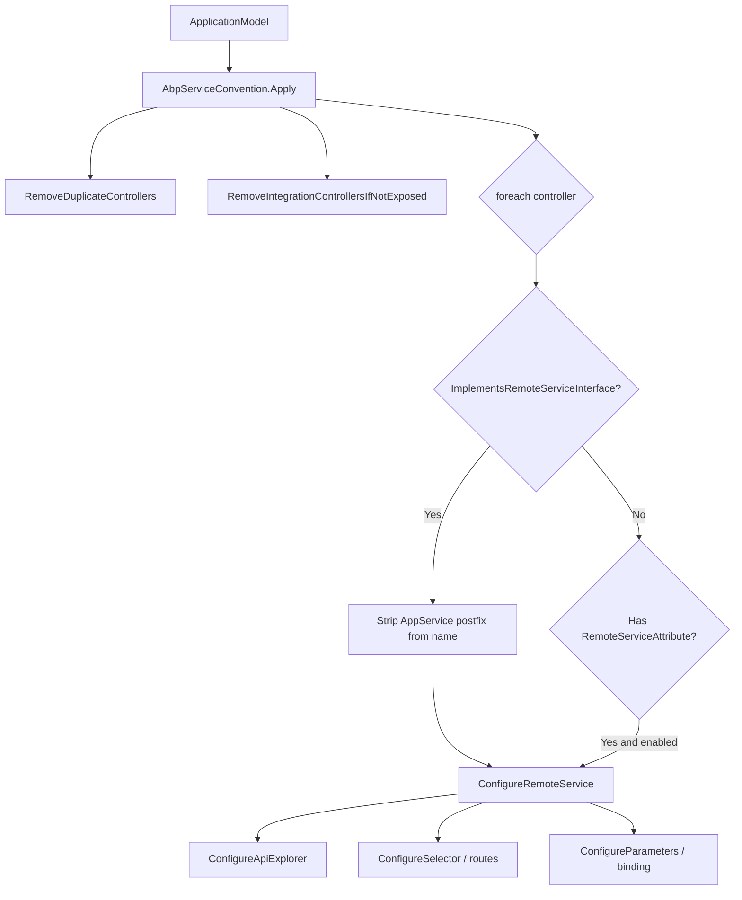
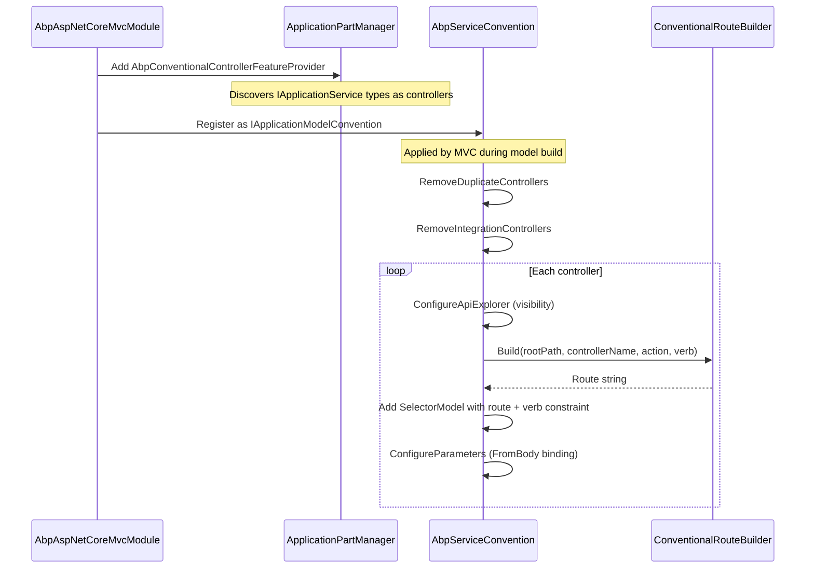

ABP's automatic API controller system converts application service classes into REST endpoints without writing a single controller. The machinery lives in three interconnected types: `AbpConventionalControllerOptions` (configuration), `AbpServiceConvention` (MVC application model transformation), and `ConventionalRouteBuilder` (route string assembly).

## Opt-In Configuration

Auto API generation is enabled per-assembly by calling `Create()` on `AbpConventionalControllerOptions` inside a module's `ConfigureServices`:

```csharp
Configure<AbpAspNetCoreMvcOptions>(options =>
{
    options.ConventionalControllers
        .Create(typeof(BookStoreApplicationModule).Assembly, settings =>
        {
            settings.RootPath = "bookstore";
            settings.RemoteServiceName = "BookStore";
        });
});
```

The `Create()` method constructs a `ConventionalControllerSetting` and calls `Initialize()`, which scans the assembly for types that match the predicate (by default: implements `IApplicationService` and is not abstract):

```csharp
public AbpConventionalControllerOptions Create(
    Assembly assembly,
    Action<ConventionalControllerSetting>? optionsAction = null)
{
    var setting = new ConventionalControllerSetting(
        assembly,
        ModuleApiDescriptionModel.DefaultRootPath,
        ModuleApiDescriptionModel.DefaultRemoteServiceName
    );
    optionsAction?.Invoke(setting);
    setting.Initialize();
    ConventionalControllerSettings.Add(setting);
    return this;
}
```

### ConventionalControllerSetting Options

| Property | Type | Default | Purpose |
|---|---|---|---|
| `RootPath` | `string` | `"app"` | URL segment after `/api/` |
| `RemoteServiceName` | `string` | `"Default"` | Maps to remote service base URL config |
| `TypePredicate` | `Func<Type, bool>?` | null | Additional filter on discovered types |
| `ApplicationServiceTypes` | `ApplicationServiceTypes` | `All` | Include/exclude integration services |
| `UseV3UrlStyle` | `bool?` | null (inherits global) | camelCase vs kebab-case URL segments |
| `UrlControllerNameNormalizer` | `Func<..., string>?` | null | Custom controller name in URL |
| `UrlActionNameNormalizer` | `Func<..., string>?` | null | Custom action name in URL |
| `ApiVersions` | `List<ApiVersion>` | `[]` | Asp.Versioning API versions |
| `MvcApiVersioningConfigurer` | `Action<MvcApiVersioningOptions>?` | null | Configure API versioning options per assembly |
| `ControllerModelConfigurer` | `Action<ControllerModel>?` | null | Hook into the MVC controller model |

### Form Body Binding Ignored Types

```csharp
public List<Type> FormBodyBindingIgnoredTypes { get; } = new List<Type>
{
    typeof(IFormFile),
    typeof(IRemoteStreamContent)
};
```

Types in this list are never bound from the JSON body, even on POST/PUT. This allows file upload parameters to come from multipart form data.

## AbpServiceConvention: The MVC Model Transformer

`AbpServiceConvention` implements `IApplicationModelConvention` (via `IAbpServiceConvention`) and is applied to the MVC `ApplicationModel` during startup. It transforms discovered application service controllers into properly configured MVC controllers.



### Duplicate Controller Removal

When a module ships a hand-written controller alongside an auto-generated one (or one module replaces another's controller), ABP removes duplicates:

1. **Explicit removal**: types listed in `AbpAspNetCoreMvcOptions.ControllersToRemove`.
2. **`[ReplaceControllers]` attribute**: a controller annotated with `[ReplaceControllersAttribute(typeof(OtherController))]` causes the target to be removed.
3. **`[ExposeServices]` with `IncludeSelf`**: if the implementation also exposes its base class types, base-class controller models are removed.

### Integration Controller Filtering

```csharp
protected virtual void RemoveIntegrationControllersIfNotExposed(ApplicationModel application)
{
    if (!Options.ExposeIntegrationServices)
    {
        var integrationControllers = GetControllers(application)
            .Where(c => IntegrationServiceAttribute.IsDefinedOrInherited(c.ControllerType))
            .ToArray();
        application.Controllers.RemoveAll(integrationControllers);
    }
    // ...
}
```

Integration services (decorated with `[IntegrationService]`) are hidden from the public API surface unless `ExposeIntegrationServices = true`. Similarly, client proxy services are removed unless `ExposeClientProxyServices = true`.

### Parameter Binding Rules

`ConfigureParameters` applies a critical rule: complex types on non-GET/DELETE actions are automatically bound `[FromBody]`:

```csharp
if (!TypeHelper.IsPrimitiveExtended(prm.ParameterInfo.ParameterType, includeEnums: true))
{
    if (CanUseFormBodyBinding(action, prm))
    {
        prm.BindingInfo = BindingInfo.GetBindingInfo(new[] { new FromBodyAttribute() });
    }
}
```

`CanUseFormBodyBinding` returns `false` when:
- The parameter is named `id` (routed instead)
- The parameter type is in `FormBodyBindingIgnoredTypes`
- The HTTP method is GET, DELETE, TRACE, or HEAD

## HTTP Verb Inference

Verb selection is delegated to `HttpMethodHelper.GetConventionalVerbForMethodName()`:

```csharp
public static Dictionary<string, string[]> ConventionalPrefixes = new Dictionary<string, string[]>
{
    {"GET",    new[] {"GetList", "GetAll", "Get"}},
    {"PUT",    new[] {"Put", "Update"}},
    {"DELETE", new[] {"Delete", "Remove"}},
    {"POST",   new[] {"Create", "Add", "Insert", "Post"}},
    {"PATCH",  new[] {"Patch"}}
};

public static string GetConventionalVerbForMethodName(string methodName)
{
    foreach (var conventionalPrefix in ConventionalPrefixes)
    {
        if (conventionalPrefix.Value.Any(
                prefix => methodName.StartsWith(prefix, StringComparison.OrdinalIgnoreCase)))
            return conventionalPrefix.Key;
    }
    return DefaultHttpVerb; // "POST"
}
```

Prefixes are checked in dictionary order. A method named `GetListAsync` matches `GetList` → `GET`. A method named `CreateOrUpdateAsync` does not match any prefix → falls back to `POST`.

<Note>
Async suffixes are stripped from the method name before the verb is used to build the route segment. `GetByIdAsync` → removes `Get` prefix → `ById` → URL segment `by-id` (kebab-case).
</Note>

## ConventionalRouteBuilder: Route Assembly

`ConventionalRouteBuilder.Build()` assembles the final route string:

```csharp
public virtual string Build(
    string rootPath,
    string controllerName,
    ActionModel action,
    string httpMethod,
    ConventionalControllerSetting? configuration)
{
    var apiRoutePrefix = GetApiRoutePrefix(action, configuration);
    var controllerNameInUrl = NormalizeUrlControllerName(...);

    var url = $"{apiRoutePrefix}/{rootPath}/{NormalizeControllerNameCase(controllerNameInUrl)}";

    // Append /{id} if a primitive "id" parameter exists
    var idParameterModel = action.Parameters.FirstOrDefault(p => p.ParameterName == "id");
    if (idParameterModel != null)
    {
        // primitive id → "/{id}", complex id → "/{TenantId}/{Name}" etc.
        url += "/{id}"; // simplified
    }

    // Append action name segment (with verb prefix stripped)
    var actionNameInUrl = NormalizeUrlActionName(...);
    if (!actionNameInUrl.IsNullOrEmpty())
    {
        url += $"/{NormalizeActionNameCase(actionNameInUrl)}";
        // Secondary id (e.g. userId in /users/{id}/roles/{userId})
    }

    return url;
}
```

### API Route Prefix

```csharp
protected virtual string GetApiRoutePrefix(ActionModel action, ...)
{
    if (IntegrationServiceAttribute.IsDefinedOrInherited(action.Controller.ControllerType))
        return AbpAspNetCoreConsts.DefaultIntegrationServiceApiPrefix; // "/integration-api"
    return AbpAspNetCoreConsts.DefaultApiPrefix; // "/api"
}
```

### URL Case Normalization

By default (`UseV3UrlStyle = false`), controller and action name segments are **kebab-cased**:

```
BookAppService → book
GetListAsync   → get (stripped "Get") → nothing → no segment appended
GetByNameAsync → by-name
CreateAsync    → POST /api/app/book (no segment, body is the DTO)
```

With `UseV3UrlStyle = true`, segments use **camelCase** instead.

### Route Examples

Given `IBookAppService` with `RootPath = "bookstore"`:

| Method | HTTP Verb | Route |
|---|---|---|
| `GetAsync(Guid id)` | GET | `/api/bookstore/book/{id}` |
| `GetListAsync()` | GET | `/api/bookstore/book` |
| `CreateAsync(CreateBookDto input)` | POST | `/api/bookstore/book` |
| `UpdateAsync(Guid id, UpdateBookDto input)` | PUT | `/api/bookstore/book/{id}` |
| `DeleteAsync(Guid id)` | DELETE | `/api/bookstore/book/{id}` |
| `GetByNameAsync(string name)` | GET | `/api/bookstore/book/by-name` |

### Controller Name Normalization

The `Integration` suffix is stripped by default:

```csharp
public string[] IgnoredUrlSuffixesInControllerNames { get; set; } = new[] { "Integration" };
```

So `OrderIntegrationAppService` → controller name `Order` → URL segment `order`.

## GlobalFeature Guard

`AbpServiceConvention` checks `[RequiresGlobalFeature]` before exposing a controller:

```csharp
protected virtual bool IsGlobalFeatureEnabled(Type controllerType)
{
    var attribute = ReflectionHelper.GetSingleAttributeOrDefault<RequiresGlobalFeatureAttribute>(controllerType);
    if (attribute == null) return true;
    return GlobalFeatureManager.Instance.IsEnabled(attribute.GetFeatureName());
}
```

If the required global feature is disabled, the controller's `ApiExplorer.IsVisible` is set to `false`, hiding it from Swagger and preventing routing.

## Full Startup Flow


