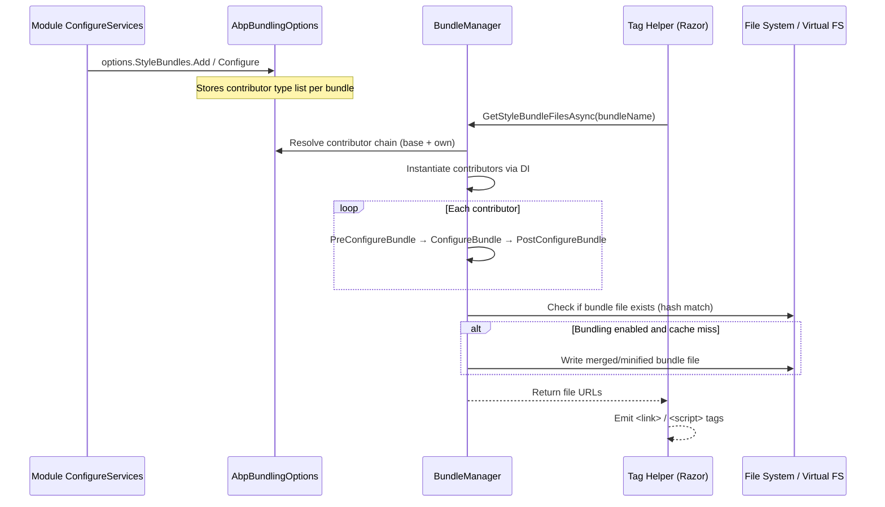

ABP's bundling and minification system provides a modular, contributor-based approach to managing JavaScript and CSS assets. Modules declare their assets through `IBundleContributor` implementations, bundles are assembled at runtime by `BundleManager`, and Razor tag helpers render the correct `<script>` and `<link>` elements.

## Core Abstractions

### IBundleContributor

```csharp
public interface IBundleContributor
{
    Task PreConfigureBundleAsync(BundleConfigurationContext context);
    Task ConfigureBundleAsync(BundleConfigurationContext context);
    Task PostConfigureBundleAsync(BundleConfigurationContext context);
    Task ConfigureDynamicResourcesAsync(BundleConfigurationContext context);
}
```

`BundleContributor` (abstract base class) provides synchronous no-op implementations of all four methods, so you typically override only `ConfigureBundle`:

```csharp
public class MyModuleStyleContributor : BundleContributor
{
    public override void ConfigureBundle(BundleConfigurationContext context)
    {
        context.Files.AddIfNotContains("/libs/my-module/my-module.css");
    }
}
```

The three-phase lifecycle (`Pre`, `Configure`, `Post`) allows contributors to depend on or modify files added by other contributors in the same bundle. `ConfigureDynamicResources` is for resources that must be resolved at request time rather than startup.

### AbpBundlingOptions

```csharp
public class AbpBundlingOptions
{
    public BundleConfigurationCollection StyleBundles { get; }
    public BundleConfigurationCollection ScriptBundles { get; }
    public HashSet<string> MinificationIgnoredFiles { get; }

    /// <summary>Default: "__bundles"</summary>
    public string BundleFolderName { get; } = "__bundles";

    /// <summary>Default: Auto</summary>
    public BundlingMode Mode { get; set; } = BundlingMode.Auto;

    public bool DeferScriptsByDefault { get; set; }
    public List<string> DeferScripts { get; }
    public bool PreloadStylesByDefault { get; set; }
    public List<string> PreloadStyles { get; }
    public AbpBundlingGlobalAssetsOptions GlobalAssets { get; set; }
    public BundleParameterDictionary Parameters { get; set; }
}
```

`StyleBundles` and `ScriptBundles` are `BundleConfigurationCollection` instances — keyed dictionaries of `BundleConfiguration` objects. Each `BundleConfiguration` holds a list of contributors and base bundle names.

### BundlingMode

```csharp
public enum BundlingMode
{
    None,           // No bundling or minification — individual file references
    Auto,           // None in Development, BundleAndMinify otherwise
    Bundle,         // Combined into one file, not minified
    BundleAndMinify // Combined and minified
}
```

`Auto` is the default and is the recommended setting. In development, you get individual file references for easy debugging. In staging/production the files are concatenated and minified.

## BundleManager

`BundleManager` extends `BundleManagerBase` and provides the ASP.NET Core-specific implementation:

```csharp
public class BundleManager : BundleManagerBase, ITransientDependency
{
    public override bool IsBundlingEnabled()
    {
        switch (Options.Mode)
        {
            case BundlingMode.None:           return false;
            case BundlingMode.Bundle:
            case BundlingMode.BundleAndMinify: return true;
            case BundlingMode.Auto:           return !HostingEnvironment.IsDevelopment();
        }
    }

    protected override bool IsMinficationEnabled()
    {
        switch (Options.Mode)
        {
            case BundlingMode.None:
            case BundlingMode.Bundle:          return false;
            case BundlingMode.BundleAndMinify: return true;
            case BundlingMode.Auto:            return !HostingEnvironment.IsDevelopment();
        }
    }

    protected override IFileProvider GetFileProvider()
    {
        return HostingEnvironment.WebRootFileProvider;
    }
}
```

`BundleManager` uses `IWebHostEnvironment` to determine the environment. `GetFileProvider()` returns the web root file provider, which includes ABP's virtual file system — meaning embedded resources from modules are resolved correctly.

### Request-Scoped Resource Tracking

```csharp
protected async override Task<List<BundleFile>> GetBundleFilesAsync(
    List<IBundleContributor> contributors)
{
    return RequestResources.TryAdd(await base.GetBundleFilesAsync(contributors));
}

protected async override Task<List<BundleFile>> GetDynamicResourcesAsync(
    List<IBundleContributor> contributors)
{
    return RequestResources.TryAdd(await base.GetDynamicResourcesAsync(contributors));
}
```

`IWebRequestResources` is a request-scoped service that deduplicates resource URLs across multiple bundle tag helpers on the same page. Both static bundle files and dynamic resources (resolved at request time via `ConfigureDynamicResourcesAsync`) are filtered through `TryAdd` — if `abp-script-bundle` and `abp-style-bundle` both try to add the same file (via base bundle inheritance), it appears only once in the rendered output.

### Bundle File Generation

When bundling is enabled, `BundleManagerBase` writes merged and optionally minified content to `wwwroot/__bundles/<hash>.js` (or `.css`). The hash is computed from the contributor chain and file contents — unchanged bundles are served from disk without regeneration.

## Defining and Composing Bundles

Modules register bundles in `ConfigureServices`:

```csharp
Configure<AbpBundlingOptions>(options =>
{
    // Define the global style bundle for the Basic theme
    options.StyleBundles
        .Add(BasicThemeBundles.Styles.Global, bundle =>
        {
            bundle
                .AddBaseBundles(StandardBundles.Styles.Global) // inherit shared bundle
                .AddContributors(typeof(BasicThemeGlobalStyleContributor));
        });

    options.ScriptBundles
        .Add(BasicThemeBundles.Scripts.Global, bundle =>
        {
            bundle
                .AddBaseBundles(StandardBundles.Scripts.Global)
                .AddContributors(typeof(BasicThemeGlobalScriptContributor));
        });
});
```

`AddBaseBundles` sets up bundle inheritance: all contributors from `StandardBundles.Styles.Global` are applied first, then `BasicThemeGlobalStyleContributor` adds theme-specific CSS. Modules further down the chain (e.g., a UI module) extend the theme bundle by calling:

```csharp
options.StyleBundles
    .Configure(BasicThemeBundles.Styles.Global, bundle =>
    {
        bundle.AddContributors(typeof(MyFeatureStyleContributor));
    });
```

`Configure` vs `Add`: `Add` creates a new bundle definition. `Configure` modifies an existing one.

### Standard Bundle Names

```csharp
// Volo.Abp.AspNetCore.Mvc.UI.Theme.Shared
public static class StandardBundles
{
    public static class Styles
    {
        public const string Global = "Global.Styles";
    }
    public static class Scripts
    {
        public const string Global = "Global.Scripts";
    }
}
```

All themes derive from these standard bundles, ensuring that base framework JavaScript (ABP utilities, anti-forgery, localization) is always included.

## Tag Helpers

ABP provides two Razor tag helpers that output the resolved bundle or individual file references:

```html
<!-- Script bundle -->
<abp-script-bundle name="@BasicThemeBundles.Scripts.Global" />

<!-- Style bundle -->
<abp-style-bundle name="@BasicThemeBundles.Styles.Global" />
```

When `IsBundlingEnabled()` returns `true`, these helpers emit a single `<script src="/__bundles/<hash>.js">` (or `<link>`). When bundling is disabled (development), they emit individual `<script>` and `<link>` tags for every file in the contributor chain.

### Script Deferring

```csharp
// Global defer
options.DeferScriptsByDefault = true;

// Per-file defer
options.DeferScripts.Add("/libs/specific-lib.js");
```

When `DeferScriptsByDefault` is `true`, all script tags get `defer` attribute. Individual files can be opted in or out via `DeferScripts`.

### Style Preloading

```csharp
options.PreloadStylesByDefault = true;
options.PreloadStyles.Add("/libs/critical.css");
```

Preloaded styles emit `<link rel="preload" as="style">` followed by the normal `<link rel="stylesheet">`, enabling the browser to fetch critical CSS early.

## CDN Support

CDN URLs are configured per-file via `AbpBundlingGlobalAssetsOptions` or by setting file paths in contributors to absolute URLs:

```csharp
public override void ConfigureBundle(BundleConfigurationContext context)
{
    // Absolute URL → served from CDN, not bundled
    context.Files.AddIfNotContains("https://cdn.example.com/libs/bootstrap/bootstrap.min.css");
}
```

Files with absolute URLs are never bundled. In bundling mode, they are emitted as-is alongside the bundle file reference.

## Module Asset Registration Flow



<Note>
Contributors are instantiated from DI each time a bundle is resolved, but the resulting file list and bundle file itself are cached in `IBundleCache` (a per-request or application-level cache depending on `BundlingMode`). In production the bundle file is generated once and served forever (until the content hash changes).
</Note>

## Minification

ABP uses `NUglify` (a fork of `UglifyJS` for .NET) for both JavaScript and CSS minification. Files listed in `MinificationIgnoredFiles` are concatenated but not minified:

```csharp
options.MinificationIgnoredFiles.Add("/libs/already-minified.min.js");
```

<Warning>
Source map files are not generated by the bundler. If you need source maps in production, serve the original files and handle bundling/minification in your build pipeline (webpack, vite, etc.) and configure ABP bundling to use the output files.
</Warning>

## Virtual File System Integration

`GetFileProvider()` returns `IWebHostEnvironment.WebRootFileProvider`, which is composed from both physical `wwwroot` files and ABP's virtual file system (`AbpVirtualFileSystemOptions`). This means embedded resources from NuGet packages (declared via `options.FileSets.AddEmbedded<TModule>(...)`) are resolved transparently alongside physical files.
