`AbpAspNetCoreMvcModule` is the central integration point between ASP.NET Core MVC and the ABP Framework. It wires together conventional controllers, request localization, AntiForgery, JSON serialization, and more — all within ABP's module lifecycle hooks (`PreConfigureServices`, `ConfigureServices`, `PostConfigureServices`, `OnApplicationInitialization`).

## Dependency Chain

The module declares eight direct dependencies, each of which brings its own dependency tree:

```csharp
[DependsOn(
    typeof(AbpAspNetCoreModule),
    typeof(AbpLocalizationModule),
    typeof(AbpApiVersioningAbstractionsModule),
    typeof(AbpAspNetCoreMvcContractsModule),
    typeof(AbpUiNavigationModule),
    typeof(AbpGlobalFeaturesModule),
    typeof(AbpDddApplicationModule),
    typeof(AbpJsonSystemTextJsonModule)
)]
public class AbpAspNetCoreMvcModule : AbpModule { ... }
```

<CardGroup cols={2}>
  <Card title="AbpAspNetCoreModule" icon="server">
    Core ASP.NET Core integration: middleware pipeline, request localization, virtual file system.
  </Card>
  <Card title="AbpDddApplicationModule" icon="layer-group">
    Application service base classes, `IApplicationService` marker interface, DDD abstractions.
  </Card>
  <Card title="AbpApiVersioningAbstractionsModule" icon="code-branch">
    API versioning abstractions used by the conventional controller convention system.
  </Card>
  <Card title="AbpJsonSystemTextJsonModule" icon="brackets-curly">
    System.Text.Json configuration with ABP-specific converters (enums, datetimes, etc.).
  </Card>
</CardGroup>

## PreConfigureServices

During `PreConfigureServices`, the module prevents dynamic proxy interception of MVC infrastructure types:

```csharp
public override void PreConfigureServices(ServiceConfigurationContext context)
{
    DynamicProxyIgnoreTypes.Add<ControllerBase>();
    DynamicProxyIgnoreTypes.Add<PageModel>();
    DynamicProxyIgnoreTypes.Add<ViewComponent>();

    context.Services.AddConventionalRegistrar(new AbpAspNetCoreMvcConventionalRegistrar());
}
```

`DynamicProxyIgnoreTypes` is a static registry. Adding `ControllerBase`, `PageModel`, and `ViewComponent` ensures ABP's interceptor pipeline (used for UoW, audit logging, etc.) does not wrap MVC runtime objects — their cross-cutting concerns are applied at the service layer instead.

`AbpAspNetCoreMvcConventionalRegistrar` scans assemblies and registers controllers as transient DI services, enabling `AddControllersAsServices()` later.

## ConfigureServices

This is where the bulk of MVC configuration happens.

### AntiForgery Integration

ABP adds `AbpAutoValidateAntiforgeryTokenAttribute` as a global MVC filter:

```csharp
var mvcCoreBuilder = context.Services.AddMvcCore(options =>
{
    options.Filters.Add(new AbpAutoValidateAntiforgeryTokenAttribute());
});
```

This filter automatically validates CSRF tokens on non-GET/HEAD/OPTIONS requests for non-AJAX clients, using the standard ASP.NET Core AntiForgery infrastructure. The `AbpApplicationConfigurationController` calls `AntiForgeryManager.SetCookie()` to seed the token on first load.

### JSON Configuration

ABP uses System.Text.Json by default, configured via an extension method on `MvcCoreBuilder`:

```csharp
mvcCoreBuilder.AddAbpJson();
```

`AddAbpJson()` registers ABP-specific JSON converters (handling `Guid`, `DateTime`, `ExtraProperties`, object extensions, etc.). If Newtonsoft.Json is preferred, modules can pre-configure `MvcBuilder` before `AddAbpJson()` is called — the last registration wins.

### Data Annotation Localization

```csharp
var mvcBuilder = context.Services.AddMvc()
    .AddDataAnnotationsLocalization(options =>
    {
        options.DataAnnotationLocalizerProvider = (type, factory) =>
        {
            var resourceType = abpMvcDataAnnotationsLocalizationOptions
                .AssemblyResources.GetOrDefault(type.Assembly);
            return resourceType != null
                ? factory.Create(resourceType)
                : factory.CreateDefaultOrNull() ?? factory.Create(type);
        };
    })
    .AddViewLocalization();
```

Each assembly can register a localization resource type. The custom `DataAnnotationLocalizerProvider` routes validation messages to the correct resource, falling back to the default resource or the model type's own resource.

### Model Binding Messages

ABP overrides ASP.NET Core's default model-binding error messages with its own localized strings:

```csharp
mvcOptions.ModelBindingMessageProvider
    .SetValueIsInvalidAccessor(_ => stringLocalizer["The value '{0}' is invalid."]);
mvcOptions.ModelBindingMessageProvider
    .SetNonPropertyValueMustBeANumberAccessor(
        () => stringLocalizer["The field must be a number."]);
```

### Conventional Controller Feature Provider

```csharp
partManager.FeatureProviders.Add(
    new AbpConventionalControllerFeatureProvider(application));
partManager.ApplicationParts.AddIfNotContains(
    typeof(AbpAspNetCoreMvcModule).Assembly);
```

`AbpConventionalControllerFeatureProvider` discovers all application services configured via `AbpConventionalControllerOptions` and exposes them as MVC controllers to the application part manager. This is what makes auto API controller generation work at the MVC framework level.

### Endpoint Route Registration

```csharp
Configure<AbpEndpointRouterOptions>(options =>
{
    options.EndpointConfigureActions.Add(endpointContext =>
    {
        endpointContext.Endpoints.MapControllerRoute(
            "defaultWithArea", "{area}/{controller=Home}/{action=Index}/{id?}");
        endpointContext.Endpoints.MapControllerRoute(
            "default", "{controller=Home}/{action=Index}/{id?}").WithStaticAssets();
        endpointContext.Endpoints.MapRazorPages().WithStaticAssets();
    });
});
```

Routes are registered via `AbpEndpointRouterOptions` rather than directly on `IEndpointRouteBuilder`, allowing other modules to insert routes before or after these defaults.

## PostConfigureServices

After all modules have configured services, `PostConfigureServices` finalises two things:

1. **ApplicationPart ordering** — `ApplicationPartSorter.Sort()` reorders application parts so that module assemblies appear in dependency order.
2. **Conventional controller DI exclusion** — all types discovered as conventional controllers are added to `DynamicProxyIgnoreTypes` to avoid double interception.

### Route-Based Culture

```csharp
protected virtual void ConfigureRouteBasedCulture(ServiceConfigurationContext context)
{
    context.Services.Configure<RouteOptions>(options =>
    {
        options.ConstraintMap["culture"] = typeof(AbpCultureRouteConstraint);
    });
    // ...
}
```

If `AbpRequestLocalizationOptions.UseRouteBasedCulture` is `true`, an additional route template `{culture:culture}/{controller=Home}/{action=Index}/{id?}` is inserted at position 0, and `AbpCultureRoutePagesConvention` is added to Razor Pages. A custom `AbpCultureRouteUrlHelperFactory` replaces the standard one to regenerate culture-prefixed URLs correctly.

## OnApplicationInitialization

```csharp
public override void OnApplicationInitialization(ApplicationInitializationContext context)
{
    AddApplicationParts(context);
    CheckLibs(context);
}
```

`AddApplicationParts` loads assemblies from three sources into `ApplicationPartManager`:
- **Plugin module assemblies** — assemblies loaded as plug-ins at runtime.
- **Conventional controller assemblies** — assemblies registered via `ConventionalControllerSettings`.
- **Additional assemblies** — assemblies returned by `IAbpModule.GetAdditionalAssemblies()`.

`CheckLibs` invokes `IAbpMvcLibsService.CheckLibs()` to verify that required client-side library bundles are present.

## AbpControllerBase and AbpController

ABP provides two base classes for controllers that surface common ABP services via lazy property injection:

```csharp
// For API controllers (no view support)
public abstract class AbpControllerBase : ControllerBase, IAvoidDuplicateCrossCuttingConcerns
{
    public IAbpLazyServiceProvider LazyServiceProvider { get; set; }

    protected IUnitOfWorkManager UnitOfWorkManager => ...;
    protected ICurrentUser CurrentUser => ...;
    protected ICurrentTenant CurrentTenant => ...;
    protected IAuthorizationService AuthorizationService => ...;
    protected IObjectMapper ObjectMapper => ...;
    protected IFeatureChecker FeatureChecker => ...;
    protected IStringLocalizer L => ...;
    // ...
}

// For MVC controllers (with view support)
public abstract class AbpController : Controller, IAvoidDuplicateCrossCuttingConcerns
{
    // Same properties as AbpControllerBase, plus:
    protected IAppUrlProvider AppUrlProvider => ...;
    protected virtual Task<RedirectResult> RedirectSafelyAsync(...) { }
}
```

All properties use `IAbpLazyServiceProvider` for resolution, which means they are resolved only on first access, preventing unnecessary DI overhead. The `IAvoidDuplicateCrossCuttingConcerns` interface signals ABP's interceptor pipeline not to double-apply cross-cutting concerns already applied at the service layer.

<Note>
Use `AbpControllerBase` for REST API controllers that derive from `ControllerBase`. Use `AbpController` for MVC controllers that return views and need `IAppUrlProvider` for safe redirects.
</Note>

## Module Lifecycle Summary

```mermaid
flowchart TD
    A[PreConfigureServices] --> B[Add DynamicProxyIgnoreTypes]
    A --> C[Register AbpAspNetCoreMvcConventionalRegistrar]
    D[ConfigureServices] --> E[Add Global AntiForgery Filter]
    D --> F[Configure JSON / AddAbpJson]
    D --> G[Configure DataAnnotation Localization]
    D --> H[Add AbpConventionalControllerFeatureProvider]
    D --> I[Register Default Routes]
    J[PostConfigureServices] --> K[Sort ApplicationParts]
    J --> L[Exclude ConventionalControllers from DI proxy]
    J --> M[Configure Route-Based Culture]
    N[OnApplicationInitialization] --> O[Add Plugin/Conventional/Additional AssemblyParts]
    N --> P[CheckLibs]
```


