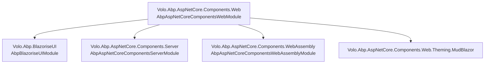

ABP supports Blazor through three distinct hosting packages, each mapping to a different Blazor deployment model. All three share a common web component foundation (`Volo.Abp.AspNetCore.Components.Web`) and a component library built on Blazorise (`Volo.Abp.BlazoriseUI`). The server-side and WebAssembly packages diverge in how they source their data — server reads in-process, WASM fetches over HTTP.

## Package Architecture



<CardGroup cols={3}>
  <Card title="Blazor Server" icon="server">
    `Volo.Abp.AspNetCore.Components.Server` — runs on the server, communicates via SignalR. Integrates with `AbpAspNetCoreSignalRModule`. ABP services are available directly in-process.
  </Card>
  <Card title="Blazor WASM" icon="browser">
    `Volo.Abp.AspNetCore.Components.WebAssembly` — runs in the browser. Uses `AbpBlazorClientHttpMessageHandler` for authenticated HTTP requests. Bootstraps from the application configuration endpoint.
  </Card>
  <Card title="MAUI Blazor" icon="mobile">
    Blazor Hybrid running inside .NET MAUI. Uses the same WASM-style component packages but hosted natively. No browser WebAssembly runtime required.
  </Card>
</CardGroup>

## AbpAspNetCoreComponentsWebModule

This is the root module for all Blazor UI work:

```csharp
[DependsOn(
    typeof(AbpUiModule),
    typeof(AbpAspNetCoreComponentsModule)
)]
public class AbpAspNetCoreComponentsWebModule : AbpModule
{
    public override void ConfigureServices(ServiceConfigurationContext context)
    {
        // Replace ASP.NET Core's default component activator with DI-based activator
        context.Services.Replace(
            ServiceDescriptor.Transient<IComponentActivator, ServiceProviderComponentActivator>());

        var preActions = context.Services.GetPreConfigureActions<AbpAspNetCoreComponentsWebOptions>();
        Configure<AbpAspNetCoreComponentsWebOptions>(options =>
        {
            preActions.Configure(options);
        });
    }
}
```

Replacing `IComponentActivator` with `ServiceProviderComponentActivator` means every Razor component is resolved from the DI container. This enables property injection (via `[Inject]`) and full DI lifecycle management for components.

## Blazor Server Module

`AbpAspNetCoreComponentsServerModule` depends on:
- `AbpHttpClientModule` — for in-process HTTP client proxies
- `AbpAspNetCoreSignalRModule` — Blazor Server's transport layer
- `AbpEventBusModule` — distributed event integration

Key configurations applied:

```csharp
public override void ConfigureServices(ServiceConfigurationContext context)
{
    context.Services.AddServerSideBlazor(options =>
    {
        if (context.Services.GetHostingEnvironment().IsDevelopment())
            options.DetailedErrors = true;
    });

    // Exclude Blazor's SignalR hub URL from UoW and audit logging
    Configure<AbpAspNetCoreUnitOfWorkOptions>(options =>
    {
        options.IgnoredUrls.AddIfNotContains("/_blazor");
    });
    Configure<AbpAspNetCoreAuditingOptions>(options =>
    {
        options.IgnoredUrls.AddIfNotContains("/_blazor");
    });

    // Register Blazor hub and fallback page (for non-Blazor Web App mode)
    if (!context.Services.ExecutePreConfiguredActions<AbpAspNetCoreComponentsWebOptions>().IsBlazorWebApp)
    {
        Configure<AbpEndpointRouterOptions>(options =>
        {
            options.EndpointConfigureActions.Add(endpointContext =>
            {
                endpointContext.Endpoints.MapBlazorHub(...);
                endpointContext.Endpoints.MapFallbackToPage("/_Host");
            });
        });
    }
}
```

The `/_blazor` URL exclusion from unit of work and audit logging is critical — Blazor Server's persistent WebSocket connection would otherwise try to wrap every SignalR message in a database transaction.

## Blazor WASM Module

`AbpAspNetCoreComponentsWebAssemblyModule` handles the extra complexity of running in the browser:

```csharp
[DependsOn(
    typeof(AbpAspNetCoreMvcClientCommonModule),
    typeof(AbpUiModule),
    typeof(AbpAspNetCoreComponentsWebModule)
)]
public class AbpAspNetCoreComponentsWebAssemblyModule : AbpModule
{
    public override void PreConfigureServices(ServiceConfigurationContext context)
    {
        // Add AbpBlazorClientHttpMessageHandler to all generated HTTP client proxies
        PreConfigure<AbpHttpClientBuilderOptions>(options =>
        {
            options.ProxyClientBuildActions.Add((_, builder) =>
            {
                builder.AddHttpMessageHandler<AbpBlazorClientHttpMessageHandler>();
            });
        });
    }

    public override async Task OnApplicationInitializationAsync(
        ApplicationInitializationContext context)
    {
        // 1. Fetch application configuration
        await context.ServiceProvider
            .GetRequiredService<WebAssemblyCachedApplicationConfigurationClient>()
            .InitializeAsync();

        // 2. Initialize claims cache from configuration
        await context.ServiceProvider
            .GetRequiredService<AbpComponentsClaimsCache>()
            .InitializeAsync();

        // 3. Set thread culture from configuration
        await SetCurrentLanguageAsync(context.ServiceProvider);
    }
}
```

### AbpBlazorClientHttpMessageHandler

This `DelegatingHandler` sits in the `HttpClient` pipeline for all proxy-generated HTTP clients. It adds:
- **Authorization header** — reads the access token from the OIDC authentication state
- **Tenant header** — adds `__tenant` header from `ICurrentTenant`
- **Culture header** — adds `Accept-Language` from `CultureInfo.CurrentUICulture`

### WebAssemblyCachedApplicationConfigurationClient

This is the WASM implementation of `ICachedApplicationConfigurationClient`. On startup it:

1. Calls `GET /api/abp/application-configuration?includeLocalizationResources=false`
2. Calls `GET /api/abp/application-localization?cultureName=en&onlyDynamics=true`
3. Merges localization resources into the configuration DTO
4. Stores the result in `ApplicationConfigurationCache` (a scoped in-memory store)
5. Sets `CurrentTenantAccessor.Current` from `currentTenant` in the response
6. Resolves timezone from IANA name or browser JS (`abp.clock.getBrowserTimeZone`)
7. Fires `ApplicationConfigurationChangedService.NotifyChanged()` to trigger re-renders

```csharp
public virtual async Task InitializeAsync()
{
    var configurationDto = await ApplicationConfigurationClientProxy.GetAsync(
        new ApplicationConfigurationRequestOptions { IncludeLocalizationResources = false });

    var localizationDto = await ApplicationLocalizationClientProxy.GetAsync(
        new ApplicationLocalizationRequestDto {
            CultureName = configurationDto.Localization.CurrentCulture.Name,
            OnlyDynamics = true
        });

    configurationDto.Localization.Resources = localizationDto.Resources;
    Cache.Set(configurationDto);

    if (!configurationDto.CurrentUser.IsAuthenticated)
        await JSRuntime.InvokeVoidAsync("abp.utils.removeOidcUser");

    CurrentTenantAccessor.Current = new BasicTenantInfo(
        configurationDto.CurrentTenant.Id,
        configurationDto.CurrentTenant.Name);
    // ...
    ApplicationConfigurationChangedService.NotifyChanged();
}
```

### Culture Initialization

After the configuration is cached, the module applies the current culture:

```csharp
private static async Task SetCurrentLanguageAsync(IServiceProvider serviceProvider)
{
    var configuration = await configurationClient.GetAsync();
    var cultureName = configuration.Localization?.CurrentCulture?.CultureName;
    if (!cultureName.IsNullOrEmpty())
    {
        var culture = new CultureInfo(cultureName!);
        CultureInfo.DefaultThreadCurrentCulture = culture;
        CultureInfo.DefaultThreadCurrentUICulture = culture;
    }

    if (CultureInfo.CurrentUICulture.TextInfo.IsRightToLeft)
        await utilsService.AddClassToTagAsync("body", "rtl");
}
```

RTL languages trigger `abp.utils.addClassToTag("body", "rtl")` via JSInterop, allowing CSS to respond appropriately.

## ABP Services in Blazor Components

All ABP services are available in components via `[Inject]`:

```razor
@inject ICurrentUser CurrentUser
@inject IAuthorizationService AuthorizationService
@inject IStringLocalizer<MyResource> L
@inject ICachedApplicationConfigurationClient ConfigurationClient
@inject IAbpUtilsService UtilsService

@if (CurrentUser.IsAuthenticated)
{
    <p>Welcome, @CurrentUser.Name!</p>
}
```

### Localization in Blazor

The `IStringLocalizer<T>` in Blazor WASM reads from the cached configuration's `Localization.Resources` dictionary rather than from resource files (which don't exist in the browser). The `AbpBlazorMessageLocalizerHelper<T>` wraps this with argument localization support:

```csharp
// Singleton helper registered by AbpBlazoriseUIModule
services.AddSingleton(typeof(AbpBlazorMessageLocalizerHelper<>));
```

### Authorization in Blazor

In Blazor Server, `IAuthorizationService` runs in-process and evaluates policies directly. In Blazor WASM, `WebAssemblyAuthenticationStateProvider` wraps Microsoft's `RemoteAuthenticationService` and initializes `AbpComponentsClaimsCache` from the OIDC token claims. The `GrantedPolicies` dictionary from the application configuration endpoint is used for quick permission checks without additional HTTP calls.

## Authentication State Provider (WASM)

`AbpAspNetCoreComponentsWebAssemblyModule` replaces the standard `RemoteAuthenticationService<,,>` with `WebAssemblyAuthenticationStateProvider<,,>`:

```csharp
public override void PostConfigureServices(ServiceConfigurationContext context)
{
    var msAuthenticationStateProvider = context.Services
        .FirstOrDefault(x => x.ServiceType == typeof(AuthenticationStateProvider));

    if (msAuthenticationStateProvider is { ImplementationType: not null } &&
        msAuthenticationStateProvider.ImplementationType.IsGenericType &&
        msAuthenticationStateProvider.ImplementationType.GetGenericTypeDefinition()
            == typeof(RemoteAuthenticationService<,,>))
    {
        // Replace with ABP's wrapper that also updates AbpComponentsClaimsCache
        context.Services.Replace(
            ServiceDescriptor.Scoped(typeof(AuthenticationStateProvider),
                webAssemblyAuthenticationStateProviderType));
    }
}
```

This ensures that when the OIDC authentication state changes (login, logout, token refresh), the ABP claims cache is refreshed and Blazor components re-render with the updated user context.

## AbpAspNetCoreComponentsWebOptions

```csharp
// Key option for Blazor Web App (.NET 8+ unified model)
public bool IsBlazorWebApp { get; set; } = false;
```

When `IsBlazorWebApp = true`, the module skips registering the legacy `/_Host` fallback page and the explicit `MapBlazorHub` call, deferring to Blazor Web App's own routing.
