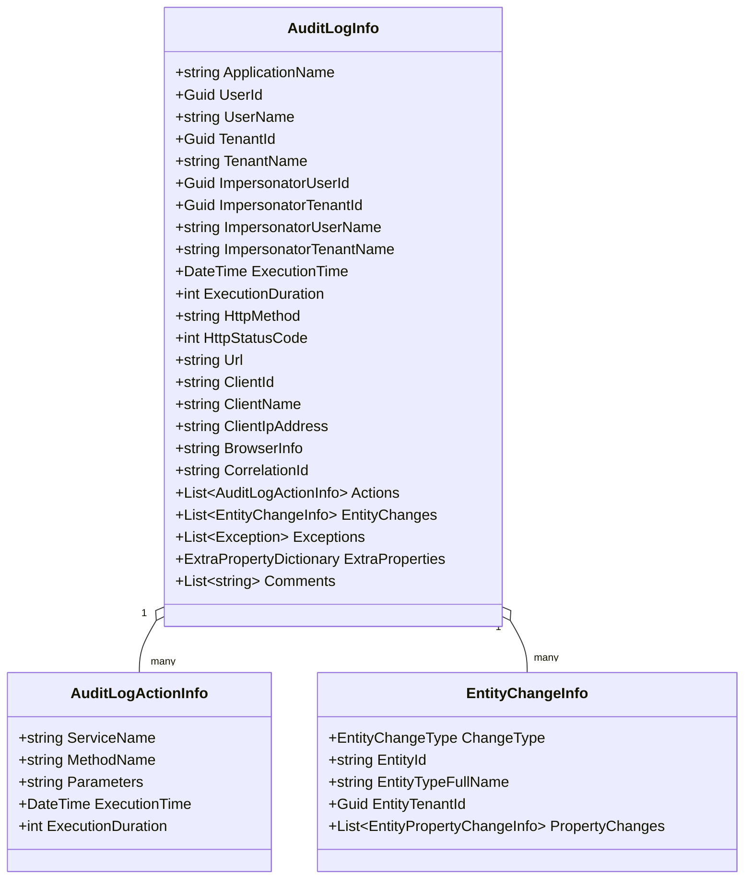
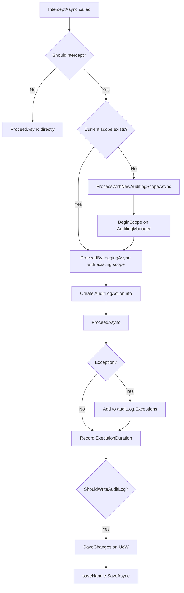

ABP's auditing subsystem captures two complementary data sets: **request/action logs** (who called what service method, when, for how long, with what result) and **entity change logs** (which domain objects changed within that request, with before/after property values). Both sets flow through a single `AuditLogInfo` object assembled in-process, then flushed to an `IAuditingStore` at the end of the request or application-service method boundary. An `AuditingInterceptor` ties the whole system together so that almost nothing needs to be wired manually.

## Core Components

<CardGroup cols={2}>
  <Card title="AuditingManager" icon="clipboard-list">
    Creates and manages the ambient `IAuditLogScope`. Call `BeginScope()` to start a new log; the returned `IAuditLogSaveHandle` accumulates data and persists via `SaveAsync()`.
  </Card>
  <Card title="AuditingInterceptor" icon="bolt">
    An `AbpInterceptor` that wraps every audited service method. Creates a new scope when none exists, attaches action info, catches exceptions, and saves the log (optionally after flushing the unit of work).
  </Card>
  <Card title="AuditLogInfo" icon="file-lines">
    The in-memory DTO. Contains request metadata, a list of `AuditLogActionInfo` (per method), a list of `EntityChangeInfo` (per entity mutation), and a list of raw `Exception` objects.
  </Card>
  <Card title="IAuditPropertySetter" icon="pen-to-square">
    Sets `CreationTime`, `CreatorId`, `LastModificationTime`, `LastModifierId`, `DeletionTime`, `DeleterId`, and `EntityVersion` on domain entities by inspecting auditing marker interfaces.
  </Card>
</CardGroup>

## AuditLogInfo Structure



The full `AuditLogInfo` class:

```csharp
[Serializable]
public class AuditLogInfo : IHasExtraProperties
{
    public string?   ApplicationName          { get; set; }
    public Guid?     UserId                   { get; set; }
    public string?   UserName                 { get; set; }
    public Guid?     TenantId                 { get; set; }
    public string?   TenantName               { get; set; }
    public Guid?     ImpersonatorUserId       { get; set; }
    public Guid?     ImpersonatorTenantId     { get; set; }
    public string?   ImpersonatorUserName     { get; set; }
    public string?   ImpersonatorTenantName   { get; set; }
    public DateTime  ExecutionTime            { get; set; }
    public int       ExecutionDuration        { get; set; }  // milliseconds
    public string?   ClientId                 { get; set; }
    public string?   ClientName               { get; set; }
    public string?   CorrelationId            { get; set; }
    public string?   ClientIpAddress          { get; set; }
    public string?   BrowserInfo              { get; set; }
    public string?   HttpMethod               { get; set; }
    public int?      HttpStatusCode           { get; set; }
    public string?   Url                      { get; set; }

    public List<AuditLogActionInfo> Actions         { get; set; }
    public List<EntityChangeInfo>   EntityChanges   { get; }
    public List<Exception>          Exceptions      { get; }
    public ExtraPropertyDictionary  ExtraProperties { get; }
    public List<string>             Comments        { get; set; }
}
```

## AuditingManager: Scope Lifecycle

`AuditingManager` stores the current scope in an `IAmbientScopeProvider<IAuditLogScope>` keyed by a constant string. This provides a logical "current log" accessible anywhere in the call chain without requiring explicit injection of the log object.

```csharp
public class AuditingManager : IAuditingManager, ITransientDependency
{
    private const string AmbientContextKey =
        "Volo.Abp.Auditing.IAuditLogScope";

    public IAuditLogScope? Current =>
        _ambientScopeProvider.GetValue(AmbientContextKey);

    public IAuditLogSaveHandle BeginScope()
    {
        var ambientScope = _ambientScopeProvider.BeginScope(
            AmbientContextKey,
            new AuditLogScope(_auditingHelper.CreateAuditLogInfo())
        );

        return new DisposableSaveHandle(
            this, ambientScope, Current!.Log,
            Stopwatch.StartNew());
    }

    protected virtual async Task SaveAsync(DisposableSaveHandle saveHandle)
    {
        BeforeSave(saveHandle);
        await _auditingStore.SaveAsync(saveHandle.AuditLog);
    }

    protected virtual void BeforeSave(DisposableSaveHandle saveHandle)
    {
        saveHandle.StopWatch.Stop();
        saveHandle.AuditLog.ExecutionDuration =
            Convert.ToInt32(saveHandle.StopWatch.Elapsed.TotalMilliseconds);
        ExecutePostContributors(saveHandle.AuditLog);
        MergeEntityChanges(saveHandle.AuditLog);
    }
}
```

`MergeEntityChanges` consolidates multiple `Updated` entries for the same entity (same type + id) into a single `EntityChangeInfo` by merging property change collections. This handles cases where the same entity is modified more than once within a single UoW.

## AuditingInterceptor Flow



`ShouldIntercept` checks three conditions:

1. `options.IsEnabled` is `true`
2. `AbpCrossCuttingConcerns.Auditing` has not already been applied (prevents double-logging)
3. `auditingHelper.ShouldSaveAudit(method, ignoreIntegrationServiceAttribute: options.IsEnabledForIntegrationServices)` — respects `[Audited]` / `[DisableAuditing]` attributes and class-level defaults

`ShouldWriteAuditLogAsync` then applies post-execution filters:

| Condition | Behavior |
|---|---|
| `AlwaysLogSelectors` matches | Always write |
| `AlwaysLogOnException && hasError` | Always write |
| `!IsEnabledForAnonymousUsers && !authenticated` | Skip |
| `!IsEnabledForGetRequests && GET/HEAD method name starts with "Get"` | Skip |

## AbpAuditingOptions

```csharp
public class AbpAuditingOptions
{
    public bool   IsEnabled                  { get; set; } = true;
    public bool   HideErrors                 { get; set; } = true;
    public string? ApplicationName           { get; set; }
    public bool   IsEnabledForAnonymousUsers { get; set; } = true;
    public bool   AlwaysLogOnException       { get; set; } = true;
    public bool   IsEnabledForIntegrationServices { get; set; } = false;
    public bool   IsEnabledForGetRequests    { get; set; } = false;
    public bool   DisableLogActionInfo       { get; set; } = false;
    public bool   SaveEntityHistoryWhenNavigationChanges { get; set; } = true;

    public List<Func<AuditLogInfo, Task<bool>>> AlwaysLogSelectors { get; }
    public List<AuditLogContributor>            Contributors { get; }
    public List<Type>                           IgnoredTypes { get; }
    public IEntityHistorySelectorList           EntityHistorySelectors { get; }
}
```

`IgnoredTypes` defaults to `{ Stream, Expression, CancellationToken }` — parameters of these types are excluded from the serialized action parameters. `EntityHistorySelectors` drives which entity types have their property changes tracked (EF Core integration reads these during `SaveChanges`).

**Selecting entities for history tracking:**

```csharp
Configure<AbpAuditingOptions>(options =>
{
    // Track all entities in your domain assembly
    options.EntityHistorySelectors.AddAllEntities();

    // Or selectively
    options.EntityHistorySelectors.Add(
        new NamedTypeSelector("MyEntities", t =>
            t.Namespace?.StartsWith("MyApp.Domain") == true)
    );
});
```

## IAuditPropertySetter

`AuditPropertySetter` inspects domain objects against auditing marker interfaces and sets timestamp/user-id properties. It is called by the EF Core `SaveChanges` interceptor in `AbpDbContext`.

```csharp
public interface IAuditPropertySetter
{
    void SetCreationProperties(object targetObject);
    void SetModificationProperties(object targetObject);
    void SetDeletionProperties(object targetObject);
    void IncrementEntityVersionProperty(object targetObject);
}
```

Marker interfaces and what gets set:

| Interface | Properties set |
|---|---|
| `IHasCreationTime` | `CreationTime` (only if default) |
| `IMayHaveCreator` / `IMustHaveCreator` | `CreatorId` |
| `IHasModificationTime` | `LastModificationTime` |
| `IModificationAuditedObject` | `LastModifierId` |
| `IHasDeletionTime` | `DeletionTime` |
| `IDeletionAuditedObject` | `DeleterId` |
| `IHasEntityVersion` | `EntityVersion` (incremented) |

`AuditPropertySetter` cross-checks `IMultiTenant.TenantId` against `CurrentUser.TenantId` before setting user-id fields, preventing a host-side user from being recorded as the creator of a tenant entity.

## IAuditingStore and Custom Sinks

The built-in `SimpleLogAuditingStore` writes to `ILogger`. Production implementations are provided by `Volo.Abp.AuditLogging` (EF Core or MongoDB). You can add a custom sink:

```csharp
public class ElasticAuditingStore : IAuditingStore, ITransientDependency
{
    private readonly IElasticClient _elasticClient;

    public async Task SaveAsync(AuditLogInfo auditInfo)
    {
        await _elasticClient.IndexDocumentAsync(auditInfo);
    }
}
```

Register by replacing the default:

```csharp
context.Services.AddTransient<IAuditingStore, ElasticAuditingStore>();
```

## AuditLogContributor Extension Point

`AuditLogContributor.PostContribute` runs after the method finishes and before the log is saved. Use it to enrich `AuditLogInfo` with custom properties:

```csharp
public class CorrelationIdAuditLogContributor : AuditLogContributor
{
    public override void PostContribute(
        AuditLogContributionContext context)
    {
        var correlationId = context.ServiceProvider
            .GetService<ICorrelationIdProvider>()
            ?.Get();

        context.AuditInfo.CorrelationId = correlationId;
    }
}

// Register:
Configure<AbpAuditingOptions>(options =>
{
    options.Contributors.Add(new CorrelationIdAuditLogContributor());
});
```

<Tip>
Set `AbpAuditingOptions.DisableLogActionInfo = true` in high-throughput scenarios where per-method parameter serialization is too expensive. The log will still capture entity changes and exceptions, but will skip `AuditLogActionInfo` creation.
</Tip>
