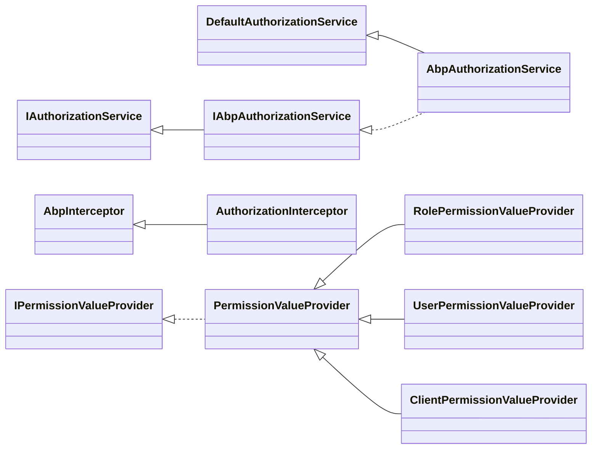

ABP extends ASP.NET Core's authorization infrastructure with a permission system that decouples what users can do from how that information is stored. Permissions are defined in code as named `PermissionDefinition` objects, and their granted/denied values are resolved at runtime through a chain of pluggable `IPermissionValueProvider` implementations. An `AuthorizationInterceptor` then enforces those permissions on any application-service method automatically, so you rarely need to call `IPermissionChecker` by hand.

## Core Abstractions

<CardGroup cols={2}>
  <Card title="IAbpAuthorizationService" icon="shield-check">
    Extends `IAuthorizationService` with `CurrentPrincipal`. ABP replaces the default ASP.NET Core implementation with `AbpAuthorizationService`, which sources the principal from `ICurrentPrincipalAccessor` so it works correctly outside an HTTP context.
  </Card>
  <Card title="IPermissionChecker" icon="list-check">
    The primary runtime check interface. Accepts a permission name (or an array) plus an optional `ClaimsPrincipal` override. Returns `bool` or `MultiplePermissionGrantResult`.
  </Card>
  <Card title="PermissionDefinition" icon="code">
    Metadata describing a single permission: unique `Name`, `DisplayName`, `MultiTenancySide`, hierarchical `Children`, allowed `Providers`, and arbitrary `Properties`.
  </Card>
  <Card title="IPermissionValueProvider" icon="plug">
    The extension point for reading grant values. Each provider has a short `Name` used for storage keying and implements `CheckAsync` returning `PermissionGrantResult` (Granted / Prohibited / Undefined).
  </Card>
</CardGroup>

## Class Hierarchy



## Defining Permissions

Permissions are declared by subclassing `PermissionDefinitionProvider` and overriding `Define`. ABP discovers all registered providers at startup and merges them into a single `IPermissionDefinitionManager`.

```csharp
public class BookStorePermissionDefinitionProvider : PermissionDefinitionProvider
{
    public override void Define(IPermissionDefinitionContext context)
    {
        var bookStoreGroup = context.AddGroup(
            BookStorePermissions.GroupName,
            L("Permission:BookStore")
        );

        var booksPermission = bookStoreGroup.AddPermission(
            BookStorePermissions.Books.Default,
            L("Permission:Books")
        );

        booksPermission.AddChild(
            BookStorePermissions.Books.Create,
            L("Permission:Books.Create")
        );

        booksPermission.AddChild(
            BookStorePermissions.Books.Edit,
            L("Permission:Books.Edit")
        );

        booksPermission.AddChild(
            BookStorePermissions.Books.Delete,
            L("Permission:Books.Delete")
        );
    }

    private static LocalizableString L(string name)
        => LocalizableString.Create<BookStoreResource>(name);
}
```

A child permission can only be granted if its parent is already granted.  
`PermissionDefinition.Providers` restricts which value providers are consulted. An empty list means all providers are allowed.

## Permission Value Providers

`SettingProvider` iterates `ISettingValueProviderManager.Providers` **in reverse order**, meaning the highest-priority provider wins. ABP registers three built-in providers out of the box:

| Provider | `Name` constant | What it checks |
|---|---|---|
| `RolePermissionValueProvider` | `"R"` | Claims matching `AbpClaimTypes.Role` in the principal |
| `UserPermissionValueProvider` | `"U"` | Claim matching `AbpClaimTypes.UserId` |
| `ClientPermissionValueProvider` | `"C"` | Claim matching `AbpClaimTypes.ClientId`; switches to host tenant while checking |

```csharp
// RolePermissionValueProvider - checks each role claim
public override async Task<PermissionGrantResult> CheckAsync(
    PermissionValueCheckContext context)
{
    var roles = context.Principal?
        .FindAll(AbpClaimTypes.Role)
        .Select(c => c.Value)
        .ToArray();

    if (roles == null || !roles.Any())
    {
        return PermissionGrantResult.Undefined;
    }

    foreach (var role in roles.Distinct())
    {
        if (await PermissionStore.IsGrantedAsync(
                context.Permission.Name, Name, role))
        {
            return PermissionGrantResult.Granted;
        }
    }

    return PermissionGrantResult.Undefined;
}
```

```csharp
// ClientPermissionValueProvider - always checks at host level
public override async Task<PermissionGrantResult> CheckAsync(
    PermissionValueCheckContext context)
{
    var clientId = context.Principal?
        .FindFirst(AbpClaimTypes.ClientId)?.Value;

    if (clientId == null)
    {
        return PermissionGrantResult.Undefined;
    }

    // Switch to host tenant for client-level grants
    using (CurrentTenant.Change(null))
    {
        return await PermissionStore.IsGrantedAsync(
            context.Permission.Name, Name, clientId)
            ? PermissionGrantResult.Granted
            : PermissionGrantResult.Undefined;
    }
}
```

`IPermissionStore` is the persistence abstraction. The framework ships `NullPermissionStore`; real storage comes from `Volo.Abp.PermissionManagement` modules (EF Core or MongoDB).

## AuthorizationInterceptor

`AuthorizationInterceptor` is an `AbpInterceptor` registered on all application services. It fires **before** `ProceedAsync()` and delegates to `IMethodInvocationAuthorizationService`, which reads `[Authorize]` and `[RequiresPermission]` attributes from the method's reflection metadata.

```csharp
public class AuthorizationInterceptor : AbpInterceptor, ITransientDependency
{
    private readonly IMethodInvocationAuthorizationService
        _methodInvocationAuthorizationService;

    public override async Task InterceptAsync(
        IAbpMethodInvocation invocation)
    {
        await AuthorizeAsync(invocation);
        await invocation.ProceedAsync();
    }

    protected virtual async Task AuthorizeAsync(
        IAbpMethodInvocation invocation)
    {
        await _methodInvocationAuthorizationService.CheckAsync(
            new MethodInvocationAuthorizationContext(
                invocation.Method
            )
        );
    }
}
```

<Note>
Because the interceptor checks the **method** attributes before execution, you do not need to call `IPermissionChecker.IsGrantedAsync` inside every application service method. Placing `[Authorize("BookStore.Books.Create")]` on the method is sufficient.
</Note>

## Declarative vs. Programmatic Checks

**Declarative (preferred for service methods)**

```csharp
[Authorize(BookStorePermissions.Books.Create)]
public async Task<BookDto> CreateAsync(CreateBookDto input)
{
    // The interceptor has already enforced the permission.
    // No manual check needed here.
    return await _bookRepository.InsertAsync(/* ... */);
}
```

**Programmatic (for conditional logic inside a method)**

```csharp
public async Task<BookDto> GetAsync(Guid id)
{
    var book = await _bookRepository.GetAsync(id);

    if (await _permissionChecker.IsGrantedAsync(
            BookStorePermissions.Books.SeeHiddenFields))
    {
        // populate sensitive fields
    }

    return ObjectMapper.Map<Book, BookDto>(book);
}
```

## PermissionGrantResult Enum

```csharp
public enum PermissionGrantResult
{
    Undefined,   // Provider has no opinion
    Granted,     // Permission is explicitly granted
    Prohibited   // Permission is explicitly denied (overrides Granted)
}
```

The evaluator stops at the first non-`Undefined` result when iterating providers in reverse (highest-priority first). A `Prohibited` result from any provider overrides a `Granted` from a lower-priority one.

## Custom Value Provider

```csharp
public class OrganizationPermissionValueProvider : PermissionValueProvider
{
    public const string ProviderName = "Organization";
    public override string Name => ProviderName;

    public OrganizationPermissionValueProvider(
        IPermissionStore permissionStore)
        : base(permissionStore) { }

    public override async Task<PermissionGrantResult> CheckAsync(
        PermissionValueCheckContext context)
    {
        var orgId = context.Principal?
            .FindFirst("organization_id")?.Value;

        if (orgId == null)
        {
            return PermissionGrantResult.Undefined;
        }

        return await PermissionStore.IsGrantedAsync(
            context.Permission.Name, Name, orgId)
            ? PermissionGrantResult.Granted
            : PermissionGrantResult.Undefined;
    }
}
```

Register via `AbpPermissionOptions`:

```csharp
Configure<AbpPermissionOptions>(options =>
{
    options.ValueProviders.Add<OrganizationPermissionValueProvider>();
});
```

## Multi-tenancy and Permissions

`PermissionDefinition.MultiTenancySide` controls which sides a permission applies to:

- `MultiTenancySides.Host` — only available to the host
- `MultiTenancySides.Tenant` — only available to tenants  
- `MultiTenancySides.Both` — available to both (default)

The permission checker framework filters out definitions that do not match the current side before calling providers.

<Warning>
Disabling a `PermissionDefinition` (setting `IsEnabled = false`) prevents it from being granted to anyone, but `IsGrantedAsync` will still return `false` rather than throwing. Use this to hide application features without breaking the permission check contract.
</Warning>
