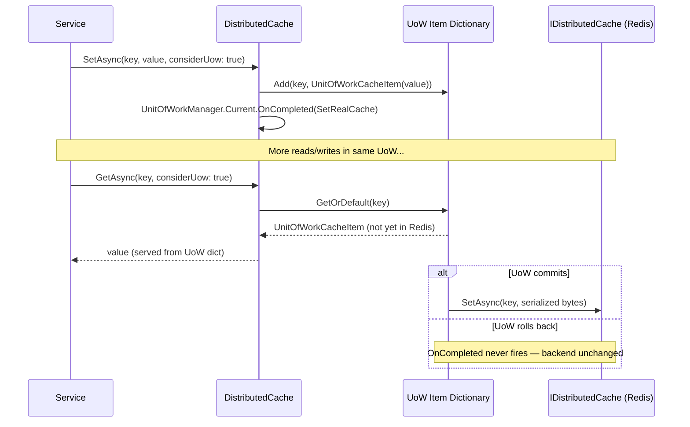

ABP wraps ASP.NET Core's `IDistributedCache` with a generic, type-safe abstraction that adds automatic key normalization, multi-tenancy isolation, UoW-aware write buffering, error suppression, and a `GetOrAddAsync` pattern with a double-checked locking semaphore. All of this lives in `Volo.Abp.Caching` and requires only a cache item POCO class to wire up.

## Architecture Overview

<CardGroup cols={2}>
  <Card title="IDistributedCache&lt;TCacheItem&gt;" icon="box">
    ABP's generic, type-safe wrapper. Extends `IDistributedCache<TCacheItem, string>` and delegates all operations to the inner two-type-parameter implementation.
  </Card>
  <Card title="DistributedCache&lt;TCacheItem, TCacheKey&gt;" icon="gear">
    The concrete class that serializes items, normalizes keys, handles UoW buffering, and catches/logs exceptions when `HideErrors = true`. Registered as a **singleton** open-generic service.
  </Card>
  <Card title="DistributedCacheKeyNormalizer" icon="key">
    Produces the final string key in format `t:{tenantId},c:{cacheName},k:{prefix}{key}`. Omits tenant prefix when `IgnoreMultiTenancy` is set.
  </Card>
  <Card title="AbpDistributedCacheOptions" icon="sliders">
    Global configuration: `KeyPrefix`, `HideErrors`, `GlobalCacheEntryOptions` (default sliding expiration 20 minutes), and per-cache configurator delegates.
  </Card>
</CardGroup>

## IDistributedCache&lt;TCacheItem&gt; Interface

ABP's interface is a superset of `Microsoft.Extensions.Caching.Distributed.IDistributedCache`. It adds type safety, UoW support, batch operations, and consistent error handling:

```csharp
public interface IDistributedCache<TCacheItem, TCacheKey>
    where TCacheItem : class
{
    TCacheItem? Get(TCacheKey key, bool? hideErrors = null, bool considerUow = false);
    Task<TCacheItem?> GetAsync(TCacheKey key, bool? hideErrors = null,
        bool considerUow = false, CancellationToken token = default);

    TCacheItem? GetOrAdd(TCacheKey key, Func<TCacheItem> factory,
        Func<DistributedCacheEntryOptions>? optionsFactory = null,
        bool? hideErrors = null, bool considerUow = false);

    Task<TCacheItem?> GetOrAddAsync(TCacheKey key,
        Func<Task<TCacheItem>> factory,
        Func<DistributedCacheEntryOptions>? optionsFactory = null,
        bool? hideErrors = null, bool considerUow = false,
        CancellationToken token = default);

    void Set(TCacheKey key, TCacheItem value,
        DistributedCacheEntryOptions? options = null,
        bool? hideErrors = null, bool considerUow = false);

    // Batch variants:
    KeyValuePair<TCacheKey, TCacheItem?>[] GetMany(...);
    Task<KeyValuePair<TCacheKey, TCacheItem?>[]> GetManyAsync(...);
    void SetMany(...);
    Task SetManyAsync(...);
    KeyValuePair<TCacheKey, TCacheItem?>[] GetOrAddMany(...);
    Task<KeyValuePair<TCacheKey, TCacheItem?>[]> GetOrAddManyAsync(...);

    void Refresh(TCacheKey key, bool? hideErrors = null);
    Task RefreshAsync(TCacheKey key, bool? hideErrors = null,
        CancellationToken token = default);
    void RefreshMany(IEnumerable<TCacheKey> keys, bool? hideErrors = null);
    Task RefreshManyAsync(IEnumerable<TCacheKey> keys, bool? hideErrors = null,
        CancellationToken token = default);

    void Remove(TCacheKey key, bool? hideErrors = null, bool considerUow = false);
    Task RemoveAsync(TCacheKey key, bool? hideErrors = null,
        bool considerUow = false, CancellationToken token = default);
    void RemoveMany(IEnumerable<TCacheKey> keys, bool? hideErrors = null,
        bool considerUow = false);
    Task RemoveManyAsync(IEnumerable<TCacheKey> keys, bool? hideErrors = null,
        bool considerUow = false, CancellationToken token = default);
}

// Shorthand interface: TCacheKey defaults to string
public interface IDistributedCache<TCacheItem>
    : IDistributedCache<TCacheItem, string>
    where TCacheItem : class { }
```

Inject `IDistributedCache<MyCacheItem>` into your service — no registration is needed because `DistributedCache<TCacheItem>` and `DistributedCache<TCacheItem,TCacheKey>` are registered as open-generic **singletons** in `AbpCachingModule`.

## Naming Cache Items with CacheNameAttribute

By default, `CacheNameAttribute.GetCacheName(type)` uses `type.FullName` minus the `CacheItem` postfix as the cache name. Override it with the attribute:

```csharp
[CacheName("ProductDetails")]
public class ProductCacheItem
{
    public string Name { get; set; } = default!;
    public decimal Price { get; set; }
}
```

Without the attribute, `Acme.ProductCacheItem` becomes the cache segment name `Acme.Product` (postfix stripped).

## Key Normalization

`DistributedCacheKeyNormalizer.NormalizeKey` produces the final Redis/memory key:

```csharp
public virtual string NormalizeKey(DistributedCacheKeyNormalizeArgs args)
{
    var normalizedKey = $"c:{args.CacheName},k:{DistributedCacheOptions.KeyPrefix}{args.Key}";

    if (!args.IgnoreMultiTenancy && CurrentTenant.Id.HasValue)
    {
        normalizedKey = $"t:{CurrentTenant.Id.Value},{normalizedKey}";
    }

    return normalizedKey;
}
```

### Key structure examples

| Scenario | Final key |
|---|---|
| No tenant, no prefix | `c:ProductDetails,k:42` |
| With `KeyPrefix = "myapp:"` | `c:ProductDetails,k:myapp:42` |
| Tenant `a1b2...` | `t:a1b2...,c:ProductDetails,k:42` |

`DistributedCache<TCacheItem, TCacheKey>.SetDefaultOptions` sets `IgnoreMultiTenancy = true` when the cache item type carries `[IgnoreMultiTenancyAttribute]` — useful for shared lookup tables that are identical across all tenants.

## AbpDistributedCacheOptions

```csharp
public class AbpDistributedCacheOptions
{
    public bool HideErrors { get; set; } = true;
    public string KeyPrefix { get; set; } = "";
    public DistributedCacheEntryOptions GlobalCacheEntryOptions { get; set; }
    public List<Func<string, DistributedCacheEntryOptions?>> CacheConfigurators { get; set; }

    // Convenience helpers:
    public void ConfigureCache<TCacheItem>(DistributedCacheEntryOptions? options);
    public void ConfigureCache(Type cacheItemType, DistributedCacheEntryOptions? options);
    public void ConfigureCache(string cacheName, DistributedCacheEntryOptions? options);
}
```

`AbpCachingModule` sets the default `GlobalCacheEntryOptions.SlidingExpiration` to **20 minutes** and, in development environments, automatically sets `HideErrors = false` so cache failures surface immediately.

`CacheConfigurators` is a list of delegates, each given the cache name at construction time and returning options or `null`. `DistributedCache` iterates them in order; the first non-null result wins. Use `ConfigureCache<T>` which adds a name-matched delegate:

```csharp
Configure<AbpDistributedCacheOptions>(options =>
{
    options.KeyPrefix = "myapp:";
    options.HideErrors = false; // throw on Redis failures

    options.ConfigureCache<ProductCacheItem>(new DistributedCacheEntryOptions
    {
        AbsoluteExpiration = DateTimeOffset.Now.AddHours(2)
    });
});
```

## GetOrAddAsync — Double-Checked Locking

The most commonly used method pattern protects against cache stampedes with a `SemaphoreSlim`:

```csharp
public virtual async Task<TCacheItem?> GetOrAddAsync(
    TCacheKey key,
    Func<Task<TCacheItem>> factory,
    Func<DistributedCacheEntryOptions>? optionsFactory = null,
    bool? hideErrors = null,
    bool considerUow = false,
    CancellationToken token = default)
{
    token = CancellationTokenProvider.FallbackToProvider(token);
    var value = await GetAsync(key, hideErrors, considerUow, token);
    if (value != null) return value;

    // Lock, re-check, then call factory
    using (await SyncSemaphore.LockAsync(token))
    {
        value = await GetAsync(key, hideErrors, considerUow, token);
        if (value != null) return value;

        value = await factory();

        if (ShouldConsiderUow(considerUow))
        {
            var uowCache = GetUnitOfWorkCache();
            if (uowCache.TryGetValue(key, out var item))
                item.SetValue(value);
            else
                uowCache.Add(key, new UnitOfWorkCacheItem<TCacheItem>(value));
        }

        await SetAsync(key, value, optionsFactory?.Invoke(), hideErrors, considerUow, token);
    }

    return value;
}
```

The outer fast-path check avoids lock contention for warm-cache scenarios. The inner double-check inside the semaphore prevents duplicate factory invocations under concurrent cold-start.

<Note>
`SyncSemaphore` is a `SemaphoreSlim(1,1)` on each `DistributedCache<TCacheItem, TCacheKey>` instance. Because the cache is registered as a **singleton**, one instance is shared across all requests for a given `TCacheItem`/`TCacheKey` pair. This means the semaphore effectively serializes stampede protection application-wide for each cache type.
</Note>

## UoW-Aware Cache

When `considerUow: true` is passed and there is an active unit of work, ABP buffers cache mutations in the UoW's item dictionary under the key `"AbpDistributedCache" + CacheName`. Actual writes to the real cache backend happen only when the UoW completes successfully via `UnitOfWorkManager.Current.OnCompleted(...)`.

### UnitOfWorkCacheItem

```csharp
[Serializable]
public class UnitOfWorkCacheItem<TValue> where TValue : class
{
    public bool IsRemoved { get; set; }
    public TValue? Value { get; set; }

    public UnitOfWorkCacheItem<TValue> SetValue(TValue value)
    {
        Value = value;
        IsRemoved = false;
        return this;
    }

    public UnitOfWorkCacheItem<TValue> RemoveValue()
    {
        Value = null;
        IsRemoved = true;
        return this;
    }
}
```

`GetUnRemovedValueOrNull()` (extension method) returns `null` when `IsRemoved = true`, allowing reads within the same UoW to see pending removals.

### UoW lifecycle



<Warning>
If you call `SetAsync` with `considerUow: true` but then the UoW rolls back, the in-memory UoW dict is discarded and the real cache is never written. However, items already in the real cache from a previous UoW are not rolled back — the UoW pattern only delays writes, it does not implement full cache transactions.
</Warning>

## Error Handling

When `HideErrors = true` (the default in production; `false` in development), any exception from the backing `IDistributedCache` is logged at `Warning` level, notified via `IExceptionNotifier`, and suppressed — `Get`/`GetAsync` return `null`, `Set`/`Remove` silently no-op. Set `HideErrors = false` to propagate exceptions, which is automatically done in development environments by `AbpCachingModule`.

```csharp
try
{
    cachedBytes = await Cache.GetAsync(NormalizeKey(key), token);
}
catch (Exception ex)
{
    if (hideErrors == true)
    {
        await HandleExceptionAsync(ex); // log + notify
        return null;
    }
    throw;
}
```

## Batch Operations and ICacheSupportsMultipleItems

ABP checks whether the backing `IDistributedCache` implementation also implements `ICacheSupportsMultipleItems`. If it does, batch methods (`GetMany`, `SetMany`, `RemoveMany`, `RefreshMany`) use the batch API. Otherwise, each item is processed individually in a loop.

## Hybrid Cache Integration

`Volo.Abp.Caching` ships a `Hybrid` namespace that wraps ASP.NET Core's `HybridCache` (introduced in .NET 9) with the same ABP conventions. The interface mirrors `IDistributedCache<T>` but uses `HybridCacheEntryOptions`:

```csharp
public interface IHybridCache<TCacheItem, TCacheKey>
    where TCacheItem : class
{
    Task<TCacheItem?> GetOrCreateAsync(
        TCacheKey key,
        Func<Task<TCacheItem>> factory,
        Func<HybridCacheEntryOptions>? optionsFactory = null,
        bool? hideErrors = null,
        bool considerUow = false,
        CancellationToken token = default);

    Task SetAsync(TCacheKey key, TCacheItem value,
        HybridCacheEntryOptions? options = null,
        bool? hideErrors = null, bool considerUow = false,
        CancellationToken token = default);

    Task RemoveAsync(TCacheKey key, bool? hideErrors = null,
        bool considerUow = false, CancellationToken token = default);

    Task RemoveManyAsync(IEnumerable<TCacheKey> keys,
        bool? hideErrors = null, bool considerUow = false,
        CancellationToken token = default);
}
```

`IHybridCache<TCacheItem>` defaults `TCacheKey` to `string` and exposes an `InternalCache` property. Both `IHybridCache<>` and `IHybridCache<,>` are also registered as open-generic **singletons** in `AbpCachingModule`.

<Tip>
Prefer `IHybridCache<T>` over `IDistributedCache<T>` when targeting .NET 9+ — `HybridCache` uses an in-process L1 cache in addition to the distributed L2 store, eliminating a network round-trip for the hot path without any code changes.
</Tip>

## Multi-Tenancy Cache Isolation

`DistributedCacheKeyNormalizer` reads `ICurrentTenant.Id` at the moment `NormalizeKey` is called. Because keys are namespaced per tenant, different tenants cannot read each other's cache entries even if they share the same Redis instance.

To opt out of tenant isolation for a specific cache item type, apply `[IgnoreMultiTenancy]` to the class. `SetDefaultOptions` in `DistributedCache` detects the attribute:

```csharp
// Detect at construction time:
IgnoreMultiTenancy = typeof(TCacheItem)
    .IsDefined(typeof(IgnoreMultiTenancyAttribute), true);
```

When `IgnoreMultiTenancy = true`, the `t:{tenantId}` segment is omitted from the key, and all tenants share the same cached entries.

## Complete Usage Example

```csharp
// Cache item definition
[CacheName("BookSummary")]
public class BookSummaryCacheItem
{
    public string Title { get; set; } = default!;
    public string AuthorName { get; set; } = default!;
}

// Usage in application service
public class BookAppService : ApplicationService
{
    private readonly IDistributedCache<BookSummaryCacheItem> _cache;

    public BookAppService(IDistributedCache<BookSummaryCacheItem> cache)
        => _cache = cache;

    public async Task<BookSummaryCacheItem?> GetSummaryAsync(Guid bookId)
    {
        return await _cache.GetOrAddAsync(
            bookId.ToString(),
            factory: async () =>
            {
                // called only on cache miss
                var book = await _bookRepository.GetAsync(bookId);
                return new BookSummaryCacheItem
                {
                    Title = book.Title,
                    AuthorName = book.Author
                };
            },
            optionsFactory: () => new DistributedCacheEntryOptions
            {
                SlidingExpiration = TimeSpan.FromMinutes(30)
            }
        );
    }
}
```
