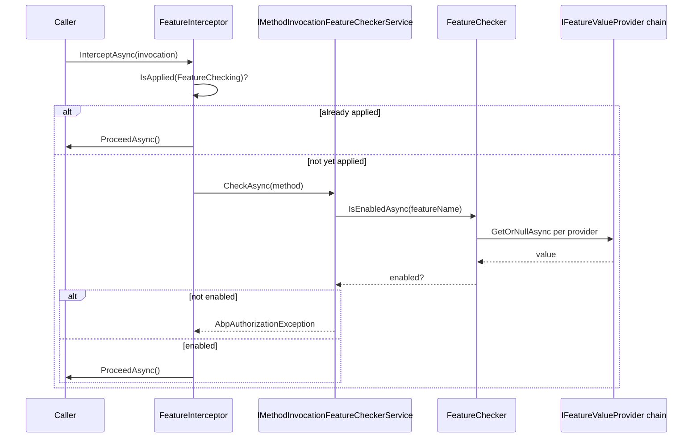
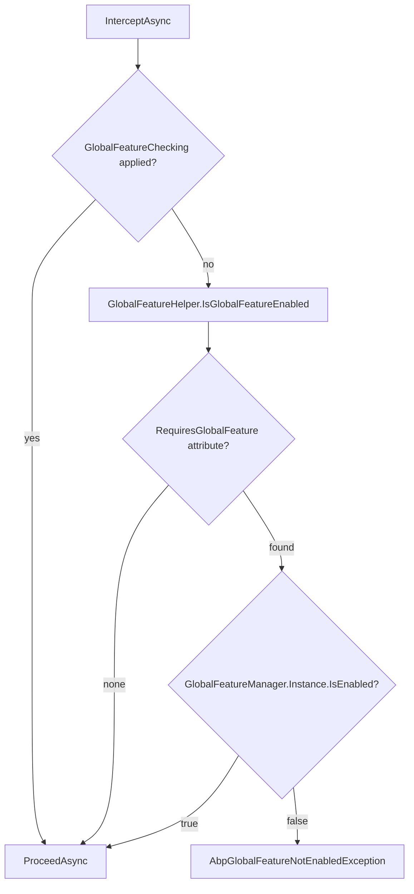

ABP has two distinct feature systems that serve complementary purposes. **Runtime Features** (`IFeatureChecker`) are per-tenant, per-edition toggles evaluated at request time and stored in a database. **Global Features** (`GlobalFeatureManager`) are application-level flags set once at startup — they are compile-time toggles that permanently enable or disable entire framework modules in a deployed application. Understanding the difference avoids confusion when you encounter both interceptor types in a trace.

## Runtime Features vs Global Features

<CardGroup cols={2}>
  <Card title="Runtime Features" icon="toggle-on">
    Per-tenant/per-edition values stored in a database. Checked at request time via `IFeatureChecker`. Can be changed without redeployment through the management UI.
  </Card>
  <Card title="Global Features" icon="flag">
    Application-wide boolean flags set in `Program.cs` or module initialization. Stored in memory only (`GlobalFeatureManager.Instance`). Require a redeployment to change.
  </Card>
  <Card title="FeatureInterceptor" icon="filter">
    Dynamic proxy interceptor that enforces `[RequiresFeature]` attributes on service classes and methods. Uses `IFeatureChecker` to query current tenant feature values.
  </Card>
  <Card title="GlobalFeatureInterceptor" icon="shield">
    Dynamic proxy interceptor that enforces `[RequiresGlobalFeature]` attributes. Reads from the in-memory `GlobalFeatureManager.Instance` — never touches the database.
  </Card>
</CardGroup>

## FeatureDefinition

`FeatureDefinition` describes a single runtime feature including its default value, value type (boolean toggle or arbitrary string), hierarchy, and which providers are allowed to set its value.

```csharp
public class FeatureDefinition : ICanCreateChildFeature
{
    public string Name { get; }
    public string? DefaultValue { get; set; }
    public IStringValueType? ValueType { get; set; } // default: ToggleStringValueType
    public bool IsVisibleToClients { get; set; }     // default: true
    public bool IsAvailableToHost { get; set; }       // default: true
    public FeatureDefinition? Parent { get; }
    public IReadOnlyList<FeatureDefinition> Children { get; }
    public List<string> AllowedProviders { get; }

    public FeatureDefinition CreateChild(string name, ...) { ... }
    public FeatureDefinition WithProperty(string key, object value) { ... }
    public FeatureDefinition WithProviders(params string[] providers) { ... }
}
```

Key differences from `SettingDefinition`:
- **Hierarchy** — features can have child features. A child can only be enabled if its parent is enabled.
- **`ValueType`** — defaults to `ToggleStringValueType` (boolean `"true"`/`"false"`) but can be `FreeTextStringValueType` or `SelectionStringValueType` for numeric quotas or plan names.
- **`IsAvailableToHost`** — controls whether host-level tenancy can use this feature.
- **`AllowedProviders`** — equivalent to `SettingDefinition.Providers`; restricts which providers answer for this feature.

## IFeatureChecker and FeatureChecker

`IFeatureChecker` is the runtime read interface. The base class `FeatureCheckerBase` adds boolean helpers like `IsEnabledAsync`:

```csharp
public class FeatureChecker : FeatureCheckerBase
{
    public override async Task<string?> GetOrNullAsync(string name)
    {
        var featureDefinition = await FeatureDefinitionManager.GetOrNullAsync(name);
        if (featureDefinition == null)
        {
            return null;
        }

        var providers = FeatureValueProviderManager.ValueProviders.Reverse();

        if (featureDefinition.AllowedProviders.Any())
        {
            providers = providers.Where(
                p => featureDefinition.AllowedProviders.Contains(p.Name)
            );
        }

        return await GetOrNullValueFromProvidersAsync(providers, featureDefinition);
    }
}
```

The resolution algorithm mirrors the settings chain: providers are reversed (highest priority last) and queried until a non-null value is found. The typical provider order registered by the commercial edition is:

| Priority (high→low) | Provider | Scope |
|---|---|---|
| 1 | `EditionFeatureValueProvider` | Edition/plan name (e.g., "Enterprise") |
| 2 | `TenantFeatureValueProvider` | Per-tenant override |
| 3 | `DefaultValueFeatureValueProvider` | `FeatureDefinition.DefaultValue` |

## FeatureDefinitionManager — Static and Dynamic Stores

`FeatureDefinitionManager` merges a static store populated at startup from `IFeatureDefinitionProvider` classes with an optional dynamic store that can be backed by a database (used by the management UI).

```csharp
public virtual async Task<FeatureDefinition?> GetOrNullAsync(string name)
{
    return await StaticStore.GetOrNullAsync(name)
        ?? await DynamicStore.GetOrNullAsync(name);
}

public virtual async Task<IReadOnlyList<FeatureDefinition>> GetAllAsync()
{
    var staticFeatures = await StaticStore.GetFeaturesAsync();
    var staticFeatureNames = staticFeatures.Select(p => p.Name).ToImmutableHashSet();
    var dynamicFeatures = await DynamicStore.GetFeaturesAsync();

    /* Static features take precedence */
    return staticFeatures.Concat(
        dynamicFeatures.Where(d => !staticFeatureNames.Contains(d.Name))
    ).ToImmutableList();
}
```

<Note>
Static definitions always win over dynamic ones with the same name. This prevents runtime database overrides from silently changing code-defined feature semantics.
</Note>

## RequiresFeatureAttribute

`[RequiresFeature]` can be placed on a class or method. When the DI container resolves a proxied service that has this attribute, `FeatureInterceptor` fires before the method executes.

```csharp
[AttributeUsage(AttributeTargets.Class | AttributeTargets.Method)]
public class RequiresFeatureAttribute : Attribute
{
    public string[] Features { get; }

    /// If true, ALL features must be enabled.
    /// If false (default), at least one must be enabled.
    public bool RequiresAll { get; set; }

    public RequiresFeatureAttribute(params string[] features)
    {
        Features = features ?? Array.Empty<string>();
    }
}
```

## FeatureInterceptor — Runtime Check Pipeline

```csharp
public class FeatureInterceptor : AbpInterceptor, ITransientDependency
{
    public override async Task InterceptAsync(IAbpMethodInvocation invocation)
    {
        if (AbpCrossCuttingConcerns.IsApplied(
                invocation.TargetObject,
                AbpCrossCuttingConcerns.FeatureChecking))
        {
            await invocation.ProceedAsync();
            return;
        }

        await CheckFeaturesAsync(invocation);
        await invocation.ProceedAsync();
    }

    protected virtual async Task CheckFeaturesAsync(IAbpMethodInvocation invocation)
    {
        using (var scope = _serviceScopeFactory.CreateScope())
        {
            await scope.ServiceProvider
                .GetRequiredService<IMethodInvocationFeatureCheckerService>()
                .CheckAsync(new MethodInvocationFeatureCheckerContext(invocation.Method));
        }
    }
}
```

Important implementation details:
1. **Re-entrancy guard** — `AbpCrossCuttingConcerns.IsApplied(..., FeatureChecking)` prevents infinite recursion when `IFeatureChecker` itself calls services that are also intercepted.
2. **Dedicated DI scope** — `_serviceScopeFactory.CreateScope()` creates a fresh scope for the check, ensuring `IFeatureChecker` gets a clean current-tenant context even if the outer scope is being reused.
3. **Delegation to `IMethodInvocationFeatureCheckerService`** — this service inspects `[RequiresFeature]` on the method and class, then calls `IFeatureChecker.IsEnabledAsync` for each declared feature.



## Global Features

Global features control whether entire ABP modules (e.g., `Ecommerce`, `CMS`) are compiled into the application's runtime behavior. They are stored in a static singleton — `GlobalFeatureManager.Instance` — and there is no database involvement.

### GlobalFeatureManager

```csharp
public class GlobalFeatureManager
{
    public static GlobalFeatureManager Instance { get; protected set; }
        = new GlobalFeatureManager();

    protected HashSet<string> EnabledFeatures { get; }
    public GlobalModuleFeaturesDictionary Modules { get; }

    public virtual bool IsEnabled<TFeature>()
        => IsEnabled(GlobalFeatureNameAttribute.GetName(typeof(TFeature)));

    public virtual bool IsEnabled(string featureName)
        => EnabledFeatures.Contains(featureName);

    public virtual void Enable<TFeature>()
        => Enable(GlobalFeatureNameAttribute.GetName(typeof(TFeature)));

    public virtual void Enable(string featureName)
        => EnabledFeatures.AddIfNotContains(featureName);
}
```

The `GlobalFeatureNameAttribute` must be present on every global feature class — it supplies the string key used in `EnabledFeatures`. Calling `GlobalFeatureManager.GetName(type)` without the attribute throws `AbpException`.

### GlobalModuleFeatures

Framework modules expose their features through a strongly-typed `GlobalModuleFeatures` subclass (e.g., `EcommerceGlobalFeatures`). This provides fluent, compile-safe access:

```csharp
public abstract class GlobalModuleFeatures
{
    protected GlobalFeatureDictionary AllFeatures { get; }

    public virtual void Enable<TFeature>() where TFeature : GlobalFeature
        => GetFeature<TFeature>().Enable();

    public virtual void Disable<TFeature>() where TFeature : GlobalFeature
        => GetFeature<TFeature>().Disable();

    public virtual void EnableAll()
    {
        foreach (var feature in AllFeatures.Values) feature.Enable();
    }
}
```

Each concrete `GlobalFeature` subclass's `Enable()`/`Disable()` delegates to `GlobalFeatureManager.Instance.Enable(FeatureName)`, keeping a single source of truth.

### RequiresGlobalFeatureAttribute

```csharp
[AttributeUsage(AttributeTargets.Class)]
public class RequiresGlobalFeatureAttribute : Attribute
{
    public Type? Type { get; }
    public string? Name { get; }

    public RequiresGlobalFeatureAttribute(Type type) { Type = type; }
    public RequiresGlobalFeatureAttribute(string name) { Name = name; }

    public virtual string GetFeatureName()
        => Name ?? GlobalFeatureNameAttribute.GetName(Type!);
}
```

Apply it to a service class (not a method) to declare that the entire class is gated on a global feature:

```csharp
[RequiresGlobalFeature(typeof(MyModuleGlobalFeature))]
public class ProductAppService : ApplicationService { ... }
```

### GlobalFeatureInterceptor — Compile-Time Check Pipeline

Unlike `FeatureInterceptor`, `GlobalFeatureInterceptor` performs a synchronous `HashSet.Contains` check with no async I/O:

```csharp
public class GlobalFeatureInterceptor : AbpInterceptor, ITransientDependency
{
    public override async Task InterceptAsync(IAbpMethodInvocation invocation)
    {
        if (AbpCrossCuttingConcerns.IsApplied(
                invocation.TargetObject,
                AbpCrossCuttingConcerns.GlobalFeatureChecking))
        {
            await invocation.ProceedAsync();
            return;
        }

        if (invocation.TargetObject != null &&
            !GlobalFeatureHelper.IsGlobalFeatureEnabled(
                invocation.TargetObject.GetType(), out var attribute))
        {
            throw new AbpGlobalFeatureNotEnabledException(
                    code: AbpGlobalFeatureErrorCodes.GlobalFeatureIsNotEnabled)
                .WithData("ServiceName", invocation.TargetObject.GetType().FullName!)
                .WithData("GlobalFeatureName", attribute!.Name!);
        }

        await invocation.ProceedAsync();
    }
}
```

`GlobalFeatureHelper.IsGlobalFeatureEnabled` reads the `[RequiresGlobalFeature]` attribute from the concrete type (not the interface), resolves the feature name, and checks `GlobalFeatureManager.Instance.IsEnabled(name)`. When disabled, `AbpGlobalFeatureNotEnabledException` is thrown before any method body executes.



## Enabling Global Features at Startup

```csharp
// In Program.cs or a module's PreConfigureServices
GlobalFeatureManager.Instance.Modules.Ecommerce().EnableAll();

// Or selectively:
GlobalFeatureManager.Instance.Enable<ProductReviewsFeature>();
```

<Warning>
`GlobalFeatureManager.Instance` is a static singleton initialized before the DI container starts. Do not enable or disable features inside `ConfigureServices` or `OnApplicationInitialization` callbacks that may be called multiple times — always use early startup hooks.
</Warning>

## Comparison Summary

| Dimension | Runtime Features | Global Features |
|---|---|---|
| Storage | Database (via `IFeatureValueProvider` chain) | In-memory `HashSet<string>` |
| Granularity | Per-tenant / per-edition | Application-wide |
| Change at runtime | Yes (management UI) | No (requires redeployment) |
| Check cost | Async DB/cache lookup | Synchronous `HashSet.Contains` |
| Attribute | `[RequiresFeature]` on class or method | `[RequiresGlobalFeature]` on class only |
| Interceptor | `FeatureInterceptor` | `GlobalFeatureInterceptor` |
| Purpose | Edition/plan control | Module activation |

<Tip>
Use Global Features to gate framework module registration (`AddXxx()` in `ConfigureServices`) as well as method interceptors. This means a disabled global feature adds zero overhead — the interceptor throws before any module code runs.
</Tip>
