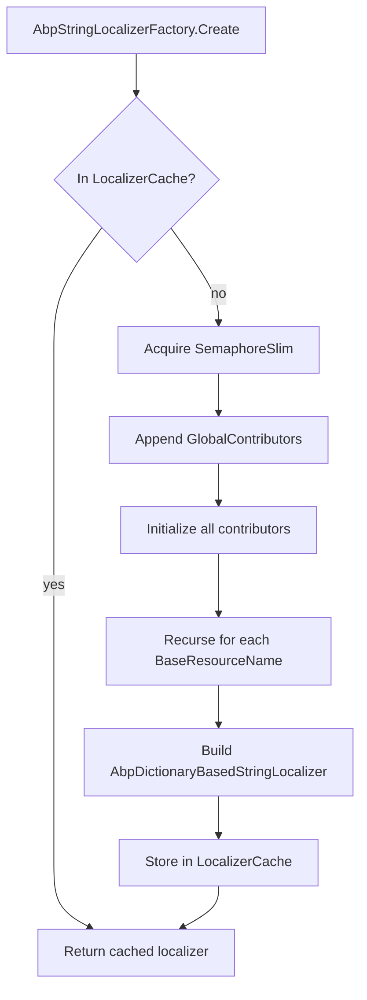

ABP's localization system extends ASP.NET Core's `IStringLocalizer` stack with resource inheritance, virtual file system contributors, dynamic overrides, multi-resource merging, and a per-resource localizer cache. The entry point is `AbpStringLocalizerFactory` — a drop-in replacement for `ResourceManagerStringLocalizerFactory` — that builds `AbpDictionaryBasedStringLocalizer` instances backed by one or more `ILocalizationResourceContributor` objects.

## Core Concepts

<CardGroup cols={2}>
  <Card title="LocalizationResource" icon="book">
    A named container for contributors and base resources. Constructed from a marker type class decorated with `[LocalizationResourceName]`.
  </Card>
  <Card title="ILocalizationResourceContributor" icon="puzzle-piece">
    Supplies a `LocalizedString?` for a given culture and key. Multiple contributors per resource are merged in order — later contributors override earlier ones.
  </Card>
  <Card title="AbpStringLocalizerFactory" icon="factory">
    Replaces the ASP.NET Core factory. Caches built localizers per resource name in a `ConcurrentDictionary` protected by a `SemaphoreSlim`.
  </Card>
  <Card title="AbpDictionaryBasedStringLocalizer" icon="magnifying-glass">
    Implements `IStringLocalizer` using contributor lookup with a three-level fallback: exact culture → base culture → default culture.
  </Card>
</CardGroup>

## LocalizationResource and LocalizationResourceBase

`LocalizationResourceBase` is the abstract common base:

```csharp
public abstract class LocalizationResourceBase
{
    public string ResourceName { get; }
    public List<string> BaseResourceNames { get; }
    public string? DefaultCultureName { get; set; }
    public LocalizationResourceContributorList Contributors { get; }
}
```

`LocalizationResource` (the concrete type used by modules) adds the required marker type and automatically reads `[InheritResource]` attributes to populate `BaseResourceNames`:

```csharp
public class LocalizationResource : LocalizationResourceBase
{
    public Type ResourceType { get; }

    public LocalizationResource(Type resourceType, string? defaultCultureName = null,
        ILocalizationResourceContributor? initialContributor = null)
        : base(LocalizationResourceNameAttribute.GetName(resourceType),
               defaultCultureName, initialContributor)
    {
        ResourceType = resourceType;
        AddBaseResourceTypes(); // reads [InheritResource] attributes
    }

    protected virtual void AddBaseResourceTypes()
    {
        var descriptors = ResourceType
            .GetCustomAttributes(true)
            .OfType<IInheritedResourceTypesProvider>();

        foreach (var descriptor in descriptors)
        {
            foreach (var baseResourceType in descriptor.GetInheritedResourceTypes())
            {
                BaseResourceNames.AddIfNotContains(
                    LocalizationResourceNameAttribute.GetName(baseResourceType)
                );
            }
        }
    }
}
```

`BaseResourceNames` drives the `BaseLocalizers` list in `AbpDictionaryBasedStringLocalizer`. When a key is not found in a resource's own contributors, each base localizer is consulted in order.

## ILocalizationResourceContributor

The contributor interface provides four operations:

```csharp
public interface ILocalizationResourceContributor
{
    bool IsDynamic { get; }
    void Initialize(LocalizationResourceInitializationContext context);
    LocalizedString? GetOrNull(string cultureName, string name);
    void Fill(string cultureName, Dictionary<string, LocalizedString> dictionary);
    Task FillAsync(string cultureName, Dictionary<string, LocalizedString> dictionary);
    Task<IEnumerable<string>> GetSupportedCulturesAsync();
}
```

- **`Initialize`** — called once when the localizer is built. Use it to set up file system paths, load JSON files, or connect to a database.
- **`GetOrNull`** — single-key lookup. Returns `null` when the contributor does not have that key for the culture.
- **`Fill` / `FillAsync`** — bulk-fill all known strings into a dictionary. Later contributors overwrite earlier ones (override semantics).
- **`IsDynamic`** — when `true`, `GetAllStrings` skips this contributor by default unless explicitly requested. Used by database-backed contributors whose data changes at runtime.

### JSON Virtual File Contributor

The most common built-in contributor reads `.json` files from ABP's virtual file system:

```csharp
public class JsonVirtualFileLocalizationResourceContributor
    : VirtualFileLocalizationResourceContributorBase
{
    public JsonVirtualFileLocalizationResourceContributor(string virtualPath)
        : base(virtualPath) { }

    protected override bool CanParseFile(IFileInfo file)
        => file.Name.EndsWith(".json", StringComparison.OrdinalIgnoreCase);

    protected override ILocalizationDictionary? CreateDictionaryFromFileContent(string jsonString)
        => JsonLocalizationDictionaryBuilder.BuildFromJsonString(jsonString);
}
```

JSON files follow this structure:

```json
{
  "culture": "en",
  "texts": {
    "WelcomeMessage": "Welcome!",
    "ProductNotFound": "Product '{0}' not found."
  }
}
```

The virtual path (e.g., `/Localization/MyModule`) maps to embedded resources via `IVirtualFileProvider`, so locale files can live inside a NuGet package without physical file deployment.

## AbpLocalizationOptions

Modules register their resources in `AbpLocalizationOptions`:

```csharp
public class AbpLocalizationOptions
{
    public LocalizationResourceDictionary Resources { get; }
    public Type? DefaultResourceType { get; set; }
    public ITypeList<ILocalizationResourceContributor> GlobalContributors { get; }
    public List<LanguageInfo> Languages { get; }
    public Dictionary<string, List<NameValue>> LanguagesMap { get; }
    public Dictionary<string, List<NameValue>> LanguageFilesMap { get; }
    public bool TryToGetFromBaseCulture { get; set; }   // default: true
    public bool TryToGetFromDefaultCulture { get; set; } // default: true
}
```

A typical module registration:

```csharp
Configure<AbpLocalizationOptions>(options =>
{
    options.Resources
        .Add<MyModuleResource>("en")
        .AddVirtualJson("/Localization/MyModule");

    options.Languages.Add(new LanguageInfo("en", "en", "English"));
    options.Languages.Add(new LanguageInfo("tr", "tr", "Türkçe"));
});
```

`GlobalContributors` are appended to every resource's contributor list when its localizer is built. Use this to inject a database override contributor that can override any resource's strings without modifying individual resource definitions.

## Resource Inheritance with InheritResourceAttribute

```csharp
[AttributeUsage(AttributeTargets.Class, AllowMultiple = true)]
public class InheritResourceAttribute : Attribute, IInheritedResourceTypesProvider
{
    public Type[] ResourceTypes { get; }

    public InheritResourceAttribute(params Type[] resourceTypes)
    {
        ResourceTypes = resourceTypes ?? new Type[0];
    }

    public virtual Type[] GetInheritedResourceTypes() => ResourceTypes;
}
```

Apply it to your marker class to pull in strings from another resource as a fallback:

```csharp
[InheritResource(typeof(AbpValidationResource))]
public class MyModuleResource { }
```

When `MyModuleResource` does not contain a key (e.g., `"The {0} field is required."`), the localizer transparently delegates to the `AbpValidationResource` localizer before returning `resourceNotFound: true`.

## AbpStringLocalizerFactory

`AbpStringLocalizerFactory` replaces `ResourceManagerStringLocalizerFactory` in the DI container:

```csharp
internal static void Replace(IServiceCollection services)
{
    services.Replace(ServiceDescriptor.Singleton<IStringLocalizerFactory,
        AbpStringLocalizerFactory>());
    services.AddSingleton<ResourceManagerStringLocalizerFactory>();
}
```

The original `ResourceManagerStringLocalizerFactory` is kept for resources not registered in `AbpLocalizationOptions.Resources` — those fall through to the standard `IStringLocalizer<T>` behavior.

### Localizer Cache and Building

```csharp
public virtual IStringLocalizer Create(Type resourceType)
{
    var resource = AbpLocalizationOptions.Resources.GetOrNull(resourceType);
    if (resource == null)
    {
        return InnerFactory.Create(resourceType); // fallback to ASP.NET Core
    }

    return CreateInternal(resource.ResourceName, resource, lockCache: true);
}
```

`CreateInternal` uses a `ConcurrentDictionary<string, StringLocalizerCacheItem>` with a `SemaphoreSlim` for thread safety:

```csharp
private IStringLocalizer CreateInternal(string resourceName,
    LocalizationResourceBase resource, bool lockCache)
{
    if (LocalizerCache.TryGetValue(resourceName, out var cacheItem))
        return cacheItem.Localizer;

    IStringLocalizer GetOrCreateLocalizer()
    {
        if (LocalizerCache.TryGetValue(resourceName, out var cacheItem2))
            return cacheItem2.Localizer;

        return LocalizerCache.GetOrAdd(
            resourceName,
            _ => CreateStringLocalizerCacheItem(resource)
        ).Localizer;
    }

    if (lockCache)
    {
        using (LocalizerCacheSemaphore.Lock())
            return GetOrCreateLocalizer();
    }
    else
    {
        return GetOrCreateLocalizer();
    }
}
```

The `lockCache: false` variant is used during recursive base-localizer construction to avoid deadlocking the semaphore when resource A inherits from resource B which is still being initialized.

### Building a StringLocalizerCacheItem

```csharp
private StringLocalizerCacheItem CreateStringLocalizerCacheItem(
    LocalizationResourceBase resource)
{
    // Attach global contributors
    foreach (var globalContributorType in AbpLocalizationOptions.GlobalContributors)
    {
        resource.Contributors.Add(
            Activator.CreateInstance(globalContributorType)!
                .As<ILocalizationResourceContributor>()
        );
    }

    // Initialize all contributors
    var context = new LocalizationResourceInitializationContext(resource, ServiceProvider);
    foreach (var contributor in resource.Contributors)
        contributor.Initialize(context);

    // Build base localizers recursively
    return new StringLocalizerCacheItem(
        new AbpDictionaryBasedStringLocalizer(
            resource,
            resource.BaseResourceNames
                .Select(x => CreateByResourceNameOrNullInternal(x, lockCache: false))
                .Where(x => x != null)
                .ToList()!,
            AbpLocalizationOptions
        )
    );
}
```



## AbpDictionaryBasedStringLocalizer — String Resolution

The localizer implements a three-level fallback on each lookup:

```csharp
protected virtual LocalizedString? GetLocalizedStringOrNull(
    string name, string cultureName, bool tryDefaults = true)
{
    // 1. Exact culture (e.g., "tr-TR")
    var strOriginal = Resource.Contributors.GetOrNull(cultureName, name);
    if (strOriginal != null) return strOriginal;

    if (!tryDefaults) return null;

    // 2. Base culture (e.g., "tr" when looking up "tr-TR")
    if (AbpLocalizationOptions.TryToGetFromBaseCulture && cultureName.Contains("-"))
    {
        var strLang = Resource.Contributors.GetOrNull(
            CultureHelper.GetBaseCultureName(cultureName), name);
        if (strLang != null) return strLang;
    }

    // 3. Resource's DefaultCultureName (e.g., "en")
    if (AbpLocalizationOptions.TryToGetFromDefaultCulture
        && !Resource.DefaultCultureName.IsNullOrEmpty())
    {
        var strDefault = Resource.Contributors.GetOrNull(
            Resource.DefaultCultureName!, name);
        if (strDefault != null) return strDefault;
    }

    return null;
}
```

If all three levels miss, the method that calls `GetLocalizedStringOrNull` then iterates the `BaseLocalizers` list:

```csharp
protected virtual LocalizedString GetLocalizedString(string name, string cultureName)
{
    var value = GetLocalizedStringOrNull(name, cultureName);

    if (value == null)
    {
        foreach (var baseLocalizer in BaseLocalizers)
        {
            using (CultureHelper.Use(CultureInfo.GetCultureInfo(cultureName)))
            {
                var baseLocalizedString = baseLocalizer[name];
                if (baseLocalizedString != null && !baseLocalizedString.ResourceNotFound)
                    return baseLocalizedString;
            }
        }

        return new LocalizedString(name, name, resourceNotFound: true);
    }

    return value;
}
```

```mermaid
flowchart TD
    A[localizer[key]] --> B[GetLocalizedStringOrNull - exact culture]
    B -- found --> DONE[Return LocalizedString]
    B -- null --> C{TryToGetFromBaseCulture?}
    C -- yes + has country code --> D[GetOrNull - base culture]
    D -- found --> DONE
    D -- null --> E{TryToGetFromDefaultCulture?}
    C -- no --> E
    E -- yes + DefaultCultureName set --> F[GetOrNull - default culture]
    F -- found --> DONE
    F -- null --> G[Try BaseLocalizers in order]
    E -- no --> G
    G -- found --> DONE
    G -- all miss --> H[Return name as-is, resourceNotFound=true]
```

## ILanguageProvider and DefaultLanguageProvider

The available language list is read by UI components from `ILanguageProvider`:

```csharp
public interface ILanguageProvider
{
    Task<IReadOnlyList<LanguageInfo>> GetLanguagesAsync();
}
```

`DefaultLanguageProvider` simply returns `AbpLocalizationOptions.Languages`:

```csharp
public class DefaultLanguageProvider : ILanguageProvider, ITransientDependency
{
    protected AbpLocalizationOptions Options { get; }

    public Task<IReadOnlyList<LanguageInfo>> GetLanguagesAsync()
        => Task.FromResult((IReadOnlyList<LanguageInfo>)Options.Languages);
}
```

Replace this with a custom implementation to serve language lists from a database, supporting runtime language management without redeployment.

## Dynamic Localization Override via Settings

`LocalizationSettingNames` exposes one built-in setting name:

```csharp
public static class LocalizationSettingNames
{
    public const string DefaultLanguage = "Abp.Localization.DefaultLanguage";
}
```

ABP reads this setting (via `ISettingProvider`) to determine the user's preferred UI language, allowing per-user language selection persisted alongside other settings. The `LocalizationSettingProvider` class defines this setting so it integrates with the settings system.

## Module Registration Pattern

<Steps>
  <Step title="Create a marker class">
    Define an empty class decorated with `[LocalizationResourceName]`:
    ```csharp
    [LocalizationResourceName("MyModule")]
    public class MyModuleResource { }
    ```
    Optionally add `[InheritResource(typeof(AbpUiResource))]` to inherit ABP UI strings.
  </Step>
  <Step title="Add JSON files to virtual file system">
    Create `Localization/MyModule/en.json`, `tr.json`, etc. Embed them as virtual files in your module's assembly.
  </Step>
  <Step title="Register in AbpLocalizationOptions">
    In `ConfigureServices` of your module:
    ```csharp
    Configure<AbpLocalizationOptions>(options =>
    {
        options.Resources
            .Add<MyModuleResource>("en") // "en" = default culture
            .AddVirtualJson("/Localization/MyModule");
    });
    ```
  </Step>
  <Step title="Inject and use">
    ```csharp
    public class MyService
    {
        private readonly IStringLocalizer<MyModuleResource> _localizer;

        public MyService(IStringLocalizer<MyModuleResource> localizer)
            => _localizer = localizer;

        public string GetMessage() => _localizer["WelcomeMessage"];
    }
    ```
    ABP resolves `IStringLocalizer<MyModuleResource>` through `AbpStringLocalizerFactory.Create(typeof(MyModuleResource))`.
  </Step>
</Steps>

<Tip>
Dynamic contributors (those with `IsDynamic = true`) are excluded from `GetAllStrings` by default. To include them — for example when exporting all translations — call the overload `GetAllStrings(includeParentCultures: true, includeBaseLocalizers: true, includeDynamicContributors: true)` on `IAbpStringLocalizer`.
</Tip>
