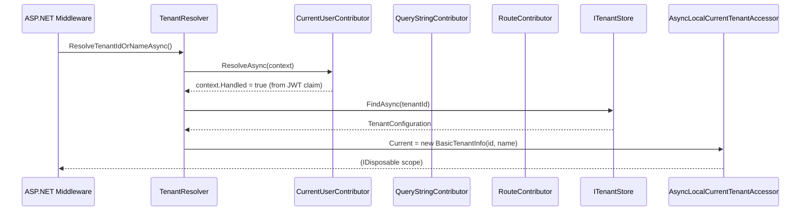

ABP's multi-tenancy support is built on a layered pipeline: incoming requests are inspected by a chain of `ITenantResolveContributor` implementations that agree on which tenant is active, the result is propagated through `AsyncLocalCurrentTenantAccessor` (an `AsyncLocal<BasicTenantInfo?>` singleton), and all subsequent infrastructure reads (settings, connection strings, cache keys) automatically scope themselves to that tenant. Switching context programmatically is a single `using` block.

## Core Abstractions

<CardGroup cols={2}>
  <Card title="ICurrentTenant" icon="building">
    Exposes `Id`, `Name`, and `IsAvailable`. The primary read API throughout the framework. Also the switch API — `Change(Guid? id, string? name)` returns an `IDisposable` that restores the previous tenant on disposal.
  </Card>
  <Card title="ITenantResolver" icon="magnifying-glass">
    Orchestrates the contributor chain. Iterates `AbpTenantResolveOptions.TenantResolvers` in order, stops at the first contributor that sets `context.Handled = true`, and returns a `TenantResolveResult` carrying the resolved `TenantIdOrName`.
  </Card>
  <Card title="ICurrentTenantAccessor" icon="database">
    The low-level state store. `AsyncLocalCurrentTenantAccessor.Instance` is the default implementation — a process-level singleton backed by `AsyncLocal<BasicTenantInfo?>`, which correctly propagates context across async continuations.
  </Card>
  <Card title="MultiTenantConnectionStringResolver" icon="link">
    Replaces the default `DefaultConnectionStringResolver`. If a current tenant is active and has connection strings configured, its strings take precedence over the global configuration.
  </Card>
</CardGroup>

## Resolution Pipeline



`TenantResolver.ResolveTenantIdOrNameAsync` creates a fresh DI scope for each resolution, so contributors can safely resolve scoped services:

```csharp
public virtual async Task<TenantResolveResult> ResolveTenantIdOrNameAsync()
{
    var result = new TenantResolveResult();

    using (var serviceScope = ServiceProvider.CreateScope())
    {
        var context = new TenantResolveContext(serviceScope.ServiceProvider);

        foreach (var tenantResolver in Options.TenantResolvers)
        {
            await tenantResolver.ResolveAsync(context);
            result.AppliedResolvers.Add(tenantResolver.Name);

            if (context.HasResolvedTenantOrHost())
            {
                result.TenantIdOrName = context.TenantIdOrName;
                break;
            }
        }
    }

    if (result.TenantIdOrName.IsNullOrEmpty()
        && !string.IsNullOrWhiteSpace(Options.FallbackTenant))
    {
        result.TenantIdOrName = Options.FallbackTenant;
        result.AppliedResolvers.Add(TenantResolverNames.FallbackTenant);
    }

    return result;
}
```

## Built-in Resolve Contributors

### CurrentUserTenantResolveContributor

Reads the `TenantId` claim from the authenticated user. This is the highest-priority contributor registered by default because user identity has already been validated by the authentication middleware.

```csharp
public class CurrentUserTenantResolveContributor : TenantResolveContributorBase
{
    public const string ContributorName = "CurrentUser";
    public override string Name => ContributorName;

    public override Task ResolveAsync(ITenantResolveContext context)
    {
        var currentUser = context.ServiceProvider
            .GetRequiredService<ICurrentUser>();

        if (currentUser.IsAuthenticated)
        {
            context.Handled = true;
            context.TenantIdOrName = currentUser.TenantId?.ToString();
        }

        return Task.CompletedTask;
    }
}
```

### ActionTenantResolveContributor

A delegate-based contributor for inline custom resolution logic, useful in tests or specialized scenarios:

```csharp
public class ActionTenantResolveContributor : TenantResolveContributorBase
{
    public override string Name => "Action";
    private readonly Action<ITenantResolveContext> _resolveAction;

    public ActionTenantResolveContributor(
        Action<ITenantResolveContext> resolveAction)
    {
        _resolveAction = resolveAction;
    }

    public override Task ResolveAsync(ITenantResolveContext context)
    {
        _resolveAction(context);
        return Task.CompletedTask;
    }
}
```

HTTP-specific contributors (header, query string, route, subdomain) are registered by the `Volo.Abp.AspNetCore.MultiTenancy` package.

## AsyncLocalCurrentTenantAccessor

The accessor is a **process-wide singleton** created once via `Instance`:

```csharp
public class AsyncLocalCurrentTenantAccessor : ICurrentTenantAccessor
{
    public static AsyncLocalCurrentTenantAccessor Instance { get; } = new();

    public BasicTenantInfo? Current {
        get => _currentScope.Value;
        set => _currentScope.Value = value;
    }

    private readonly AsyncLocal<BasicTenantInfo?> _currentScope;

    private AsyncLocalCurrentTenantAccessor()
    {
        _currentScope = new AsyncLocal<BasicTenantInfo?>();
    }
}
```

`AsyncLocal<T>` copies values into child execution contexts automatically, so spawning a `Task.Run` inside a tenant-scoped operation carries the tenant forward without any extra plumbing.

## CurrentTenant and Switching

`CurrentTenant` reads and writes the accessor. `Change` snapshots the previous value and restores it via a `DisposeAction`:

```csharp
public class CurrentTenant : ICurrentTenant, ITransientDependency
{
    public virtual bool IsAvailable => Id.HasValue;
    public virtual Guid? Id   => _currentTenantAccessor.Current?.TenantId;
    public string?       Name => _currentTenantAccessor.Current?.Name;

    public IDisposable Change(Guid? id, string? name = null)
    {
        return SetCurrent(id, name);
    }

    private IDisposable SetCurrent(Guid? tenantId, string? name = null)
    {
        var parentScope = _currentTenantAccessor.Current;
        _currentTenantAccessor.Current = new BasicTenantInfo(tenantId, name);

        return new DisposeAction<ValueTuple<ICurrentTenantAccessor, BasicTenantInfo?>>(
            static (state) =>
            {
                var (currentTenantAccessor, parentScope) = state;
                currentTenantAccessor.Current = parentScope;
            },
            (_currentTenantAccessor, parentScope)
        );
    }
}
```

**Practical usage**

```csharp
// Switch to a specific tenant for a scoped operation
using (_currentTenant.Change(tenantId))
{
    var orders = await _orderRepository.GetListAsync();
    await ProcessOrdersAsync(orders);
}
// Original tenant context automatically restored here

// Switch to host (null = host)
using (_currentTenant.Change(null))
{
    var globalConfig = await _settingProvider.GetOrNullAsync("App.Theme");
}
```

## ICurrentTenant Interface

The full `ICurrentTenant` contract:

```csharp
public interface ICurrentTenant
{
    bool IsAvailable { get; }   // true when Id has a value (tenant context active)
    Guid? Id { get; }
    string? Name { get; }
    IDisposable Change(Guid? id, string? name = null);
}
```

`IsAvailable` returns `false` when running in the host context (`Id == null`). Use it as a guard before accessing tenant-specific resources.

## Per-Tenant Connection Strings

`MultiTenantConnectionStringResolver` overrides the default resolver to look up `TenantConfiguration.ConnectionStrings` from `ITenantStore`:

```csharp
public override async Task<string> ResolveAsync(
    string? connectionStringName = null)
{
    if (_currentTenant.Id == null)
    {
        return await base.ResolveAsync(connectionStringName);
    }

    var tenant = await FindTenantConfigurationAsync(
        _currentTenant.Id.Value);

    if (tenant == null || tenant.ConnectionStrings.IsNullOrEmpty())
    {
        return await base.ResolveAsync(connectionStringName);
    }

    // Tenant-specific default connection string
    var tenantDefault = tenant.ConnectionStrings?.Default;

    if (connectionStringName == null ||
        connectionStringName ==
            ConnectionStrings.DefaultConnectionStringName)
    {
        return !tenantDefault.IsNullOrWhiteSpace()
            ? tenantDefault!
            : Options.ConnectionStrings.Default!;
    }

    // Named connection string lookup with fallback chain
    var connString = tenant.ConnectionStrings?
        .GetOrDefault(connectionStringName);
    if (!connString.IsNullOrWhiteSpace())
    {
        return connString!;
    }

    return !tenantDefault.IsNullOrWhiteSpace()
        ? tenantDefault!
        : await base.ResolveAsync(connectionStringName);
}
```

<Note>
The fallback chain is: tenant named → tenant database mapping → tenant default → global default. This lets you run most tenants on a shared database while routing specific high-value tenants to isolated instances.
</Note>

## Registering a Custom Contributor

Implement `TenantResolveContributorBase` and insert it into `AbpTenantResolveOptions`:

```csharp
public class HeaderTenantResolveContributor : TenantResolveContributorBase
{
    public const string ContributorName = "XTenantHeader";
    public override string Name => ContributorName;

    public override Task ResolveAsync(ITenantResolveContext context)
    {
        var httpContext = context.ServiceProvider
            .GetRequiredService<IHttpContextAccessor>()
            .HttpContext;

        var tenantId = httpContext?.Request.Headers["X-Tenant-Id"]
            .FirstOrDefault();

        if (!tenantId.IsNullOrWhiteSpace())
        {
            context.Handled = true;
            context.TenantIdOrName = tenantId;
        }

        return Task.CompletedTask;
    }
}

// In module ConfigureServices:
Configure<AbpTenantResolveOptions>(options =>
{
    options.TenantResolvers.Add(
        new HeaderTenantResolveContributor());
});
```

## IMultiTenant Marker Interface

Entities that should be isolated per tenant implement `IMultiTenant`:

```csharp
public interface IMultiTenant
{
    Guid? TenantId { get; }
}
```

ABP's EF Core integration automatically appends `WHERE TenantId = @currentTenantId` global query filters to all `IMultiTenant` entities. `[IgnoreMultiTenancy]` on a method or class disables this filter for that scope.

<Warning>
Never call `CurrentTenant.Change()` inside a repository method itself. The tenant context should be established at the application service (or middleware) boundary so that all downstream infrastructure — repositories, caches, settings — reads from the same tenant consistently.
</Warning>
