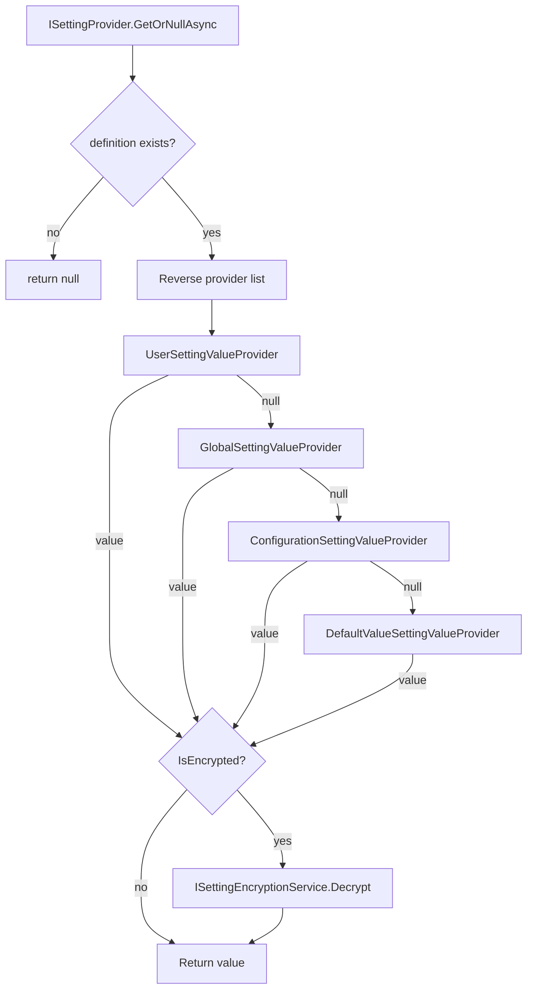

The ABP settings system lets application code read configuration values that can be stored and overridden at multiple scopes — code defaults, `appsettings.json`, per-application, per-tenant, and per-user — without the consumer knowing which scope supplied the final value. Everything flows through a single `ISettingProvider` abstraction backed by an ordered chain of `ISettingValueProvider` implementations.

## Core Interfaces and Classes

<CardGroup cols={2}>
  <Card title="ISettingProvider" icon="magnifying-glass">
    Entry point for reading settings. `GetOrNullAsync(name)` walks the provider chain and returns the highest-priority non-null value.
  </Card>
  <Card title="SettingDefinition" icon="file-lines">
    Declares a setting: its name, default value, allowed providers, encryption flag, and visibility to clients.
  </Card>
  <Card title="ISettingValueProvider" icon="layer-group">
    One link in the resolution chain. Each provider has a short `Name` identifier and two read methods.
  </Card>
  <Card title="ISettingStore" icon="database">
    Persistence abstraction used by store-backed providers (Global, Tenant, User). Modules replace `NullSettingStore` with a real EF implementation.
  </Card>
</CardGroup>

## SettingDefinition

A `SettingDefinition` is the schema declaration for one setting. It is registered once at startup through an `ISettingDefinitionProvider`.

```csharp
public class SettingDefinition
{
    public string Name { get; }
    public string? DefaultValue { get; set; }
    public bool IsVisibleToClients { get; set; }   // default: false
    public bool IsInherited { get; set; }           // default: true
    public bool IsEncrypted { get; set; }           // default: false
    public List<string> Providers { get; }          // empty = all providers allowed
    public Dictionary<string, object> Properties { get; }

    public SettingDefinition WithProperty(string key, object value) { ... }
    public SettingDefinition WithProviders(params string[] providers) { ... }
}
```

Key points:
- **`Providers`** — when non-empty, only providers whose `Name` is in this list are consulted during resolution. Use `WithProviders("G", "T")` to restrict a setting to global/tenant scope only.
- **`IsEncrypted`** — if `true`, the raw bytes stored in `ISettingStore` are encrypted. `SettingProvider` calls `ISettingEncryptionService.Decrypt` after retrieval.
- **`IsVisibleToClients`** — controls whether the setting is exposed to the UI/API layer. Sensitive settings (passwords, API keys) should leave this as `false`.

### Registering Definitions

Implement `ISettingDefinitionProvider` and override `Define`:

```csharp
public class MySettingDefinitionProvider : SettingDefinitionProvider
{
    public override void Define(ISettingDefinitionContext context)
    {
        context.Add(
            new SettingDefinition(
                "MyApp.MaxItemCount",
                defaultValue: "1000",
                isVisibleToClients: true
            )
        );
    }
}
```

ABP's `AbpSettingsModule` auto-discovers all `ISettingDefinitionProvider` implementations registered with the DI container via `services.OnRegistered(...)` in `PreConfigureServices`, so no explicit registration call is needed.

## The Value Provider Chain

`AbpSettingsModule.ConfigureServices` registers four built-in providers in this order:

```csharp
options.ValueProviders.Add<DefaultValueSettingValueProvider>();
options.ValueProviders.Add<ConfigurationSettingValueProvider>();
options.ValueProviders.Add<GlobalSettingValueProvider>();
options.ValueProviders.Add<UserSettingValueProvider>();
```

`SettingProvider.GetOrNullAsync` reverses this list before iterating, so higher-index providers (User) are tried first and lower-index ones act as fallbacks.



<Note>
The ABP base module does not register a `TenantSettingValueProvider`. That is added by the multi-tenancy module, which inserts it between `GlobalSettingValueProvider` and `UserSettingValueProvider` in the list.
</Note>

### Provider Name Constants

| Provider | `Name` constant | Scope |
|---|---|---|
| `DefaultValueSettingValueProvider` | `"D"` | Compile-time default in `SettingDefinition.DefaultValue` |
| `ConfigurationSettingValueProvider` | `"C"` | `appsettings.json` under `Settings:<SettingName>` |
| `GlobalSettingValueProvider` | `"G"` | Application-wide store record with `providerName = "G"` |
| `UserSettingValueProvider` | `"U"` | Per-user store record keyed by `CurrentUser.Id` |

### ISettingValueProvider Contract

```csharp
public interface ISettingValueProvider
{
    string Name { get; }
    Task<string?> GetOrNullAsync(SettingDefinition setting);
    Task<List<SettingValue>> GetAllAsync(SettingDefinition[] settings);
}
```

`GetOrNullAsync` returns `null` when the provider has no value for the setting at the current context (no current user, no row in the store, etc.). `SettingProvider` moves to the next provider in the chain only when `null` is returned.

## SettingProvider Resolution Algorithm

The full `GetOrNullAsync` implementation demonstrates the chain walk:

```csharp
public virtual async Task<string?> GetOrNullAsync(string name)
{
    var setting = await SettingDefinitionManager.GetOrNullAsync(name);
    if (setting == null)
    {
        return null;
    }

    var providers = Enumerable
        .Reverse(SettingValueProviderManager.Providers);

    if (setting.Providers.Any())
    {
        providers = providers.Where(p => setting.Providers.Contains(p.Name));
    }

    var value = await GetOrNullValueFromProvidersAsync(providers, setting);
    if (value != null && setting.IsEncrypted)
    {
        value = SettingEncryptionService.Decrypt(setting, value);
    }

    return value;
}
```

`GetAllAsync(string[] names)` is an optimized bulk variant: it iterates providers in reversed order, collects non-null values, removes satisfied definitions from the remaining list, and stops early once all definitions have values.

## SettingValueProviderManager

`SettingValueProviderManager` is a singleton that builds the provider list lazily on first access. It resolves each provider type from the DI container and throws `AbpException` if two providers share the same `Name`.

```csharp
public class SettingValueProviderManager : ISettingValueProviderManager, ISingletonDependency
{
    public List<ISettingValueProvider> Providers => _lazyProviders.Value;
    // ...
    protected virtual List<ISettingValueProvider> GetProviders()
    {
        var providers = Options.ValueProviders
            .Select(type => (ServiceProvider.GetRequiredService(type) as ISettingValueProvider)!)
            .ToList();

        var multipleProviders = providers.GroupBy(p => p.Name)
            .FirstOrDefault(x => x.Count() > 1);
        if (multipleProviders != null)
        {
            throw new AbpException($"Duplicate setting value provider name detected: ...");
        }

        return providers;
    }
}
```

## AbpSettingOptions

```csharp
public class AbpSettingOptions
{
    public ITypeList<ISettingDefinitionProvider> DefinitionProviders { get; }
    public ITypeList<ISettingValueProvider> ValueProviders { get; }
    public HashSet<string> DeletedSettings { get; }

    // Default: true — preserves original plain-text value if decryption fails
    public bool ReturnOriginalValueIfDecryptFailed { get; set; }
}
```

Add a custom provider at application startup:

```csharp
Configure<AbpSettingOptions>(options =>
{
    options.ValueProviders.Add<MyCustomSettingValueProvider>();
});
```

## ISettingStore

`ISettingStore` is the read-only persistence contract used by `GlobalSettingValueProvider`, `UserSettingValueProvider`, and any store-backed provider:

```csharp
public interface ISettingStore
{
    Task<string?> GetOrNullAsync(string name, string? providerName, string? providerKey);
    Task<List<SettingValue>> GetAllAsync(string[] names, string? providerName, string? providerKey);
}
```

`providerName` is the short provider code (`"G"`, `"U"`, etc.) and `providerKey` carries the contextual key (user ID for `"U"`, `null` for `"G"`). ABP ships a `NullSettingStore` that returns `null`/empty for everything; the `Volo.Abp.SettingManagement` package replaces it with an EF Core implementation.

## Encrypted Settings

Set `IsEncrypted = true` on a `SettingDefinition` to have the framework transparently encrypt values before they are stored and decrypt them on read. `SettingEncryptionService` delegates to ABP's `IStringEncryptionService` (AES by default).

```csharp
new SettingDefinition("Smtp.Password", isEncrypted: true)
```

<Warning>
If you change an existing setting to `IsEncrypted = true` after plain-text values are already stored, decryption will fail for those rows. `AbpSettingOptions.ReturnOriginalValueIfDecryptFailed` (default `true`) ensures the original plain-text value is returned rather than throwing an exception, giving you a migration window.
</Warning>

## Static vs Dynamic Definition Store

`SettingDefinitionManager` combines a `IStaticSettingDefinitionStore` (populated at startup from `ISettingDefinitionProvider` implementations) with an `IDynamicSettingDefinitionStore` (for settings created at runtime, e.g., via the management UI). Static definitions take precedence over dynamic ones with the same name.

```csharp
public virtual async Task<SettingDefinition?> GetOrNullAsync(string name)
{
    return await StaticStore.GetOrNullAsync(name)
        ?? await DynamicStore.GetOrNullAsync(name);
}
```

## Adding a Custom Value Provider

<Steps>
  <Step title="Implement ISettingValueProvider">
    Create a class that implements `ISettingValueProvider` (or extend `SettingValueProvider` which has a base `ISettingStore` helper). Return `null` when no value exists for the current context.
  </Step>
  <Step title="Register the provider type">
    In your module's `ConfigureServices`, call:
    ```csharp
    Configure<AbpSettingOptions>(options =>
    {
        options.ValueProviders.Add<MyOrgSettingValueProvider>();
    });
    ```
    Position in the list controls priority — providers added later override those added earlier.
  </Step>
  <Step title="Optionally restrict definitions">
    On any `SettingDefinition` that should only be resolved by your provider, call `.WithProviders("MyOrg")` to skip all other providers.
  </Step>
</Steps>

<Tip>
When reading multiple settings in one request, prefer `ISettingProvider.GetAllAsync(string[] names)` over repeated `GetOrNullAsync` calls. The bulk method short-circuits provider iteration per definition and avoids redundant store queries.
</Tip>
