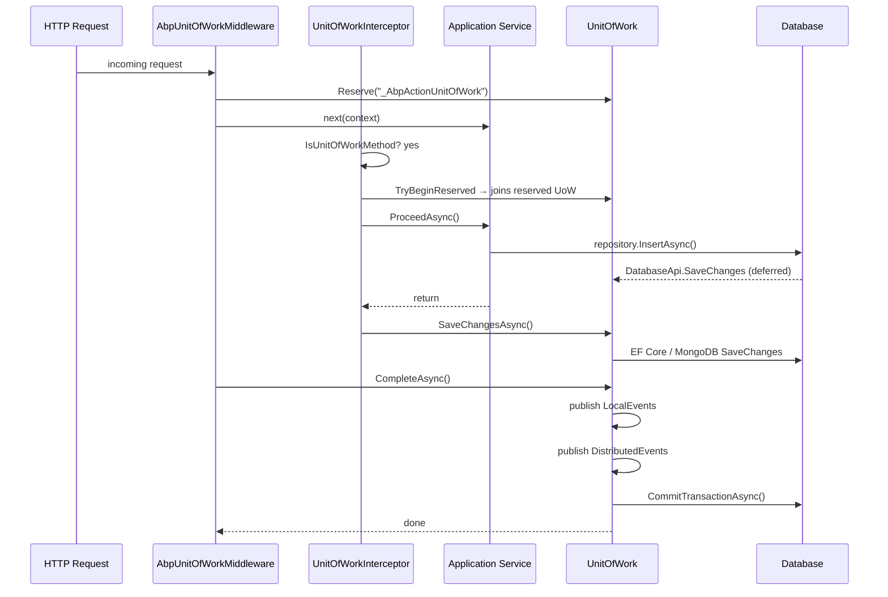

The Unit of Work (UoW) pattern in ABP coordinates all database operations within a single logical transaction boundary, manages connection lifetimes, and holds domain events until the work is successfully committed. Every repository, application service, and domain service participates in the same ambient UoW automatically — without callers needing to open or close connections manually.

## Core Interfaces

<CardGroup cols={2}>
  <Card title="IUnitOfWork" icon="layer-group">
    The primary abstraction. Extends `IDatabaseApiContainer`, `ITransactionApiContainer`, and `IDisposable`. Carries options, outer UoW reference, completion state, and pending event queues.
  </Card>
  <Card title="IUnitOfWorkManager" icon="gear">
    Factory and ambient accessor. `Begin()` returns an existing child UoW or creates a new one. `Current` gives the active UoW for the executing async context.
  </Card>
  <Card title="IDatabaseApiContainer" icon="database">
    Keyed store for `IDatabaseApi` instances (one per DbContext/session). Provides `FindDatabaseApi`, `AddDatabaseApi`, and `GetOrAddDatabaseApi`.
  </Card>
  <Card title="ITransactionApiContainer" icon="arrows-rotate">
    Keyed store for `ITransactionApi` instances. Provides `FindTransactionApi`, `AddTransactionApi`, and `GetOrAddTransactionApi` for underlying transaction handles.
  </Card>
</CardGroup>

### `IUnitOfWork` interface

Defined in `Volo.Abp.Uow/Volo/Abp/Uow/IUnitOfWork.cs`:

```csharp
public interface IUnitOfWork : IDatabaseApiContainer, ITransactionApiContainer, IDisposable
{
    Guid Id { get; }
    Dictionary<string, object> Items { get; }

    event EventHandler<UnitOfWorkFailedEventArgs> Failed;
    event EventHandler<UnitOfWorkEventArgs> Disposed;

    IAbpUnitOfWorkOptions Options { get; }
    IUnitOfWork? Outer { get; }

    bool IsReserved { get; }
    bool IsDisposed { get; }
    bool IsCompleted { get; }
    string? ReservationName { get; }

    void SetOuter(IUnitOfWork? outer);
    void Initialize(AbpUnitOfWorkOptions options);
    void Reserve(string reservationName);

    Task SaveChangesAsync(CancellationToken cancellationToken = default);
    Task CompleteAsync(CancellationToken cancellationToken = default);
    Task RollbackAsync(CancellationToken cancellationToken = default);

    void OnCompleted(Func<Task> handler);

    void AddOrReplaceLocalEvent(
        UnitOfWorkEventRecord eventRecord,
        Predicate<UnitOfWorkEventRecord>? replacementSelector = null);

    void AddOrReplaceDistributedEvent(
        UnitOfWorkEventRecord eventRecord,
        Predicate<UnitOfWorkEventRecord>? replacementSelector = null);
}
```

`SetOuter` is called by `UnitOfWorkManager.CreateNewUnitOfWork` to link the new UoW to the ambient one before pushing it as the current context.

### `IUnitOfWorkManager` interface

```csharp
public interface IUnitOfWorkManager
{
    IUnitOfWork? Current { get; }

    IUnitOfWork Begin(AbpUnitOfWorkOptions options, bool requiresNew = false);
    IUnitOfWork Reserve(string reservationName, bool requiresNew = false);

    void BeginReserved(string reservationName, AbpUnitOfWorkOptions options);
    bool TryBeginReserved(string reservationName, AbpUnitOfWorkOptions options);
}
```

## Ambient UoW via `UnitOfWorkManager`

`UnitOfWorkManager` (`Volo.Abp.Uow/Volo/Abp/Uow/UnitOfWorkManager.cs`) is a singleton that delegates ambient tracking to `IAmbientUnitOfWork`, which uses an `AsyncLocal`-backed slot. `Current` returns `_ambientUnitOfWork.GetCurrentByChecking()` — which traverses the chain and skips disposed entries — rather than the raw ambient value.

Calling `Begin()` checks whether a current UoW already exists:

```csharp
public IUnitOfWork Begin(AbpUnitOfWorkOptions options, bool requiresNew = false)
{
    var currentUow = Current;
    if (currentUow != null && !requiresNew)
    {
        return new ChildUnitOfWork(currentUow);   // participates in existing UoW
    }

    var unitOfWork = CreateNewUnitOfWork();
    unitOfWork.Initialize(options);
    return unitOfWork;
}
```

`CreateNewUnitOfWork` opens a new DI scope, resolves `IUnitOfWork` as transient, calls `SetOuter` to link the previous ambient UoW, pushes itself as the new ambient, and restores the previous UoW when `Disposed` fires:

```csharp
private IUnitOfWork CreateNewUnitOfWork()
{
    var scope = _serviceScopeFactory.CreateScope();
    try
    {
        var outerUow = _ambientUnitOfWork.UnitOfWork;

        var unitOfWork = scope.ServiceProvider.GetRequiredService<IUnitOfWork>();

        unitOfWork.SetOuter(outerUow);

        _ambientUnitOfWork.SetUnitOfWork(unitOfWork);

        unitOfWork.Disposed += (sender, args) =>
        {
            _ambientUnitOfWork.SetUnitOfWork(outerUow);
            scope.Dispose();
        };

        return unitOfWork;
    }
    catch
    {
        scope.Dispose();
        throw;
    }
}
```

### Nested UoW behavior

| Scenario | Result |
|---|---|
| `requiresNew = false` (default) | Returns a `ChildUnitOfWork` wrapping the outer. `CompleteAsync` is a no-op; only the root commits. |
| `requiresNew = true` | Creates a fully independent UoW with its own DI scope and transaction. |
| `RollbackAsync` on child | Delegates to the parent — `_parent.RollbackAsync(cancellationToken)` is called directly, setting `_isRolledback` on the root UoW. |

`ChildUnitOfWork` (`Volo.Abp.Uow/Volo/Abp/Uow/ChildUnitOfWork.cs`) delegates every operation to `_parent` except `CompleteAsync` (which returns `Task.CompletedTask`) and `Dispose` (which is empty). This means inner services cannot accidentally commit a transaction.

```csharp
// ChildUnitOfWork — inner complete is intentionally skipped
public Task CompleteAsync(CancellationToken cancellationToken = default)
{
    return Task.CompletedTask;
}

public void Dispose()
{
    // intentionally empty — parent controls lifetime
}
```

## `[UnitOfWork]` Attribute and Interceptor

`UnitOfWorkAttribute` (`Volo.Abp.Uow/Volo/Abp/Uow/UnitOfWorkAttribute.cs`) can be placed on a method, class, or interface:

```csharp
[AttributeUsage(AttributeTargets.Method | AttributeTargets.Class | AttributeTargets.Interface)]
public class UnitOfWorkAttribute : Attribute
{
    public bool? IsTransactional { get; set; }
    public int? Timeout { get; set; }
    public IsolationLevel? IsolationLevel { get; set; }
    public bool IsDisabled { get; set; }

    public UnitOfWorkAttribute() { }
    public UnitOfWorkAttribute(bool isTransactional) { ... }
    public UnitOfWorkAttribute(bool isTransactional, IsolationLevel isolationLevel) { ... }
    public UnitOfWorkAttribute(bool isTransactional, IsolationLevel isolationLevel, int timeout) { ... }

    public virtual void SetOptions(AbpUnitOfWorkOptions options) { ... }
}
```

`UnitOfWorkInterceptor` (`Volo.Abp.Uow/Volo/Abp/Uow/UnitOfWorkInterceptor.cs`) is a Castle DynamicProxy interceptor registered by `AbpUnitOfWorkModule`. It checks `UnitOfWorkHelper.IsUnitOfWorkMethod()` and, when applicable, wraps the invocation:

```csharp
public override async Task InterceptAsync(IAbpMethodInvocation invocation)
{
    if (!UnitOfWorkHelper.IsUnitOfWorkMethod(invocation.Method, out var unitOfWorkAttribute))
    {
        await invocation.ProceedAsync();
        return;
    }

    using (var scope = _serviceScopeFactory.CreateScope())
    {
        var options = CreateOptions(scope.ServiceProvider, invocation, unitOfWorkAttribute);
        var unitOfWorkManager = scope.ServiceProvider.GetRequiredService<IUnitOfWorkManager>();

        // Try to join a reserved UoW (e.g. opened by AbpUnitOfWorkMiddleware for HTTP requests)
        if (unitOfWorkManager.TryBeginReserved(UnitOfWork.UnitOfWorkReservationName, options))
        {
            await invocation.ProceedAsync();
            if (unitOfWorkManager.Current != null)
            {
                await unitOfWorkManager.Current.SaveChangesAsync();
            }
            return;
        }

        using (var uow = unitOfWorkManager.Begin(options))
        {
            await invocation.ProceedAsync();
            await uow.CompleteAsync();
        }
    }
}
```

<Note>
The interceptor auto-detects `IsTransactional` via `IUnitOfWorkTransactionBehaviourProvider` and the method name: methods **not** starting with `"Get"` (case-insensitive) are considered transactional by default unless overridden by `AbpUnitOfWorkDefaultOptions` or `[UnitOfWork(isTransactional: false)]`.
</Note>

## Request → Interceptor → UoW Sequence



## `UnitOfWork` Implementation — Completion Flow

`CompleteAsync` (`Volo.Abp.Uow/Volo/Abp/Uow/UnitOfWork.cs`) orchestrates the entire commit sequence:

<Steps>
  <Step title="SaveChanges">
    Iterates all registered `IDatabaseApi` instances. Any that implement `ISupportsSavingChanges` have `SaveChangesAsync` called. This flushes pending EF Core change-tracker writes to the database inside the open transaction.
  </Step>
  <Step title="Flush pending events">
    Pending local and distributed event records (stored in `LocalEventWithPredicates` / `DistributedEventWithPredicates`) are processed by `GetEventsRecords` — which applies replacement selectors — and moved to the active `LocalEvents` / `DistributedEvents` lists, then published through `IUnitOfWorkEventPublisher`. This loop repeats (including another `SaveChangesAsync`) until no new events are enqueued, because handlers can enqueue further events.
  </Step>
  <Step title="Commit transactions">
    Iterates all registered `ITransactionApi` instances and calls `CommitAsync`. For EF Core this commits the `DbTransaction`; for MongoDB it commits the `IClientSession` transaction.
  </Step>
  <Step title="Run OnCompleted handlers">
    Asynchronous callbacks registered with `OnCompleted(Func<Task>)` are invoked in registration order via `OnCompletedAsync()`.
  </Step>
</Steps>

```csharp
// Simplified CompleteAsync from UnitOfWork.cs
await SaveChangesAsync(cancellationToken);

LocalEvents.AddRange(GetEventsRecords(LocalEventWithPredicates));
LocalEventWithPredicates.Clear();
DistributedEvents.AddRange(GetEventsRecords(DistributedEventWithPredicates));
DistributedEventWithPredicates.Clear();

while (LocalEvents.Any() || DistributedEvents.Any())
{
    // publish ordered local events, then distributed events...
    await SaveChangesAsync(cancellationToken); // handlers may add more changes

    LocalEvents.AddRange(GetEventsRecords(LocalEventWithPredicates));
    LocalEventWithPredicates.Clear();
    DistributedEvents.AddRange(GetEventsRecords(DistributedEventWithPredicates));
    DistributedEventWithPredicates.Clear();
}

await CommitTransactionsAsync(cancellationToken);
IsCompleted = true;
await OnCompletedAsync();
```

## Database API and Transaction API Containers

Each ORM provider registers its own `IDatabaseApi` implementation under a stable key (typically derived from the connection string name + DbContext type). The UoW stores these in plain `Dictionary<string, IDatabaseApi>` fields:

```csharp
private readonly Dictionary<string, IDatabaseApi> _databaseApis;
private readonly Dictionary<string, ITransactionApi> _transactionApis;
```

Providers use `GetOrAddDatabaseApi` to ensure only one instance exists per UoW per database:

```csharp
// Pattern used by EF Core and MongoDB providers
var dbApi = unitOfWork.GetOrAddDatabaseApi(
    key,
    () => new EfCoreDatabaseApi<TDbContext>(dbContext)
);
```

`IDatabaseApi` supports optional interfaces:
- `ISupportsSavingChanges` — called during `SaveChangesAsync`
- `ISupportsRollback` — called during `RollbackAsync`

`ITransactionApi` supports:
- `CommitAsync` — called during `CommitTransactionsAsync`
- `ISupportsRollback` — called during `RollbackAsync`

<Tip>
The `Items` dictionary on `IUnitOfWork` is a free-form bag for storing request-scoped data that needs to travel with the UoW without coupling layers (e.g., caching a resolved connection string or storing audit metadata).
</Tip>

## Reserved Unit of Work

The HTTP middleware and some background job runners create a *reserved* UoW before the application code runs. The reservation allows the interceptor to attach to an already-open scope rather than creating a new one.

`UnitOfWork.UnitOfWorkReservationName` is the constant `"_AbpActionUnitOfWork"`.

```csharp
// In UnitOfWorkManager
public IUnitOfWork Reserve(string reservationName, bool requiresNew = false)
{
    if (!requiresNew &&
        _ambientUnitOfWork.UnitOfWork != null &&
        _ambientUnitOfWork.UnitOfWork.IsReservedFor(reservationName))
    {
        return new ChildUnitOfWork(_ambientUnitOfWork.UnitOfWork);
    }

    var unitOfWork = CreateNewUnitOfWork();
    unitOfWork.Reserve(reservationName);  // marks IsReserved = true, sets ReservationName
    return unitOfWork;
}

public bool TryBeginReserved(string reservationName, AbpUnitOfWorkOptions options)
{
    var uow = _ambientUnitOfWork.UnitOfWork;

    // Walk up the chain looking for the reserved UoW
    while (uow != null && !uow.IsReservedFor(reservationName))
    {
        uow = uow.Outer;
    }

    if (uow == null) return false;

    uow.Initialize(options);  // now active
    return true;
}
```

`IsReservedFor` is an extension method in `UnitOfWorkExtensions` that checks `IsReserved && ReservationName == reservationName`.

<Warning>
Calling `CompleteAsync` more than once on the same `UnitOfWork` throws `AbpException: "Completion has already been requested for this unit of work."`. The `PreventMultipleComplete()` guard checks both `IsCompleted` and `_isCompleting` flags.
</Warning>
