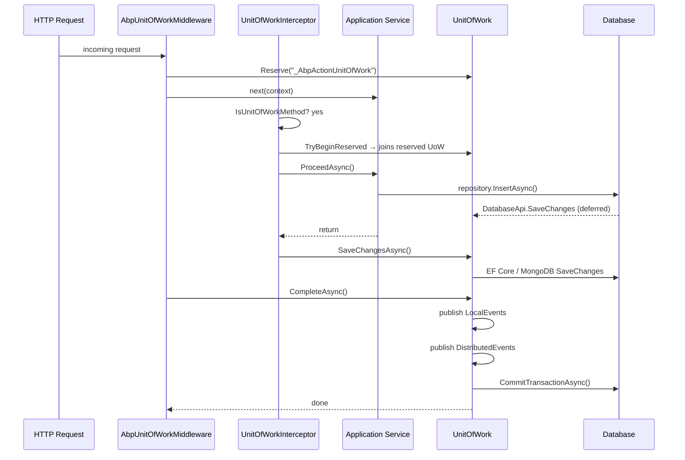

The Unit of Work (UoW) pattern in ABP coordinates all database operations within a single logical transaction boundary, manages connection lifetimes, and holds domain events until the work is successfully committed. Every repository, application service, and domain service participates in the same ambient UoW automatically — without callers needing to open or close connections manually.

## Core Interfaces

<CardGroup cols={2}>
  <Card title="IUnitOfWork" icon="layer-group">
    The primary abstraction. Extends `IDatabaseApiContainer`, `ITransactionApiContainer`, and `IDisposable`. Carries options, outer UoW reference, completion state, and pending event queues.
  </Card>
  <Card title="IUnitOfWorkManager" icon="gear">
    Factory and ambient accessor. `Begin()` returns an existing child UoW or creates a new one. `Current` gives the active UoW for the executing async context.
  </Card>
  <Card title="IDatabaseApiContainer" icon="database">
    Keyed store for `IDatabaseApi` instances (one per DbContext/session). Provides `FindDatabaseApi`, `AddDatabaseApi`, and `GetOrAddDatabaseApi`.
  </Card>
  <Card title="ITransactionApiContainer" icon="arrows-rotate">
    Keyed store for `ITransactionApi` instances. Provides `FindTransactionApi`, `AddTransactionApi`, and `GetOrAddTransactionApi` for underlying transaction handles.
  </Card>
</CardGroup>

### `IUnitOfWork` interface

```csharp
public interface IUnitOfWork : IDatabaseApiContainer, ITransactionApiContainer, IDisposable
{
    Guid Id { get; }
    Dictionary<string, object> Items { get; }

    event EventHandler<UnitOfWorkFailedEventArgs> Failed;
    event EventHandler<UnitOfWorkEventArgs> Disposed;

    IAbpUnitOfWorkOptions Options { get; }
    IUnitOfWork? Outer { get; }

    bool IsReserved { get; }
    bool IsDisposed { get; }
    bool IsCompleted { get; }
    string? ReservationName { get; }

    void Initialize(AbpUnitOfWorkOptions options);
    void Reserve(string reservationName);

    Task SaveChangesAsync(CancellationToken cancellationToken = default);
    Task CompleteAsync(CancellationToken cancellationToken = default);
    Task RollbackAsync(CancellationToken cancellationToken = default);

    void OnCompleted(Func<Task> handler);

    void AddOrReplaceLocalEvent(
        UnitOfWorkEventRecord eventRecord,
        Predicate<UnitOfWorkEventRecord>? replacementSelector = null);

    void AddOrReplaceDistributedEvent(
        UnitOfWorkEventRecord eventRecord,
        Predicate<UnitOfWorkEventRecord>? replacementSelector = null);
}
```

### `IUnitOfWorkManager` interface

```csharp
public interface IUnitOfWorkManager
{
    IUnitOfWork? Current { get; }

    IUnitOfWork Begin(AbpUnitOfWorkOptions options, bool requiresNew = false);
    IUnitOfWork Reserve(string reservationName, bool requiresNew = false);

    void BeginReserved(string reservationName, AbpUnitOfWorkOptions options);
    bool TryBeginReserved(string reservationName, AbpUnitOfWorkOptions options);
}
```

## Ambient UoW via `UnitOfWorkManager`

`UnitOfWorkManager` is a singleton that delegates ambient tracking to `IAmbientUnitOfWork`, which uses an `AsyncLocal`-backed slot. Calling `Begin()` checks whether a current UoW already exists:

```csharp
public IUnitOfWork Begin(AbpUnitOfWorkOptions options, bool requiresNew = false)
{
    var currentUow = Current;
    if (currentUow != null && !requiresNew)
    {
        return new ChildUnitOfWork(currentUow);   // participates in existing UoW
    }

    var unitOfWork = CreateNewUnitOfWork();
    unitOfWork.Initialize(options);
    return unitOfWork;
}
```

`CreateNewUnitOfWork` opens a new DI scope, resolves `IUnitOfWork` as transient, links `Outer`, sets itself as ambient, and restores the previous UoW on `Dispose`.

### Nested UoW behavior

| Scenario | Result |
|---|---|
| `requiresNew = false` (default) | Returns a `ChildUnitOfWork` wrapping the outer. `CompleteAsync` is a no-op; only the root commits. |
| `requiresNew = true` | Creates a fully independent UoW with its own DI scope and transaction. |
| `RollbackAsync` on child | Propagates immediately to the parent — the outer will also fail. |

`ChildUnitOfWork` delegates every operation to `_parent` except `CompleteAsync` (which does nothing) and `Dispose` (which is also a no-op). This means inner services cannot accidentally commit a transaction.

```csharp
// ChildUnitOfWork — inner complete is intentionally skipped
public Task CompleteAsync(CancellationToken cancellationToken = default)
{
    return Task.CompletedTask;
}

public void Dispose()
{
    // intentionally empty — parent controls lifetime
}
```

## `[UnitOfWork]` Attribute and Interceptor

`UnitOfWorkAttribute` can be placed on a method, class, or interface:

```csharp
[AttributeUsage(AttributeTargets.Method | AttributeTargets.Class | AttributeTargets.Interface)]
public class UnitOfWorkAttribute : Attribute
{
    public bool? IsTransactional { get; set; }
    public int? Timeout { get; set; }
    public IsolationLevel? IsolationLevel { get; set; }
    public bool IsDisabled { get; set; }
}
```

`UnitOfWorkInterceptor` (a Castle DynamicProxy interceptor registered by `AbpUnitOfWorkModule`) intercepts every method call on proxied services. It checks `UnitOfWorkHelper.IsUnitOfWorkMethod()` and, when applicable, wraps the invocation:

```csharp
public override async Task InterceptAsync(IAbpMethodInvocation invocation)
{
    if (!UnitOfWorkHelper.IsUnitOfWorkMethod(invocation.Method, out var unitOfWorkAttribute))
    {
        await invocation.ProceedAsync();
        return;
    }

    using (var scope = _serviceScopeFactory.CreateScope())
    {
        var options = CreateOptions(scope.ServiceProvider, invocation, unitOfWorkAttribute);
        var unitOfWorkManager = scope.ServiceProvider.GetRequiredService<IUnitOfWorkManager>();

        // Try to join a reserved UoW (e.g. opened by AbpUnitOfWorkMiddleware for HTTP requests)
        if (unitOfWorkManager.TryBeginReserved(UnitOfWork.UnitOfWorkReservationName, options))
        {
            await invocation.ProceedAsync();
            if (unitOfWorkManager.Current != null)
            {
                await unitOfWorkManager.Current.SaveChangesAsync();
            }
            return;
        }

        using (var uow = unitOfWorkManager.Begin(options))
        {
            await invocation.ProceedAsync();
            await uow.CompleteAsync();
        }
    }
}
```

<Note>
The interceptor auto-detects `IsTransactional` based on the method name: methods **not** starting with `"Get"` are considered transactional by default unless overridden by `AbpUnitOfWorkDefaultOptions` or `[UnitOfWork(isTransactional: false)]`.
</Note>

## Request → Interceptor → UoW Sequence



## `UnitOfWork` Implementation — Completion Flow

`CompleteAsync` orchestrates the entire commit sequence:

<Steps>
  <Step title="SaveChanges">
    Iterates all registered `IDatabaseApi` instances. Any that implement `ISupportsSavingChanges` have `SaveChangesAsync` called. This flushes pending EF Core change-tracker writes to the database inside the open transaction.
  </Step>
  <Step title="Flush pending events">
    Pending local and distributed event records (populated via `AddOrReplaceLocalEvent` / `AddOrReplaceDistributedEvent`) are moved to the active event lists and published through `IUnitOfWorkEventPublisher`. This loop repeats until no new events are enqueued (handlers can enqueue further events).
  </Step>
  <Step title="Commit transactions">
    Iterates all registered `ITransactionApi` instances and calls `CommitAsync`. For EF Core this commits the `DbTransaction`; for MongoDB it commits the `IClientSession` transaction.
  </Step>
  <Step title="Run OnCompleted handlers">
    Synchronous and asynchronous callbacks registered with `OnCompleted(Func<Task>)` are invoked in registration order.
  </Step>
</Steps>

```csharp
// Simplified CompleteAsync loop
await SaveChangesAsync(cancellationToken);

while (LocalEvents.Any() || DistributedEvents.Any())
{
    // publish local events ...
    // publish distributed events ...
    await SaveChangesAsync(cancellationToken); // handlers may add more changes
}

await CommitTransactionsAsync(cancellationToken);
IsCompleted = true;
await OnCompletedAsync();
```

## Database API and Transaction API Containers

Each ORM provider registers its own `IDatabaseApi` implementation under a stable key (typically derived from the connection string name + DbContext type). The UoW stores these in plain `Dictionary<string, IDatabaseApi>` fields:

```csharp
private readonly Dictionary<string, IDatabaseApi> _databaseApis;
private readonly Dictionary<string, ITransactionApi> _transactionApis;
```

Providers use `GetOrAddDatabaseApi` to ensure only one instance exists per UoW per database:

```csharp
// Pattern used by EF Core and MongoDB providers
var dbApi = unitOfWork.GetOrAddDatabaseApi(
    key,
    () => new EfCoreDatabaseApi<TDbContext>(dbContext)
);
```

`IDatabaseApi` supports optional interfaces:
- `ISupportsSavingChanges` — called during `SaveChangesAsync`
- `ISupportsRollback` — called during `RollbackAsync`

`ITransactionApi` supports:
- `CommitAsync` — called during `CommitTransactionsAsync`
- `ISupportsRollback` — called during `RollbackAsync`

<Tip>
The `Items` dictionary on `IUnitOfWork` is a free-form bag for storing request-scoped data that needs to travel with the UoW without coupling layers (e.g., caching a resolved connection string or storing audit metadata).
</Tip>

## Reserved Unit of Work

The HTTP middleware and some background job runners create a *reserved* UoW before the application code runs. The reservation allows the interceptor to attach to an already-open scope rather than creating a new one:

```csharp
// In UnitOfWorkManager
public IUnitOfWork Reserve(string reservationName, bool requiresNew = false)
{
    // ...
    var unitOfWork = CreateNewUnitOfWork();
    unitOfWork.Reserve(reservationName);  // marks IsReserved = true, sets ReservationName
    return unitOfWork;
}

public bool TryBeginReserved(string reservationName, AbpUnitOfWorkOptions options)
{
    var uow = _ambientUnitOfWork.UnitOfWork;
    while (uow != null && !uow.IsReservedFor(reservationName))
    {
        uow = uow.Outer;  // walk up the chain
    }
    if (uow == null) return false;
    uow.Initialize(options);  // now active
    return true;
}
```

<Warning>
Calling `CompleteAsync` more than once on the same `UnitOfWork` throws `AbpException: "Completion has already been requested for this unit of work."`. The `_isCompleting` flag guards against concurrent completion attempts.
</Warning>
