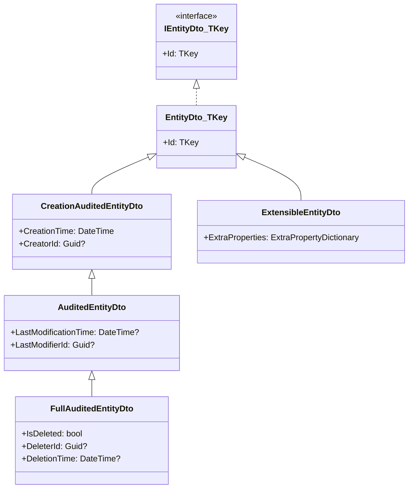
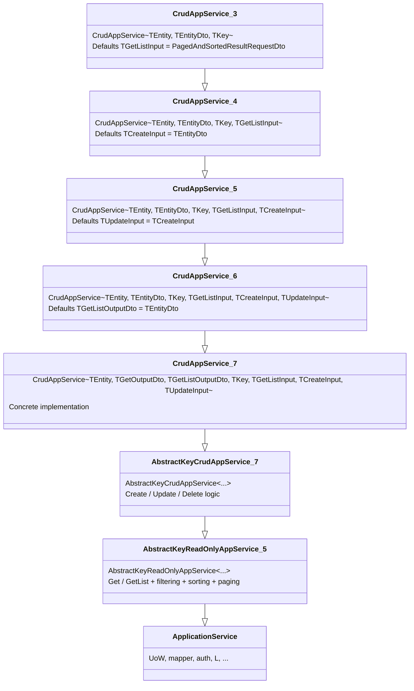

Application services are the entry points that orchestrate domain operations on behalf of callers — whether those callers are HTTP controllers, gRPC handlers, or other services. ABP's `ApplicationService` base class wires together Unit of Work management, object mapping, authorization, localization, and multi-tenancy in a single, DI-managed object. This page explains how it works internally, how `CrudAppService` reduces boilerplate for CRUD modules, and how the framework exposes these services as HTTP APIs automatically.

## `IApplicationService` — the contract

```csharp
// Volo.Abp.Application.Services
public interface IApplicationService : IRemoteService
{
}
```

`IApplicationService` inherits `IRemoteService`, which is the marker interface that the Auto API Controller system uses to discover services and generate `Controller` wrappers. Implementing `IApplicationService` is therefore both a DI registration signal and an HTTP exposure signal.

## `ApplicationService` base class

`ApplicationService` is the abstract class every application service in ABP extends:

```csharp
public abstract class ApplicationService :
    IApplicationService,
    IAvoidDuplicateCrossCuttingConcerns,
    IValidationEnabled,
    IUnitOfWorkEnabled,
    IAuditingEnabled,
    IGlobalFeatureCheckingEnabled,
    ITransientDependency
{
    public IAbpLazyServiceProvider LazyServiceProvider { get; set; } = default!;

    public static string[] CommonPostfixes { get; set; } =
        { "AppService", "ApplicationService", "Service" };
    // ...
}
```

Implementing `ITransientDependency` ensures automatic DI registration at transient lifetime. The marker interfaces (`IUnitOfWorkEnabled`, `IAuditingEnabled`, etc.) activate the corresponding AOP interceptors without any attribute decoration.

### Key lazy-resolved properties

All services are resolved through `IAbpLazyServiceProvider` — cached on first use, never allocated if the method that needs them is never called:

| Property | Type | Notes |
|---|---|---|
| `UnitOfWorkManager` | `IUnitOfWorkManager` | Access `CurrentUnitOfWork` to check active UoW |
| `ObjectMapper` | `IObjectMapper` | Respects `ObjectMapperContext` for module-scoped mappers |
| `AuthorizationService` | `IAuthorizationService` | Used by `CheckPolicyAsync` |
| `CurrentUser` | `ICurrentUser` | Authenticated user ID, name, roles, claims |
| `CurrentTenant` | `ICurrentTenant` | Multi-tenancy context |
| `GuidGenerator` | `IGuidGenerator` | Sequential GUID generation |
| `FeatureChecker` | `IFeatureChecker` | Feature flag evaluation |
| `SettingProvider` | `ISettingProvider` | Per-tenant / per-user settings |
| `Clock` | `IClock` | Time abstraction |
| `DataFilter` | `IDataFilter` | Enable / disable data filters programmatically |
| `L` | `IStringLocalizer` | Localized string lookup |
| `Logger` | `ILogger` | Scoped to the concrete class name |

### The `L` localizer

```csharp
protected IStringLocalizer L {
    get {
        if (_localizer == null)
            _localizer = CreateLocalizer();
        return _localizer;
    }
}

protected Type? LocalizationResource {
    get => _localizationResource;
    set { _localizationResource = value; _localizer = null; }
}
private Type? _localizationResource = typeof(DefaultResource);
```

Set `LocalizationResource` in the constructor to bind `L` to your module's resource type:

```csharp
public class OrderAppService : ApplicationService, IOrderAppService
{
    public OrderAppService()
    {
        LocalizationResource = typeof(OrderResource);
    }

    public Task<string> GetStatusLabelAsync(OrderStatus status)
    {
        return Task.FromResult(L[$"Enum:OrderStatus:{(int)status}"].Value);
    }
}
```

### `CheckPolicyAsync`

```csharp
protected virtual async Task CheckPolicyAsync(string? policyName)
{
    if (string.IsNullOrEmpty(policyName))
        return;

    await AuthorizationService.CheckAsync(policyName!);
}
```

Throws `AbpAuthorizationException` if the current user does not satisfy the policy. This is used internally by `CrudAppService` and is also suitable for ad-hoc authorization in hand-written services.

### Object mapper context

When your module has its own AutoMapper profile, point `ObjectMapperContext` to the module-marker type:

```csharp
public class OrderAppService : ApplicationService
{
    public OrderAppService()
    {
        ObjectMapperContext = typeof(AbpOrderApplicationModule);
    }
}
```

This resolves `IObjectMapper<AbpOrderApplicationModule>` instead of the global mapper, scoping profile resolution to your module.

## DTO hierarchy

ABP ships a complete set of DTO base classes aligned with the entity auditing hierarchy. They live in `Volo.Abp.Ddd.Application.Contracts`.



`Extensible*` variants (e.g., `ExtensibleAuditedEntityDto<TKey>`) add `ExtraProperties: ExtraPropertyDictionary` — use them for entities backed by `AggregateRoot<TKey>` so the extra properties round-trip through the API.

Pagination input DTOs follow a parallel hierarchy:

```csharp
// Minimal — just MaxResultCount
LimitedResultRequestDto

// Adds SkipCount
PagedResultRequestDto : LimitedResultRequestDto

// Adds Sorting
PagedAndSortedResultRequestDto : PagedResultRequestDto

// Output container
PagedResultDto<T>(long TotalCount, IReadOnlyList<T> Items)
```

## `CrudAppService<TEntity,TEntityDto,TKey>` — the full generic chain

`CrudAppService` is a stack of progressively more specific generic overloads. Each outer overload delegates to the next inner one with a defaulted type argument.



The seven-type-parameter variant at the bottom is where the logic lives. The narrower overloads just supply defaults so callers can be terse.

### What `AbstractKeyCrudAppService` provides

```csharp
public abstract class AbstractKeyCrudAppService<TEntity, TGetOutputDto, TGetListOutputDto,
    TKey, TGetListInput, TCreateInput, TUpdateInput>
    : AbstractKeyReadOnlyAppService<...>,
      ICrudAppService<TGetOutputDto, TGetListOutputDto, TKey, TGetListInput, TCreateInput, TUpdateInput>
{
    protected IRepository<TEntity> Repository { get; }

    protected virtual string? CreatePolicyName { get; set; }
    protected virtual string? UpdatePolicyName { get; set; }
    protected virtual string? DeletePolicyName { get; set; }

    public virtual async Task<TGetOutputDto> CreateAsync(TCreateInput input)
    {
        await CheckCreatePolicyAsync();
        var entity = await MapToEntityAsync(input);
        TryToSetTenantId(entity);
        await Repository.InsertAsync(entity, autoSave: true);
        return await MapToGetOutputDtoAsync(entity);
    }

    public virtual async Task<TGetOutputDto> UpdateAsync(TKey id, TUpdateInput input)
    {
        await CheckUpdatePolicyAsync();
        var entity = await GetEntityByIdAsync(id);
        await MapToEntityAsync(input, entity);
        await Repository.UpdateAsync(entity, autoSave: true);
        return await MapToGetOutputDtoAsync(entity);
    }

    public virtual async Task DeleteAsync(TKey id)
    {
        await CheckDeletePolicyAsync();
        await DeleteByIdAsync(id);
    }
}
```

### What `AbstractKeyReadOnlyAppService` provides

```csharp
public virtual async Task<PagedResultDto<TGetListOutputDto>> GetListAsync(TGetListInput input)
{
    await CheckGetListPolicyAsync();

    var query = await CreateFilteredQueryAsync(input);
    var totalCount = await AsyncExecuter.CountAsync(query);

    var entities = new List<TEntity>();
    if (totalCount > 0)
    {
        query = ApplySorting(query, input);
        query = ApplyPaging(query, input);
        entities = await AsyncExecuter.ToListAsync(query);
    }

    return new PagedResultDto<TGetListOutputDto>(
        totalCount,
        await MapToGetListOutputDtosAsync(entities)
    );
}
```

Override `CreateFilteredQueryAsync` to add search predicates; `ApplySorting` and `ApplyPaging` handle the rest automatically when the input implements `ISortedResultRequest` / `IPagedResultRequest`.

### Default sorting in `CrudAppService`

```csharp
protected override IQueryable<TEntity> ApplyDefaultSorting(IQueryable<TEntity> query)
{
    if (typeof(TEntity).IsAssignableTo<IHasCreationTime>())
    {
        return query.OrderByDescending(e => ((IHasCreationTime)e).CreationTime);
    }
    else
    {
        return query.OrderByDescending(e => e.Id);
    }
}
```

Entities that implement `IHasCreationTime` are sorted newest-first by default; all others fall back to descending ID order.

## Authorization integration

Set the policy name properties to enable automatic authorization checks before each operation:

```csharp
public class BookAppService
    : CrudAppService<Book, BookDto, Guid, PagedAndSortedResultRequestDto,
                     CreateBookInput, UpdateBookInput>,
      IBookAppService
{
    public BookAppService(IRepository<Book, Guid> repository)
        : base(repository)
    {
        GetPolicyName      = BookPermissions.Books.Default;
        GetListPolicyName  = BookPermissions.Books.Default;
        CreatePolicyName   = BookPermissions.Books.Create;
        UpdatePolicyName   = BookPermissions.Books.Edit;
        DeletePolicyName   = BookPermissions.Books.Delete;
    }
}
```

Each policy name is passed to `CheckPolicyAsync`, which calls `IAuthorizationService.CheckAsync`. You can also use the standard `[Authorize]` attribute on individual methods for finer control:

```csharp
[Authorize(BookPermissions.Books.Default)]
public override Task<BookDto> GetAsync(Guid id) => base.GetAsync(id);
```

## `ReadOnlyAppService<TEntity,TEntityDto,TKey>`

Use `ReadOnlyAppService` when the service must expose `Get` and `GetList` but never mutates state:

```csharp
public abstract class ReadOnlyAppService<TEntity, TGetOutputDto, TGetListOutputDto, TKey, TGetListInput>
    : AbstractKeyReadOnlyAppService<TEntity, TGetOutputDto, TGetListOutputDto, TKey, TGetListInput>
    where TEntity : class, IEntity<TKey>
{
    protected IReadOnlyRepository<TEntity, TKey> Repository { get; }

    protected ReadOnlyAppService(IReadOnlyRepository<TEntity, TKey> repository) : base(repository)
    {
        Repository = repository;
    }

    protected override async Task<TEntity> GetEntityByIdAsync(TKey id)
    {
        return await Repository.GetAsync(id);
    }

    protected override IQueryable<TEntity> ApplyDefaultSorting(IQueryable<TEntity> query)
    {
        if (typeof(TEntity).IsAssignableTo<ICreationAuditedObject>())
        {
            return query.OrderByDescending(e => ((ICreationAuditedObject)e).CreationTime);
        }
        return query.OrderByDescending(e => e.Id);
    }
}
```

It accepts `IReadOnlyRepository<TEntity, TKey>` instead of `IRepository`, so it can be used safely in read-replica scenarios.

## A complete example

The Identity module's `IdentityUserAppService` is a hand-written (non-`CrudAppService`) example that shows how all the pieces fit together:

```csharp
public class IdentityUserAppService : IdentityAppServiceBase, IIdentityUserAppService
{
    protected IdentityUserManager UserManager { get; }
    protected IIdentityUserRepository UserRepository { get; }

    public IdentityUserAppService(
        IdentityUserManager userManager,
        IIdentityUserRepository userRepository, /* ... */)
    {
        UserManager = userManager;
        UserRepository = userRepository;
    }

    [Authorize(IdentityPermissions.Users.Default)]
    public virtual async Task<IdentityUserDto> GetAsync(Guid id)
    {
        return ObjectMapper.Map<IdentityUser, IdentityUserDto>(
            await UserManager.GetByIdAsync(id)
        );
    }

    [Authorize(IdentityPermissions.Users.Default)]
    public virtual async Task<PagedResultDto<IdentityUserDto>> GetListAsync(
        GetIdentityUsersInput input)
    {
        var count = await UserRepository.GetCountAsync(input.Filter);
        var list  = await UserRepository.GetListAsync(
            input.Sorting, input.MaxResultCount, input.SkipCount, input.Filter);

        return new PagedResultDto<IdentityUserDto>(
            count,
            ObjectMapper.Map<List<IdentityUser>, List<IdentityUserDto>>(list)
        );
    }
}
```

Key observations:
- `ObjectMapper.Map` uses the module-scoped mapper configured via `ObjectMapperContext`.
- `[Authorize]` on individual methods overrides any class-level policy.
- The domain service `IdentityUserManager` is called for identity-specific operations; the repository is called directly for read queries that do not need domain invariant enforcement.

## Auto API controller wiring

Because `IApplicationService` extends `IRemoteService`, the ABP ASP.NET Core integration automatically generates a controller for every application service class. The generated controller:

- Maps each method to an HTTP verb by convention (`Get*` → `GET`, `Create*` → `POST`, `Update*` → `PUT`, `Delete*` → `DELETE`).
- Uses the class name (stripped of the `AppService` / `ApplicationService` / `Service` postfix) as the route segment.
- Applies ABP's `[ApiController]` and route prefix conventions.

<Note>
For full details on verb mapping rules, route grouping, and how to override conventions, see the [Auto API Controllers](/aspnetcore/auto-api-controllers) page.
</Note>

<Steps>
  <Step title="Define the contract interface">
    Create `IOrderAppService` in the `.Application.Contracts` project. Extend `IApplicationService`. Define DTOs alongside it.

    ```csharp
    public interface IOrderAppService : IApplicationService
    {
        Task<OrderDto> GetAsync(Guid id);
        Task<PagedResultDto<OrderDto>> GetListAsync(PagedAndSortedResultRequestDto input);
        Task<OrderDto> CreateAsync(CreateOrderInput input);
        Task DeleteAsync(Guid id);
    }
    ```
  </Step>
  <Step title="Implement in the .Application project">
    Extend `CrudAppService` or `ApplicationService`. Wire up policies, mapper context, and localization resource.

    ```csharp
    public class OrderAppService
        : CrudAppService<Order, OrderDto, Guid,
                         PagedAndSortedResultRequestDto,
                         CreateOrderInput>,
          IOrderAppService
    {
        public OrderAppService(IRepository<Order, Guid> repository)
            : base(repository)
        {
            LocalizationResource = typeof(OrderResource);
            ObjectMapperContext  = typeof(AbpOrderApplicationModule);
            GetPolicyName     = OrderPermissions.Orders.Default;
            CreatePolicyName  = OrderPermissions.Orders.Create;
            DeletePolicyName  = OrderPermissions.Orders.Delete;
        }

        protected override async Task<IQueryable<Order>> CreateFilteredQueryAsync(
            PagedAndSortedResultRequestDto input)
        {
            return (await base.CreateFilteredQueryAsync(input))
                .WhereIf(!input.Filter.IsNullOrWhiteSpace(),
                    o => o.Reference.Contains(input.Filter));
        }
    }
    ```
  </Step>
  <Step title="No controller needed">
    ABP generates the `OrderController` at startup. The generated controller calls the application service methods and inherits the `[Authorize]` attributes applied on them.
  </Step>
</Steps>

<Tip>
Keep application services thin. If a method body starts reaching into repository internals or duplicating business rules across multiple services, extract that logic into a domain service and call the domain service from the application service.
</Tip>
