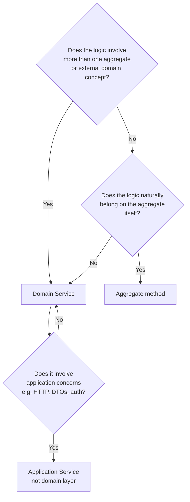

Domain services encapsulate domain logic that does not naturally belong to a single entity or aggregate root. They are pure expressions of business rules — they work with domain objects, emit domain events, and coordinate between repositories, but they know nothing about HTTP, DTOs, or application workflows. This page explains how ABP implements and registers domain services, what the `DomainService` base class provides, and when to reach for one rather than putting the logic in an entity or an application service.

## `IDomainService` — the marker interface

```csharp
// Volo.Abp.Domain.Services
public interface IDomainService : ITransientDependency
{
}
```

That is the entire interface. Its only job is to be a recognisable marker that:

1. Causes the ABP conventional registrar to register implementing classes in the DI container with **transient** lifetime (because `ITransientDependency` is extended).
2. Signals to readers that a class belongs to the domain layer, not the application or infrastructure layer.

Because `IDomainService` extends `ITransientDependency`, any class that implements it is automatically discovered and registered — no `[Dependency]` attribute needed.

## `DomainService` — the abstract base class

Most domain services inherit from `DomainService` rather than implementing `IDomainService` directly:

```csharp
// Volo.Abp.Domain.Services
public abstract class DomainService : IDomainService
{
    public IAbpLazyServiceProvider LazyServiceProvider { get; set; } = default!;

    [Obsolete("Use LazyServiceProvider instead.")]
    public IServiceProvider ServiceProvider { get; set; } = default!;

    protected IClock Clock
        => LazyServiceProvider.LazyGetRequiredService<IClock>();

    protected IGuidGenerator GuidGenerator
        => LazyServiceProvider.LazyGetService<IGuidGenerator>(
               SimpleGuidGenerator.Instance);

    protected ILoggerFactory LoggerFactory
        => LazyServiceProvider.LazyGetRequiredService<ILoggerFactory>();

    protected ICurrentTenant CurrentTenant
        => LazyServiceProvider.LazyGetRequiredService<ICurrentTenant>();

    protected IAsyncQueryableExecuter AsyncExecuter
        => LazyServiceProvider.LazyGetRequiredService<IAsyncQueryableExecuter>();

    protected ILogger Logger
        => LazyServiceProvider.LazyGetService<ILogger>(provider =>
               LoggerFactory?.CreateLogger(GetType().FullName!) ?? NullLogger.Instance);
}
```

### Lazy service locator

`IAbpLazyServiceProvider` is a thin wrapper around `IServiceProvider` that caches each resolved service on first access. Properties like `Clock`, `GuidGenerator`, and `CurrentTenant` are implemented as lazy computed properties on top of it. The advantage over constructor injection is that subclasses can add domain logic without touching the constructor signature — a common need as a domain service grows.

<Note>
The `ServiceProvider` property on `DomainService` is marked `[Obsolete]`. Always use `LazyServiceProvider` or the typed computed properties (`Clock`, `GuidGenerator`, `CurrentTenant`, `Logger`) instead.
</Note>

### Available services out of the box

| Property | Type | Purpose |
|---|---|---|
| `Clock` | `IClock` | Time abstraction — use instead of `DateTime.Now` for testability |
| `GuidGenerator` | `IGuidGenerator` | Sequential GUID generation (falls back to `SimpleGuidGenerator`) |
| `CurrentTenant` | `ICurrentTenant` | Multi-tenancy context — current tenant ID and name |
| `AsyncExecuter` | `IAsyncQueryableExecuter` | Provider-agnostic async LINQ execution |
| `Logger` | `ILogger` | Typed logger scoped to the concrete class |
| `LoggerFactory` | `ILoggerFactory` | Factory for creating loggers with custom categories |

Additional services are obtained via `LazyServiceProvider.LazyGetRequiredService<T>()` at the point of use, so constructor signatures stay stable.

## When to use a domain service



<CardGroup cols={2}>
  <Card title="Belongs in a domain service" icon="puzzle-piece">
    Logic that coordinates multiple aggregates, queries a repository to enforce a uniqueness invariant, or performs a multi-step business operation that doesn't fit on any single entity.
  </Card>
  <Card title="Belongs on the aggregate" icon="cube">
    State transitions, invariant enforcement, and domain event raising that only touch the internal state of one aggregate. For example, `order.AddLine(product, qty)` belongs on `Order`.
  </Card>
  <Card title="Belongs in an application service" icon="layer-group">
    Use-case orchestration: mapping DTOs, checking authorization policies, starting/committing units of work, calling multiple domain services in sequence. This is presentation-facing code.
  </Card>
  <Card title="Gray area" icon="circle-question">
    A domain service may call an application service's dependency (like `ISettingProvider`) if it needs configuration values. But it must not take `HttpContext`, `ICurrentUser`, or any DTO type as input.
  </Card>
</CardGroup>

## `IdentityUserManager` — a real-world example

The Identity module's `IdentityUserManager` is the canonical example of a complex domain service in ABP. It inherits from ASP.NET Core Identity's `UserManager<IdentityUser>` and additionally implements `IDomainService`:

```csharp
// modules/identity/src/Volo.Abp.Identity.Domain
public class IdentityUserManager : UserManager<IdentityUser>, IDomainService
{
    protected IIdentityRoleRepository RoleRepository { get; }
    protected IIdentityUserRepository UserRepository { get; }
    protected IOrganizationUnitRepository OrganizationUnitRepository { get; }
    protected ISettingProvider SettingProvider { get; }
    protected ICancellationTokenProvider CancellationTokenProvider { get; }
    protected IDistributedEventBus DistributedEventBus { get; }
    protected ICurrentTenant CurrentTenant { get; }
    protected IDataFilter DataFilter { get; }

    public IdentityUserManager(
        IdentityUserStore store,
        IIdentityRoleRepository roleRepository,
        IIdentityUserRepository userRepository,
        // ... other deps
        ICancellationTokenProvider cancellationTokenProvider,
        ICurrentTenant currentTenant,
        IDataFilter dataFilter)
        : base(store, /* ... */)
    {
        RoleRepository = roleRepository;
        UserRepository = userRepository;
        CurrentTenant = currentTenant;
        DataFilter = dataFilter;
        // ...
    }
}
```

This class does **not** inherit from `DomainService` because it already extends `UserManager<T>` — C# doesn't allow multiple base classes. Instead it directly implements `IDomainService`, which is sufficient for DI registration. The domain-service-flavoured services like `ICurrentTenant` are injected through the constructor rather than the lazy provider.

### Why is this a domain service and not an application service?

`IdentityUserManager` enforces pure domain rules:

- Password hashing and validation
- User uniqueness (username / email must be unique within a tenant)
- Role and claim assignment as domain operations
- Triggering distributed events when user state changes

None of these are application-layer concerns. The Identity `IdentityUserAppService` calls `IdentityUserManager` to perform these operations and focuses only on DTO mapping, authorization policy checking, and returning paged results.

## Writing a domain service

<Steps>
  <Step title="Extend DomainService">
    Create your class in the `.Domain` project of your module. Extend `DomainService` (or implement `IDomainService` directly when you cannot use the base class).

    ```csharp
    public class OrderManager : DomainService
    {
        private readonly IRepository<Order, Guid> _orderRepository;
        private readonly IRepository<Product, Guid> _productRepository;

        public OrderManager(
            IRepository<Order, Guid> orderRepository,
            IRepository<Product, Guid> productRepository)
        {
            _orderRepository = orderRepository;
            _productRepository = productRepository;
        }
    }
    ```
  </Step>
  <Step title="Implement domain methods">
    Methods accept and return domain objects (entities, value objects). They must not accept DTOs.

    ```csharp
    public async Task<Order> CreateAsync(
        Guid customerId,
        List<(Guid ProductId, int Qty)> lines)
    {
        var order = new Order(
            GuidGenerator.Create(),
            customerId,
            Clock.Now
        );

        foreach (var (productId, qty) in lines)
        {
            var product = await _productRepository.GetAsync(productId);
            order.AddLine(product, qty); // invariant enforced on the aggregate
        }

        return await _orderRepository.InsertAsync(order, autoSave: true);
    }
    ```
  </Step>
  <Step title="Inject into application services">
    Application services receive the domain service through constructor injection and use it to perform use-case logic, then map results to DTOs.

    ```csharp
    public class OrderAppService : ApplicationService, IOrderAppService
    {
        private readonly OrderManager _orderManager;

        public OrderAppService(OrderManager orderManager)
        {
            _orderManager = orderManager;
        }

        [Authorize(OrderPermissions.Create)]
        public async Task<OrderDto> CreateAsync(CreateOrderInput input)
        {
            var order = await _orderManager.CreateAsync(
                input.CustomerId,
                input.Lines.Select(l => (l.ProductId, l.Qty)).ToList()
            );
            return ObjectMapper.Map<Order, OrderDto>(order);
        }
    }
    ```
  </Step>
</Steps>

## Domain service vs. static helper

A domain service is a DI-managed, transient object. It is different from a static helper class in two important ways:

1. It can depend on infrastructure services (`IRepository`, `IClock`, `IGuidGenerator`) through the DI container — static helpers cannot.
2. It participates in the ABP interception pipeline: Unit of Work, auditing, and change-tracking interceptors apply to its methods the same way they apply to application service methods.

## Domain service vs. application service: responsibility matrix

| Concern | Domain service | Application service |
|---|---|---|
| Business rule enforcement | ✅ | ❌ (delegate to domain) |
| Repository calls | ✅ | ✅ (read queries) |
| Domain event raising | ✅ | ❌ |
| DTO mapping | ❌ | ✅ |
| Authorization checks | ❌ | ✅ |
| HTTP / API awareness | ❌ | ✅ |
| Calls other domain services | ✅ | ✅ |
| Calls application services | ❌ | ✅ |

<Tip>
Keep domain services focused. A class that starts growing to 1,000+ lines usually signals that you need to split it into smaller services — one per distinct subdomain concept. `OrderManager`, `PaymentManager`, and `ShipmentManager` are better than one giant `EcommerceManager`.
</Tip>
