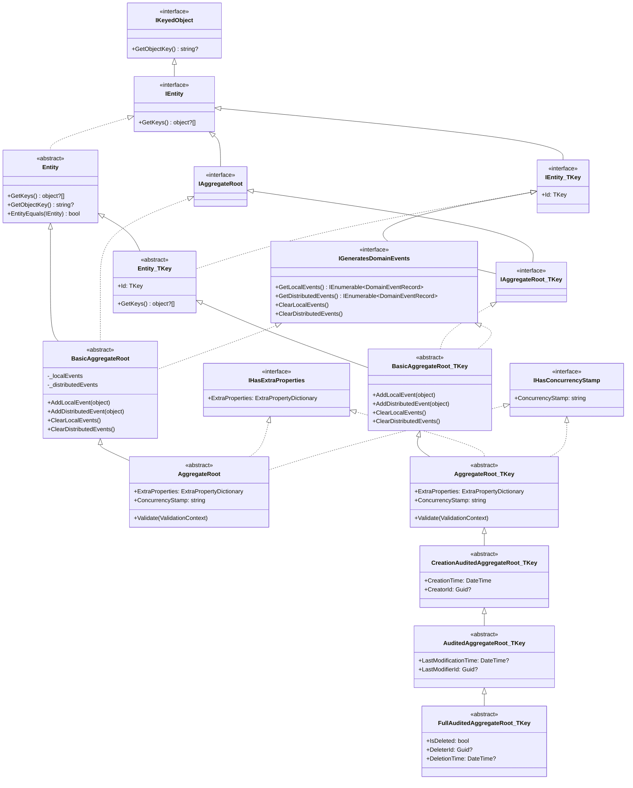
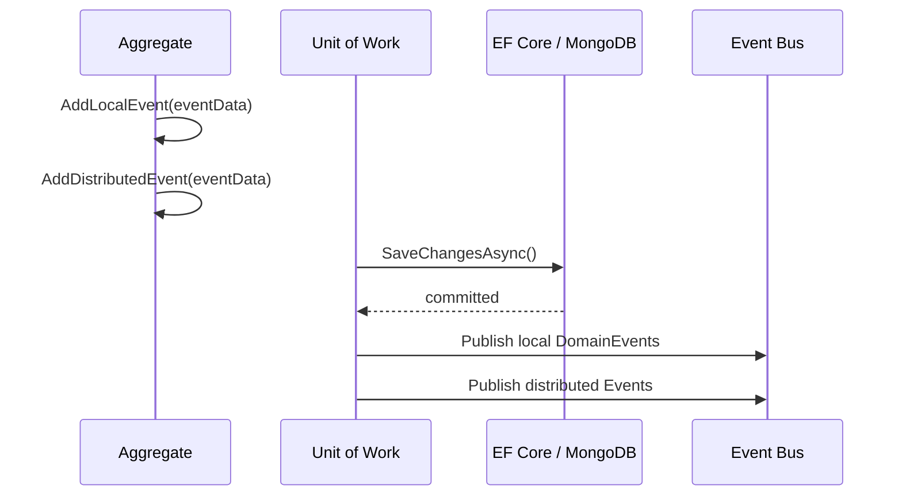

The domain model in ABP Framework is built on a carefully layered set of base classes and interfaces. Every persistent object in the system descends from one of these types, and the choice of base class determines what infrastructure features — change tracking, domain events, extra property bags, optimistic concurrency, and auditing — the object participates in automatically.

## Class hierarchy

The diagram below shows the full inheritance chain from the raw `IEntity` interface down to the richest audited aggregate root you will typically use in a module.



## `IEntity` and `Entity<TKey>`

`IEntity` extends `IKeyedObject` and requires a single method. `IEntity<TKey>` adds a strongly-typed `Id` property:

```csharp
// Volo.Abp.Domain.Entities
public interface IEntity : IKeyedObject
{
    object?[] GetKeys();
}

public interface IEntity<TKey> : IEntity
{
    TKey Id { get; }
}
```

The abstract class `Entity` implements `IEntity` and wires up multi-tenancy bootstrapping in its constructor via `EntityHelper.TrySetTenantId(this)`. It also provides `GetObjectKey()` (which encodes composite keys as a string) and `EntityEquals()`:

```csharp
[Serializable]
public abstract class Entity : IEntity
{
    protected Entity()
    {
        EntityHelper.TrySetTenantId(this);
    }

    public virtual string? GetObjectKey()
    {
        var keys = GetKeys();
        return keys.Length switch
        {
            0 => null,
            1 when keys[0] != null => keys[0]?.ToString(),
            _ => KeyedObjectHelper.EncodeCompositeKey(keys)
        };
    }

    public abstract object?[] GetKeys();

    public bool EntityEquals(IEntity other)
    {
        return EntityHelper.EntityEquals(this, other);
    }
}
```

The typed variant `Entity<TKey>` adds the strongly-typed `Id` property and a single-element `GetKeys()` implementation:

```csharp
[Serializable]
public abstract class Entity<TKey> : Entity, IEntity<TKey>
{
    public virtual TKey Id { get; protected set; } = default!;

    protected Entity() { }

    protected Entity(TKey id)
    {
        Id = id;
    }

    public override object?[] GetKeys()
    {
        return [Id];
    }

    public override string ToString()
    {
        return $"[ENTITY: {GetType().Name}] Id = {Id}";
    }
}
```

<Note>
Child objects that are **not** aggregate roots — for example, `IdentityUserClaim` which belongs to `IdentityUser` — should inherit from `Entity<TKey>` directly. They live inside the aggregate's transaction boundary and should not be accessed through their own repository.
</Note>

## `BasicAggregateRoot<TKey>` — domain events without extra properties

`BasicAggregateRoot<TKey>` bridges `Entity<TKey>` and the `IGeneratesDomainEvents` contract. It maintains two private, lazily-initialised collections of `DomainEventRecord` objects — one for in-process local events and one for distributed events:

```csharp
[Serializable]
public abstract class BasicAggregateRoot<TKey> : Entity<TKey>,
    IAggregateRoot<TKey>,
    IGeneratesDomainEvents
{
    private ICollection<DomainEventRecord>? _distributedEvents;
    private ICollection<DomainEventRecord>? _localEvents;

    protected BasicAggregateRoot() { }

    protected BasicAggregateRoot(TKey id) : base(id) { }

    public virtual IEnumerable<DomainEventRecord> GetLocalEvents()
        => _localEvents ?? Array.Empty<DomainEventRecord>();

    public virtual IEnumerable<DomainEventRecord> GetDistributedEvents()
        => _distributedEvents ?? Array.Empty<DomainEventRecord>();

    public virtual void ClearLocalEvents()
    {
        _localEvents?.Clear();
    }

    public virtual void ClearDistributedEvents()
    {
        _distributedEvents?.Clear();
    }

    protected virtual void AddLocalEvent(object eventData)
    {
        _localEvents ??= new Collection<DomainEventRecord>();
        _localEvents.Add(new DomainEventRecord(eventData, EventOrderGenerator.GetNext()));
    }

    protected virtual void AddDistributedEvent(object eventData)
    {
        _distributedEvents ??= new Collection<DomainEventRecord>();
        _distributedEvents.Add(new DomainEventRecord(eventData, EventOrderGenerator.GetNext()));
    }
}
```

There is also a non-generic `BasicAggregateRoot` (no `TKey`) for composite-key aggregates, with the same domain event infrastructure, inheriting from `Entity` rather than `Entity<TKey>`.

<Tip>
Use `BasicAggregateRoot<TKey>` when your aggregate root must **not** carry extra properties or a concurrency stamp — for example, a high-throughput log entry that should stay as thin as possible.
</Tip>

## `AggregateRoot<TKey>` — the standard base class

`AggregateRoot<TKey>` inherits from `BasicAggregateRoot<TKey>` and adds two important cross-cutting concerns: an extensible property dictionary (`IHasExtraProperties`) and optimistic concurrency protection (`IHasConcurrencyStamp`).

```csharp
[Serializable]
public abstract class AggregateRoot<TKey> : BasicAggregateRoot<TKey>,
    IHasExtraProperties,
    IHasConcurrencyStamp
{
    public virtual ExtraPropertyDictionary ExtraProperties { get; protected set; }

    [DisableAuditing]
    public virtual string ConcurrencyStamp { get; set; }

    protected AggregateRoot()
    {
        ConcurrencyStamp = Guid.NewGuid().ToString("N");
        ExtraProperties = new ExtraPropertyDictionary();
        this.SetDefaultsForExtraProperties();
    }

    protected AggregateRoot(TKey id) : base(id)
    {
        ConcurrencyStamp = Guid.NewGuid().ToString("N");
        ExtraProperties = new ExtraPropertyDictionary();
        this.SetDefaultsForExtraProperties();
    }

    public virtual IEnumerable<ValidationResult> Validate(ValidationContext validationContext)
    {
        return ExtensibleObjectValidator.GetValidationErrors(this, validationContext);
    }
}
```

There is also a non-generic `AggregateRoot` that extends `BasicAggregateRoot` (the non-generic variant) and adds the same `ExtraProperties`, `ConcurrencyStamp`, and `Validate` members for composite-key scenarios.

### `IHasExtraProperties` — the extensible property bag

`ExtraPropertyDictionary` is a `Dictionary<string, object?>` that is persisted as a JSON column (EF Core) or a sub-document field (MongoDB). It lets modules and application code add new fields to an entity **without changing its schema or recompiling** the defining assembly.

```csharp
// Adding an extra property inside an aggregate method
user.SetProperty("Nickname", "jdoe");

// Reading it back
var nickname = user.GetProperty<string>("Nickname");
```

The `SetDefaultsForExtraProperties()` extension method (from `Volo.Abp.ObjectExtending`) iterates all `ObjectExtensionManager`-registered properties for the type and populates their default values at construction time.

### `IHasConcurrencyStamp`

The `ConcurrencyStamp` is a random 32-char hex string (a `Guid` formatted with `"N"`) set in the constructor. Both the EF Core and MongoDB providers enforce optimistic concurrency by comparing this stamp on every update, preventing lost-update anomalies when two requests modify the same aggregate concurrently.

<Warning>
Do **not** set `ConcurrencyStamp` manually. The repository provider updates it automatically before each `UpdateAsync` call.
</Warning>

## Domain events

Domain events are plain POCO objects enqueued inside an aggregate by calling `AddLocalEvent` or `AddDistributedEvent`. The Unit of Work infrastructure harvests them after `SaveChangesAsync` succeeds.

```csharp
// Volo.Abp.Domain.Entities
public class DomainEventRecord
{
    public object EventData { get; }
    public long EventOrder { get; }

    public DomainEventRecord(object eventData, long eventOrder)
    {
        EventData = eventData;
        EventOrder = eventOrder;
    }
}
```

`EventOrder` comes from `EventOrderGenerator.GetNext()` — a monotonically increasing `long` that preserves cross-aggregate ordering within a single Unit of Work.

The `IGeneratesDomainEvents` interface defines the full contract implemented by `BasicAggregateRoot`:

```csharp
public interface IGeneratesDomainEvents
{
    IEnumerable<DomainEventRecord> GetLocalEvents();
    IEnumerable<DomainEventRecord> GetDistributedEvents();
    void ClearLocalEvents();
    void ClearDistributedEvents();
}
```

After the Unit of Work commits, the `EntityChangeEventHelper` collects all `DomainEventEntry` objects (wrapping the source entity, event data, and order) into an `EntityEventReport` and dispatches them through the in-process event bus. Distributed events are forwarded to the configured message broker.



### Built-in entity lifecycle events

ABP automatically raises typed event data objects for entity changes. `EntityCreatedEventData<TEntity>` (in `Volo.Abp.Domain.Entities.Events`) is one example:

```csharp
[Serializable]
public class EntityCreatedEventData<TEntity> : EntityChangedEventData<TEntity>
{
    public EntityCreatedEventData(TEntity entity) : base(entity) { }
}
```

Parallel types exist for updates and deletions (`EntityUpdatedEventData<TEntity>`, `EntityDeletedEventData<TEntity>`). These are raised automatically by the change-event infrastructure — you do not need to call `AddLocalEvent` for them unless you want custom event data.

## Auditing base classes

ABP provides a stack of convenience aggregate root base classes that automatically record who created, modified, or deleted an entity. These are all defined in `Volo.Abp.Domain.Entities.Auditing`.

<CardGroup cols={2}>
  <Card title="CreationAuditedAggregateRoot&lt;TKey&gt;" icon="circle-plus">
    Adds `CreationTime` (`DateTime`) and `CreatorId` (`Guid?`). Populated automatically by the auditing interceptor.
  </Card>
  <Card title="AuditedAggregateRoot&lt;TKey&gt;" icon="pen-to-square">
    Extends creation auditing with `LastModificationTime` (`DateTime?`) and `LastModifierId` (`Guid?`).
  </Card>
  <Card title="FullAuditedAggregateRoot&lt;TKey&gt;" icon="trash">
    Adds soft-delete support: `IsDeleted` (`bool`), `DeleterId` (`Guid?`), and `DeletionTime` (`DateTime?`). The repository's `ApplyDataFilters` method automatically filters out soft-deleted records.
  </Card>
  <Card title="WithUser variants" icon="user">
    `CreationAuditedAggregateRootWithUser<TKey, TUser>`, `AuditedAggregateRootWithUser`, and `FullAuditedAggregateRootWithUser` store a navigation property to the actual user entity rather than just the ID.
  </Card>
</CardGroup>

Each audited class also has a non-generic counterpart (`CreationAuditedAggregateRoot`, `AuditedAggregateRoot`, `FullAuditedAggregateRoot`) for composite-key aggregates.

### Auditing property visibility

Note that in `CreationAuditedAggregateRoot<TKey>`, auditing properties have **public** setters (not `protected`), since the auditing infrastructure sets them from outside the entity:

```csharp
public abstract class CreationAuditedAggregateRoot<TKey> : AggregateRoot<TKey>, ICreationAuditedObject
{
    public virtual DateTime CreationTime { get; set; }
    public virtual Guid? CreatorId { get; set; }
}
```

### `ISoftDelete`

`FullAuditedAggregateRoot<TKey>` implements `IFullAuditedObject` which in turn implements `ISoftDelete`. When the `ISoftDelete` data filter is enabled (the default), `RepositoryBase.ApplyDataFilters` appends a `WHERE IsDeleted = false` clause to every query:

```csharp
protected virtual TQueryable ApplyDataFilters<TQueryable, TOtherEntity>(TQueryable query)
    where TQueryable : IQueryable<TOtherEntity>
{
    if (typeof(ISoftDelete).IsAssignableFrom(typeof(TOtherEntity)))
    {
        query = (TQueryable)query.WhereIf(
            DataFilter.IsEnabled<ISoftDelete>(),
            e => ((ISoftDelete)e!).IsDeleted == false);
    }
    if (typeof(IMultiTenant).IsAssignableFrom(typeof(TOtherEntity)))
    {
        var tenantId = CurrentTenant.Id;
        query = (TQueryable)query.WhereIf(
            DataFilter.IsEnabled<IMultiTenant>(),
            e => ((IMultiTenant)e!).TenantId == tenantId);
    }
    return query;
}
```

## Choosing the right base class

<Steps>
  <Step title="Does it need to be an aggregate root?">
    Child objects (e.g., order lines inside an order) should extend `Entity<TKey>`. They must not have their own repository and are only reachable through the parent aggregate.
  </Step>
  <Step title="Does it need extra properties / concurrency?">
    If yes, use `AggregateRoot<TKey>`. This is the most common choice for any module entity that users may want to extend without modifying source code. If no, use `BasicAggregateRoot<TKey>` for a leaner footprint.
  </Step>
  <Step title="Does it need auditing?">
    Choose the appropriate audited base class: `CreationAuditedAggregateRoot<TKey>` → `AuditedAggregateRoot<TKey>` → `FullAuditedAggregateRoot<TKey>` depending on how much audit trail the aggregate requires.
  </Step>
</Steps>

### Base class quick reference

| Base class | Key | ExtraProps | ConcurrencyStamp | DomainEvents | CreationTime | ModificationTime | SoftDelete |
|---|---|---|---|---|---|---|---|
| `Entity<TKey>` | ✅ | ❌ | ❌ | ❌ | ❌ | ❌ | ❌ |
| `BasicAggregateRoot<TKey>` | ✅ | ❌ | ❌ | ✅ | ❌ | ❌ | ❌ |
| `AggregateRoot<TKey>` | ✅ | ✅ | ✅ | ✅ | ❌ | ❌ | ❌ |
| `CreationAuditedAggregateRoot<TKey>` | ✅ | ✅ | ✅ | ✅ | ✅ | ❌ | ❌ |
| `AuditedAggregateRoot<TKey>` | ✅ | ✅ | ✅ | ✅ | ✅ | ✅ | ❌ |
| `FullAuditedAggregateRoot<TKey>` | ✅ | ✅ | ✅ | ✅ | ✅ | ✅ | ✅ |

A real example from the Identity module:

```csharp
// modules/identity/src/Volo.Abp.Identity.Domain
public class IdentityUser : FullAuditedAggregateRoot<Guid>, IUser, IHasEntityVersion
{
    public virtual Guid? TenantId { get; protected set; }
    public virtual string UserName { get; protected internal set; }
    public virtual string Email { get; protected internal set; }
    // ... child collections managed by the aggregate
}
```

`IdentityUser` gets: `ExtraProperties`, `ConcurrencyStamp`, `CreationTime`, `CreatorId`, `LastModificationTime`, `LastModifierId`, `IsDeleted`, `DeleterId`, `DeletionTime`, and domain event infrastructure — all for free by picking the right base class.
