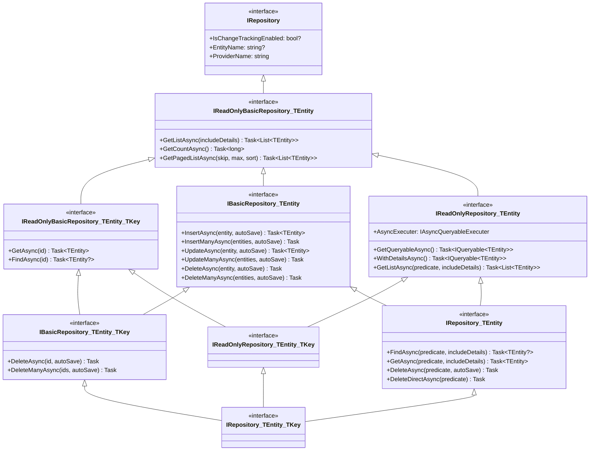
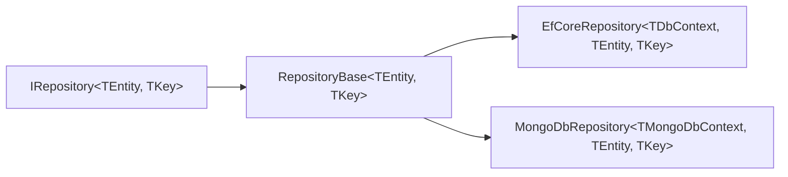

ABP's repository abstraction sits between the domain model and the persistence layer. Rather than exposing raw ORM types to domain or application code, the framework defines a clean set of interfaces that are implemented by provider-specific packages (EF Core, MongoDB). This page walks through those interfaces from the ground up, explains the `RepositoryBase` internals that every concrete repository inherits, and shows how repositories are discovered and registered automatically.

## Interface hierarchy



### `IReadOnlyBasicRepository<TEntity>`

The root of all read operations. It does **not** require a queryable provider — implementations only need to produce materialised `List<T>` results:

```csharp
public interface IReadOnlyBasicRepository<TEntity> : IRepository
    where TEntity : class, IEntity
{
    Task<List<TEntity>> GetListAsync(bool includeDetails = false,
        CancellationToken cancellationToken = default);

    Task<long> GetCountAsync(CancellationToken cancellationToken = default);

    Task<List<TEntity>> GetPagedListAsync(int skipCount, int maxResultCount,
        string sorting, bool includeDetails = false,
        CancellationToken cancellationToken = default);
}
```

The key-typed variant `IReadOnlyBasicRepository<TEntity, TKey>` adds `GetAsync(TKey id)` (throws `EntityNotFoundException` if absent) and `FindAsync(TKey id)` (returns `null`).

### `IReadOnlyRepository<TEntity>` — the queryable layer

`IReadOnlyRepository<TEntity>` extends the basic read interface with an `IAsyncQueryableExecuter` and async queryable access:

```csharp
public interface IReadOnlyRepository<TEntity> : IReadOnlyBasicRepository<TEntity>
    where TEntity : class, IEntity
{
    IAsyncQueryableExecuter AsyncExecuter { get; }

    Task<IQueryable<TEntity>> GetQueryableAsync();

    Task<IQueryable<TEntity>> WithDetailsAsync();
    Task<IQueryable<TEntity>> WithDetailsAsync(
        params Expression<Func<TEntity, object>>[] propertySelectors);

    Task<List<TEntity>> GetListAsync(
        Expression<Func<TEntity, bool>> predicate,
        bool includeDetails = false,
        CancellationToken cancellationToken = default);
}
```

`GetQueryableAsync()` is the primary hook: it returns an `IQueryable<TEntity>` that **already has data filters applied** (soft-delete, multi-tenancy). Callers should compose LINQ on top of it and materialise results via `AsyncExecuter` to remain provider-agnostic.

### `IBasicRepository<TEntity>` — write operations

```csharp
public interface IBasicRepository<TEntity> : IReadOnlyBasicRepository<TEntity>
    where TEntity : class, IEntity
{
    Task<TEntity> InsertAsync(TEntity entity, bool autoSave = false,
        CancellationToken cancellationToken = default);
    Task InsertManyAsync(IEnumerable<TEntity> entities, bool autoSave = false,
        CancellationToken cancellationToken = default);
    Task<TEntity> UpdateAsync(TEntity entity, bool autoSave = false,
        CancellationToken cancellationToken = default);
    Task UpdateManyAsync(IEnumerable<TEntity> entities, bool autoSave = false,
        CancellationToken cancellationToken = default);
    Task DeleteAsync(TEntity entity, bool autoSave = false,
        CancellationToken cancellationToken = default);
    Task DeleteManyAsync(IEnumerable<TEntity> entities, bool autoSave = false,
        CancellationToken cancellationToken = default);
}
```

The `autoSave` flag controls whether the underlying ORM flushes changes immediately (`SaveChangesAsync`) or defers to the outer Unit of Work to commit on its own.

### `IRepository<TEntity>` — predicate-based queries and batch delete

`IRepository<TEntity>` composes the queryable read interface with the full write interface, adding predicate-based finders and two batch-delete methods:

```csharp
public interface IRepository<TEntity> : IReadOnlyRepository<TEntity>, IBasicRepository<TEntity>
    where TEntity : class, IEntity
{
    // Returns null or throws InvalidOperationException on multiple matches
    Task<TEntity?> FindAsync(Expression<Func<TEntity, bool>> predicate,
        bool includeDetails = true, CancellationToken cancellationToken = default);

    // Throws EntityNotFoundException if nothing matches
    Task<TEntity> GetAsync(Expression<Func<TEntity, bool>> predicate,
        bool includeDetails = true, CancellationToken cancellationToken = default);

    // Fetches then deletes — honours soft-delete and audit hooks
    Task DeleteAsync(Expression<Func<TEntity, bool>> predicate,
        bool autoSave = false, CancellationToken cancellationToken = default);

    // Directly deletes in DB — bypasses soft-delete, multi-tenancy, audit logging
    Task DeleteDirectAsync(Expression<Func<TEntity, bool>> predicate,
        CancellationToken cancellationToken = default);
}
```

<Warning>
`DeleteDirectAsync` issues a bulk-delete SQL statement. It bypasses soft-delete filtering, multi-tenancy checks, domain events, and audit logging. Use it only for maintenance tasks or bulk cleanup where you explicitly want to skip those features.
</Warning>

## `RepositoryBase<TEntity>` internals

`RepositoryBase<TEntity>` provides a partial implementation shared by every concrete provider:

```csharp
public abstract class RepositoryBase<TEntity>
    : BasicRepositoryBase<TEntity>, IRepository<TEntity>, IUnitOfWorkManagerAccessor
    where TEntity : class, IEntity
{
    // Concrete provider must implement this
    public abstract Task<IQueryable<TEntity>> GetQueryableAsync();

    // GetAsync is built on top of FindAsync
    public async Task<TEntity> GetAsync(
        Expression<Func<TEntity, bool>> predicate,
        bool includeDetails = true,
        CancellationToken cancellationToken = default)
    {
        var entity = await FindAsync(predicate, includeDetails, cancellationToken);
        if (entity == null)
        {
            throw new EntityNotFoundException<TEntity>();
        }
        return entity;
    }

    // Applied inside GetQueryableAsync() by providers
    protected virtual TQueryable ApplyDataFilters<TQueryable>(TQueryable query)
        where TQueryable : IQueryable<TEntity>
    {
        return ApplyDataFilters<TQueryable, TEntity>(query);
    }

    protected virtual TQueryable ApplyDataFilters<TQueryable, TOtherEntity>(TQueryable query)
        where TQueryable : IQueryable<TOtherEntity>
    {
        if (typeof(ISoftDelete).IsAssignableFrom(typeof(TOtherEntity)))
        {
            query = (TQueryable)query.WhereIf(
                DataFilter.IsEnabled<ISoftDelete>(),
                e => ((ISoftDelete)e!).IsDeleted == false);
        }
        if (typeof(IMultiTenant).IsAssignableFrom(typeof(TOtherEntity)))
        {
            var tenantId = CurrentTenant.Id;
            query = (TQueryable)query.WhereIf(
                DataFilter.IsEnabled<IMultiTenant>(),
                e => ((IMultiTenant)e!).TenantId == tenantId);
        }
        return query;
    }
}
```

`BasicRepositoryBase<TEntity>` (the parent) provides lazy-resolved services — `DataFilter`, `CurrentTenant`, `UnitOfWorkManager`, `Logger`, `AsyncExecuter`, `EntityChangeTrackingProvider` — via `IAbpLazyServiceProvider`. It also implements the `ShouldTrackingEntityChange()` logic that respects `[EnableEntityChangeTracking]` / `[DisableEntityChangeTracking]` attributes and the `IsChangeTrackingEnabled` flag.

### Async queryable execution

Provider-specific LINQ extensions (e.g., `ToListAsync`) are wrapped behind `IAsyncQueryableExecuter` so that domain code does not take a hard dependency on EF Core:

```csharp
// In a domain service or application service
var queryable = await _userRepository.GetQueryableAsync();
var users = await AsyncExecuter.ToListAsync(
    queryable.Where(u => u.IsActive).OrderBy(u => u.UserName)
);
```

The EF Core implementation delegates to `EntityFrameworkQueryableExtensions.ToListAsync`; the MongoDB implementation uses its own async enumeration API. The abstraction is resolved at runtime, so you can swap providers without changing query code.

## `ISupportsExplicitLoading<TEntity>`

For EF Core repositories that do not eagerly include navigation properties, this interface provides on-demand loading after the aggregate is already in memory:

```csharp
public interface ISupportsExplicitLoading<TEntity>
    where TEntity : class, IEntity
{
    Task EnsureCollectionLoadedAsync<TProperty>(
        TEntity entity,
        Expression<Func<TEntity, IEnumerable<TProperty>>> propertyExpression,
        CancellationToken cancellationToken)
        where TProperty : class;

    Task EnsurePropertyLoadedAsync<TProperty>(
        TEntity entity,
        Expression<Func<TEntity, TProperty?>> propertyExpression,
        CancellationToken cancellationToken)
        where TProperty : class;
}
```

Cast the injected repository to this interface at the call site:

```csharp
await ((ISupportsExplicitLoading<Order>)_orderRepository)
    .EnsureCollectionLoadedAsync(order, o => o.Lines, cancellationToken);
```

## How EF Core and MongoDB plug in

Both providers follow the same pattern: a concrete generic repository class extends `RepositoryBase<TEntity, TKey>`, implements `GetQueryableAsync()` by projecting from the ORM's `DbSet` or `IMongoCollection`, and calls `ApplyDataFilters` before returning the queryable.



The EF Core repository overrides `GetQueryableAsync()` to return `DbContext.Set<TEntity>().AsQueryable()` wrapped in `ApplyDataFilters`. The MongoDB repository does the same with `IMongoCollection<TEntity>.AsQueryable()`.

Custom repositories extend the provider-specific base class directly and inject the `DbContext` or `IMongoDbContext` alongside it:

```csharp
// EF Core example
public class EfCoreIdentityUserRepository
    : EfCoreRepository<IdentityDbContext, IdentityUser, Guid>,
      IIdentityUserRepository
{
    public EfCoreIdentityUserRepository(
        IDbContextProvider<IdentityDbContext> dbContextProvider)
        : base(dbContextProvider) { }

    public async Task<List<IdentityUser>> GetListAsync(
        string sorting, int maxResultCount, int skipCount, string filter)
    {
        var dbContext = await GetDbContextAsync();
        return await dbContext.Users
            .WhereIf(!filter.IsNullOrWhiteSpace(),
                u => u.UserName.Contains(filter) || u.Email.Contains(filter))
            .OrderBy(sorting)
            .PageBy(skipCount, maxResultCount)
            .ToListAsync();
    }
}
```

## Convention-based repository registration

`AbpRepositoryConventionalRegistrar` is a `DefaultConventionalRegistrar` that limits automatic registration to types that implement `IRepository`:

```csharp
public class AbpRepositoryConventionalRegistrar : DefaultConventionalRegistrar
{
    public static bool ExposeRepositoryClasses { get; set; }

    protected override bool IsConventionalRegistrationDisabled(Type type)
    {
        return !typeof(IRepository).IsAssignableFrom(type)
            || base.IsConventionalRegistrationDisabled(type);
    }

    protected override List<Type> GetExposedServiceTypes(Type type)
    {
        if (ExposeRepositoryClasses)
        {
            return base.GetExposedServiceTypes(type);
        }
        // By default only the interfaces are exposed, not the concrete class
        return base.GetExposedServiceTypes(type)
            .Where(x => x.IsInterface)
            .ToList();
    }

    protected override ServiceLifetime? GetDefaultLifeTimeOrNull(Type type)
    {
        return ServiceLifetime.Transient;
    }
}
```

By default, concrete repository classes are **not** injectable directly — only their interfaces are. This enforces the DDD principle that the domain should depend on abstractions. Set `ExposeRepositoryClasses = true` during tests or tooling scenarios where you need direct access to the concrete type.

Default repositories for every entity in a `DbContext` are registered by `RepositoryRegistrarBase.AddRepositories()` during module startup. Custom repositories defined with `AbpDbContextRegistrationOptions.AddRepository<TEntity, TRepository>()` are registered first and take precedence over the generated defaults.

<CardGroup cols={2}>
  <Card title="Default repository" icon="database">
    Generated automatically by the provider package for every entity type discovered in the `DbContext`. Provides full `IRepository<TEntity, TKey>` semantics with no additional code.
  </Card>
  <Card title="Custom repository" icon="code">
    A hand-written class that extends the provider-specific base and adds domain-specific query methods. Registered via `options.AddRepository<TEntity, TMyRepository>()` in the module's `ConfigureServices`.
  </Card>
</CardGroup>

## `autoSave` and Unit of Work interaction

Most write methods accept an `autoSave` parameter. When `false` (the default), changes are staged in the ORM's change tracker and flushed only when the surrounding Unit of Work completes. When `true`, `SaveChangesAsync` is called immediately.

```csharp
// Defer to UoW (preferred in application services)
await _repository.InsertAsync(entity);

// Flush immediately (useful in domain services that need the generated ID)
var saved = await _repository.InsertAsync(entity, autoSave: true);
```

<Tip>
Prefer `autoSave: false` inside application services — the ABP Unit of Work middleware commits automatically at the end of the HTTP request, batching all changes into a single transaction.
</Tip>
