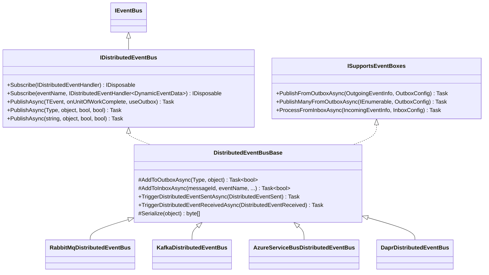

The Distributed Event Bus delivers events across process boundaries — between microservices or between independently deployed instances of the same service. It sits on top of a pluggable broker (RabbitMQ, Kafka, Azure Service Bus, or Dapr) and integrates with ABP's Unit of Work and the transactional Outbox/Inbox pattern to guarantee at-least-once delivery without dual-write problems.

## Interface Hierarchy



## File Inventory

| File | Role |
|---|---|
| `Volo.Abp.EventBus.Abstractions` / `Distributed/IDistributedEventBus.cs` | Interface extending `IEventBus` with `useOutbox` parameter |
| `Volo.Abp.EventBus.Abstractions` / `Distributed/IDistributedEventHandler.cs` | `IDistributedEventHandler<TEvent>` with `HandleEventAsync(TEvent)` |
| `Volo.Abp.EventBus.Abstractions` / `Distributed/ISupportsEventBoxes.cs` | Contract for Outbox/Inbox operations, implemented by all providers |
| `Volo.Abp.EventBus.Abstractions` / `Distributed/OutboxConfig.cs` | Config: `ImplementationType`, `DatabaseName`, `Selector`, `IsSendingEnabled` |
| `Volo.Abp.EventBus.Abstractions` / `Distributed/InboxConfig.cs` | Config: `ImplementationType`, `DatabaseName`, `EventSelector`, `HandlerSelector`, `IsProcessingEnabled` |
| `Volo.Abp.EventBus.Abstractions` / `Distributed/OutgoingEventInfo.cs` | Outbox row: `Id`, `EventName`, `EventData` (bytes), `CreationTime`, correlation via `ExtraProperties` |
| `Volo.Abp.EventBus.Abstractions` / `Distributed/IncomingEventInfo.cs` | Inbox row: `Id`, `MessageId`, `EventName`, `EventData`, `Status`, `RetryCount`, `NextRetryTime` |
| `Volo.Abp.EventBus.Abstractions` / `Distributed/DistributedEventSent.cs` | Side-channel notification published on the local bus after a direct send |
| `Volo.Abp.EventBus.Abstractions` / `Distributed/DistributedEventReceived.cs` | Side-channel notification published on the local bus when a message is received |
| `Volo.Abp.EventBus` / `Distributed/DistributedEventBusBase.cs` | Abstract base: UoW integration, Outbox/Inbox routing, observability notifications |
| `Volo.Abp.EventBus` / `Distributed/AbpDistributedEventBusOptions.cs` | `Handlers`, `Outboxes`, `Inboxes` collections |
| `Volo.Abp.EventBus` / `Distributed/OutboxSenderManager.cs` | `IBackgroundWorker` that starts one `OutboxSender` per configured outbox |
| `Volo.Abp.EventBus` / `Distributed/InboxProcessManager.cs` | `IBackgroundWorker` that starts one `InboxProcessor` per configured inbox |

## `IDistributedEventBus`

```csharp
public interface IDistributedEventBus : IEventBus
{
    IDisposable Subscribe<TEvent>(IDistributedEventHandler<TEvent> handler)
        where TEvent : class;

    IDisposable Subscribe(string eventName, IDistributedEventHandler<DynamicEventData> handler);

    Task PublishAsync<TEvent>(
        TEvent eventData,
        bool onUnitOfWorkComplete = true,
        bool useOutbox = true)
        where TEvent : class;

    Task PublishAsync(
        Type eventType,
        object eventData,
        bool onUnitOfWorkComplete = true,
        bool useOutbox = true);

    Task PublishAsync(
        string eventName,
        object eventData,
        bool onUnitOfWorkComplete = true,
        bool useOutbox = true);
}
```

The extra `useOutbox` parameter (absent from `ILocalEventBus`) controls whether the Outbox pattern is used. Passing `useOutbox: false` publishes directly to the broker, bypassing the database-backed reliability layer.

The `string eventName` overload publishes dynamic (type-less) events — it resolves the CLR type from the event name registry if possible, otherwise wraps the data in a `DynamicEventData` envelope.

## `DistributedEventBusBase` — Publish Flow

```csharp
public virtual async Task PublishAsync(
    Type eventType,
    object eventData,
    bool onUnitOfWorkComplete = true,
    bool useOutbox = true)
{
    // 1. Hold in UoW until commit
    if (onUnitOfWorkComplete && UnitOfWorkManager.Current != null)
    {
        AddToUnitOfWork(
            UnitOfWorkManager.Current,
            new UnitOfWorkEventRecord(eventType, eventData,
                EventOrderGenerator.GetNext(), useOutbox)
        );
        return;
    }

    // 2. Write to Outbox table (if configured and inside a UoW)
    if (useOutbox)
    {
        if (await AddToOutboxAsync(eventType, eventData))
        {
            return;
        }
    }

    // 3. Publish directly to the broker
    await PublishToEventBusAsync(eventType, eventData);

    // 4. Fire side-channel notification on the local bus
    await TriggerDistributedEventSentAsync(new DistributedEventSent()
    {
        Source = DistributedEventSource.Direct,
        EventName = GetEventName(eventType, eventData),
        EventData = GetEventData(eventData)
    });
}
```

The three-level decision tree ensures:
1. Events published inside a UoW wait until the UoW commits before being sent
2. After the UoW commits, if an Outbox is configured the serialized event is written to the database atomically with any other UoW changes
3. If no Outbox is configured, the event goes straight to the broker

Note that `EventBusBase.PublishAsync(Type, object, bool)` (without `useOutbox`) simply calls `PublishAsync(Type, object, bool, useOutbox: true)` — the `useOutbox` parameter is added at the `IDistributedEventBus` level.

### `AddToOutboxAsync`

```csharp
protected virtual async Task<bool> AddToOutboxAsync(Type eventType, object eventData)
{
    var unitOfWork = UnitOfWorkManager.Current;
    if (unitOfWork == null) return false;

    var addedToOutbox = false;

    foreach (var outboxConfig in AbpDistributedEventBusOptions.Outboxes.Values
        .OrderBy(x => x.Selector is null))
    {
        if (outboxConfig.Selector == null || outboxConfig.Selector(eventType))
        {
            var eventOutbox = (IEventOutbox)unitOfWork.ServiceProvider
                .GetRequiredService(outboxConfig.ImplementationType);

            (var eventName, eventData) = ResolveEventForPublishing(eventType, eventData);

            await OnAddToOutboxAsync(eventName, eventType, eventData);

            var outgoingEventInfo = new OutgoingEventInfo(
                GuidGenerator.Create(),
                eventName,
                Serialize(eventData),   // provider-specific serialization
                Clock.Now
            );

            var correlationId = CorrelationIdProvider.Get();
            if (correlationId != null)
                outgoingEventInfo.SetCorrelationId(correlationId);

            await eventOutbox.EnqueueAsync(outgoingEventInfo);
            addedToOutbox = true;
        }
    }

    return addedToOutbox;
}
```

The method iterates **all** matching outbox configurations (not just the first), so an event can be written to multiple outboxes simultaneously if more than one selector matches. It returns `false` only when there is no active UoW or no outbox configuration is matched.

`OnAddToOutboxAsync(string, Type, object)` is a protected virtual hook for provider-specific pre-processing before the row is inserted.

## ETOs — Event Transfer Objects

ETOs are the recommended DTO type for distributed events. They should be:
- **Serialization-friendly**: primitive types, no circular references, no lazy-load proxies
- **Versioned** or forward-compatible: adding optional properties is safe; removing or renaming is a breaking change
- **Tenant-aware** when needed: implement `IEventDataMayHaveTenantId`

```csharp
// Typical ETO
public class OrderCreatedEto
{
    public Guid OrderId { get; set; }
    public Guid? TenantId { get; set; }
    public decimal TotalAmount { get; set; }
    public DateTime CreatedAt { get; set; }
}

// Tenant-aware ETO using IEventDataMayHaveTenantId
public class OrderCreatedEto : IEventDataMayHaveTenantId
{
    public Guid? TenantId { get; set; }

    // Returns true and sets tenantId when TenantId has a value
    public bool IsMultiTenant(out Guid? tenantId)
    {
        tenantId = TenantId;
        return TenantId.HasValue;
    }
}
```

`IEventDataMayHaveTenantId.IsMultiTenant(out Guid? tenantId)` is used by `EventBusBase.GetEventDataTenantId` to switch the current tenant context before invoking handlers.

ABP also provides `EtoBase` (in `Volo.Abp.Domain.Entities.Events.Distributed`) as a base class for ETOs that need an `ExtraProperties` dictionary:

```csharp
[Serializable]
public abstract class EtoBase
{
    public Dictionary<string, string> Properties { get; set; }
}
```

### `[EventName]` attribute

```csharp
[EventName("Orders.Created.v2")]
public class OrderCreatedEtoV2 { ... }
```

Without the attribute, the event name defaults to `eventType.FullName`. For cross-service contracts that span codebases, always set an explicit name to avoid breaking changes from namespace or class renames.

## Serialization

`DistributedEventBusBase.Serialize(object eventData)` is `protected abstract byte[]`. Each provider supplies its own implementation:

| Provider | Serialization |
|---|---|
| RabbitMQ | JSON bytes via `IRabbitMqSerializer` (wraps `System.Text.Json` or Newtonsoft) |
| Kafka | JSON bytes |
| Azure Service Bus | JSON bytes |
| Dapr | JSON via Dapr SDK |

The serialized `byte[]` is stored in `OutgoingEventInfo.EventData` (for the Outbox) or sent directly as the broker message body.

## Provider Implementations

### RabbitMQ (`Volo.Abp.EventBus.RabbitMQ`)

`RabbitMqDistributedEventBus` declares an exchange and queue on initialization:

```csharp
public void Initialize()
{
    Consumer = MessageConsumerFactory.Create(
        new ExchangeDeclareConfiguration(
            AbpRabbitMqEventBusOptions.ExchangeName,
            type: AbpRabbitMqEventBusOptions.GetExchangeTypeOrDefault(),
            durable: true),
        new QueueDeclareConfiguration(
            AbpRabbitMqEventBusOptions.ClientName,
            durable: true,
            exclusive: false,
            autoDelete: false,
            prefetchCount: AbpRabbitMqEventBusOptions.PrefetchCount),
        AbpRabbitMqEventBusOptions.ConnectionName
    );

    Consumer.OnMessageReceived(ProcessEventAsync);
    SubscribeHandlers(AbpDistributedEventBusOptions.Handlers);
}
```

- One **exchange** per application (configurable name and type)
- One **queue** per `ClientName` (typically the service name)
- Subscribed event types are bound as routing keys
- `IRabbitMqMessageConsumerFactory` creates a resilient consumer with automatic reconnect

### Kafka, Azure Service Bus, Dapr

All three follow the same `DistributedEventBusBase` contract. The provider-specific classes handle:
- Topic/subscription creation (Kafka topics, Azure Service Bus topics/subscriptions, Dapr pub/sub component names)
- Consumer group management (Kafka)
- Dead-letter queues (Azure Service Bus)
- Message ID deduplication (used when writing to the Inbox)

## Subscribing to Distributed Events

```csharp
// 1. Implement IDistributedEventHandler<TEvent> (auto-discovered by AbpEventBusModule)
public class OrderCreatedHandler
    : IDistributedEventHandler<OrderCreatedEto>, ITransientDependency
{
    public async Task HandleEventAsync(OrderCreatedEto eventData)
    {
        // handle the event
    }
}

// 2. Optionally register explicitly in module (not needed if the class is a DI-registered type)
Configure<AbpDistributedEventBusOptions>(options =>
{
    options.Handlers.Add<OrderCreatedHandler>();
});
```

Handler types in `AbpDistributedEventBusOptions.Handlers` are subscribed by the provider's `SubscribeHandlers` call (in `Initialize` or the constructor). The subscription causes the provider to bind the routing key or topic filter to the application's queue.

### Dynamic subscriptions

Subscribe to untyped payloads from external systems by name:

```csharp
distributedEventBus.Subscribe(
    "ExternalSystem.OrderPlaced",
    new MyDynamicHandler()
);

public class MyDynamicHandler
    : IDistributedEventHandler<DynamicEventData>, ITransientDependency
{
    public async Task HandleEventAsync(DynamicEventData eventData)
    {
        var orderId = eventData.Data; // raw object
        // ...
    }
}
```

## `AbpDistributedEventBusOptions`

```csharp
public class AbpDistributedEventBusOptions
{
    // Handler types to auto-subscribe at startup
    public ITypeList<IEventHandler> Handlers { get; }

    // Named outbox configurations (for selective routing)
    public OutboxConfigDictionary Outboxes { get; }

    // Named inbox configurations
    public InboxConfigDictionary Inboxes { get; }
}
```

`OutboxConfigDictionary` and `InboxConfigDictionary` extend `Dictionary<string, OutboxConfig/InboxConfig>` and expose a `Configure(Action<OutboxConfig/InboxConfig>)` convenience method (see Outbox/Inbox page for setup details).

## `ISupportsEventBoxes`

`DistributedEventBusBase` implements `ISupportsEventBoxes`, the contract used by `OutboxSender` and `InboxProcessor` background workers to interact with the distributed event bus:

```csharp
public interface ISupportsEventBoxes
{
    Task PublishFromOutboxAsync(OutgoingEventInfo outgoingEvent, OutboxConfig outboxConfig);
    Task PublishManyFromOutboxAsync(IEnumerable<OutgoingEventInfo> outgoingEvents, OutboxConfig outboxConfig);
    Task ProcessFromInboxAsync(IncomingEventInfo incomingEvent, InboxConfig inboxConfig);
}
```

`AsSupportsEventBoxes()` is an extension method that casts `IDistributedEventBus` to `ISupportsEventBoxes` (throwing if the implementation does not support it).

## Distributed Event Sent/Received Notifications

`DistributedEventBusBase` publishes `DistributedEventSent` and `DistributedEventReceived` objects via the **local** event bus as side-channel notifications. This allows services to hook observability concerns (logging, metrics, tracing) without modifying the event handling chain:

```csharp
// Source enum values: Direct, Inbox, Outbox
public class DistributedEventSent
{
    public DistributedEventSource Source { get; set; }
    public string EventName { get; set; }
    public object EventData { get; set; }
}

public class DistributedEventReceived
{
    public DistributedEventSource Source { get; set; }
    public string EventName { get; set; }
    public object EventData { get; set; }
}
```

Both `TriggerDistributedEventSentAsync` and `TriggerDistributedEventReceivedAsync` swallow any exceptions from the local bus publish (they are fire-and-forget observability hooks):

```csharp
public virtual async Task TriggerDistributedEventSentAsync(DistributedEventSent distributedEvent)
{
    try
    {
        await LocalEventBus.PublishAsync(distributedEvent, onUnitOfWorkComplete: false);
    }
    catch (Exception) { /* ignored */ }
}
```

`TriggerDistributedEventReceivedAsync` is called by both `TriggerHandlersDirectAsync` (direct delivery) and `TriggerHandlersFromInboxAsync` (inbox delivery), with the `Source` field set accordingly (`Direct` vs `Inbox`).

## Failure Handling

Direct (non-Inbox) failure handling is broker-specific:

| Provider | On handler exception |
|---|---|
| RabbitMQ | Message is nacked; broker routes to dead-letter exchange (if configured) |
| Kafka | Offset is not committed; message is redelivered on next poll |
| Azure Service Bus | Message lock expires; dead-letter after `MaxDeliveryCount` |
| Dapr | Dapr retries based on resiliency policy |

When the **Inbox** pattern is enabled, failures are handled uniformly by `InboxProcessor` via `AbpEventBusBoxesOptions.InboxProcessorFailurePolicy` (see the [Outbox/Inbox](./outbox-inbox) page for details).

<Tip>
For services that consume events from external systems (outside ABP), use `Subscribe(string eventName, IDistributedEventHandler&lt;DynamicEventData&gt; handler)` to receive untyped JSON payloads. Access the raw data via `DynamicEventData.Data`.
</Tip>
