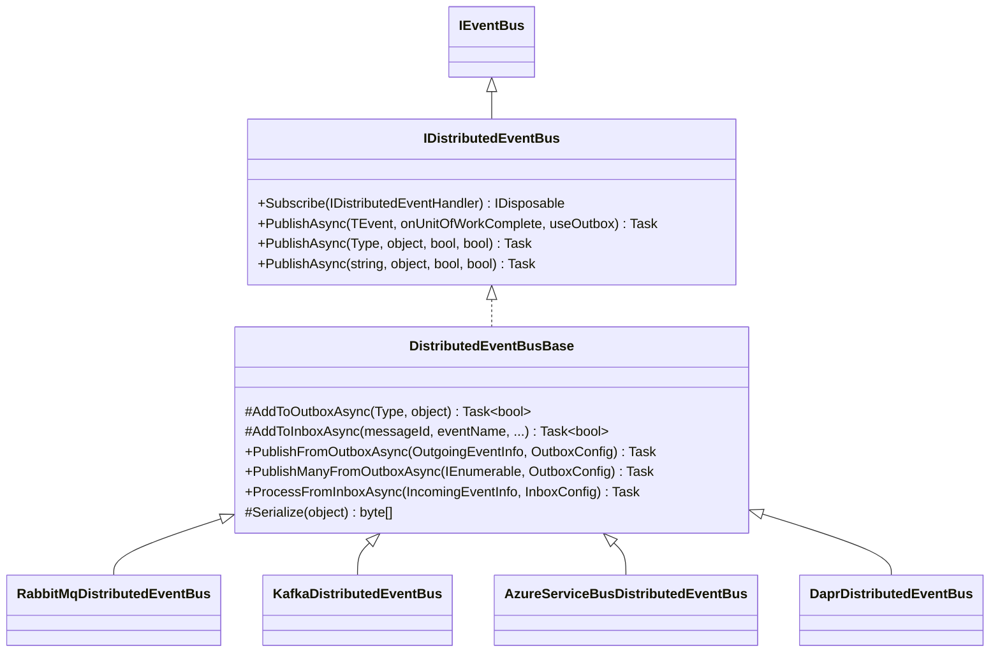

The Distributed Event Bus delivers events across process boundaries — between microservices or between independently deployed instances of the same service. It sits on top of a pluggable broker (RabbitMQ, Kafka, Azure Service Bus, or Dapr) and integrates with ABP's Unit of Work and the transactional Outbox/Inbox pattern to guarantee at-least-once delivery without dual-write problems.

## Interface Hierarchy



## `IDistributedEventBus`

```csharp
public interface IDistributedEventBus : IEventBus
{
    IDisposable Subscribe<TEvent>(IDistributedEventHandler<TEvent> handler)
        where TEvent : class;

    Task PublishAsync<TEvent>(
        TEvent eventData,
        bool onUnitOfWorkComplete = true,
        bool useOutbox = true)
        where TEvent : class;

    Task PublishAsync(
        Type eventType,
        object eventData,
        bool onUnitOfWorkComplete = true,
        bool useOutbox = true);

    Task PublishAsync(
        string eventName,
        object eventData,
        bool onUnitOfWorkComplete = true,
        bool useOutbox = true);
}
```

The extra `useOutbox` parameter (absent from `ILocalEventBus`) controls whether the Outbox pattern is used. Passing `useOutbox: false` publishes directly to the broker, bypassing the database-backed reliability layer.

## `DistributedEventBusBase` — Publish Flow

```csharp
public virtual async Task PublishAsync(
    Type eventType,
    object eventData,
    bool onUnitOfWorkComplete = true,
    bool useOutbox = true)
{
    // 1. Hold in UoW until commit
    if (onUnitOfWorkComplete && UnitOfWorkManager.Current != null)
    {
        AddToUnitOfWork(
            UnitOfWorkManager.Current,
            new UnitOfWorkEventRecord(eventType, eventData,
                EventOrderGenerator.GetNext(), useOutbox)
        );
        return;
    }

    // 2. Write to Outbox table (if configured and inside a UoW)
    if (useOutbox)
    {
        if (await AddToOutboxAsync(eventType, eventData))
        {
            return;
        }
    }

    // 3. Publish directly to the broker
    await PublishToEventBusAsync(eventType, eventData);
}
```

The three-level decision tree ensures:
1. Events published inside a UoW wait until the UoW commits before being sent
2. After the UoW commits, if an Outbox is configured the serialized event is written to the database atomically with any other UoW changes
3. If no Outbox is configured, the event goes straight to the broker

### `AddToOutboxAsync`

```csharp
protected virtual async Task<bool> AddToOutboxAsync(Type eventType, object eventData)
{
    var unitOfWork = UnitOfWorkManager.Current;
    if (unitOfWork == null) return false;

    foreach (var outboxConfig in AbpDistributedEventBusOptions.Outboxes.Values
        .OrderBy(x => x.Selector is null))
    {
        if (outboxConfig.Selector == null || outboxConfig.Selector(eventType))
        {
            var eventOutbox = (IEventOutbox)unitOfWork.ServiceProvider
                .GetRequiredService(outboxConfig.ImplementationType);

            (var eventName, eventData) = ResolveEventForPublishing(eventType, eventData);

            var outgoingEventInfo = new OutgoingEventInfo(
                GuidGenerator.Create(),
                eventName,
                Serialize(eventData),   // provider-specific serialization
                Clock.Now
            );

            var correlationId = CorrelationIdProvider.Get();
            if (correlationId != null)
                outgoingEventInfo.SetCorrelationId(correlationId);

            await eventOutbox.EnqueueAsync(outgoingEventInfo);
            return true;
        }
    }

    return false;
}
```

## ETOs — Event Transfer Objects

ETOs are the recommended DTO type for distributed events. They should be:
- **Serialization-friendly**: primitive types, no circular references, no lazy-load proxies
- **Versioned** or forward-compatible: adding optional properties is safe; removing or renaming is a breaking change
- **Tenant-aware** when needed: implement `IEventDataMayHaveTenantId`

```csharp
// Typical ETO
public class OrderCreatedEto
{
    public Guid OrderId { get; set; }
    public Guid? TenantId { get; set; }
    public decimal TotalAmount { get; set; }
    public DateTime CreatedAt { get; set; }
}

// Tenant-aware ETO
public class OrderCreatedEto : IEventDataMayHaveTenantId
{
    public Guid? TenantId { get; set; }
    public bool HasTenantId() => TenantId.HasValue;
}
```

`IEventDataMayHaveTenantId` is used by provider implementations to route the event to the correct broker topic or queue partition when multi-tenancy is involved.

### `[EventName]` attribute

```csharp
[EventName("Orders.Created.v2")]
public class OrderCreatedEtoV2 { ... }
```

Without the attribute, the event name defaults to the full CLR type name. For cross-service contracts that span codebases, always set an explicit name to avoid breaking changes from namespace/class renames.

## Serialization

`DistributedEventBusBase.Serialize(object eventData)` is abstract. Each provider supplies its own implementation:

| Provider | Serialization |
|---|---|
| RabbitMQ | `IRabbitMqSerializer` (JSON via `System.Text.Json` or Newtonsoft) |
| Kafka | JSON bytes |
| Azure Service Bus | JSON bytes |
| Dapr | JSON via Dapr SDK |

The serialized `byte[]` is stored in `OutgoingEventInfo.EventData` (for the Outbox) or sent directly to the broker message body.

## Provider Implementations

### RabbitMQ (`Volo.Abp.EventBus.RabbitMQ`)

`RabbitMqDistributedEventBus` declares an exchange and queue on first use:

```csharp
public void Initialize()
{
    Consumer = MessageConsumerFactory.Create(
        new ExchangeDeclareConfiguration(
            AbpRabbitMqEventBusOptions.ExchangeName,
            type: AbpRabbitMqEventBusOptions.GetExchangeTypeOrDefault(),
            durable: true,
            arguments: AbpRabbitMqEventBusOptions.ExchangeArguments),
        new QueueDeclareConfiguration(
            AbpRabbitMqEventBusOptions.ClientName,
            durable: true,
            exclusive: false,
            autoDelete: false,
            prefetchCount: AbpRabbitMqEventBusOptions.PrefetchCount,
            arguments: AbpRabbitMqEventBusOptions.QueueArguments),
        AbpRabbitMqEventBusOptions.ConnectionName
    );

    Consumer.OnMessageReceived(ProcessEventAsync);
    SubscribeHandlers(AbpDistributedEventBusOptions.Handlers);
}
```

- One **exchange** per application
- One **queue** per `ClientName` (typically the service name)
- Subscribed event types are bound as routing keys
- `IRabbitMqMessageConsumerFactory` creates a resilient consumer with automatic reconnect

### Kafka, Azure Service Bus, Dapr

All three follow the same `DistributedEventBusBase` contract. The provider-specific classes handle:
- Topic/subscription creation (Kafka topics, Azure Service Bus topics/subscriptions, Dapr pub/sub component names)
- Consumer group management (Kafka)
- Dead-letter queues (Azure Service Bus)
- Message ID deduplication (used when writing to the Inbox)

## Subscribing to Distributed Events

```csharp
// 1. Implement IDistributedEventHandler<TEvent>
public class OrderCreatedHandler
    : IDistributedEventHandler<OrderCreatedEto>, ITransientDependency
{
    public async Task HandleEventAsync(OrderCreatedEto eventData)
    {
        // ...
    }
}

// 2. Register in module
Configure<AbpDistributedEventBusOptions>(options =>
{
    options.Handlers.Add<OrderCreatedHandler>();
});
```

Handler types in `AbpDistributedEventBusOptions.Handlers` are subscribed by the provider's `SubscribeHandlers` call (in `Initialize` / constructor). The subscription causes the provider to bind the routing key or topic filter to the application's queue.

## `AbpDistributedEventBusOptions`

```csharp
public class AbpDistributedEventBusOptions
{
    // Handler types to auto-subscribe at startup
    public ITypeList<IEventHandler> Handlers { get; }

    // Named outbox configurations (for selective routing)
    public OutboxConfigDictionary Outboxes { get; }

    // Named inbox configurations
    public InboxConfigDictionary Inboxes { get; }
}
```

`OutboxConfigDictionary` and `InboxConfigDictionary` are dictionaries of `OutboxConfig` / `InboxConfig` objects. Each entry specifies:
- `ImplementationType` — the `IEventOutbox` / `IEventInbox` implementation to use
- `Selector` — optional `Func<Type, bool>` to limit which event types use this outbox/inbox
- `DatabaseName` — used as part of the distributed lock name

## Distributed Event Sent/Received Notifications

`DistributedEventBusBase` publishes `DistributedEventSent` and `DistributedEventReceived` objects via the **local** event bus as side-channel notifications. This allows services to hook observability concerns (logging, metrics, tracing) without modifying the event handling chain:

```csharp
public virtual async Task TriggerDistributedEventSentAsync(DistributedEventSent distributedEvent)
{
    try
    {
        await LocalEventBus.PublishAsync(distributedEvent, onUnitOfWorkComplete: false);
    }
    catch (Exception) { /* ignored */ }
}
```

## Failure Handling

Direct (non-Inbox) failure handling is broker-specific:

| Provider | On handler exception |
|---|---|
| RabbitMQ | Message is nacked; broker routes to dead-letter exchange (if configured) |
| Kafka | Offset is not committed; message is redelivered on next poll |
| Azure Service Bus | Message lock expires; dead-letter after `MaxDeliveryCount` |
| Dapr | Dapr retries based on resiliency policy |

When the **Inbox** pattern is enabled, failures are handled uniformly by `InboxProcessor` via `AbpEventBusBoxesOptions.InboxProcessorFailurePolicy` (see the Outbox/Inbox page for details).

<Tip>
For services that consume events from external systems (outside ABP), use `Subscribe(string eventName, IDistributedEventHandler&lt;DynamicEventData&gt; handler)` to receive untyped JSON payloads. Access the raw data via `DynamicEventData.Data`.
</Tip>
