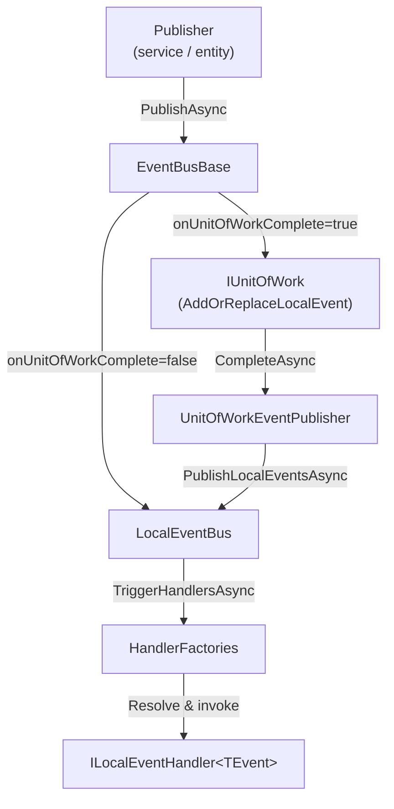

The Local Event Bus is an in-process, synchronous-dispatch event bus. It is the right tool for domain events that must be handled within the same transaction as the operation that raised them — for example, updating a read-model table or sending a notification after a domain aggregate commits. Because it is entirely in-memory, there is no serialization, no broker, and no retry infrastructure.

## Architecture Overview



## `LocalEventBus` Implementation

`LocalEventBus` is a **singleton** (`ISingletonDependency`) registered under both `ILocalEventBus` and `LocalEventBus`. It extends the abstract `EventBusBase` class and stores handler factories in two `ConcurrentDictionary` maps:

```csharp
[ExposeServices(typeof(ILocalEventBus), typeof(LocalEventBus))]
public class LocalEventBus : EventBusBase, ILocalEventBus, ISingletonDependency
{
    // Strongly-typed handlers: event CLR type → list of factories
    protected ConcurrentDictionary<Type, List<IEventHandlerFactory>> HandlerFactories { get; }

    // Name → CLR type map for lookup by string event name
    protected ConcurrentDictionary<string, Type> EventTypes { get; }

    // Dynamic (string-keyed) handlers: event name → list of factories
    protected ConcurrentDictionary<string, List<IEventHandlerFactory>> DynamicEventHandlerFactories { get; }
}
```

The constructor subscribes all handlers declared in `AbpLocalEventBusOptions.Handlers` at startup:

```csharp
public LocalEventBus(
    IOptions<AbpLocalEventBusOptions> options,
    IServiceScopeFactory serviceScopeFactory,
    ICurrentTenant currentTenant,
    IUnitOfWorkManager unitOfWorkManager,
    IEventHandlerInvoker eventHandlerInvoker)
    : base(serviceScopeFactory, currentTenant, unitOfWorkManager, eventHandlerInvoker)
{
    Options = options.Value;
    HandlerFactories = new ConcurrentDictionary<Type, List<IEventHandlerFactory>>();
    EventTypes = new ConcurrentDictionary<string, Type>();
    DynamicEventHandlerFactories = new ConcurrentDictionary<string, List<IEventHandlerFactory>>();
    SubscribeHandlers(Options.Handlers);
}
```

## Handler Registration

### Interface-based (recommended)

Implement `ILocalEventHandler<TEvent>` and register the handler type in `AbpLocalEventBusOptions`:

```csharp
// Handler class
public class OrderCreatedEventHandler
    : ILocalEventHandler<OrderCreatedEto>, ITransientDependency
{
    public async Task HandleEventAsync(OrderCreatedEto eventData)
    {
        // handle the event
    }
}

// Module configuration
Configure<AbpLocalEventBusOptions>(options =>
{
    options.Handlers.Add<OrderCreatedEventHandler>();
});
```

ABP's conventional registrar also discovers `ILocalEventHandler<TEvent>` implementations automatically if they are transient/scoped dependencies in the DI container.

### Lambda subscription

For programmatic subscriptions (useful in tests or dynamic scenarios):

```csharp
IDisposable subscription = localEventBus.Subscribe<OrderCreatedEto>(async eventData =>
{
    // handle inline
});

// Later, to unsubscribe:
subscription.Dispose();
```

Lambda subscriptions are stored as `SingleInstanceHandlerFactory` wrapping an `ActionEventHandler<TEvent>`.

### `Subscribe` implementation

```csharp
public override IDisposable Subscribe(Type eventType, IEventHandlerFactory factory)
{
    EventTypes.GetOrAdd(EventNameAttribute.GetNameOrDefault(eventType), eventType);

    GetOrCreateHandlerFactories(eventType)
        .Locking(factories =>
        {
            if (!factory.IsInFactories(factories))
            {
                factories.Add(factory);
            }
        });

    return new EventHandlerFactoryUnregistrar(this, eventType, factory);
}
```

The `Locking` extension method acquires a `Monitor` lock on the list before mutation — providing thread-safety for the inner `List<IEventHandlerFactory>` (the outer `ConcurrentDictionary` only guarantees atomic key-level access).

## `[EventName]` Attribute

`EventNameAttribute` provides an override for the string name used when publishing or subscribing by name. By default the name is the full CLR type name:

```csharp
[EventName("Orders.Created")]
public class OrderCreatedEto
{
    public Guid OrderId { get; set; }
}
```

The `EventTypes` dictionary maps this string name to the CLR type, enabling dynamic subscribers (using `Subscribe(string eventName, ...)`) to receive strongly-typed dispatches.

## Handler Invocation Order

`LocalEventHandlerOrderAttribute` controls the order in which handlers are called for the same event type. Lower `Order` values execute first:

```csharp
[LocalEventHandlerOrder(-1)]   // runs before default (0) handlers
public class PriorityHandler : ILocalEventHandler<OrderCreatedEto> { ... }
```

`GetHandlerFactories` sorts handlers before returning them:

```csharp
protected override IEnumerable<EventTypeWithEventHandlerFactories> GetHandlerFactories(Type eventType)
{
    var handlerFactoryList = new List<Tuple<IEventHandlerFactory, Type, int>>();

    foreach (var handlerFactory in HandlerFactories.Where(
        hf => ShouldTriggerEventForHandler(eventType, hf.Key)))
    {
        foreach (var factory in handlerFactory.Value)
        {
            handlerFactoryList.Add(new Tuple<IEventHandlerFactory, Type, int>(
                factory,
                handlerFactory.Key,
                ReflectionHelper.GetAttributesOfMemberOrDeclaringType<LocalEventHandlerOrderAttribute>(
                    factory.GetHandler().EventHandler.GetType())
                    .FirstOrDefault()?.Order ?? 0));
        }
    }

    return handlerFactoryList
        .OrderBy(x => x.Item3)
        .Select(x => new EventTypeWithEventHandlerFactories(
            x.Item2, new List<IEventHandlerFactory> { x.Item1 }))
        .ToArray();
}
```

Handlers with the same order value execute in registration order (first-registered, first-invoked).

## Transactional Publishing via `UnitOfWorkEventPublisher`

When `PublishAsync` is called with `onUnitOfWorkComplete: true` (the default) and a UoW is active, the event is **held** in the UoW rather than immediately dispatched:

```csharp
// In EventBusBase
protected override void AddToUnitOfWork(IUnitOfWork unitOfWork, UnitOfWorkEventRecord eventRecord)
{
    unitOfWork.AddOrReplaceLocalEvent(eventRecord);
}
```

At `UnitOfWork.CompleteAsync`, `UnitOfWorkEventPublisher.PublishLocalEventsAsync` drains the queue and dispatches each held event in `EventOrder` sequence:

```csharp
public class UnitOfWorkEventPublisher : IUnitOfWorkEventPublisher, ITransientDependency
{
    public async Task PublishLocalEventsAsync(IEnumerable<UnitOfWorkEventRecord> localEvents)
    {
        foreach (var localEvent in localEvents)
        {
            await _localEventBus.PublishAsync(
                localEvent.EventType,
                localEvent.EventData,
                onUnitOfWorkComplete: false  // bypass UoW check to avoid infinite loop
            );
        }
    }
}
```

This is the key guarantee: **a local event handler runs only after the database transaction commits**. If the UoW rolls back, the events are discarded.

### Event deduplication with replacement predicates

`AddOrReplaceLocalEvent` accepts an optional `Predicate<UnitOfWorkEventRecord>` that identifies a prior record to replace:

```csharp
unitOfWork.AddOrReplaceLocalEvent(
    new UnitOfWorkEventRecord(typeof(StockChangedEto), newData, order),
    existingRecord => existingRecord.EventType == typeof(StockChangedEto)
                      && ((StockChangedEto)existingRecord.EventData).ProductId == productId
);
```

This prevents duplicate events when the same aggregate is modified multiple times inside a single UoW.

## Subtype Matching

`ShouldTriggerEventForHandler` checks both exact type equality and `IsAssignableFrom`, so a handler registered for a base class or interface will receive events published with a derived type:

```csharp
private static bool ShouldTriggerEventForHandler(Type targetEventType, Type handlerEventType)
{
    if (handlerEventType == targetEventType) return true;
    if (handlerEventType.IsAssignableFrom(targetEventType)) return true;
    return false;
}
```

## Thread Safety

| Structure | Thread-safety mechanism |
|---|---|
| `HandlerFactories` (`ConcurrentDictionary`) | Concurrent reads; inner `List` protected by `.Locking()` (Monitor lock) |
| `EventTypes` (`ConcurrentDictionary`) | Full concurrent access via `GetOrAdd` |
| `DynamicEventHandlerFactories` (`ConcurrentDictionary`) | Same as `HandlerFactories` |
| Event dispatch (`TriggerHandlersAsync`) | Reads a snapshot of handler factories; concurrent publishes do not interfere |

<Note>
`LocalEventBus` is a singleton but dispatches handlers by resolving a new DI scope per handler invocation (done inside `EventBusBase.TriggerHandlersAsync`). Transient and scoped handlers are correctly disposed after each invocation.
</Note>

<Tip>
To test local event handling in isolation, use `ILocalEventBus` directly in integration tests. ABP's test infrastructure registers a real `LocalEventBus` singleton so you can verify that the correct events were published and handled within the same test transaction.
</Tip>
