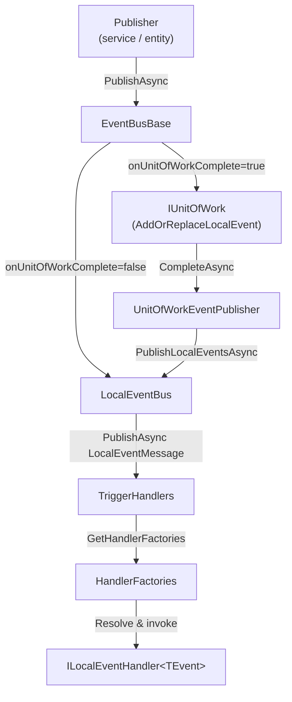

The Local Event Bus is an in-process, synchronous-dispatch event bus. It is the right tool for domain events that must be handled within the same transaction as the operation that raised them — for example, updating a read-model table or sending a notification after a domain aggregate commits. Because it is entirely in-memory, there is no serialization, no broker, and no retry infrastructure.

## Architecture Overview



## File Inventory

| File | Role |
|---|---|
| `Volo.Abp.EventBus.Abstractions` / `IEventBus.cs` | Root interface with all Subscribe/Unsubscribe/PublishAsync overloads |
| `Volo.Abp.EventBus.Abstractions` / `Local/ILocalEventBus.cs` | Extends `IEventBus` with `Subscribe<TEvent>(ILocalEventHandler<TEvent>)`, `GetEventHandlerFactories`, `GetDynamicEventHandlerFactories` |
| `Volo.Abp.EventBus.Abstractions` / `Local/ILocalEventHandler.cs` | `ILocalEventHandler<TEvent>` with `HandleEventAsync(TEvent)` |
| `Volo.Abp.EventBus.Abstractions` / `Local/LocalEventHandlerOrderAttribute.cs` | Controls execution order via integer `Order` property |
| `Volo.Abp.EventBus.Abstractions` / `EventNameAttribute.cs` | Overrides the string name used for publish/subscribe |
| `Volo.Abp.EventBus` / `EventBusBase.cs` | Abstract base: UoW integration, `TriggerHandlersAsync`, `SubscribeHandlers` |
| `Volo.Abp.EventBus` / `Local/LocalEventBus.cs` | Concrete singleton: three `ConcurrentDictionary` stores, handler sorting |
| `Volo.Abp.EventBus` / `Local/LocalEventMessage.cs` | Envelope (`MessageId`, `EventData`, `EventType`) passed to `PublishAsync(LocalEventMessage)` |
| `Volo.Abp.EventBus` / `UnitOfWorkEventPublisher.cs` | Drains the UoW queue at commit time for both local and distributed events |
| `Volo.Abp.EventBus` / `AbpEventBusModule.cs` | DI auto-registration of `ILocalEventHandler<>` implementations into `AbpLocalEventBusOptions` |

## `LocalEventBus` Implementation

`LocalEventBus` is a **singleton** (`ISingletonDependency`) registered under both `ILocalEventBus` and `LocalEventBus`. It extends the abstract `EventBusBase` class and stores handler factories in three `ConcurrentDictionary` maps:

```csharp
[ExposeServices(typeof(ILocalEventBus), typeof(LocalEventBus))]
public class LocalEventBus : EventBusBase, ILocalEventBus, ISingletonDependency
{
    // Strongly-typed handlers: event CLR type → list of factories
    protected ConcurrentDictionary<Type, List<IEventHandlerFactory>> HandlerFactories { get; }

    // Name → CLR type map for lookup by string event name
    protected ConcurrentDictionary<string, Type> EventTypes { get; }

    // Dynamic (string-keyed) handlers: event name → list of factories
    protected ConcurrentDictionary<string, List<IEventHandlerFactory>> DynamicEventHandlerFactories { get; }
}
```

The constructor subscribes all handlers declared in `AbpLocalEventBusOptions.Handlers` at startup:

```csharp
public LocalEventBus(
    IOptions<AbpLocalEventBusOptions> options,
    IServiceScopeFactory serviceScopeFactory,
    ICurrentTenant currentTenant,
    IUnitOfWorkManager unitOfWorkManager,
    IEventHandlerInvoker eventHandlerInvoker)
    : base(serviceScopeFactory, currentTenant, unitOfWorkManager, eventHandlerInvoker)
{
    Options = options.Value;
    Logger = NullLogger<LocalEventBus>.Instance;
    HandlerFactories = new ConcurrentDictionary<Type, List<IEventHandlerFactory>>();
    EventTypes = new ConcurrentDictionary<string, Type>();
    DynamicEventHandlerFactories = new ConcurrentDictionary<string, List<IEventHandlerFactory>>();
    SubscribeHandlers(Options.Handlers);
}
```

`AbpEventBusModule.PreConfigureServices` uses `services.OnRegistered` to collect every type that implements `ILocalEventHandler<>` and adds it to `AbpLocalEventBusOptions.Handlers`, so explicit `options.Handlers.Add<T>()` calls are only needed when the handler is **not** a DI-registered type.

## `ILocalEventBus` Interface

```csharp
public interface ILocalEventBus : IEventBus
{
    IDisposable Subscribe<TEvent>(ILocalEventHandler<TEvent> handler)
        where TEvent : class;

    List<EventTypeWithEventHandlerFactories> GetEventHandlerFactories(Type eventType);

    List<EventTypeWithEventHandlerFactories> GetDynamicEventHandlerFactories(string eventName);
}
```

The `GetEventHandlerFactories` and `GetDynamicEventHandlerFactories` methods expose the sorted factory lists for inspection (used in tests and diagnostics).

## Handler Registration

### Interface-based (recommended)

Implement `ILocalEventHandler<TEvent>` and register it as a transient DI service:

```csharp
// Handler class (auto-discovered by AbpEventBusModule)
public class OrderCreatedEventHandler
    : ILocalEventHandler<OrderCreatedEto>, ITransientDependency
{
    public async Task HandleEventAsync(OrderCreatedEto eventData)
    {
        // handle the event
    }
}
```

Because `AbpEventBusModule` automatically discovers handlers, no extra configuration is needed. You can still add a handler explicitly:

```csharp
Configure<AbpLocalEventBusOptions>(options =>
{
    options.Handlers.Add<OrderCreatedEventHandler>();
});
```

### Lambda subscription

For programmatic subscriptions (useful in tests or dynamic scenarios):

```csharp
IDisposable subscription = localEventBus.Subscribe<OrderCreatedEto>(async eventData =>
{
    // handle inline
});

// Later, to unsubscribe:
subscription.Dispose();
```

Lambda subscriptions are stored as `SingleInstanceHandlerFactory` wrapping an `ActionEventHandler<TEvent>`.

### `Subscribe(Type, IEventHandlerFactory)` implementation

```csharp
public override IDisposable Subscribe(Type eventType, IEventHandlerFactory factory)
{
    EventTypes.GetOrAdd(EventNameAttribute.GetNameOrDefault(eventType), eventType);

    GetOrCreateHandlerFactories(eventType)
        .Locking(factories =>
        {
            if (!factory.IsInFactories(factories))
            {
                factories.Add(factory);
            }
        });

    return new EventHandlerFactoryUnregistrar(this, eventType, factory);
}
```

The `Locking` extension method acquires a `Monitor` lock on the list before mutation — providing thread-safety for the inner `List<IEventHandlerFactory>` (the outer `ConcurrentDictionary` only guarantees atomic key-level access).

### Dynamic (string-name) subscriptions

`Subscribe(string eventName, IEventHandlerFactory handler)` populates `DynamicEventHandlerFactories` and returns a `DynamicEventHandlerFactoryUnregistrar`:

```csharp
public override IDisposable Subscribe(string eventName, IEventHandlerFactory handler)
{
    GetOrCreateDynamicHandlerFactories(eventName).Locking(factories =>
    {
        if (!handler.IsInFactories(factories))
        {
            factories.Add(handler);
        }
    });

    return new DynamicEventHandlerFactoryUnregistrar(this, eventName, handler);
}
```

Dynamic subscriptions are useful for cross-cutting concerns (e.g., an audit logger that subscribes to all events by name) and for receiving events whose CLR type is not available at compile time.

## `[EventName]` Attribute

`EventNameAttribute` provides an override for the string name used when publishing or subscribing by name. By default the name is the full CLR type name (`FullName`):

```csharp
[EventName("Orders.Created")]
public class OrderCreatedEto
{
    public Guid OrderId { get; set; }
}
```

The `EventTypes` dictionary maps this string name to the CLR type, enabling dynamic subscribers to receive the same event as typed handlers. `EventNameAttribute.GetNameOrDefault(Type)` falls back to `eventType.FullName` when no attribute is present.

## Handler Invocation Order

`LocalEventHandlerOrderAttribute` controls the order in which handlers are called for the same event type. Lower `Order` values execute first (ascending sort):

```csharp
[LocalEventHandlerOrder(-1)]   // runs before default (0) handlers
public class PriorityHandler : ILocalEventHandler<OrderCreatedEto>, ITransientDependency { ... }

[LocalEventHandlerOrder(10)]   // runs after default (0) handlers
public class AuditHandler : ILocalEventHandler<OrderCreatedEto>, ITransientDependency { ... }
```

`GetHandlerFactories` collects factories from both `HandlerFactories` and `DynamicEventHandlerFactories`, attaches the `Order` value from `LocalEventHandlerOrderAttribute` (defaulting to 0), then sorts by order before returning:

```csharp
protected override IEnumerable<EventTypeWithEventHandlerFactories> GetHandlerFactories(Type eventType)
{
    var handlerFactoryList = new List<Tuple<IEventHandlerFactory, Type, int>>();
    var eventNames = EventTypes.Where(x => ShouldTriggerEventForHandler(eventType, x.Value))
        .Select(x => x.Key).ToList();

    // Strongly-typed handlers
    foreach (var handlerFactory in HandlerFactories.Where(hf => ShouldTriggerEventForHandler(eventType, hf.Key)))
    {
        foreach (var factory in handlerFactory.Value)
        {
            handlerFactoryList.Add(new Tuple<IEventHandlerFactory, Type, int>(
                factory,
                handlerFactory.Key,
                ReflectionHelper.GetAttributesOfMemberOrDeclaringType<LocalEventHandlerOrderAttribute>(
                    factory.GetHandler().EventHandler.GetType())
                    .FirstOrDefault()?.Order ?? 0));
        }
    }

    // Dynamic (string-name) handlers that match any of the resolved event names
    foreach (var handlerFactory in DynamicEventHandlerFactories.Where(aehf => eventNames.Contains(aehf.Key)))
    {
        foreach (var factory in handlerFactory.Value)
        {
            handlerFactoryList.Add(new Tuple<IEventHandlerFactory, Type, int>(
                factory,
                typeof(DynamicEventData),
                ReflectionHelper.GetAttributesOfMemberOrDeclaringType<LocalEventHandlerOrderAttribute>(
                    factory.GetHandler().EventHandler.GetType())
                    .FirstOrDefault()?.Order ?? 0));
        }
    }

    return handlerFactoryList
        .OrderBy(x => x.Item3)
        .Select(x => new EventTypeWithEventHandlerFactories(
            x.Item2, new List<IEventHandlerFactory> { x.Item1 }))
        .ToArray();
}
```

Handlers with the same order value execute in registration order (first-registered, first-invoked).

## Publish Flow

`EventBusBase.PublishAsync` wraps every publish call:

```csharp
public virtual async Task PublishAsync(Type eventType, object eventData, bool onUnitOfWorkComplete = true)
{
    if (onUnitOfWorkComplete && UnitOfWorkManager.Current != null)
    {
        AddToUnitOfWork(
            UnitOfWorkManager.Current,
            new UnitOfWorkEventRecord(eventType, eventData, EventOrderGenerator.GetNext())
        );
        return;
    }

    await PublishToEventBusAsync(eventType, eventData);
}
```

`LocalEventBus.PublishToEventBusAsync` wraps the data in a `LocalEventMessage` and calls `TriggerHandlersAsync`:

```csharp
protected override async Task PublishToEventBusAsync(Type eventType, object eventData)
{
    await PublishAsync(new LocalEventMessage(Guid.NewGuid(), eventData, eventType));
}

public virtual async Task PublishAsync(LocalEventMessage localEventMessage)
{
    await TriggerHandlersAsync(localEventMessage.EventType, localEventMessage.EventData);
}
```

## Transactional Publishing via `UnitOfWorkEventPublisher`

When `PublishAsync` is called with `onUnitOfWorkComplete: true` (the default) and a UoW is active, the event is **held** in the UoW rather than immediately dispatched:

```csharp
// In LocalEventBus
protected override void AddToUnitOfWork(IUnitOfWork unitOfWork, UnitOfWorkEventRecord eventRecord)
{
    unitOfWork.AddOrReplaceLocalEvent(eventRecord);
}
```

At `UnitOfWork.CompleteAsync`, `UnitOfWorkEventPublisher.PublishLocalEventsAsync` drains the queue and dispatches each held event in `EventOrder` sequence:

```csharp
[Dependency(ReplaceServices = true)]
public class UnitOfWorkEventPublisher : IUnitOfWorkEventPublisher, ITransientDependency
{
    public async Task PublishLocalEventsAsync(IEnumerable<UnitOfWorkEventRecord> localEvents)
    {
        foreach (var localEvent in localEvents)
        {
            await _localEventBus.PublishAsync(
                localEvent.EventType,
                localEvent.EventData,
                onUnitOfWorkComplete: false  // bypass UoW check to avoid infinite loop
            );
        }
    }

    public async Task PublishDistributedEventsAsync(IEnumerable<UnitOfWorkEventRecord> distributedEvents)
    {
        foreach (var distributedEvent in distributedEvents)
        {
            await _distributedEventBus.PublishAsync(
                distributedEvent.EventType,
                distributedEvent.EventData,
                onUnitOfWorkComplete: false,
                useOutbox: distributedEvent.UseOutbox
            );
        }
    }
}
```

This is the key guarantee: **a local event handler runs only after the database transaction commits**. If the UoW rolls back, the events are discarded because the `UnitOfWorkEventRecord` objects are held only in memory.

### Event deduplication with replacement predicates

`AddOrReplaceLocalEvent` accepts an optional `Predicate<UnitOfWorkEventRecord>` that identifies a prior record to replace, preventing duplicate events when the same aggregate is modified multiple times inside a single UoW:

```csharp
unitOfWork.AddOrReplaceLocalEvent(
    new UnitOfWorkEventRecord(typeof(StockChangedEto), newData, order),
    existingRecord => existingRecord.EventType == typeof(StockChangedEto)
                      && ((StockChangedEto)existingRecord.EventData).ProductId == productId
);
```

## Subtype Matching

`ShouldTriggerEventForHandler` checks both exact type equality and `IsAssignableFrom`, so a handler registered for a base class or interface will receive events published with a derived type:

```csharp
private static bool ShouldTriggerEventForHandler(Type targetEventType, Type handlerEventType)
{
    if (handlerEventType == targetEventType) return true;
    if (handlerEventType.IsAssignableFrom(targetEventType)) return true;
    return false;
}
```

## Dynamic Event Publishing

`PublishAsync(string eventName, object eventData, bool onUnitOfWorkComplete)` resolves the CLR type from `EventTypes`. If a type is found, it converts the data and re-publishes as strongly typed; otherwise it publishes a `DynamicEventData` envelope:

```csharp
public override Task PublishAsync(string eventName, object eventData, bool onUnitOfWorkComplete = true)
{
    var eventType = EventTypes.GetOrDefault(eventName);
    var dynamicEventData = eventData as DynamicEventData ?? new DynamicEventData(eventName, eventData);

    if (eventType != null)
    {
        return PublishAsync(eventType, ConvertDynamicEventData(dynamicEventData.Data, eventType), onUnitOfWorkComplete);
    }

    return PublishAsync(typeof(DynamicEventData), dynamicEventData, onUnitOfWorkComplete);
}
```

`DynamicEventData` carries both an `EventName` string and an opaque `Data` object, allowing handlers that implement `ILocalEventHandler<DynamicEventData>` to receive untyped payloads.

## Thread Safety

| Structure | Thread-safety mechanism |
|---|---|
| `HandlerFactories` (`ConcurrentDictionary`) | Concurrent reads; inner `List` protected by `.Locking()` (Monitor lock) |
| `EventTypes` (`ConcurrentDictionary`) | Full concurrent access via `GetOrAdd` |
| `DynamicEventHandlerFactories` (`ConcurrentDictionary`) | Same as `HandlerFactories` |
| Event dispatch (`TriggerHandlersAsync`) | Reads a snapshot of handler factories; concurrent publishes do not interfere |

<Note>
`LocalEventBus` is a singleton but dispatches handlers by resolving a new DI scope per handler invocation (done inside `EventBusBase.TriggerHandlerAsync`). Transient and scoped handlers are correctly disposed after each invocation.
</Note>

<Tip>
To test local event handling in isolation, use `ILocalEventBus` directly in integration tests. ABP's test infrastructure registers a real `LocalEventBus` singleton so you can verify that the correct events were published and handled within the same test transaction.
</Tip>
