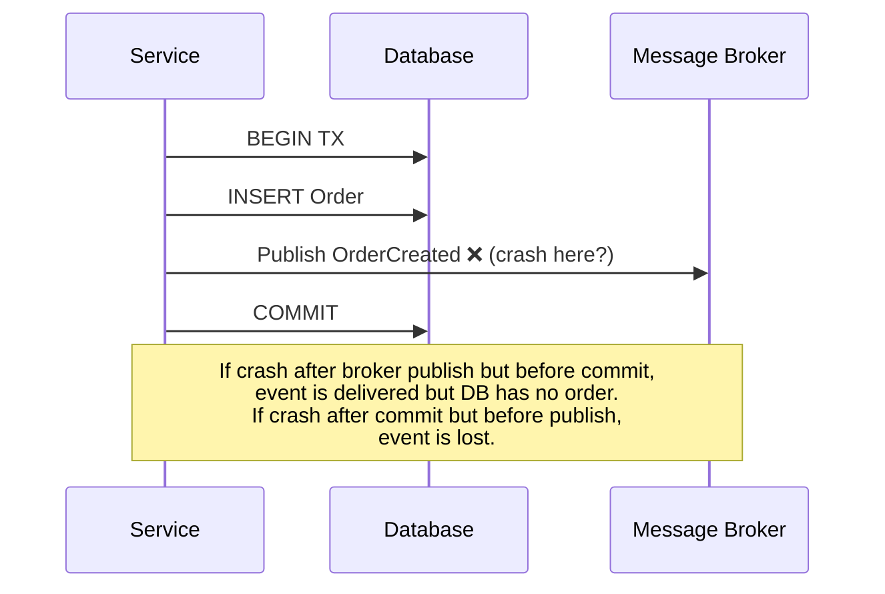
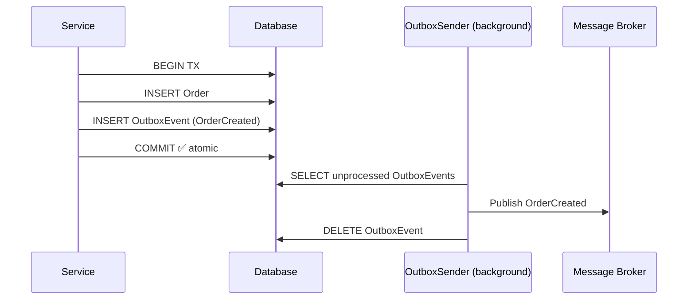
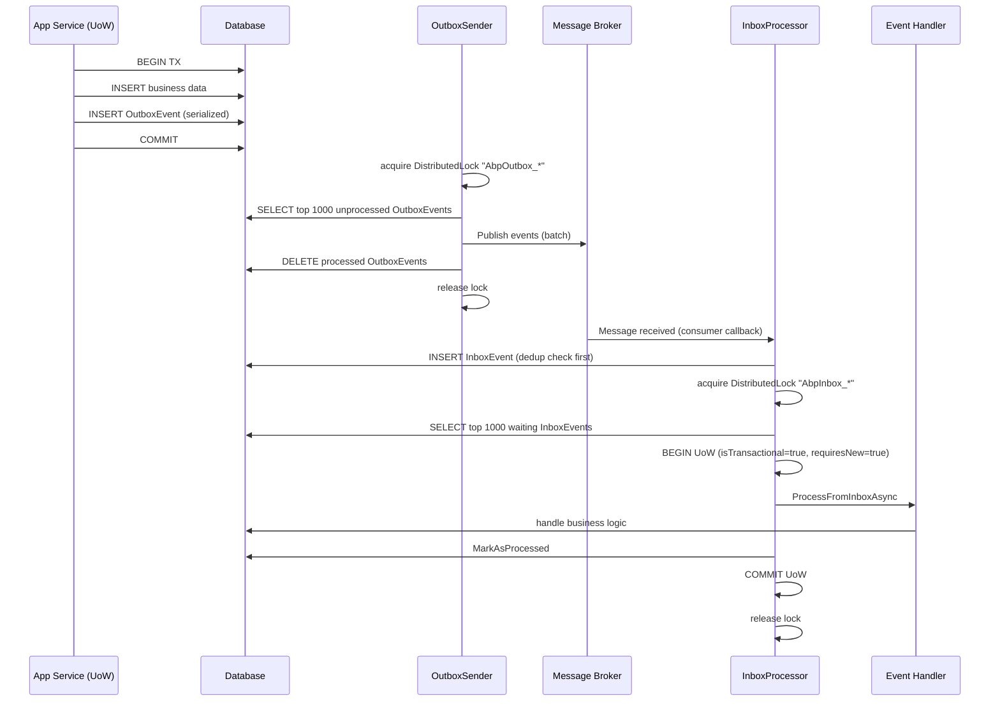

The dual-write problem in distributed systems occurs when a service needs to both commit a database change and publish an event to a message broker atomically — but neither operation can participate in the other's transaction. ABP solves this with the Transactional Outbox/Inbox pattern: events are persisted in the same database transaction as business data, then a background worker relays them to the broker.

## The Dual-Write Problem



With the Outbox pattern, the broker publish is replaced by a database write inside the same transaction:



## Outbox Configuration

Configure outboxes in your module's `ConfigureServices`:

```csharp
Configure<AbpDistributedEventBusOptions>(options =>
{
    options.Outboxes.Configure<MyProjectDbContext>(outbox =>
    {
        outbox.IsSameDatabase = true;
        // Optionally limit which event types use this outbox:
        outbox.Selector = type => type.Namespace!.StartsWith("MyProject.Orders");
    });
});
```

Inbox configuration is symmetric:

```csharp
Configure<AbpDistributedEventBusOptions>(options =>
{
    options.Inboxes.Configure<MyProjectDbContext>(inbox =>
    {
        inbox.IsSameDatabase = true;
        inbox.EventSelector = type => type.Namespace!.StartsWith("MyProject.Orders");
    });
});
```

## `IEventOutbox` and `IEventInbox`

Both are generic interfaces resolved from the UoW's `ServiceProvider` or a fresh DI scope. Their concrete implementations are provided by the persistence module (EF Core or MongoDB):

| Interface | EF Core implementation | MongoDB implementation |
|---|---|---|
| `IEventOutbox` | `EfCoreEventOutbox<TDbContext>` | `MongoDbContextEventOutbox<TDbContext>` |
| `IEventInbox` | `EfCoreEventInbox<TDbContext>` | `MongoDbContextEventInbox<TDbContext>` |

Key methods on `IEventOutbox`:

```csharp
Task EnqueueAsync(OutgoingEventInfo eventInfo);
Task<List<OutgoingEventInfo>> GetWaitingEventsAsync(
    int maxCount,
    Expression<Func<IOutgoingEventInfo, bool>>? filter,
    CancellationToken cancellationToken);
Task DeleteAsync(Guid id);
Task DeleteManyAsync(Guid[] ids);
```

Key methods on `IEventInbox`:

```csharp
Task EnqueueAsync(IncomingEventInfo eventInfo);
Task<bool> ExistsByMessageIdAsync(string messageId);
Task<List<IncomingEventInfo>> GetWaitingEventsAsync(
    int maxCount,
    Expression<Func<IIncomingEventInfo, bool>>? filter,
    CancellationToken cancellationToken);
Task MarkAsProcessedAsync(Guid id);
Task MarkAsDiscardAsync(Guid id);
Task RetryLaterAsync(Guid id, int retryCount, DateTime? nextRetryTime);
Task DeleteOldEventsAsync();
```

## How Events Enter the Outbox

When `IDistributedEventBus.PublishAsync` is called with `useOutbox: true` and a UoW is active, `DistributedEventBusBase.AddToOutboxAsync` writes an `OutgoingEventInfo` row inside the current UoW's transaction:

```csharp
protected virtual async Task<bool> AddToOutboxAsync(Type eventType, object eventData)
{
    var unitOfWork = UnitOfWorkManager.Current;
    if (unitOfWork == null) return false;

    foreach (var outboxConfig in AbpDistributedEventBusOptions.Outboxes.Values
        .OrderBy(x => x.Selector is null))
    {
        if (outboxConfig.Selector == null || outboxConfig.Selector(eventType))
        {
            var eventOutbox = (IEventOutbox)unitOfWork.ServiceProvider
                .GetRequiredService(outboxConfig.ImplementationType);

            (var eventName, eventData) = ResolveEventForPublishing(eventType, eventData);

            var outgoingEventInfo = new OutgoingEventInfo(
                GuidGenerator.Create(),
                eventName,
                Serialize(eventData),
                Clock.Now
            );

            var correlationId = CorrelationIdProvider.Get();
            if (correlationId != null)
                outgoingEventInfo.SetCorrelationId(correlationId);

            await eventOutbox.EnqueueAsync(outgoingEventInfo);
            return true;
        }
    }

    return false;
}
```

If the UoW rolls back, the `OutgoingEventInfo` row is never committed — the event is silently discarded. If the UoW commits, the row is persisted and will be picked up by `OutboxSender`.

## `OutboxSender` — Background Worker

`OutboxSender` is a transient background worker started by `AbpEventBusHostedService` (one instance per configured outbox). It uses `AbpAsyncTimer` to poll on a configurable interval:

```csharp
public class OutboxSender : IOutboxSender, ITransientDependency
{
    protected AbpAsyncTimer Timer { get; }
    protected IAbpDistributedLock DistributedLock { get; }
    protected AbpEventBusBoxesOptions EventBusBoxesOptions { get; }
    protected string DistributedLockName { get; set; } = default!;

    public virtual Task StartAsync(OutboxConfig outboxConfig, CancellationToken cancellationToken = default)
    {
        OutboxConfig = outboxConfig;
        Outbox = (IEventOutbox)ServiceProvider
            .GetRequiredService(outboxConfig.ImplementationType);
        DistributedLockName = $"AbpOutbox_{OutboxConfig.DatabaseName}";
        Timer.Period = Convert.ToInt32(EventBusBoxesOptions.PeriodTimeSpan.TotalMilliseconds);
        Timer.Start(cancellationToken);
        return Task.CompletedTask;
    }
}
```

### Polling loop

```csharp
protected virtual async Task RunAsync()
{
    await using (var handle = await DistributedLock
        .TryAcquireAsync(DistributedLockName, cancellationToken: StoppingToken))
    {
        if (handle != null)
        {
            while (true)
            {
                var waitingEvents = await GetWaitingEventsAsync();
                if (waitingEvents.Count <= 0) break;

                if (EventBusBoxesOptions.BatchPublishOutboxEvents)
                    await PublishOutgoingMessagesInBatchAsync(waitingEvents);
                else
                    await PublishOutgoingMessagesAsync(waitingEvents);
            }
        }
        else
        {
            // Another instance holds the lock — back off
            await Task.Delay(EventBusBoxesOptions.DistributedLockWaitDuration, StoppingToken);
        }
    }
}
```

The distributed lock (`"AbpOutbox_{DatabaseName}"`) ensures that in a multi-instance deployment, only one instance processes the outbox at a time, preventing duplicate broker publishes.

### Batch vs single publishing

| Mode | Behavior |
|---|---|
| `BatchPublishOutboxEvents = true` (default) | Calls `PublishManyFromOutboxAsync` + bulk `DeleteManyAsync`. More efficient for high-throughput. |
| `BatchPublishOutboxEvents = false` | Publishes and deletes one event at a time. More resilient to partial failures. |

## `InboxProcessor` — Background Worker

`InboxProcessor` is symmetric to `OutboxSender`. It polls the inbox table, processes each event in an independent transactional UoW, and marks it processed:

```csharp
protected virtual async Task RunAsync()
{
    await using (var handle = await DistributedLock
        .TryAcquireAsync(DistributedLockName, cancellationToken: StoppingToken))
    {
        if (handle != null)
        {
            await DeleteOldEventsAsync();

            while (true)
            {
                var waitingEvents = await GetWaitingEventsAsync();
                if (waitingEvents.Count <= 0) break;

                foreach (var waitingEvent in waitingEvents)
                {
                    using (var uow = UnitOfWorkManager.Begin(
                        isTransactional: true, requiresNew: true))
                    {
                        await DistributedEventBus
                            .AsSupportsEventBoxes()
                            .ProcessFromInboxAsync(waitingEvent, InboxConfig);

                        await Inbox.MarkAsProcessedAsync(waitingEvent.Id);
                        await uow.CompleteAsync(StoppingToken);
                    }
                }
            }
        }
    }
}
```

Each event is processed in its own `requiresNew: true` UoW, so a handler failure does not roll back previously processed events.

### How events enter the Inbox

When a broker message arrives, the provider implementation calls `DistributedEventBusBase.AddToInboxAsync`:

```csharp
protected virtual async Task<bool> AddToInboxAsync(
    string? messageId,
    string eventName,
    Type eventType,
    object eventData,
    string? correlationId)
{
    foreach (var inboxConfig in AbpDistributedEventBusOptions.Inboxes.Values
        .OrderBy(x => x.EventSelector is null))
    {
        if (inboxConfig.EventSelector == null || inboxConfig.EventSelector(eventType))
        {
            var eventInbox = (IEventInbox)scope.ServiceProvider
                .GetRequiredService(inboxConfig.ImplementationType);

            // Deduplication: skip if already seen this messageId
            if (!messageId.IsNullOrEmpty() &&
                await eventInbox.ExistsByMessageIdAsync(messageId!))
                continue;

            var incomingEventInfo = new IncomingEventInfo(
                GuidGenerator.Create(),
                messageId!,
                eventName,
                Serialize(eventData),
                Clock.Now
            );
            incomingEventInfo.SetCorrelationId(correlationId!);
            await eventInbox.EnqueueAsync(incomingEventInfo);
        }
    }
    return true;
}
```

The `ExistsByMessageIdAsync` check provides **idempotency** at the inbox level: if the broker redelivers a message (e.g., after a network partition), the inbox ignores the duplicate.

## Failure Policies for Inbox Processing

`AbpEventBusBoxesOptions.InboxProcessorFailurePolicy` governs what happens when a handler throws:

```csharp
public enum InboxProcessorFailurePolicy
{
    Retry,       // Re-throw; timer will retry on next tick
    RetryLater,  // Exponential back-off; max retries before discard
    Discard      // Mark as discarded immediately
}
```

### `RetryLater` back-off calculation

```csharp
protected virtual DateTime? GetNextRetryTime(int retryCount, double factor)
{
    var delaySeconds = factor * Math.Pow(2, retryCount);
    return DateTime.Now.AddSeconds(delaySeconds);
}
```

With default `InboxProcessorRetryBackoffFactor = 10`:
- Retry 0 → 10 s
- Retry 1 → 20 s
- Retry 2 → 40 s
- Retry 9 → 5120 s (~85 min)

After `InboxProcessorMaxRetryCount` (default: 10) exhausted retries, the event is marked `Discarded`:

```csharp
if (waitingEvent.RetryCount >= EventBusBoxesOptions.InboxProcessorMaxRetryCount)
{
    await Inbox.RetryLaterAsync(waitingEvent.Id, waitingEvent.RetryCount, null);
    await Inbox.MarkAsDiscardAsync(waitingEvent.Id);
    await uow.CompleteAsync(StoppingToken);
    continue;
}
```

## `AbpEventBusBoxesOptions` Reference

```csharp
public class AbpEventBusBoxesOptions
{
    // How often OutboxSender / InboxProcessor poll (default: 2 seconds)
    public TimeSpan PeriodTimeSpan { get; set; }

    // Max events fetched per poll cycle (default: 1000)
    public int OutboxWaitingEventMaxCount { get; set; }
    public int InboxWaitingEventMaxCount { get; set; }

    // Optional LINQ filter to process only a subset of events
    public Expression<Func<IOutgoingEventInfo, bool>>? OutboxProcessorFilter { get; set; }
    public Expression<Func<IIncomingEventInfo, bool>>? InboxProcessorFilter { get; set; }

    // Distributed lock back-off when lock unavailable (default: 15 seconds)
    public TimeSpan DistributedLockWaitDuration { get; set; }

    // Inbox failure handling
    public InboxProcessorFailurePolicy InboxProcessorFailurePolicy { get; set; }
    public int InboxProcessorMaxRetryCount { get; set; }     // default: 10
    public double InboxProcessorRetryBackoffFactor { get; set; } // default: 10

    // How often old processed inbox events are cleaned up (default: 6 hours)
    public TimeSpan CleanOldEventTimeIntervalSpan { get; set; }

    // How long to retain processed inbox events before deletion (default: 2 hours)
    public TimeSpan WaitTimeToDeleteProcessedInboxEvents { get; set; }

    // Whether to batch publish from outbox (default: true)
    public bool BatchPublishOutboxEvents { get; set; }
}
```

## Complete Flow Diagram



<Warning>
The Outbox/Inbox pattern requires that your `DbContext` has `OutboxEvents` and `InboxEvents` tables. When using EF Core, add `modelBuilder.ConfigureEventOutbox()` and `modelBuilder.ConfigureEventInbox()` in `OnModelCreating`, then create the corresponding migrations. For MongoDB, call the equivalent model builder extension methods.
</Warning>

<Note>
Distributed locking (`IAbpDistributedLock`) requires a distributed lock provider. ABP ships `Volo.Abp.DistributedLocking.Abstractions` with a local (in-memory) implementation for single-node deployments and a Redis-backed implementation (`Volo.Abp.DistributedLocking`) for multi-node production use.
</Note>
