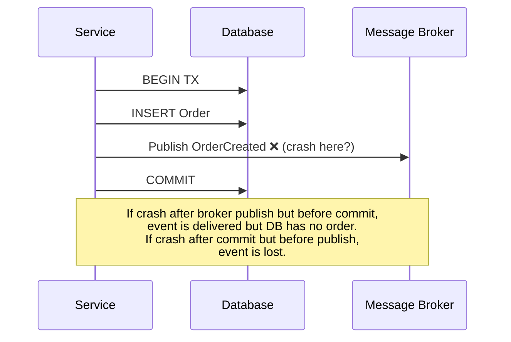
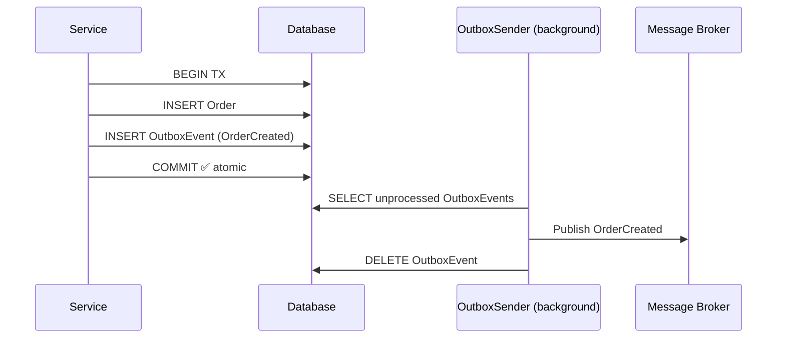
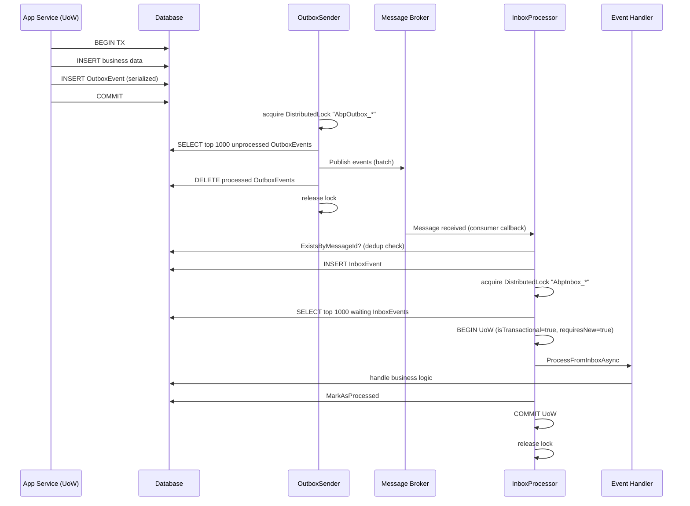

The dual-write problem in distributed systems occurs when a service needs to both commit a database change and publish an event to a message broker atomically — but neither operation can participate in the other's transaction. ABP solves this with the Transactional Outbox/Inbox pattern: events are persisted in the same database transaction as business data, then a background worker relays them to the broker.

## The Dual-Write Problem



With the Outbox pattern, the broker publish is replaced by a database write inside the same transaction:



## File Inventory

| File | Role |
|---|---|
| `Volo.Abp.EventBus.Abstractions` / `Distributed/IEventOutbox.cs` | Outbox store interface: `EnqueueAsync`, `GetWaitingEventsAsync`, `DeleteAsync`, `DeleteManyAsync` |
| `Volo.Abp.EventBus.Abstractions` / `Distributed/IEventInbox.cs` | Inbox store interface: `EnqueueAsync`, `GetWaitingEventsAsync`, `MarkAsProcessedAsync`, `RetryLaterAsync`, `MarkAsDiscardAsync`, `ExistsByMessageIdAsync`, `DeleteOldEventsAsync` |
| `Volo.Abp.EventBus.Abstractions` / `Distributed/OutgoingEventInfo.cs` | Outbox row: `Id`, `EventName`, `EventData` (bytes), `CreationTime`, correlation via `ExtraProperties` |
| `Volo.Abp.EventBus.Abstractions` / `Distributed/IncomingEventInfo.cs` | Inbox row: `Id`, `MessageId`, `EventName`, `EventData`, `Status`, `RetryCount`, `NextRetryTime`, `HandledTime` |
| `Volo.Abp.EventBus.Abstractions` / `Distributed/OutboxConfig.cs` | `ImplementationType`, `DatabaseName`, `Selector`, `IsSendingEnabled` |
| `Volo.Abp.EventBus.Abstractions` / `Distributed/InboxConfig.cs` | `ImplementationType`, `DatabaseName`, `EventSelector`, `HandlerSelector`, `IsProcessingEnabled` |
| `Volo.Abp.EventBus.Abstractions` / `Distributed/OutboxConfigDictionary.cs` | `Configure(Action<OutboxConfig>)` convenience wrapper around `Dictionary<string, OutboxConfig>` |
| `Volo.Abp.EventBus.Abstractions` / `Distributed/InboxConfigDictionary.cs` | `Configure(Action<InboxConfig>)` convenience wrapper around `Dictionary<string, InboxConfig>` |
| `Volo.Abp.EventBus` / `Distributed/OutboxSender.cs` | Background timer worker: acquires distributed lock, drains outbox, publishes to broker |
| `Volo.Abp.EventBus` / `Distributed/InboxProcessor.cs` | Background timer worker: acquires distributed lock, processes inbox rows per-UoW |
| `Volo.Abp.EventBus` / `Distributed/OutboxSenderManager.cs` | `IBackgroundWorker` that starts one `OutboxSender` per enabled outbox config |
| `Volo.Abp.EventBus` / `Distributed/InboxProcessManager.cs` | `IBackgroundWorker` that starts one `InboxProcessor` per enabled inbox config |
| `Volo.Abp.EventBus` / `Distributed/AbpEventBusBoxesOptions.cs` | Polling interval, batch sizes, failure policy, retry settings, cleanup intervals |
| `Volo.Abp.EntityFrameworkCore` / `DistributedEvents/EfCoreOutboxConfigExtensions.cs` | `outboxConfig.UseDbContext<TDbContext>()` sets `ImplementationType` and `DatabaseName` |
| `Volo.Abp.EntityFrameworkCore` / `DistributedEvents/EfCoreInboxConfigExtensions.cs` | `inboxConfig.UseDbContext<TDbContext>()` sets `ImplementationType` and `DatabaseName` |

## Outbox Configuration

Configure outboxes in your module's `ConfigureServices` using the EF Core extension:

```csharp
Configure<AbpDistributedEventBusOptions>(options =>
{
    options.Outboxes.Configure(outbox =>
    {
        // Sets ImplementationType = typeof(IDbContextEventOutbox<MyProjectDbContext>)
        // and DatabaseName from the DbContext's ConnectionStringName attribute
        outbox.UseDbContext<MyProjectDbContext>();

        // Optionally limit which event types use this outbox:
        outbox.Selector = type => type.Namespace!.StartsWith("MyProject.Orders");
    });
});
```

`OutboxConfigDictionary.Configure(Action<OutboxConfig>)` creates or updates the `"Default"` entry. Named outboxes can be created with the `Configure(string outboxName, Action<OutboxConfig>)` overload, which is useful when routing different event types to different databases.

Inbox configuration is symmetric:

```csharp
Configure<AbpDistributedEventBusOptions>(options =>
{
    options.Inboxes.Configure(inbox =>
    {
        inbox.UseDbContext<MyProjectDbContext>();

        // Only process events matching this selector
        inbox.EventSelector = type => type.Namespace!.StartsWith("MyProject.Orders");

        // Only invoke handlers matching this selector (optional)
        inbox.HandlerSelector = handlerType => handlerType.Namespace!.StartsWith("MyProject");
    });
});
```

### `OutboxConfig` and `InboxConfig` properties

```csharp
public class OutboxConfig
{
    public string Name { get; }          // Dictionary key (e.g. "Default")
    public string DatabaseName { get; set; }  // Used in distributed lock name
    public Type ImplementationType { get; set; }  // IEventOutbox implementation
    public Func<Type, bool>? Selector { get; set; }  // Null = match all event types
    public bool IsSendingEnabled { get; set; } = true; // Disable to pause outbox sending
}

public class InboxConfig
{
    public string Name { get; }
    public string DatabaseName { get; set; }
    public Type ImplementationType { get; set; }  // IEventInbox implementation
    public Func<Type, bool>? EventSelector { get; set; }  // Filter incoming events by type
    public Func<Type, bool>? HandlerSelector { get; set; } // Filter handlers by type
    public bool IsProcessingEnabled { get; set; } = true;
}
```

## `IEventOutbox` and `IEventInbox`

Both are resolved from the UoW's `ServiceProvider` (for outbox writes) or a fresh DI scope (for inbox writes). Their concrete implementations are provided by the persistence module (EF Core or MongoDB).

`IEventOutbox` methods:

```csharp
public interface IEventOutbox
{
    Task EnqueueAsync(OutgoingEventInfo outgoingEvent);

    Task<List<OutgoingEventInfo>> GetWaitingEventsAsync(
        int maxCount,
        Expression<Func<IOutgoingEventInfo, bool>>? filter = null,
        CancellationToken cancellationToken = default);

    Task DeleteAsync(Guid id);

    Task DeleteManyAsync(IEnumerable<Guid> ids);
}
```

`IEventInbox` methods:

```csharp
public interface IEventInbox
{
    Task EnqueueAsync(IncomingEventInfo incomingEvent);

    Task<List<IncomingEventInfo>> GetWaitingEventsAsync(
        int maxCount,
        Expression<Func<IIncomingEventInfo, bool>>? filter = null,
        CancellationToken cancellationToken = default);

    Task MarkAsProcessedAsync(Guid id);

    Task RetryLaterAsync(Guid id, int retryCount, DateTime? nextRetryTime);

    Task MarkAsDiscardAsync(Guid id);

    Task<bool> ExistsByMessageIdAsync(string messageId);

    Task DeleteOldEventsAsync();
}
```

## How Events Enter the Outbox

When `IDistributedEventBus.PublishAsync` is called with `useOutbox: true` and a UoW is active, `DistributedEventBusBase.AddToOutboxAsync` writes an `OutgoingEventInfo` row inside the current UoW's transaction. The method iterates all configured outboxes whose `Selector` matches the event type (sorted so specific selectors run before the null/catch-all selector):

```csharp
protected virtual async Task<bool> AddToOutboxAsync(Type eventType, object eventData)
{
    var unitOfWork = UnitOfWorkManager.Current;
    if (unitOfWork == null) return false;

    var addedToOutbox = false;

    foreach (var outboxConfig in AbpDistributedEventBusOptions.Outboxes.Values
        .OrderBy(x => x.Selector is null))
    {
        if (outboxConfig.Selector == null || outboxConfig.Selector(eventType))
        {
            var eventOutbox = (IEventOutbox)unitOfWork.ServiceProvider
                .GetRequiredService(outboxConfig.ImplementationType);

            (var eventName, eventData) = ResolveEventForPublishing(eventType, eventData);

            await OnAddToOutboxAsync(eventName, eventType, eventData);

            var outgoingEventInfo = new OutgoingEventInfo(
                GuidGenerator.Create(),
                eventName,
                Serialize(eventData),
                Clock.Now
            );

            var correlationId = CorrelationIdProvider.Get();
            if (correlationId != null)
                outgoingEventInfo.SetCorrelationId(correlationId);

            await eventOutbox.EnqueueAsync(outgoingEventInfo);
            addedToOutbox = true;
        }
    }

    return addedToOutbox;
}
```

If the UoW rolls back, the `OutgoingEventInfo` row is never committed — the event is silently discarded. If the UoW commits, the row is persisted and will be picked up by `OutboxSender`.

## `OutboxSenderManager` and `OutboxSender` — Background Workers

`AbpEventBusModule.OnApplicationInitializationAsync` registers `OutboxSenderManager` as a background worker. At startup it creates one `OutboxSender` per outbox entry whose `IsSendingEnabled` is `true`:

```csharp
public class OutboxSenderManager : IBackgroundWorker
{
    public async Task StartAsync(CancellationToken cancellationToken = default)
    {
        foreach (var outboxConfig in Options.Outboxes.Values)
        {
            if (outboxConfig.IsSendingEnabled)
            {
                var sender = ServiceProvider.GetRequiredService<IOutboxSender>();
                await sender.StartAsync(outboxConfig, cancellationToken);
                Senders.Add(sender);
            }
        }
    }
}
```

`OutboxSender` is an `ITransientDependency` that owns an `AbpAsyncTimer`. On start it sets the distributed lock name from the outbox's `DatabaseName`:

```csharp
public virtual Task StartAsync(OutboxConfig outboxConfig, CancellationToken cancellationToken = default)
{
    OutboxConfig = outboxConfig;
    Outbox = (IEventOutbox)ServiceProvider.GetRequiredService(outboxConfig.ImplementationType);
    DistributedLockName = $"AbpOutbox_{OutboxConfig.DatabaseName}";
    Timer.Start(cancellationToken);
    return Task.CompletedTask;
}
```

### Polling loop

```csharp
protected virtual async Task RunAsync()
{
    await using (var handle = await DistributedLock
        .TryAcquireAsync(DistributedLockName, cancellationToken: StoppingToken))
    {
        if (handle != null)
        {
            while (true)
            {
                var waitingEvents = await GetWaitingEventsAsync();
                if (waitingEvents.Count <= 0) break;

                if (EventBusBoxesOptions.BatchPublishOutboxEvents)
                    await PublishOutgoingMessagesInBatchAsync(waitingEvents);
                else
                    await PublishOutgoingMessagesAsync(waitingEvents);
            }
        }
        else
        {
            // Another instance holds the lock — back off
            await Task.Delay(EventBusBoxesOptions.DistributedLockWaitDuration, StoppingToken);
        }
    }
}
```

The distributed lock (`"AbpOutbox_{DatabaseName}"`) ensures that in a multi-instance deployment only one instance processes the outbox at a time, preventing duplicate broker publishes.

### Batch vs single publishing

| Mode | Behavior |
|---|---|
| `BatchPublishOutboxEvents = true` (default) | Calls `PublishManyFromOutboxAsync` + `Outbox.DeleteManyAsync(ids)`. More efficient for high-throughput. |
| `BatchPublishOutboxEvents = false` | Calls `PublishFromOutboxAsync` + `Outbox.DeleteAsync(id)` per event. More resilient to partial failures. |

## How Events Enter the Inbox

When a broker message arrives, the provider implementation calls `DistributedEventBusBase.AddToInboxAsync`. This method iterates all configured inboxes whose `EventSelector` matches the event type, checks for duplicate `MessageId`, then inserts an `IncomingEventInfo` row:

```csharp
protected virtual async Task<bool> AddToInboxAsync(
    string? messageId,
    string eventName,
    Type eventType,
    object eventData,
    string? correlationId)
{
    if (AbpDistributedEventBusOptions.Inboxes.Count <= 0) return false;

    var addToInbox = false;

    using (var scope = ServiceScopeFactory.CreateScope())
    {
        foreach (var inboxConfig in AbpDistributedEventBusOptions.Inboxes.Values
            .OrderBy(x => x.EventSelector is null))
        {
            if (inboxConfig.EventSelector == null || inboxConfig.EventSelector(eventType))
            {
                var eventInbox = (IEventInbox)scope.ServiceProvider
                    .GetRequiredService(inboxConfig.ImplementationType);

                if (!messageId.IsNullOrEmpty())
                {
                    if (await eventInbox.ExistsByMessageIdAsync(messageId!))
                    {
                        // Already seen this message — skip insert but still flag as handled
                        addToInbox = true;
                        continue;
                    }
                }

                eventData = GetEventData(eventData);

                var incomingEventInfo = new IncomingEventInfo(
                    GuidGenerator.Create(),
                    messageId!,
                    eventName,
                    Serialize(eventData),
                    Clock.Now
                );
                incomingEventInfo.SetCorrelationId(correlationId!);
                await eventInbox.EnqueueAsync(incomingEventInfo);
                addToInbox = true;
            }
        }
    }

    return addToInbox;
}
```

The `ExistsByMessageIdAsync` check provides **idempotency** at the inbox level: if the broker redelivers a message (e.g., after a network partition), the inbox ignores the duplicate.

## `InboxProcessManager` and `InboxProcessor` — Background Workers

`AbpEventBusModule` also registers `InboxProcessManager` as a background worker. It creates one `InboxProcessor` per inbox entry whose `IsProcessingEnabled` is `true`.

`InboxProcessor.RunAsync` first calls `DeleteOldEventsAsync` (subject to `CleanOldEventTimeIntervalSpan` throttle), then processes each waiting event in its own transactional UoW:

```csharp
protected virtual async Task RunAsync()
{
    await using (var handle = await DistributedLock
        .TryAcquireAsync(DistributedLockName, cancellationToken: StoppingToken))
    {
        if (handle != null)
        {
            await DeleteOldEventsAsync();

            while (true)
            {
                var waitingEvents = await GetWaitingEventsAsync();
                if (waitingEvents.Count <= 0) break;

                foreach (var waitingEvent in waitingEvents)
                {
                    try
                    {
                        using (var uow = UnitOfWorkManager.Begin(
                            isTransactional: true, requiresNew: true))
                        {
                            await DistributedEventBus
                                .AsSupportsEventBoxes()
                                .ProcessFromInboxAsync(waitingEvent, InboxConfig);

                            await Inbox.MarkAsProcessedAsync(waitingEvent.Id);
                            await uow.CompleteAsync(StoppingToken);
                        }
                    }
                    catch (Exception e)
                    {
                        // Handle according to InboxProcessorFailurePolicy (see below)
                    }
                }
            }
        }
        else
        {
            await Task.Delay(EventBusBoxesOptions.DistributedLockWaitDuration, StoppingToken);
        }
    }
}
```

Each event is processed in its own `requiresNew: true` UoW, so a handler failure does not roll back previously processed events. `InboxConfig.HandlerSelector` is passed to `ProcessFromInboxAsync`, allowing selective handler invocation per inbox configuration.

## Failure Policies for Inbox Processing

`AbpEventBusBoxesOptions.InboxProcessorFailurePolicy` governs what happens when a handler throws:

```csharp
public enum InboxProcessorFailurePolicy
{
    Retry,      // Re-throw; timer will retry the same event on next tick (default)
    RetryLater, // Exponential back-off; discard after max retries
    Discard     // Mark as discarded immediately on first failure
}
```

### `RetryLater` back-off calculation

```csharp
protected virtual DateTime? GetNextRetryTime(int retryCount, double factor)
{
    var delaySeconds = factor * Math.Pow(2, retryCount);
    return DateTime.Now.AddSeconds(delaySeconds);
}
```

With the default `InboxProcessorRetryBackoffFactor = 10`:

| Retry count | Delay |
|---|---|
| 0 | 10 s |
| 1 | 20 s |
| 2 | 40 s |
| 3 | 80 s |
| 9 | 5120 s (~85 min) |

After `InboxProcessorMaxRetryCount` (default: 10) exhausted retries, the event is marked `Discarded`:

```csharp
if (waitingEvent.RetryCount >= EventBusBoxesOptions.InboxProcessorMaxRetryCount)
{
    await Inbox.RetryLaterAsync(waitingEvent.Id, waitingEvent.RetryCount, null);
    await Inbox.MarkAsDiscardAsync(waitingEvent.Id);
    await uow.CompleteAsync(StoppingToken);
    continue;
}
```

## `AbpEventBusBoxesOptions` Reference

```csharp
public class AbpEventBusBoxesOptions
{
    // How often OutboxSender / InboxProcessor poll (default: 2 seconds)
    public TimeSpan PeriodTimeSpan { get; set; }

    // Max events fetched per poll cycle (default: 1000)
    public int OutboxWaitingEventMaxCount { get; set; }
    public int InboxWaitingEventMaxCount { get; set; }

    // Optional LINQ filter to process only a subset of events
    public Expression<Func<IOutgoingEventInfo, bool>>? OutboxProcessorFilter { get; set; }
    public Expression<Func<IIncomingEventInfo, bool>>? InboxProcessorFilter { get; set; }

    // Distributed lock back-off when lock unavailable (default: 15 seconds)
    public TimeSpan DistributedLockWaitDuration { get; set; }

    // Inbox failure handling (default: Retry)
    public InboxProcessorFailurePolicy InboxProcessorFailurePolicy { get; set; }
    public int InboxProcessorMaxRetryCount { get; set; }        // default: 10
    public double InboxProcessorRetryBackoffFactor { get; set; } // default: 10

    // How often old processed inbox events are cleaned up (default: 6 hours)
    public TimeSpan CleanOldEventTimeIntervalSpan { get; set; }

    // How long to retain processed inbox events before deletion (default: 2 hours)
    public TimeSpan WaitTimeToDeleteProcessedInboxEvents { get; set; }

    // Whether to batch publish from outbox (default: true)
    public bool BatchPublishOutboxEvents { get; set; }
}
```

## Complete Flow Diagram



<Warning>
The Outbox/Inbox pattern requires that your `DbContext` implements `IHasEventOutbox` / `IHasEventInbox` and has the corresponding tables. When using EF Core, call `outbox.UseDbContext<TDbContext>()` (from `Volo.Abp.EntityFrameworkCore`) in your outbox/inbox configuration, then create and apply the EF Core migrations for the new tables. For MongoDB, call the equivalent model builder extension methods from the MongoDB integration package.
</Warning>

<Note>
Distributed locking (`IAbpDistributedLock`) requires a distributed lock provider. ABP ships `Volo.Abp.DistributedLocking.Abstractions` with a local (in-memory) implementation for single-node deployments and a Redis-backed implementation (`Volo.Abp.DistributedLocking`) for multi-node production use.
</Note>
