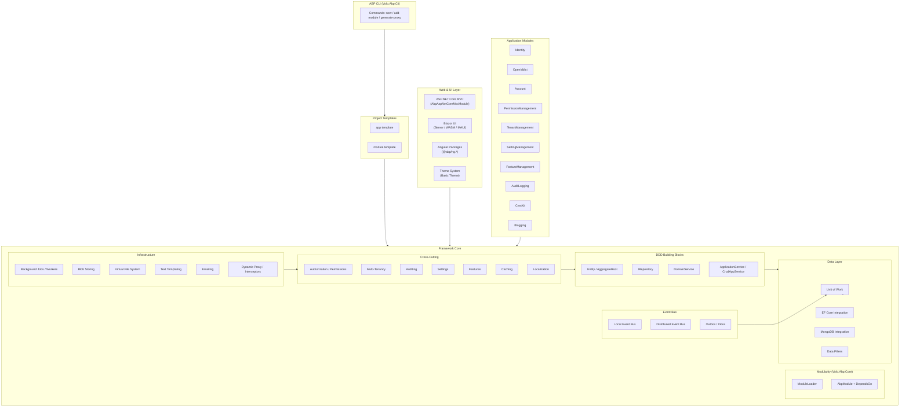

ABP Framework is an open-source ASP.NET Core application framework built on top of .NET. It provides a **modular architecture** with a graph-based module loader, a full suite of **Domain-Driven Design building blocks** (entities, aggregates, repositories, domain services, application services), a layered **data access abstraction** over EF Core and MongoDB, a **local + distributed event bus** with transactional Outbox/Inbox support, and a large set of **cross-cutting concern implementations** (multi-tenancy, authorization, auditing, settings, features, caching, localization). On top of the framework sit pre-built **application modules** (Identity, OpenIddict, TenantManagement, AuditLogging, CmsKit) and first-class UI support for **ASP.NET Core MVC**, **Blazor** (Server / WebAssembly / MAUI), and **Angular**.

## High-Level Architecture

## Subsystem Map

<CardGroup cols={2}>
  <Card title="Modularity System" icon="puzzle-piece" href="/modularity/module-system">
    AbpModule, DependsOn graph, ModuleLoader, plugin sources, and lifecycle hooks.
  </Card>
  <Card title="DDD Building Blocks" icon="layer-group" href="/ddd/entities-aggregates">
    Entity, AggregateRoot, IRepository, DomainService, ApplicationService, and CrudAppService base classes.
  </Card>
  <Card title="Data Layer" icon="database" href="/data/unit-of-work">
    Unit of Work, EF Core DbContext, MongoDB context, and global data filters.
  </Card>
  <Card title="Event Bus" icon="bolt" href="/event-bus/local-event-bus">
    Local in-process event bus, distributed event bus, and transactional Outbox/Inbox pattern.
  </Card>
  <Card title="Cross-Cutting Concerns" icon="shield-halved" href="/cross-cutting/authorization-permissions">
    Authorization, multi-tenancy, auditing, settings, features, caching, and localization.
  </Card>
  <Card title="Infrastructure" icon="server" href="/infrastructure/background-jobs-workers">
    Background jobs, blob storing, virtual file system, text templating, emailing, and interceptors.
  </Card>
  <Card title="ASP.NET Core MVC" icon="globe" href="/aspnetcore/mvc-module">
    MVC module, auto API controllers, application configuration endpoint, and bundling.
  </Card>
  <Card title="Blazor UI" icon="window-maximize" href="/blazor/blazor-ui-overview">
    Blazor Server, WebAssembly, and MAUI component packages with ABP integration.
  </Card>
  <Card title="Angular UI" icon="angular" href="/angular/angular-packages">
    @abp/ng.* packages, core module, HTTP client proxy generation for Angular SPAs.
  </Card>
  <Card title="Theming" icon="palette" href="/theming/theme-system">
    ITheme abstraction, layout components, MudBlazor integration, and Basic Theme.
  </Card>
  <Card title="Application Modules" icon="boxes-stacked" href="/modules/identity-module">
    Pre-built Identity, OpenIddict, Account, TenantManagement, CmsKit, and more.
  </Card>
  <Card title="ABP CLI & Tooling" icon="terminal" href="/tooling/abp-cli">
    CLI commands for scaffolding, module management, proxy generation, and bundling.
  </Card>
</CardGroup>

## Where to Start

<Note>
If you're reading the codebase cold, start with the **[Architecture Overview](/architecture-overview)** page, then the **[Module System](/modularity/module-system)** — everything in ABP is a module.
</Note>

**Key entry points:**

| Symbol / File | Purpose |
|---|---|
| `framework/src/Volo.Abp.Core/Volo/Abp/AbpApplicationBase.cs` | Root application bootstrap — loads modules, wires DI |
| `framework/src/Volo.Abp.Core/Volo/Abp/Modularity/AbpModule.cs` | Base class every module extends |
| `framework/src/Volo.Abp.Core/Volo/Abp/Modularity/ModuleLoader.cs` | Builds the ordered module graph at startup |
| `framework/src/Volo.Abp.Ddd.Domain/Volo/Abp/Domain/Entities/Entity.cs` | Root entity base class |
| `framework/src/Volo.Abp.Ddd.Application/Volo/Abp/Application/Services/CrudAppService.cs` | CRUD app service base with built-in authorization |
| `framework/src/Volo.Abp.Uow/Volo/Abp/Uow/UnitOfWork.cs` | UoW implementation — ambient transaction scope |
| `framework/src/Volo.Abp.EventBus.Abstractions/Volo/Abp/EventBus/IEventBus.cs` | Core event bus interface |
| `framework/src/Volo.Abp.AspNetCore.Mvc/Volo/Abp/AspNetCore/Mvc/Conventions/AbpServiceConvention.cs` | Turns app services into REST controllers |
| `framework/src/Volo.Abp.Cli.Core/Volo/Abp/Cli/CliService.cs` | CLI entry point — dispatches to `IConsoleCommand` |
