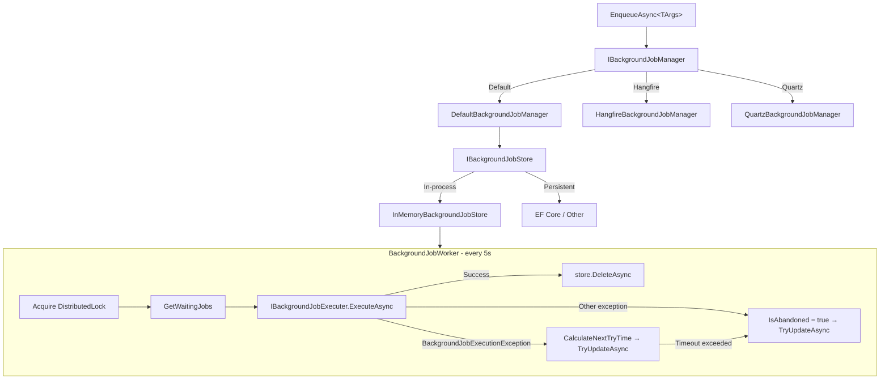

ABP separates two distinct concepts for deferred work: **background jobs** (fire-and-forget tasks enqueued with arguments, executed once) and **background workers** (long-running processes that run on a periodic schedule). Both share the same hosting infrastructure but differ in lifecycle, storage, and execution semantics.

## Background Jobs

### Core Abstractions

`IBackgroundJobManager` is the single entry point for enqueueing work. The interface is intentionally minimal:

```csharp
// Volo.Abp.BackgroundJobs.Abstractions
public interface IBackgroundJobManager
{
    Task<string> EnqueueAsync<TArgs>(
        TArgs args,
        BackgroundJobPriority priority = BackgroundJobPriority.Normal,
        TimeSpan? delay = null
    );
}
```

The `TArgs` type is resolved to a named job via `AbpBackgroundJobOptions.GetBackgroundJobName`, which by default reads the `[BackgroundJobName]` attribute (or falls back to the full type name).

### Job Registration: AbpBackgroundJobOptions

`AbpBackgroundJobOptions` holds two bidirectional dictionaries mapping args-types ↔ job-names and job-names ↔ job-names, plus a delegate for resolving job names:

```csharp
public class AbpBackgroundJobOptions
{
    public bool IsJobExecutionEnabled { get; set; } = true;
    public Func<Type, string> GetBackgroundJobName { get; set; }

    public void AddJob<TJob>() { ... }
    public void AddJob(BackgroundJobConfiguration jobConfiguration) { ... }
    public BackgroundJobConfiguration GetJob(Type argsType) { ... }
    public BackgroundJobConfiguration GetJob(string name) { ... }
    public BackgroundJobConfiguration? GetJobOrNull(string name) { ... }
    public IReadOnlyList<BackgroundJobConfiguration> GetJobs() { ... }
}
```

Call `options.AddJob<MyJob>()` in your module's `ConfigureServices` to register a job. `BackgroundJobConfiguration` stores the relationship between the job implementation type, its args type, and its string name.

### Default Storage: InMemoryBackgroundJobStore

The default implementation keeps jobs in a `ConcurrentDictionary<Guid, BackgroundJobInfo>`. `GetWaitingJobsAsync` filters by application name, sorts by `Priority DESC, TryCount ASC, NextTryTime ASC`, and caps results at `maxResultCount`:

```csharp
public virtual Task<List<BackgroundJobInfo>> GetWaitingJobsAsync(
    string? applicationName, int maxResultCount)
{
    var waitingJobs = _jobs.Values
        .Where(t => t.ApplicationName == applicationName)
        .Where(t => !t.IsAbandoned && t.NextTryTime <= Clock.Now)
        .OrderByDescending(t => t.Priority)
        .ThenBy(t => t.TryCount)
        .ThenBy(t => t.NextTryTime)
        .Take(maxResultCount)
        .ToList();
    return Task.FromResult(waitingJobs);
}
```

`UpdateAsync` in `InMemoryBackgroundJobStore` checks `IsAbandoned`: if the job is abandoned it simply removes it from the dictionary (calls `DeleteAsync`); otherwise it is a no-op since in-memory state is already mutated in place.

Replace the in-memory store with a persistent store (e.g., EF Core) by implementing `IBackgroundJobStore` and registering it in DI.

### DefaultBackgroundJobManager

When using the built-in job system (not Hangfire/Quartz), `DefaultBackgroundJobManager` serializes args and writes a `BackgroundJobInfo` record to `IBackgroundJobStore`. The `NextTryTime` is set to `Clock.Now` by default and overridden only if a `delay` is provided:

```csharp
[Dependency(ReplaceServices = true)]
public class DefaultBackgroundJobManager : IBackgroundJobManager, ITransientDependency
{
    public virtual async Task<string> EnqueueAsync<TArgs>(
        TArgs args,
        BackgroundJobPriority priority = BackgroundJobPriority.Normal,
        TimeSpan? delay = null)
    {
        var jobName = BackgroundJobOptions.Value.GetBackgroundJobName(typeof(TArgs));
        var jobId = await EnqueueAsync(jobName, args!, priority, delay);
        return jobId.ToString();
    }

    protected virtual async Task<Guid> EnqueueAsync(
        string jobName, object args,
        BackgroundJobPriority priority = BackgroundJobPriority.Normal,
        TimeSpan? delay = null)
    {
        var jobInfo = new BackgroundJobInfo
        {
            Id = GuidGenerator.Create(),
            ApplicationName = BackgroundJobWorkerOptions.Value.ApplicationName,
            JobName = jobName,
            JobArgs = Serializer.Serialize(args),
            Priority = priority,
            CreationTime = Clock.Now,
            NextTryTime = Clock.Now
        };

        if (delay.HasValue)
        {
            jobInfo.NextTryTime = Clock.Now.Add(delay.Value);
        }

        await Store.InsertAsync(jobInfo);
        return jobInfo.Id;
    }
}
```

### BackgroundJobWorker: The Polling Loop

`BackgroundJobWorker` extends `AsyncPeriodicBackgroundWorkerBase` and drives the execution cycle. On every tick (`JobPollPeriod`, default 5 000 ms) it:

1. Attempts to acquire a distributed lock (`IAbpDistributedLock`) using `WorkerOptions.DistributedLockName`
2. Fetches at most `MaxJobFetchCount` (default 1 000) waiting jobs from `IBackgroundJobStore`
3. For each job: increments `TryCount`, sets `LastTryTime = clock.Now`
4. Deserializes args and calls `IBackgroundJobExecuter.ExecuteAsync`
5. On success: calls `store.DeleteAsync(jobInfo.Id)`
6. On `BackgroundJobExecutionException`: calculates a back-off time via `CalculateNextTryTime` and calls `TryUpdateAsync`
7. On other hard errors: sets `IsAbandoned = true` and calls `TryUpdateAsync`

```csharp
protected override async Task DoWorkAsync(PeriodicBackgroundWorkerContext workerContext)
{
    await using (var handler = await DistributedLock.TryAcquireAsync(
        WorkerOptions.DistributedLockName, cancellationToken: StoppingToken))
    {
        if (handler != null)
        {
            var store = workerContext.ServiceProvider
                .GetRequiredService<IBackgroundJobStore>();

            var waitingJobs = await store.GetWaitingJobsAsync(
                WorkerOptions.ApplicationName, WorkerOptions.MaxJobFetchCount);

            if (!waitingJobs.Any())
            {
                return;
            }

            var jobExecuter = workerContext.ServiceProvider
                .GetRequiredService<IBackgroundJobExecuter>();
            // ... execute each job ...
        }
        else
        {
            // Another instance holds the lock; sleep 12× the poll period
            try
            {
                await Task.Delay(WorkerOptions.JobPollPeriod * 12, StoppingToken);
            }
            catch (TaskCanceledException) { }
        }
    }
}
```

The distributed lock prevents multiple application instances from processing the same jobs concurrently. `StoppingToken` is inherited from `BackgroundWorkerBase` and is cancelled when the application shuts down.

### Retry Back-off Algorithm

`CalculateNextTryTime` uses an exponential back-off formula:

```csharp
protected virtual DateTime? CalculateNextTryTime(BackgroundJobInfo jobInfo, IClock clock)
{
    var nextWaitDuration = WorkerOptions.DefaultFirstWaitDuration *
        (Math.Pow(WorkerOptions.DefaultWaitFactor, jobInfo.TryCount - 1));

    var nextTryDate = jobInfo.LastTryTime?.AddSeconds(nextWaitDuration)
        ?? clock.Now.AddSeconds(nextWaitDuration);

    if (nextTryDate.Subtract(jobInfo.CreationTime).TotalSeconds > WorkerOptions.DefaultTimeout)
    {
        return null; // caller sets IsAbandoned = true
    }
    return nextTryDate;
}
```

| Option | Default | Description |
|---|---|---|
| `JobPollPeriod` | 5 000 ms | Polling interval |
| `MaxJobFetchCount` | 1 000 | Jobs fetched per tick |
| `DefaultFirstWaitDuration` | 60 s | First retry wait |
| `DefaultWaitFactor` | 2.0 | Exponential back-off multiplier |
| `DefaultTimeout` | 172 800 s (2 days) | Max age before abandon |
| `DistributedLockName` | `"AbpBackgroundJobWorker"` | Distributed lock key |

### BackgroundJobExecuter

`BackgroundJobExecuter` resolves the job type from DI, reflects on `Execute` or `ExecuteAsync`, and invokes it inside the correct tenant context. The tenant is taken from `IMultiTenant.TenantId` if the job args implement `IMultiTenant`; otherwise it falls back to `CurrentTenant.Id`:

```csharp
public virtual async Task ExecuteAsync(JobExecutionContext context)
{
    var job = context.ServiceProvider.GetService(context.JobType);

    var jobExecuteMethod =
        context.JobType.GetMethod(nameof(IBackgroundJob<object>.Execute)) ??
        context.JobType.GetMethod(nameof(IAsyncBackgroundJob<object>.ExecuteAsync));

    using (CurrentTenant.Change(GetJobArgsTenantId(context.JobArgs)))
    {
        // invoke synchronous or asynchronous execute method
    }
}

protected virtual Guid? GetJobArgsTenantId(object jobArgs)
{
    return jobArgs switch
    {
        IMultiTenant multiTenantJobArgs => multiTenantJobArgs.TenantId,
        _ => CurrentTenant.Id
    };
}
```

### NullBackgroundJobManager

`NullBackgroundJobManager` is registered with `[Dependency(TryRegister = true)]`, meaning it is only used when no other `IBackgroundJobManager` is registered. It throws an `AbpException` on `EnqueueAsync`, signaling that no real provider is configured. Use `IBackgroundJobManager.IsAvailable()` to guard optional queue usage.

---

## Pluggable Job Providers

<CardGroup cols={2}>
  <Card title="Hangfire" icon="h">
    `Volo.Abp.BackgroundJobs.HangFire` — `HangfireBackgroundJobManager` replaces `IBackgroundJobManager` and delegates directly to `BackgroundJob.Enqueue` / `BackgroundJob.Schedule`. Job execution is handled by `HangfireJobExecutionAdapter`, which calls `IBackgroundJobExecuter` inside Hangfire's context.
  </Card>
  <Card title="Quartz.NET" icon="clock">
    `Volo.Abp.BackgroundJobs.Quartz` — `QuartzBackgroundJobManager` builds an `IJobDetail` with `JobDataMap` (serialized args + retry config) and schedules it via `IScheduler`. `QuartzJobExecutionAdapter` bridges Quartz's `IJob.Execute` to ABP's `IBackgroundJobExecuter`.
  </Card>
  <Card title="RabbitMQ / TickerQ" icon="rabbit">
    Additional community providers exist for RabbitMQ and TickerQ. All implement `IBackgroundJobManager` with `[Dependency(ReplaceServices = true)]` so they override the default manager automatically.
  </Card>
  <Card title="Disabling Built-in Execution" icon="pause">
    Set `AbpBackgroundJobOptions.IsJobExecutionEnabled = false` to enqueue jobs without running the built-in poller — useful when a separate worker process handles execution.
  </Card>
</CardGroup>

### Hangfire Internals

```csharp
[Dependency(ReplaceServices = true)]
public class HangfireBackgroundJobManager : IBackgroundJobManager, ITransientDependency
{
    public virtual Task<string> EnqueueAsync<TArgs>(
        TArgs args,
        BackgroundJobPriority priority = BackgroundJobPriority.Normal,
        TimeSpan? delay = null)
    {
        return Task.FromResult(delay.HasValue
            ? BackgroundJob.Schedule<HangfireJobExecutionAdapter<TArgs>>(
                adapter => adapter.ExecuteAsync(GetQueueName(typeof(TArgs)), args, default),
                delay.Value)
            : BackgroundJob.Enqueue<HangfireJobExecutionAdapter<TArgs>>(
                adapter => adapter.ExecuteAsync(GetQueueName(typeof(TArgs)), args, default)));
    }
}
```

Queue names are resolved from `[Queue]` attribute on the job type (with the configured `DefaultQueuePrefix`).

---

## Background Workers

Background workers are **long-running singletons** that start with the application and are restarted on failure. They do not enqueue work — they are the work.

### IBackgroundWorker

```csharp
// IRunnable extends IHostedService-like StartAsync/StopAsync
public interface IBackgroundWorker : IRunnable, ISingletonDependency { }
```

Workers are registered as singletons and managed by `BackgroundWorkerManager`, which calls `StartAsync` / `StopAsync` on each.

### BackgroundWorkerBase

`BackgroundWorkerBase` is the root base class for all workers. It provides `StoppingTokenSource` and `StoppingToken` (a `CancellationToken` that is cancelled when `StopAsync` is called), a lazy-resolved logger, and default lifecycle logging:

```csharp
public abstract class BackgroundWorkerBase : IBackgroundWorker
{
    protected CancellationTokenSource StoppingTokenSource { get; set; }
    protected CancellationToken StoppingToken { get; set; }

    public virtual Task StartAsync(CancellationToken cancellationToken = default) { ... }
    public virtual Task StopAsync(CancellationToken cancellationToken = default)
    {
        StoppingTokenSource.Cancel();
        StoppingTokenSource.Dispose();
        return Task.CompletedTask;
    }
}
```

### PeriodicBackgroundWorkerBase

The synchronous variant uses an `AbpTimer` (a wrapper around `System.Threading.Timer`) that fires `Timer_Elapsed` on each tick. Each tick creates a new DI scope. Override `DoWork`:

```csharp
public abstract class PeriodicBackgroundWorkerBase : BackgroundWorkerBase
{
    protected AbpTimer Timer { get; }
    public int Period => Timer.Period;
    public string? CronExpression { get; protected set; }

    protected abstract void DoWork(PeriodicBackgroundWorkerContext workerContext);
}
```

### AsyncPeriodicBackgroundWorkerBase

The async variant wraps `AbpAsyncTimer` (task-based timer). Each tick creates its own DI scope, catches exceptions, and notifies `IExceptionNotifier`. Override `DoWorkAsync`:

```csharp
public abstract class AsyncPeriodicBackgroundWorkerBase : BackgroundWorkerBase
{
    protected AbpAsyncTimer Timer { get; }
    protected CancellationToken StartCancellationToken { get; set; }
    public int Period => Timer.Period;
    public string? CronExpression { get; protected set; }

    protected abstract Task DoWorkAsync(PeriodicBackgroundWorkerContext workerContext);
}
```

`BackgroundJobWorker` itself extends `AsyncPeriodicBackgroundWorkerBase`, making it a worker that drives the job polling loop.

### CronExpression Support

Both `PeriodicBackgroundWorkerBase` and `AsyncPeriodicBackgroundWorkerBase` expose a `CronExpression` property. When set it takes priority over the `Period` value, allowing cron-style scheduling without requiring a full Quartz integration.

### Registering Workers

```csharp
// In your module's OnApplicationInitializationAsync:
public override async Task OnApplicationInitializationAsync(
    ApplicationInitializationContext context)
{
    await context.AddBackgroundWorkerAsync<MyPeriodicWorker>();
}
```

`AddBackgroundWorkerAsync` resolves the worker from DI and calls `BackgroundWorkerManager.AddAsync`. If `BackgroundWorkerManager.IsRunning` is already true (the application started before the worker was added), `StartAsync` is called immediately.

### Architecture Diagram



<Note>
`CronExpression` on both `PeriodicBackgroundWorkerBase` and `AsyncPeriodicBackgroundWorkerBase` takes priority over `Period` when set. This allows cron-style scheduling without a full Quartz integration.
</Note>

<Warning>
`InMemoryBackgroundJobStore` does not survive application restarts. For production use, replace it with a persistent implementation such as `Volo.Abp.BackgroundJobs.EntityFrameworkCore`.
</Warning>
