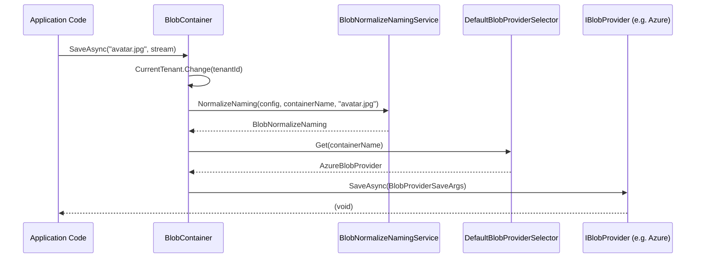

ABP's blob storing system provides a unified, provider-agnostic API for saving and retrieving binary objects. The abstraction is built around named **containers** that map to specific storage backends through a pluggable provider model. Multi-tenancy, naming normalization, and provider selection are all handled transparently by the infrastructure layer.

## Core Interfaces

### IBlobContainer

`IBlobContainer` is the primary API for application code:

```csharp
public interface IBlobContainer
{
    Task SaveAsync(
        string name,
        Stream stream,
        bool overrideExisting = false,
        CancellationToken cancellationToken = default);

    Task<bool> DeleteAsync(
        string name,
        CancellationToken cancellationToken = default);

    Task<bool> ExistsAsync(
        string name,
        CancellationToken cancellationToken = default);

    Task<Stream> GetAsync(
        string name,
        CancellationToken cancellationToken = default);

    Task<Stream?> GetOrNullAsync(
        string name,
        CancellationToken cancellationToken = default);
}
```

`GetAsync` throws `AbpException` if the blob is not found. Use `GetOrNullAsync` when absence is an expected case.

The generic form `IBlobContainer<TContainer>` inherits from `IBlobContainer` and allows typed injection scoped to a specific container:

```csharp
public interface IBlobContainer<TContainer> : IBlobContainer
    where TContainer : class
{
}
```

Inject `IBlobContainer<ProfilePicturesContainer>` to work exclusively with that container's configured storage provider.

### IBlobProvider

Provider implementations implement `IBlobProvider`. All methods receive strongly-typed args objects that carry the resolved container name, blob name, stream, and the container configuration:

```csharp
public interface IBlobProvider
{
    Task SaveAsync(BlobProviderSaveArgs args);
    Task<bool> DeleteAsync(BlobProviderDeleteArgs args);
    Task<bool> ExistsAsync(BlobProviderExistsArgs args);
    Task<Stream?> GetOrNullAsync(BlobProviderGetArgs args);
}
```

`BlobProviderBase` is the recommended base class. All four methods are declared `abstract` — subclasses must implement all of them. It adds the `TryCopyToMemoryStreamAsync` helper, which copies a stream into a detached `MemoryStream` (necessary when the underlying SDK returns a non-seekable or connection-tied stream):

```csharp
public abstract class BlobProviderBase : IBlobProvider
{
    public abstract Task SaveAsync(BlobProviderSaveArgs args);
    public abstract Task<bool> DeleteAsync(BlobProviderDeleteArgs args);
    public abstract Task<bool> ExistsAsync(BlobProviderExistsArgs args);
    public abstract Task<Stream?> GetOrNullAsync(BlobProviderGetArgs args);

    protected virtual async Task<Stream?> TryCopyToMemoryStreamAsync(
        Stream? stream,
        CancellationToken cancellationToken = default)
    {
        if (stream == null) return null;
        var memoryStream = new MemoryStream();
        await stream.CopyToAsync(memoryStream, cancellationToken);
        memoryStream.Seek(0, SeekOrigin.Begin);
        return memoryStream;
    }
}
```

---

## Container Configuration

### BlobContainerNameAttribute

Container identity is determined by `BlobContainerNameAttribute`. If absent, the type's full name is used:

```csharp
[BlobContainerName("profile-pictures")]
public class ProfilePicturesContainer { }
```

`BlobContainerNameAttribute.GetContainerName<T>()` is the internal resolution method used throughout the framework.

### BlobContainerConfiguration

Each named container has a `BlobContainerConfiguration` instance that stores:

```csharp
public class BlobContainerConfiguration
{
    public Type? ProviderType { get; set; }
    public bool IsMultiTenant { get; set; } = true;
    public ITypeList<IBlobNamingNormalizer> NamingNormalizers { get; }

    // Key-value property bag for provider-specific config
    public T? GetConfigurationOrDefault<T>(string name, T? defaultValue = default);
    public object? GetConfigurationOrNull(string name, object? defaultValue = null);
    public BlobContainerConfiguration SetConfiguration(string name, object? value);
    public BlobContainerConfiguration ClearConfiguration(string name);
}
```

`ProviderType` determines which registered `IBlobProvider` handles this container. Providers read their configuration from the property bag via `GetConfigurationOrDefault<T>(name)`.

Each `BlobContainerConfiguration` accepts an optional `fallbackConfiguration` in its constructor. `GetConfigurationOrNull` walks the fallback chain before returning null — new named containers automatically receive the `DefaultContainer` configuration as their fallback.

### AbpBlobStoringOptions

`AbpBlobStoringOptions` holds a `BlobContainerConfigurations` registry:

```csharp
public class AbpBlobStoringOptions
{
    public BlobContainerConfigurations Containers { get; }
}
```

Configure containers in your module:

```csharp
Configure<AbpBlobStoringOptions>(options =>
{
    options.Containers.ConfigureDefault(container =>
    {
        container.UseFileSystem(fileSystem =>
        {
            fileSystem.BasePath = "C:\\my-files";
        });
    });

    options.Containers.Configure<ProfilePicturesContainer>(container =>
    {
        container.UseAzure(azure =>
        {
            azure.ConnectionString = "...";
            azure.ContainerName = "profile-pictures";
        });
    });
});
```

`BlobContainerConfigurations` pre-populates a `DefaultContainer` entry. Calls to `Configure<TContainer>` create a new `BlobContainerConfiguration` backed by `Default` as its fallback if the container does not already exist. `ConfigureAll` iterates every registered container.

---

## BlobContainer: The Execution Pipeline

`BlobContainer` (the non-generic runtime implementation) orchestrates the full pipeline on every operation. The generic `BlobContainer<TContainer>` is a thin wrapper that delegates to a plain `BlobContainer` created by `IBlobContainerFactory`:

```csharp
public virtual async Task SaveAsync(
    string name,
    Stream stream,
    bool overrideExisting = false,
    CancellationToken cancellationToken = default)
{
    using (CurrentTenant.Change(GetTenantIdOrNull()))
    {
        var blobNormalizeNaming = BlobNormalizeNamingService
            .NormalizeNaming(Configuration, ContainerName, name);

        await Provider.SaveAsync(
            new BlobProviderSaveArgs(
                blobNormalizeNaming.ContainerName!,
                Configuration,
                blobNormalizeNaming.BlobName!,
                stream,
                overrideExisting,
                CancellationTokenProvider.FallbackToProvider(cancellationToken)
            )
        );
    }
}
```

`GetTenantIdOrNull` returns `CurrentTenant.Id` when `Configuration.IsMultiTenant` is `true`, or `null` otherwise.

The sequence is:
<Steps>
  <Step title="Tenant isolation">
    `CurrentTenant.Change(GetTenantIdOrNull())` switches the ambient tenant context. When `IsMultiTenant` is `true` this scopes blob names to the current tenant.
  </Step>
  <Step title="Naming normalization">
    `BlobNormalizeNamingService.NormalizeNaming` runs the ordered `NamingNormalizers` chain to transform both the container name and blob name (e.g., lowercasing for Azure, replacing slashes for S3).
  </Step>
  <Step title="Provider dispatch">
    The resolved `IBlobProvider` receives a strongly-typed args object containing the normalized names, the configuration, and the stream.
  </Step>
</Steps>

### BlobNormalizeNamingService

This service iterates through `BlobContainerConfiguration.NamingNormalizers` in order, applying each `IBlobNamingNormalizer` to the container name and blob name:

```csharp
public BlobNormalizeNaming NormalizeNaming(
    BlobContainerConfiguration configuration,
    string? containerName,
    string? blobName)
{
    using (var scope = ServiceProvider.CreateScope())
    {
        foreach (var normalizerType in configuration.NamingNormalizers)
        {
            var normalizer = scope.ServiceProvider
                .GetRequiredService(normalizerType)
                .As<IBlobNamingNormalizer>();

            containerName = normalizer.NormalizeContainerName(containerName!);
            blobName = normalizer.NormalizeBlobName(blobName!);
        }
        return new BlobNormalizeNaming(containerName, blobName);
    }
}
```

---

## DefaultBlobProviderSelector

`DefaultBlobProviderSelector` resolves which registered `IBlobProvider` instance handles a given container. It reads the container's `ProviderType` from `IBlobContainerConfigurationProvider` and finds a matching provider among all registered `IEnumerable<IBlobProvider>`:

```csharp
public virtual IBlobProvider Get(string containerName)
{
    var configuration = ConfigurationProvider.Get(containerName);

    if (!BlobProviders.Any())
    {
        throw new AbpException(
            "No BLOB Storage provider was registered! ...");
    }

    if (configuration.ProviderType == null)
    {
        throw new AbpException(
            "No BLOB Storage provider was used! ...");
    }

    foreach (var provider in BlobProviders)
    {
        if (ProxyHelper.GetUnProxiedType(provider)
            .IsAssignableTo(configuration.ProviderType))
        {
            return provider;
        }
    }

    throw new AbpException(
        $"Could not find the BLOB Storage provider with the type " +
        $"({configuration.ProviderType.AssemblyQualifiedName}) configured for the container {containerName}...");
}
```

`ProxyHelper.GetUnProxiedType` unwraps Castle Windsor dynamic proxies before the type check, ensuring interceptors (e.g., for auditing) don't interfere with provider matching.

---

## Available Providers

<CardGroup cols={3}>
  <Card title="Azure Blob Storage" icon="microsoft">
    `Volo.Abp.BlobStoring.Azure` — `AzureBlobProvider`. Uses Azure SDK's `BlobServiceClient`. Naming normalizer lowercases container names per Azure requirements. Configuration via `AzureBlobProviderConfiguration` (connection string, container name, `CreateContainerIfNotExists`).
  </Card>
  <Card title="AWS S3" icon="aws">
    `Volo.Abp.BlobStoring.Aws` — `AwsS3BlobProvider`. Supports custom endpoint (for MinIO), `ACL`, and bucket auto-creation.
  </Card>
  <Card title="File System" icon="folder">
    `Volo.Abp.BlobStoring.FileSystem` — `FileSystemBlobProvider`. Persists blobs to the local file system under a configurable base path. Suitable for development and single-server deployments.
  </Card>
  <Card title="Database / In-Memory" icon="database">
    `Volo.Abp.BlobStoring.Database` / in-process memory provider. In-memory provider stores streams in a dictionary — useful for testing without external dependencies.
  </Card>
  <Card title="MinIO" icon="box">
    `Volo.Abp.BlobStoring.Minio` — dedicated MinIO provider wrapping the MinIO .NET SDK.
  </Card>
  <Card title="Aliyun / Bunny / Google" icon="cloud">
    Additional community-maintained providers: `Volo.Abp.BlobStoring.Aliyun`, `Volo.Abp.BlobStoring.BunnyCdn`, `Volo.Abp.BlobStoring.Google`.
  </Card>
</CardGroup>

### Azure Provider Internals

The Azure provider uses extension methods on `BlobContainerConfiguration` to store typed configuration into the property bag:

```csharp
// AzureBlobContainerConfigurationExtensions
public static BlobContainerConfiguration UseAzure(
    this BlobContainerConfiguration containerConfiguration,
    Action<AzureBlobProviderConfiguration> azureConfigureAction)
{
    azureConfigureAction(new AzureBlobProviderConfiguration(containerConfiguration));
    return containerConfiguration;
}
```

`AzureBlobProviderConfiguration` wraps `SetConfiguration` / `GetConfigurationOrDefault` calls using string keys from `AzureBlobProviderConfigurationNames`.

---

## Request Flow Diagram



<Tip>
To write a custom provider, implement `BlobProviderBase`, register it with DI, and call the appropriate `UseMyProvider()` extension method on `BlobContainerConfiguration`. Providers are discovered via `IEnumerable<IBlobProvider>` injection — all registered providers are available to the selector.
</Tip>

<Warning>
Naming normalizers run in registration order. If you mix multiple normalizers on the same container (e.g., a custom one plus the Azure one), ensure they are idempotent and compatible with each other's output.
</Warning>
