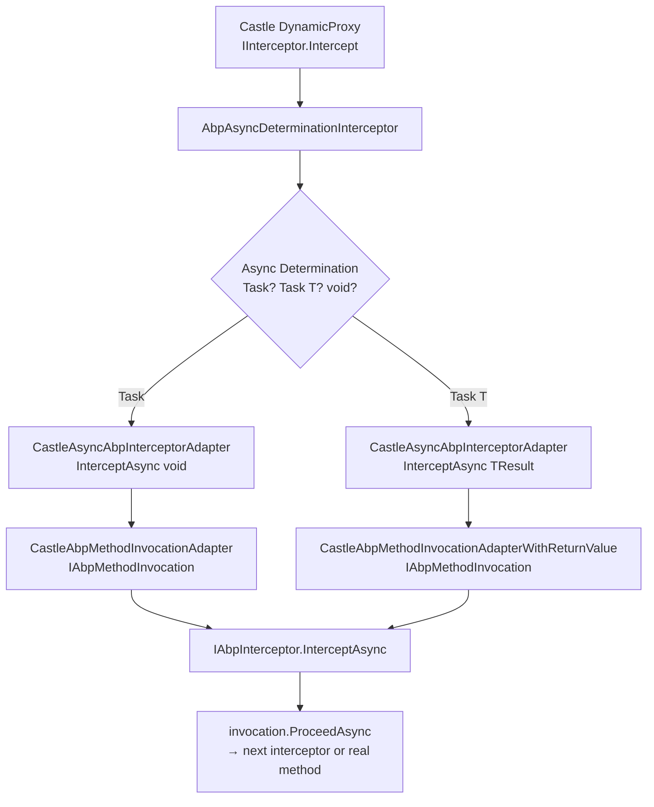

ABP's cross-cutting concerns — unit of work boundaries, audit logging, authorization checks, feature flags, and global feature guards — are all implemented as **interceptors** that wrap service method calls transparently. The interception infrastructure builds on Castle Windsor's dynamic proxy and exposes a clean, framework-agnostic API (`IAbpInterceptor`) that hides the Castle internals.

## The ABP Interceptor Abstraction

### IAbpInterceptor

```csharp
// Volo.Abp.Core — Volo.Abp.DynamicProxy namespace
public interface IAbpInterceptor
{
    Task InterceptAsync(IAbpMethodInvocation invocation);
}
```

Every interceptor receives an `IAbpMethodInvocation` and is responsible for calling `invocation.ProceedAsync()` to continue the pipeline. Interceptors that don't call `ProceedAsync` short-circuit execution (e.g., a failed authorization check).

### AbpInterceptor

`AbpInterceptor` is the abstract base class. It enforces `InterceptAsync` as the single override point:

```csharp
// Volo.Abp.Core — Volo.Abp.DynamicProxy namespace
public abstract class AbpInterceptor : IAbpInterceptor
{
    public abstract Task InterceptAsync(IAbpMethodInvocation invocation);
}
```

All framework interceptors extend `AbpInterceptor` and are registered as `ITransientDependency`, giving each interception its own DI scope.

### IAbpMethodInvocation

`IAbpMethodInvocation` abstracts the in-flight method call:

```csharp
public interface IAbpMethodInvocation
{
    object?[]                            Arguments { get; }
    IReadOnlyDictionary<string, object?> ArgumentsDictionary { get; }
    Type[]?                              GenericArguments { get; }
    object?                              TargetObject { get; }
    MethodInfo                           Method { get; }
    object                               ReturnValue { get; set; }
    Task                                 ProceedAsync();
}
```

Interceptors can:
- Inspect `Method` and `Arguments` before calling `ProceedAsync`
- Modify `Arguments` (mutation) before proceeding
- Read or replace `ReturnValue` after calling `ProceedAsync`
- Short-circuit by throwing an exception without calling `ProceedAsync`

---

## Castle Windsor Adapter

ABP delegates proxy generation to Castle Windsor. The bridge between `IAbpInterceptor` and Castle's `IInterceptor` is a two-layer adapter, all in the `Volo.Abp.Castle.DynamicProxy` namespace.

### CastleAsyncAbpInterceptorAdapter

`CastleAsyncAbpInterceptorAdapter<TInterceptor>` extends Castle's `AsyncInterceptorBase` (from `Castle.Core.AsyncInterceptor`). It wraps the ABP method invocation in the appropriate adapter and calls `IAbpInterceptor.InterceptAsync`:

```csharp
public class CastleAsyncAbpInterceptorAdapter<TInterceptor> : AsyncInterceptorBase
    where TInterceptor : IAbpInterceptor
{
    private readonly TInterceptor _abpInterceptor;

    protected override async Task InterceptAsync(
        IInvocation invocation,
        IInvocationProceedInfo proceedInfo,
        Func<IInvocation, IInvocationProceedInfo, Task> proceed)
    {
        await _abpInterceptor.InterceptAsync(
            new CastleAbpMethodInvocationAdapter(invocation, proceedInfo, proceed)
        );
    }

    protected override async Task<TResult> InterceptAsync<TResult>(
        IInvocation invocation,
        IInvocationProceedInfo proceedInfo,
        Func<IInvocation, IInvocationProceedInfo, Task<TResult>> proceed)
    {
        var adapter = new CastleAbpMethodInvocationAdapterWithReturnValue<TResult>(
            invocation, proceedInfo, proceed);
        await _abpInterceptor.InterceptAsync(adapter);
        return (TResult)adapter.ReturnValue;
    }
}
```

`AsyncInterceptorBase` determines whether the intercepted method returns `Task`, `Task<T>`, `ValueTask`, or `void` and routes to the appropriate overload — this is the "async determination" step.

### AbpAsyncDeterminationInterceptor

`AbpAsyncDeterminationInterceptor<TInterceptor>` (in `Volo.Abp.Castle.DynamicProxy`) is the Castle `IInterceptor` that is actually registered against proxied types. It composes `AsyncDeterminationInterceptor` with `CastleAsyncAbpInterceptorAdapter`:

```csharp
public class AbpAsyncDeterminationInterceptor<TInterceptor> : AsyncDeterminationInterceptor
    where TInterceptor : IAbpInterceptor
{
    public AbpAsyncDeterminationInterceptor(TInterceptor abpInterceptor)
        : base(new CastleAsyncAbpInterceptorAdapter<TInterceptor>(abpInterceptor))
    {
    }
}
```

### CastleAbpMethodInvocationAdapter

`CastleAbpMethodInvocationAdapter` implements `IAbpMethodInvocation` by delegating to Castle's `IInvocation`. `ProceedAsync` calls the Castle `proceed` delegate, which advances the proxy chain:

```csharp
public class CastleAbpMethodInvocationAdapter
    : CastleAbpMethodInvocationAdapterBase, IAbpMethodInvocation
{
    protected IInvocationProceedInfo ProceedInfo { get; }
    protected Func<IInvocation, IInvocationProceedInfo, Task> Proceed { get; }

    public override async Task ProceedAsync()
    {
        await Proceed(Invocation, ProceedInfo);
    }
}
```

For methods with return values, `CastleAbpMethodInvocationAdapterWithReturnValue<TResult>` is used instead — it captures the result and exposes it via `ReturnValue`.

---

## Interceptor Registration

ABP uses `IConventionalRegistrar` to register interceptors when services are added to the DI container. Each cross-cutting concern ships its own registrar.

### Pattern

Every interceptor registrar follows the same pattern:

```csharp
// Example: UnitOfWorkInterceptorRegistrar
public static class UnitOfWorkInterceptorRegistrar
{
    public static void RegisterIfNeeded(IOnServiceRegistredContext context)
    {
        if (ShouldIntercept(context.ImplementationType))
        {
            context.Interceptors.TryAdd<UnitOfWorkInterceptor>();
        }
    }

    private static bool ShouldIntercept(Type type)
    {
        return !DynamicProxyIgnoreTypes.Contains(type)
            && (type.IsDefined(typeof(UnitOfWorkAttribute), true)
                || UnitOfWorkHelper.HasUnitOfWorkMethods(type));
    }
}
```

The registrar is called during `OnServiceRegistred` events fired by ABP's `IConventionalRegistrar` implementations. If the type needs interception, `context.Interceptors.TryAdd<TInterceptor>()` adds the Castle interceptor type to the proxy configuration for that service.

### ProxyHelper.GetUnProxiedType

Throughout the framework, `ProxyHelper.GetUnProxiedType(instance)` is used to unwrap Castle-generated proxy types before type comparisons. This prevents interceptors from wrapping each other's proxies and ensures `typeof(MyService)` comparisons succeed even when the resolved object is a proxy.

---

## Built-in Framework Interceptors

<CardGroup cols={2}>
  <Card title="UnitOfWorkInterceptor" icon="database">
    Located in `Volo.Abp.Uow`. Wraps methods decorated with `[UnitOfWork]` or matching naming conventions. Begins a UoW scope, proceeds, then calls `CompleteAsync`. Supports reserved UoW from middleware.
  </Card>
  <Card title="AuditingInterceptor" icon="clipboard">
    Located in `Volo.Abp.Auditing`. Captures method arguments, return values, and exceptions into an `AuditLogInfo`. Runs post-invocation to record execution time and success/failure.
  </Card>
  <Card title="AuthorizationInterceptor" icon="lock">
    Located in `Volo.Abp.Authorization`. Checks `[Authorize]` and `[RequiresPermission]` attributes via `IMethodInvocationAuthorizationService` before calling `ProceedAsync`.
  </Card>
  <Card title="FeatureInterceptor" icon="toggle-on">
    Located in `Volo.Abp.Features`. Checks `[RequiresFeature]` attributes. Throws `AbpAuthorizationException` if any required feature is disabled for the current tenant.
  </Card>
  <Card title="GlobalFeatureInterceptor" icon="flag">
    Located in `Volo.Abp.GlobalFeatures`. Checks `[RequiresGlobalFeature]` attributes. Global features are on/off per-deployment (not per-tenant).
  </Card>
  <Card title="ValidationInterceptor" icon="check-circle">
    Located in `Volo.Abp.Validation`. Validates method arguments using data annotations and `IObjectValidator` before proceeding.
  </Card>
</CardGroup>

### UnitOfWorkInterceptor Detail

```csharp
public class UnitOfWorkInterceptor : AbpInterceptor, ITransientDependency
{
    public override async Task InterceptAsync(IAbpMethodInvocation invocation)
    {
        if (!UnitOfWorkHelper.IsUnitOfWorkMethod(invocation.Method, out var uowAttribute))
        {
            await invocation.ProceedAsync();
            return;
        }

        using (var scope = _serviceScopeFactory.CreateScope())
        {
            var uowManager = scope.ServiceProvider
                .GetRequiredService<IUnitOfWorkManager>();

            // Try to join a reserved UoW started by AbpUnitOfWorkMiddleware
            if (uowManager.TryBeginReserved(
                UnitOfWork.UnitOfWorkReservationName, options))
            {
                await invocation.ProceedAsync();
                await uowManager.Current?.SaveChangesAsync();
                return;
            }

            using (var uow = uowManager.Begin(options))
            {
                await invocation.ProceedAsync();
                await uow.CompleteAsync();
            }
        }
    }
}
```

### AuthorizationInterceptor Detail

```csharp
public class AuthorizationInterceptor : AbpInterceptor, ITransientDependency
{
    public override async Task InterceptAsync(IAbpMethodInvocation invocation)
    {
        await AuthorizeAsync(invocation);
        await invocation.ProceedAsync();
    }

    protected virtual async Task AuthorizeAsync(IAbpMethodInvocation invocation)
    {
        await _methodInvocationAuthorizationService.CheckAsync(
            new MethodInvocationAuthorizationContext(invocation.Method)
        );
    }
}
```

Authorization runs **before** `ProceedAsync`. If `CheckAsync` throws, the method is never executed.

---

## Async vs Sync Invocation Path



`AsyncDeterminationInterceptor` (from `Castle.Core.AsyncInterceptor`) inspects the method's return type to decide which overload of `InterceptAsync` to call. This ensures `async` methods are awaited properly and exceptions from async methods propagate correctly through the interceptor chain.

<Note>
Interceptors are invoked in the order they are added to `context.Interceptors`. The last-added interceptor wraps all earlier ones. ABP framework interceptors are added in a defined order: authorization first, then validation, then features, then auditing, then UoW — so UoW is the innermost wrapper.
</Note>

<Warning>
Only classes registered through ABP's DI infrastructure (via `IConventionalRegistrar`) receive interceptors. Services registered with raw `services.AddTransient<T>()` bypassing ABP's conventional registration will not have proxies applied.
</Warning>
