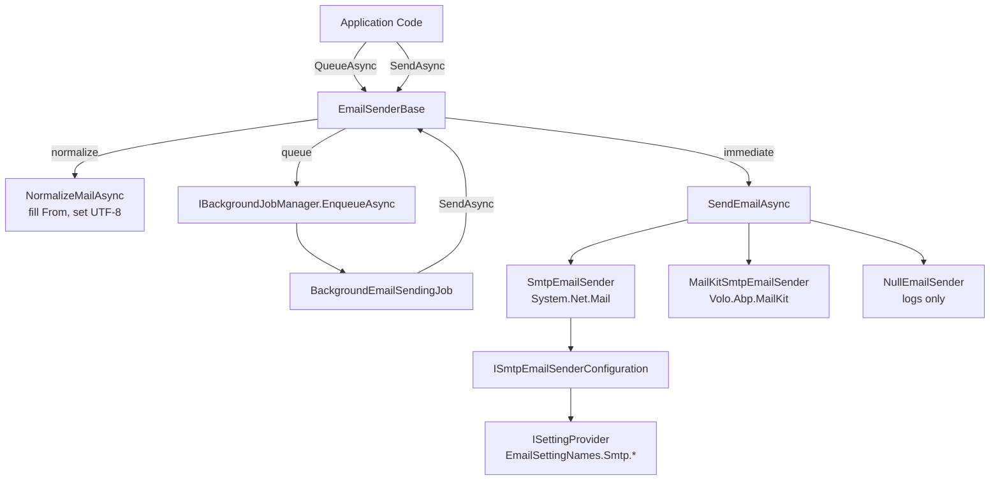

ABP's emailing infrastructure provides a unified `IEmailSender` abstraction that supports both immediate delivery and background queuing. The default implementation is SMTP-based and reads its configuration from ABP's settings system, making it reconfigurable at runtime without redeployment.

## IEmailSender

`IEmailSender` exposes two groups of methods: `SendAsync` for immediate delivery and `QueueAsync` for deferred delivery via the background job system:

```csharp
public interface IEmailSender
{
    // Immediate delivery — simplified overloads
    Task SendAsync(string to, string? subject, string? body,
        bool isBodyHtml = true,
        AdditionalEmailSendingArgs? additionalEmailSendingArgs = null);

    Task SendAsync(string from, string to, string? subject, string? body,
        bool isBodyHtml = true,
        AdditionalEmailSendingArgs? additionalEmailSendingArgs = null);

    // Immediate delivery — raw MailMessage
    Task SendAsync(MailMessage mail, bool normalize = true);

    // Background queue
    Task QueueAsync(string to, string subject, string body,
        bool isBodyHtml = true,
        AdditionalEmailSendingArgs? additionalEmailSendingArgs = null);

    Task QueueAsync(string from, string to, string subject, string body,
        bool isBodyHtml = true,
        AdditionalEmailSendingArgs? additionalEmailSendingArgs = null);
}
```

`AdditionalEmailSendingArgs` carries optional CC addresses and file attachments (as `byte[]`).

---

## EmailSenderBase

`EmailSenderBase` is the abstract base class that implements all `IEmailSender` members except the low-level `SendEmailAsync(MailMessage)`. Subclasses only override `SendEmailAsync`.

### BuildMailMessage

The `SendAsync` string overloads call `BuildMailMessage`, which constructs a `MailMessage` and attaches any CC recipients and file attachments from `AdditionalEmailSendingArgs`:

```csharp
protected virtual MailMessage BuildMailMessage(
    string? from, string to, string? subject, string? body,
    bool isBodyHtml = true,
    AdditionalEmailSendingArgs? additionalEmailSendingArgs = null)
{
    var message = from == null
        ? new MailMessage { To = { to }, Subject = subject, Body = body, IsBodyHtml = isBodyHtml }
        : new MailMessage(from, to, subject, body) { IsBodyHtml = isBodyHtml };

    if (additionalEmailSendingArgs?.Attachments != null)
    {
        foreach (var attachment in additionalEmailSendingArgs.Attachments
                     .Where(x => x.File != null))
        {
            var fileStream = new MemoryStream(attachment.File!);
            fileStream.Seek(0, SeekOrigin.Begin);
            message.Attachments.Add(new Attachment(fileStream, attachment.Name));
        }
    }

    if (additionalEmailSendingArgs?.CC != null)
    {
        foreach (var cc in additionalEmailSendingArgs.CC)
            message.CC.Add(cc);
    }

    return message;
}
```

### Normalization

When `normalize = true` (the default for `SendAsync(MailMessage, bool)`), `NormalizeMailAsync` is called before dispatch:

```csharp
protected virtual async Task NormalizeMailAsync(MailMessage mail)
{
    if (mail.From == null || mail.From.Address.IsNullOrEmpty())
    {
        mail.From = new MailAddress(
            await Configuration.GetDefaultFromAddressAsync(),
            await Configuration.GetDefaultFromDisplayNameAsync(),
            Encoding.UTF8
        );
    }
    if (mail.HeadersEncoding == null) mail.HeadersEncoding = Encoding.UTF8;
    if (mail.SubjectEncoding == null) mail.SubjectEncoding = Encoding.UTF8;
    if (mail.BodyEncoding == null)    mail.BodyEncoding    = Encoding.UTF8;
}
```

`Configuration` is an `IEmailSenderConfiguration` (resolved via the constructor), which has `GetDefaultFromAddressAsync` and `GetDefaultFromDisplayNameAsync`. The concrete `SmtpEmailSenderConfiguration` wraps `ISettingProvider`.

This ensures a consistent `From` address (from settings) and UTF-8 encoding on all headers, subject, and body — without requiring the caller to configure these manually.

### Background Queuing

`QueueAsync` first validates the recipient address, then enqueues a `BackgroundEmailSendingJobArgs` via `IBackgroundJobManager`. If no background job manager is available (`IsAvailable()` returns false), it falls back to synchronous delivery:

```csharp
public virtual async Task QueueAsync(string to, string subject,
    string body, bool isBodyHtml = true,
    AdditionalEmailSendingArgs? additionalEmailSendingArgs = null)
{
    await ValidateEmailAddressAsync(to);

    if (!BackgroundJobManager.IsAvailable())
    {
        await SendAsync(to, subject, body, isBodyHtml, additionalEmailSendingArgs);
        return;
    }

    await BackgroundJobManager.EnqueueAsync(
        new BackgroundEmailSendingJobArgs
        {
            TenantId = CurrentTenant.Id,
            To = to,
            Subject = subject,
            Body = body,
            IsBodyHtml = isBodyHtml,
            AdditionalEmailSendingArgs = additionalEmailSendingArgs
        }
    );
}
```

The `TenantId` is captured from `ICurrentTenant` at enqueue time, ensuring the email is sent in the correct tenant context when the background job runs. The `QueueAsync(from, to, ...)` overload additionally captures `From` in `BackgroundEmailSendingJobArgs`.

---

## BackgroundEmailSendingJob

`BackgroundEmailSendingJob` is the background job that processes queued emails. It is a simple pass-through to `IEmailSender.SendAsync`:

```csharp
public class BackgroundEmailSendingJob
    : AsyncBackgroundJob<BackgroundEmailSendingJobArgs>, ITransientDependency
{
    public async override Task ExecuteAsync(BackgroundEmailSendingJobArgs args)
    {
        if (args.From.IsNullOrWhiteSpace())
        {
            await EmailSender.SendAsync(
                args.To, args.Subject, args.Body,
                args.IsBodyHtml, args.AdditionalEmailSendingArgs);
        }
        else
        {
            await EmailSender.SendAsync(
                args.From!, args.To, args.Subject, args.Body,
                args.IsBodyHtml, args.AdditionalEmailSendingArgs);
        }
    }
}
```

`BackgroundEmailSendingJobArgs` implements `IMultiTenant` via the `TenantId` property, so `BackgroundJobExecuter` automatically switches to the correct tenant context when the job runs.

Because the job calls `SendAsync` (not `QueueAsync`), there is no recursive queuing risk.

---

## SMTP Implementation

`SmtpEmailSender` is the default concrete implementation, registered as `ITransientDependency`:

```csharp
public class SmtpEmailSender : EmailSenderBase, ISmtpEmailSender, ITransientDependency
{
    public async Task<SmtpClient> BuildClientAsync()
    {
        var host = await SmtpConfiguration.GetHostAsync();
        var port = await SmtpConfiguration.GetPortAsync();
        var smtpClient = new SmtpClient(host, port);

        try
        {
            if (await SmtpConfiguration.GetEnableSslAsync())
                smtpClient.EnableSsl = true;

            if (await SmtpConfiguration.GetUseDefaultCredentialsAsync())
            {
                smtpClient.UseDefaultCredentials = true;
            }
            else
            {
                smtpClient.UseDefaultCredentials = false;
                var userName = await SmtpConfiguration.GetUserNameAsync();
                if (!userName.IsNullOrEmpty())
                {
                    var password = await SmtpConfiguration.GetPasswordAsync();
                    var domain = await SmtpConfiguration.GetDomainAsync();
                    smtpClient.Credentials = !domain.IsNullOrEmpty()
                        ? new NetworkCredential(userName, password, domain)
                        : new NetworkCredential(userName, password);
                }
            }
            return smtpClient;
        }
        catch
        {
            smtpClient.Dispose();
            throw;
        }
    }

    protected async override Task SendEmailAsync(MailMessage mail)
    {
        using (var smtpClient = await BuildClientAsync())
        {
            Logger.LogWarning(
                "We don't recommend using SmtpClient for new development " +
                "because SmtpClient doesn't support many modern protocols. " +
                "Use MailKit or other libraries instead.");
            await smtpClient.SendMailAsync(mail);
        }
    }
}
```

<Warning>
`SmtpEmailSender` uses `System.Net.Mail.SmtpClient`, which Microsoft has deprecated for new development. The implementation logs a `LogWarning` on every send. Use the MailKit integration (`Volo.Abp.MailKit`) for production systems.
</Warning>

---

## Settings: EmailSettingNames

All SMTP configuration is stored in ABP's settings system. Settings are read asynchronously via `ISmtpEmailSenderConfiguration`, which wraps `ISettingProvider`:

```csharp
public static class EmailSettingNames
{
    public const string DefaultFromAddress     = "Abp.Mailing.DefaultFromAddress";
    public const string DefaultFromDisplayName = "Abp.Mailing.DefaultFromDisplayName";

    public static class Smtp
    {
        public const string Host                  = "Abp.Mailing.Smtp.Host";
        public const string Port                  = "Abp.Mailing.Smtp.Port";
        public const string UserName              = "Abp.Mailing.Smtp.UserName";
        public const string Password              = "Abp.Mailing.Smtp.Password";
        public const string Domain                = "Abp.Mailing.Smtp.Domain";
        public const string EnableSsl             = "Abp.Mailing.Smtp.EnableSsl";
        public const string UseDefaultCredentials = "Abp.Mailing.Smtp.UseDefaultCredentials";
    }
}
```

Settings are defined in `EmailSettingProvider` and can be overridden at the global, tenant, or user level through ABP's layered settings system. This means SMTP host/credentials can be changed per tenant without touching code.

---

## MailKit Integration

`Volo.Abp.MailKit` replaces `SmtpEmailSender` with a MailKit-based implementation that supports:

- Modern SMTP AUTH mechanisms (OAUTH2, XOAUTH2)
- STARTTLS and implicit TLS
- Connection pooling

Install the package and add `AbpMailKitModule` to your module dependencies. MailKit's sender is registered with `[Dependency(ReplaceServices = true)]` and automatically overrides `SmtpEmailSender`.

---

## NullEmailSender

`NullEmailSender` extends `EmailSenderBase` with a no-op `SendEmailAsync`. It logs a `LogWarning` indicating it is active, then logs the email details (To, CC, Subject, Body) at `LogDebug`:

```csharp
public class NullEmailSender : EmailSenderBase
{
    public NullEmailSender(
        ICurrentTenant currentTenant,
        IEmailSenderConfiguration configuration,
        IBackgroundJobManager backgroundJobManager)
        : base(currentTenant, configuration, backgroundJobManager) { }

    protected override Task SendEmailAsync(MailMessage mail)
    {
        Logger.LogWarning("USING NullEmailSender!");
        Logger.LogDebug("SendEmailAsync:");
        Logger.LogDebug(mail.To.ToString());
        Logger.LogDebug(mail.CC.ToString());
        Logger.LogDebug(mail.Subject);
        Logger.LogDebug(mail.Body);
        return Task.FromResult(0);
    }
}
```

Register it in test projects to capture email calls without network access:

```csharp
// In test module ConfigureServices:
context.Services.AddTransient<IEmailSender, NullEmailSender>();
```

<Tip>
In integration tests, inject `NullEmailSender` and check the logger output (via a mock `ILogger`) or use a dedicated `FakeEmailSender` that collects sent emails in a list for assertion.
</Tip>

---

## Architecture Diagram



| Setting Key | Default | Description |
|---|---|---|
| `Abp.Mailing.DefaultFromAddress` | — | Sender address when `From` is not set |
| `Abp.Mailing.DefaultFromDisplayName` | — | Sender display name |
| `Abp.Mailing.Smtp.Host` | — | SMTP server hostname |
| `Abp.Mailing.Smtp.Port` | 25 | SMTP port |
| `Abp.Mailing.Smtp.EnableSsl` | false | Enable SSL/TLS |
| `Abp.Mailing.Smtp.UseDefaultCredentials` | true | Use Windows default credentials |
| `Abp.Mailing.Smtp.UserName` | — | SMTP username |
| `Abp.Mailing.Smtp.Password` | — | SMTP password |
| `Abp.Mailing.Smtp.Domain` | — | Windows domain for credentials |
