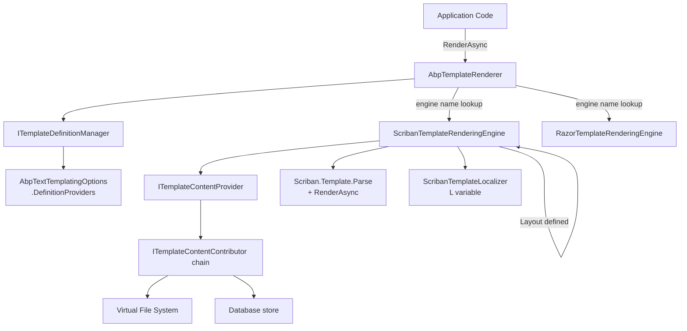

ABP's text templating system provides a structured way to define, store, localize, and render templates backed by pluggable rendering engines. The system is used internally for email bodies, notification messages, and any scenario where text content needs to be data-driven and localizable without hard-coded strings.

## Core Interfaces

### ITemplateRenderer

`ITemplateRenderer` is the primary API for rendering templates. It accepts the template name, an optional model, an optional culture override, and an optional global context dictionary:

```csharp
public interface ITemplateRenderer
{
    Task<string> RenderAsync(
        string templateName,
        object? model = null,
        string? cultureName = null,
        Dictionary<string, object>? globalContext = null
    );
}
```

The `globalContext` allows injecting shared objects (e.g., a base URL or a localization helper) that are accessible throughout the template and any layout it references. If `cultureName` is `null`, `CultureInfo.CurrentUICulture` is used.

The concrete implementation, `AbpTemplateRenderer`, resolves the template definition, looks up the `RenderEngine` name in `AbpTextTemplatingOptions.RenderingEngines`, creates a DI scope, and delegates to the matching `ITemplateRenderingEngine`:

```csharp
public class AbpTemplateRenderer : ITemplateRenderer, ITransientDependency
{
    public virtual async Task<string> RenderAsync(
        string templateName, object? model = null,
        string? cultureName = null,
        Dictionary<string, object>? globalContext = null)
    {
        var templateDefinition = await TemplateDefinitionManager.GetAsync(templateName);
        var renderEngine = templateDefinition.RenderEngine
            ?? Options.DefaultRenderingEngine;

        var providerType = Options.RenderingEngines.GetOrDefault(renderEngine!);

        using (var scope = ServiceScopeFactory.CreateScope())
        {
            var engine = (ITemplateRenderingEngine)
                scope.ServiceProvider.GetRequiredService(providerType);
            return await engine.RenderAsync(templateName, model, cultureName, globalContext);
        }
    }
}
```

### ITemplateRenderingEngine

`ITemplateRenderingEngine` is the contract all rendering engines implement:

```csharp
public interface ITemplateRenderingEngine
{
    string Name { get; }
    bool IsSandboxed { get; }

    Task<string> RenderAsync(
        string templateName,
        object? model = null,
        string? cultureName = null,
        Dictionary<string, object>? globalContext = null
    );
}
```

Engines are registered in `AbpTextTemplatingOptions.RenderingEngines` as a `Dictionary<string, Type>` mapping engine name → implementation type.

### ITemplateContentProvider

`ITemplateContentProvider` resolves the raw template string for a given template definition and culture:

```csharp
public interface ITemplateContentProvider
{
    Task<string?> GetContentOrNullAsync(
        string templateName,
        string? cultureName = null,
        bool tryDefaults = true,
        bool useCurrentCultureIfCultureNameIsNull = true
    );

    Task<string?> GetContentOrNullAsync(
        TemplateDefinition templateDefinition,
        string? cultureName = null,
        bool tryDefaults = true,
        bool useCurrentCultureIfCultureNameIsNull = true
    );
}
```

`tryDefaults = true` tells the provider to fall back to the `DefaultCultureName` or the neutral template if the requested culture's content is unavailable. Content can come from the Virtual File System, database, or any custom `ITemplateContentContributor` registered in `AbpTextTemplatingOptions.ContentContributors`.

### ITemplateDefinitionManager

`ITemplateDefinitionManager` provides access to all registered `TemplateDefinition` objects at runtime:

```csharp
public interface ITemplateDefinitionManager
{
    Task<TemplateDefinition> GetAsync(string name);
    Task<IReadOnlyList<TemplateDefinition>> GetAllAsync();
    Task<TemplateDefinition?> GetOrNullAsync(string name);
}
```

---

## TemplateDefinition

`TemplateDefinition` is the metadata descriptor for a template. Key fields:

```csharp
public class TemplateDefinition : IHasNameWithLocalizableDisplayName
{
    public const int MaxNameLength = 128;

    public string Name { get; }                      // max 128 chars
    public ILocalizableString DisplayName { get; set; }
    public bool IsLayout { get; }                    // true = layout template
    public string? Layout { get; set; }              // layout template name
    public string? LocalizationResourceName { get; set; }
    public bool IsInlineLocalized { get; set; }
    public string? DefaultCultureName { get; }
    public string? RenderEngine { get; set; }        // e.g., "Scriban"
    public Dictionary<string, object?> Properties { get; }
}
```

Two constructor overloads exist. The first accepts a `Type localizationResource` parameter and extracts the resource name via `LocalizationResourceNameAttribute.GetName`. The second accepts a raw `string? localizationResourceName`:

```csharp
// Overload 1 – takes a Type
public TemplateDefinition(
    string name,
    Type localizationResource,
    ILocalizableString? displayName = null,
    bool isLayout = false,
    string? layout = null,
    string? defaultCultureName = null)

// Overload 2 – takes a string name
public TemplateDefinition(
    string name,
    string? localizationResourceName = null,
    ILocalizableString? displayName = null,
    bool isLayout = false,
    string? layout = null,
    string? defaultCultureName = null)
```

Fluent builders simplify setup:

```csharp
new TemplateDefinition(
    name: "WelcomeEmail",
    localizationResource: typeof(MyLocalizationResource),
    layout: "EmailLayout",
    defaultCultureName: "en"
).WithRenderEngine(ScribanTemplateRenderingEngine.EngineName);
```

`WithProperty(key, value)` stores arbitrary metadata that provider-specific code can read. `WithRenderEngine` sets `RenderEngine`, which `AbpTemplateRenderer` uses to dispatch to the correct rendering engine.

---

## AbpTextTemplatingOptions

`AbpTextTemplatingOptions` is the central configuration class for the templating system:

```csharp
public class AbpTextTemplatingOptions
{
    public ITypeList<ITemplateDefinitionProvider> DefinitionProviders { get; }
    public ITypeList<ITemplateContentContributor> ContentContributors { get; }
    public IDictionary<string, Type> RenderingEngines { get; }
    public string? DefaultRenderingEngine { get; set; }
    public HashSet<string> DeletedTemplates { get; }
}
```

`DefinitionProviders` is populated by implementations of `ITemplateDefinitionProvider`. `ContentContributors` are tried in order to locate template content. `RenderingEngines` maps engine names (e.g., `"Scriban"`) to their `ITemplateRenderingEngine` implementation types.

---

## ITemplateDefinitionProvider

Templates are registered by implementing `ITemplateDefinitionProvider`:

```csharp
public interface ITemplateDefinitionProvider
{
    void PreDefine(ITemplateDefinitionContext context);
    void Define(ITemplateDefinitionContext context);
    void PostDefine(ITemplateDefinitionContext context);
}
```

The three-phase lifecycle (Pre → Define → Post) allows modules to define templates and then allows other modules to customize or extend them in `PostDefine`. ABP discovers all `ITemplateDefinitionProvider` implementations via the `AbpTextTemplatingOptions.DefinitionProviders` type list during module initialization.

---

## Scriban Rendering Engine

`Volo.Abp.TextTemplating.Scriban` provides the default rendering engine using the [Scriban](https://github.com/scriban/scriban) language.

### ScribanTemplateRenderingEngine

```csharp
public class ScribanTemplateRenderingEngine : TemplateRenderingEngineBase, ITransientDependency
{
    public const string EngineName = "Scriban";
    public override string Name => EngineName;
    public override bool IsSandboxed => true;
}
```

`IsSandboxed = true` means only public properties (not methods) on injected objects are accessible from templates, enforced via the `MemberFilter`:

```csharp
protected virtual bool IsMemberAllowed(MemberInfo member)
{
    return member is PropertyInfo;
}
```

### Rendering Pipeline

<Steps>
  <Step title="Resolve template definition">
    `TemplateDefinitionManager.GetAsync(templateName)` retrieves the `TemplateDefinition`, including layout name and render engine hint.
  </Step>
  <Step title="Fetch raw content">
    `GetContentOrNullAsync(templateDefinition)` (from `TemplateRenderingEngineBase`) calls `ITemplateContentProvider` with the current culture. Falls back to `DefaultCultureName` if the culture-specific content is absent.
  </Step>
  <Step title="Build Scriban context">
    A `TemplateContext` is constructed with a `ScriptObject` populated from `globalContext` and the `model` (accessible in templates as `{{ model.PropertyName }}`). If `LocalizationResourceName` is set, a `ScribanTemplateLocalizer` is injected as `L`.
  </Step>
  <Step title="Parse and render">
    `Template.Parse(templateContent).RenderAsync(context)` produces the rendered string.
  </Step>
  <Step title="Apply layout">
    If the definition has a `Layout`, the rendered content is stored in `globalContext["content"]` and the layout template is rendered recursively using the same global context.
  </Step>
</Steps>

```csharp
protected virtual async Task<string> RenderInternalAsync(
    string templateName,
    Dictionary<string, object> globalContext,
    object? model = null)
{
    var templateDefinition = await TemplateDefinitionManager.GetAsync(templateName);
    var renderedContent = await RenderSingleTemplateAsync(
        templateDefinition, globalContext, model);

    if (templateDefinition.Layout != null)
    {
        globalContext["content"] = renderedContent;
        renderedContent = await RenderInternalAsync(
            templateDefinition.Layout, globalContext);
    }
    return renderedContent;
}
```

### Localization in Scriban Templates

When `LocalizationResourceName` is set on the `TemplateDefinition`, `ScribanTemplateLocalizer` is pushed into the template context as `L`. This exposes the ABP localization pipeline inside templates:

```
Hello, {{ model.UserName }}!
{{ L["WelcomeMessage"] }}
```

`ScribanTemplateLocalizer` wraps an `IStringLocalizer` and exposes localization as an indexer callable from Scriban syntax.

---

## Razor Rendering Engine

`Volo.Abp.TextTemplating.Razor` provides a Razor-based engine. Register it by adding the module and using `WithRenderEngine("Razor")` on your template definition. The Razor engine compiles templates at runtime using Roslyn and caches compiled assemblies.

---

## Localized Templates

A template can be split by culture:

- A **neutral** template (no culture suffix) serves as the fallback
- Culture-specific variants use the culture name as a suffix in the content provider

`IsInlineLocalized = true` means the template contains all cultures inline (using Scriban `if` blocks on `model.CultureName`). `IsInlineLocalized = false` (default) means each culture is a separate content entry, resolved by `ITemplateContentProvider` at render time.

---

## Email Integration

ABP's emailing infrastructure renders email bodies through the text templating system. Define an email template:

```csharp
// In your ITemplateDefinitionProvider.Define():
context.Add(
    new TemplateDefinition(
        name: "PasswordResetEmail",
        localizationResource: typeof(MyLocalizationResource),
        layout: "EmailLayout"
    ).WithRenderEngine(ScribanTemplateRenderingEngine.EngineName)
);
```

Then render the template before sending:

```csharp
public class PasswordResetEmailSender
{
    private readonly ITemplateRenderer _templateRenderer;
    private readonly IEmailSender _emailSender;

    public async Task SendAsync(string to, string resetLink)
    {
        var body = await _templateRenderer.RenderAsync(
            "PasswordResetEmail",
            new { ResetLink = resetLink }
        );
        await _emailSender.SendAsync(to, "Reset your password", body);
    }
}
```

---

## Architecture Overview



<Note>
The `globalContext` dictionary is passed by reference through the entire layout rendering chain. Modifications made in a child template (e.g., setting `globalContext["title"]`) are visible to the layout template. Use this to implement template-specific metadata like page titles.
</Note>

<Tip>
Store template content in the database using `Volo.Abp.TextTemplating.EntityFrameworkCore`. This lets administrators edit template bodies at runtime through the ABP Suite UI without redeployment.
</Tip>
