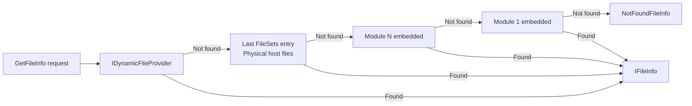

ABP's Virtual File System (VFS) is the mechanism by which framework modules ship Razor views, JavaScript files, CSS stylesheets, and other static assets inside NuGet packages — without requiring consumers to manually copy files into their projects. It builds a unified `IFileProvider` hierarchy by layering physical files, embedded assembly resources, and dynamically injected files.

## IVirtualFileProvider

`IVirtualFileProvider` extends ASP.NET Core's `IFileProvider` with no additional members. It is registered as a singleton and is the canonical entry point for reading virtual files:

```csharp
public interface IVirtualFileProvider : IFileProvider { }
```

Any code that accepts `IFileProvider` (Razor views, `.resx` discovery, localization) can receive `IVirtualFileProvider` — ABP integrates VFS into the ASP.NET Core infrastructure automatically.

---

## VirtualFileProvider: Composited Layers

`VirtualFileProvider` is the singleton implementation. Its constructor assembles a `CompositeFileProvider` from all registered file sets, with the **dynamic provider first** and file sets in **reverse registration order** (last registered wins):

```csharp
public class VirtualFileProvider : IVirtualFileProvider, ISingletonDependency
{
    private readonly IFileProvider _hybridFileProvider;

    public VirtualFileProvider(
        IOptions<AbpVirtualFileSystemOptions> options,
        IDynamicFileProvider dynamicFileProvider)
    {
        _hybridFileProvider = CreateHybridProvider(dynamicFileProvider);
    }

    protected virtual IFileProvider CreateHybridProvider(
        IDynamicFileProvider dynamicFileProvider)
    {
        var fileProviders = new List<IFileProvider>();
        fileProviders.Add(dynamicFileProvider);

        foreach (var fileSet in _options.FileSets.AsEnumerable().Reverse())
        {
            fileProviders.Add(fileSet.FileProvider);
        }

        return new CompositeFileProvider(fileProviders);
    }
}
```

Resolution priority (highest to lowest):
1. `IDynamicFileProvider` — runtime-injected files
2. Last registered `VirtualFileSetInfo` — typically the host application's physical files
3. Earlier registrations — framework and module embedded resources

---

## AbpVirtualFileSystemOptions and VirtualFileSetList

`AbpVirtualFileSystemOptions` holds a `VirtualFileSetList` (a `List<VirtualFileSetInfo>`):

```csharp
public class AbpVirtualFileSystemOptions
{
    public VirtualFileSetList FileSets { get; }
}

public class VirtualFileSetList : List<VirtualFileSetInfo> { }
```

Each `VirtualFileSetInfo` wraps an `IFileProvider`. The host application's physical files are typically added last via `AddEmbedded<T>()` extension calls on the options.

---

## Embedding Resources: EmbeddedVirtualFileSetInfo

`EmbeddedVirtualFileSetInfo` carries the assembly reference and an optional base folder, linking the embedded resource manifest to a virtual path:

```csharp
public class EmbeddedVirtualFileSetInfo : VirtualFileSetInfo
{
    public Assembly Assembly { get; }
    public string? BaseFolder { get; }

    public EmbeddedVirtualFileSetInfo(
        IFileProvider fileProvider,
        Assembly assembly,
        string? baseFolder = null)
        : base(fileProvider)
    {
        Assembly = assembly;
        BaseFolder = baseFolder;
    }
}
```

Calling `options.FileSets.AddEmbedded<MyModule>()` in a module's `ConfigureServices` creates one of these entries backed by an `AbpEmbeddedFileProvider`.

---

## AbpEmbeddedFileProvider

`AbpEmbeddedFileProvider` reads the assembly's embedded resource manifest on first access (using `Lazy<Dictionary<string, IFileInfo>>`). It converts .NET manifest resource paths (e.g., `MyModule.Pages.Index.cshtml`) to virtual paths (e.g., `/Pages/Index.cshtml`) by:

1. Stripping the `BaseNamespace` prefix
2. Splitting on `.` and treating the last two segments as `filename.extension`
3. Joining the remaining segments with `/` as directory parts

```csharp
private string ConvertToRelativePath(string resourceName)
{
    if (!BaseNamespace.IsNullOrEmpty())
    {
        resourceName = resourceName.Substring(BaseNamespace!.Length + 1);
    }
    var pathParts = resourceName.Split('.');
    if (pathParts.Length <= 2) return resourceName;

    var folder = pathParts.Take(pathParts.Length - 2).JoinAsString("/");
    var fileName = pathParts[pathParts.Length - 2] + "." + pathParts[pathParts.Length - 1];
    return folder + "/" + fileName;
}
```

<Note>
This path reconstruction assumes filenames contain exactly one dot (the extension). Files with multiple dots in the name (e.g., `my.file.js`) require a `[EmbeddedResourcePrefix]` or manual namespace adjustment to avoid incorrect path splitting.
</Note>

Directories are synthesised recursively — if `/Pages/Account/Login.cshtml` is found, `AbpEmbeddedFileProvider` also creates virtual directory entries for `/Pages/Account` and `/Pages`.

### Last-Modified Time

To enable caching correctness, the provider reads `File.GetLastWriteTimeUtc(Assembly.Location)` as the last-modified time for all resources in that assembly. This means touching the DLL invalidates all virtual file cache entries for that module.

---

## IDynamicFileProvider

`IDynamicFileProvider` adds runtime file injection on top of `IFileProvider`. It is the **first** provider checked in the composite:

```csharp
public interface IDynamicFileProvider : IFileProvider
{
    void AddOrUpdate(IFileInfo fileInfo);
    bool Delete(string filePath);
}
```

ABP uses `IDynamicFileProvider` internally to support features like:
- Text template content stored in database being exposed as virtual files
- Runtime generation of localization resources

Call `AddOrUpdate` with any `IFileInfo` implementation to make a file immediately visible through `IVirtualFileProvider`.

---

## Development-Time Physical File Override

During development you often want to edit a module's views in-place rather than rebuilding the assembly. ABP supports this by registering a `PhysicalFileProvider` pointing at the module's source directory **on top of** the embedded files.

Call `ReplaceEmbeddedByPhysical<TModule>` to override an embedded set with a physical directory:

```csharp
// In the host application's ConfigureServices (development only)
Configure<AbpVirtualFileSystemOptions>(options =>
{
    options.FileSets.ReplaceEmbeddedByPhysical<MyModuleModule>(
        Path.Combine(hostingEnvironment.ContentRootPath,
            "..\\MyModule\\src\\MyModule")
    );
});
```

Because `FileSets` are resolved in reverse order, the physical provider appended last takes precedence, shadowing the embedded entries.

---

## How Modules Ship Assets

Framework modules embed their views, JS, and CSS into the DLL by:

1. Setting `<EmbeddedResource Include="**\*.cshtml" />` (or `js`, `css`) in the `.csproj`
2. Calling `options.FileSets.AddEmbedded<TModule>()` in `ConfigureServices`
3. Tagging view files with `<GenerateEmbeddedFilesManifest>true</GenerateEmbeddedFilesManifest>` to produce the manifest used by `EmbeddedFileProvider`

```csharp
// In a module's ConfigureServices:
public override void ConfigureServices(ServiceConfigurationContext context)
{
    Configure<AbpVirtualFileSystemOptions>(options =>
    {
        options.FileSets.AddEmbedded<MyModule>();
    });
}
```

---

## Resolution Flow Diagram



<Tip>
ABP integrates `IVirtualFileProvider` with ASP.NET Core's static file middleware and Razor view engine through `AbpRazorPagesOptions` and related infrastructure. You do not need to wire it manually — modules that call `AddEmbedded` in `ConfigureServices` automatically become the source for Razor view discovery.
</Tip>
