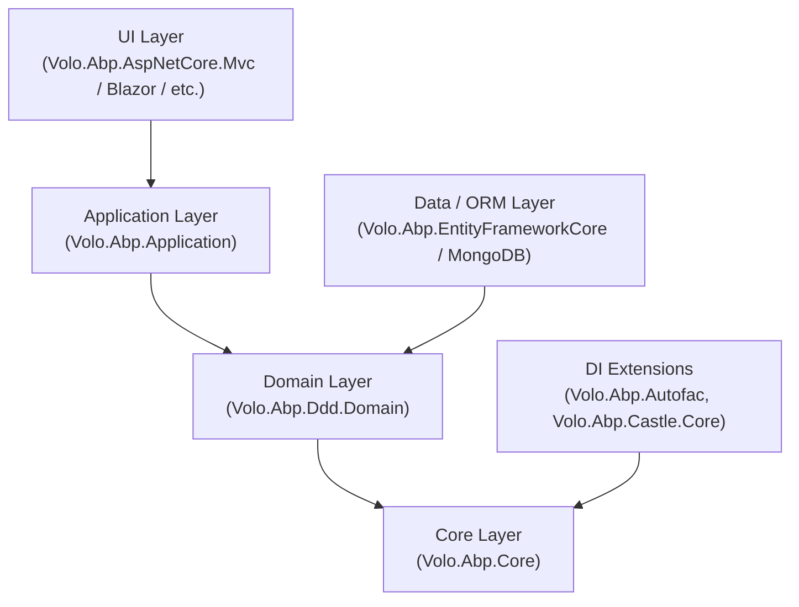

ABP Framework is an open-source ASP.NET Core application framework that provides a complete infrastructure for building modular, multi-tenant enterprise applications. This page covers what ABP is, the key architectural decisions baked into the framework, and how its package layers relate to one another — giving you the map you need before reading the deeper subsystem docs.

## Framework Classification

ABP is not a code generator or a CMS. It is a **runtime framework** that you depend on as a set of NuGet packages. Its core responsibilities are:

- Composing an application from independently versioned **modules** via a dependency graph resolved at startup from `[DependsOn]` attributes
- Running a deterministic **lifecycle** (PreConfigureServices → ConfigureServices → PostConfigureServices → OnPreApplicationInitialization → OnApplicationInitialization → OnPostApplicationInitialization → OnApplicationShutdown) across every loaded module
- Providing **convention-based dependency injection** on top of Microsoft's `IServiceCollection` using marker interfaces and `DependencyAttribute`
- Layering **Domain-Driven Design** building blocks (Entities, Repositories, Domain Services, Application Services) on top of those primitives
- Offering opt-in cross-cutting concerns: auditing, authorization, validation, event bus, multi-tenancy, localization, and more — each packaged as its own ABP module

The entry point to any ABP application is a single **startup module** type derived from `AbpModule`. Everything else is discovered by following that module's `[DependsOn]` attributes recursively via `AbpModuleHelper.FindAllModuleTypes`.

## Key Architectural Decisions

<CardGroup cols={2}>
  <Card title="Startup-module-first" icon="flag">
    The application is bootstrapped from one concrete `AbpModule` subclass. All other modules are pulled in via `[DependsOn]`, not via assembly scanning of `bin/`. Module types must be non-abstract, non-generic classes implementing `IAbpModule`.
  </Card>
  <Card title="Sync + async lifecycle duality" icon="arrows-rotate">
    Every lifecycle hook ships both a synchronous and an `Async` overload. `AbpModule` delegates sync calls to the async path, so only one implementation is needed. `ModuleManager` exposes both `InitializeModulesAsync` and `InitializeModules`.
  </Card>
  <Card title="IServiceCollection compatibility" icon="puzzle-piece">
    ABP's conventional registrar writes to standard `IServiceCollection`. Swapping in Autofac is a single line; the framework itself never breaks that contract. `DefaultConventionalRegistrar` extends `ConventionalRegistrarBase` and respects the full standard `ServiceDescriptor` pipeline.
  </Card>
  <Card title="Plugin-first extensibility" icon="plug">
    Modules that are not known at compile time can be loaded from a folder (`FolderPlugInSource`) or by explicit type (`TypePlugInSource`) via `AbpApplicationCreationOptions.PlugInSources` and are treated identically to statically referenced modules by `ModuleLoader`.
  </Card>
</CardGroup>

## Layer Stack

The ABP package ecosystem is organized in layers. Higher layers depend on lower ones; you include only the layers you need.



| Layer | Key Package | What It Adds |
|---|---|---|
| **Core** | `Volo.Abp.Core` | Module system, lifecycle, conventional DI, options |
| **DDD Domain** | `Volo.Abp.Ddd.Domain` | Entities, Aggregates, Repositories, Domain Services |
| **Application** | `Volo.Abp.Application` | Application Services, DTOs, Object Mapping |
| **Data** | `Volo.Abp.EntityFrameworkCore` | EF Core repositories, DB migrations |
| **UI** | `Volo.Abp.AspNetCore.Mvc` | Razor Pages, API Controllers, filters |
| **DI** | `Volo.Abp.Autofac` | Property injection, Castle interceptors |

<Note>
`Volo.Abp.Core` is the only hard dependency. All other packages are ABP modules that plug in via `[DependsOn]` — you can use any subset of the stack.
</Note>

## Central Bootstrapping Types

The following types live in `Volo.Abp.Core` and form the backbone of every ABP application:

| Type | File | Role |
|---|---|---|
| `IAbpApplication` | `Volo/Abp/IAbpApplication.cs` | Root interface: exposes `StartupModuleType`, `Services`, `ServiceProvider`, `ConfigureServicesAsync()`, `ShutdownAsync()`, `Shutdown()` |
| `AbpApplicationBase` | `Volo/Abp/AbpApplicationBase.cs` | Abstract base: constructor wires core singletons, calls `LoadModules`, drives `ConfigureServices` phases |
| `AbpApplicationWithInternalServiceProvider` | `Volo/Abp/AbpApplicationWithInternalServiceProvider.cs` | Concrete variant that builds its own `IServiceProvider`; exposes `CreateServiceProvider()` and `InitializeAsync()` |
| `AbpApplicationWithExternalServiceProvider` | `Volo/Abp/AbpApplicationWithExternalServiceProvider.cs` | Concrete variant that receives the host's `IServiceProvider`; exposes `InitializeAsync(IServiceProvider)` |
| `AbpApplicationFactory` | `Volo/Abp/AbpApplicationFactory.cs` | Static factory with four `Create` + four `CreateAsync` overloads; async overloads set `SkipConfigureServices = true` and call `ConfigureServicesAsync()` after construction |
| `AbpApplicationCreationOptions` | `Volo/Abp/AbpApplicationCreationOptions.cs` | Carries `PlugInSources`, `Configuration`, `SkipConfigureServices`, `ApplicationName`, `Environment` |
| `AbpModule` | `Volo/Abp/Modularity/AbpModule.cs` | Abstract base class for all modules; sync hooks delegate to async overloads |
| `ModuleLoader` | `Volo/Abp/Modularity/ModuleLoader.cs` | Discovers all modules from startup type + plugin sources via `AbpModuleHelper`; topological-sorts them |
| `ModuleManager` | `Volo/Abp/Modularity/ModuleManager.cs` | Resolves `IModuleLifecycleContributor` instances at construction; drives them over the sorted module list at init and shutdown |
| `DefaultConventionalRegistrar` | `Volo/Abp/DependencyInjection/DefaultConventionalRegistrar.cs` | Scans each module's assemblies and registers types via marker interfaces and `DependencyAttribute` |

## `AbpApplicationCreationOptions` — Configurable Surface

`AbpApplicationCreationOptions` (`Volo/Abp/AbpApplicationCreationOptions.cs`) is passed to every `Create`/`CreateAsync` overload as a configuration callback. Its configurable properties are:

| Property | Type | Purpose |
|---|---|---|
| `Services` | `IServiceCollection` | Read-only reference to the DI container under construction |
| `PlugInSources` | `PlugInSourceList` | List of `IPlugInSource` entries (folder, explicit type, etc.) loaded alongside static module references |
| `Configuration` | `AbpConfigurationBuilderOptions` | Options for building `IConfiguration` when none is already registered |
| `SkipConfigureServices` | `bool` | When `true`, the constructor does not call `ConfigureServices()`; caller must invoke `ConfigureServicesAsync()` manually. Set to `true` automatically by all `CreateAsync` overloads. |
| `ApplicationName` | `string?` | Overrides the application name (falls back to `IConfiguration["ApplicationName"]` then `Assembly.GetEntryAssembly().GetName().Name`) |
| `Environment` | `string?` | Overrides the environment name exposed via `IAbpHostEnvironment` (defaults to `Production` if unset after services are configured) |

## `AbpModule` — The Module Contract

Every ABP module is a non-abstract, non-generic class deriving from `AbpModule` (`Volo/Abp/Modularity/AbpModule.cs`). The base class implements all lifecycle interfaces, with sync overloads delegating to the async path:

```csharp
// AbpModule.cs — sync/async duality pattern
public virtual Task ConfigureServicesAsync(ServiceConfigurationContext context)
{
    ConfigureServices(context);       // sync override point
    return Task.CompletedTask;
}

public virtual void ConfigureServices(ServiceConfigurationContext context) { }
```

The same pattern applies to `PreConfigureServices`/`PostConfigureServices` and all three `OnApplicationInitialization` variants plus `OnApplicationShutdown`.

`AbpModule` also exposes convenience `Configure<TOptions>`, `PreConfigure<TOptions>`, and `PostConfigure<TOptions>` helpers that forward to `ServiceConfigurationContext.Services`, so module authors rarely need to touch `IServiceCollection` directly.

The `SkipAutoServiceRegistration` property (protected, settable by the module itself) opts a module out of the automatic `AddAssembly` call during `ConfigureServicesAsync`.

## `DependsOnAttribute` — The Dependency Declaration

```csharp
// DependsOnAttribute.cs
[AttributeUsage(AttributeTargets.Class, AllowMultiple = true)]
public class DependsOnAttribute : Attribute, IDependedTypesProvider
{
    public Type[] DependedTypes { get; }

    public DependsOnAttribute(params Type[]? dependedTypes)
    {
        DependedTypes = dependedTypes ?? Type.EmptyTypes;
    }

    public virtual Type[] GetDependedTypes() => DependedTypes;
}
```

`AbpModuleHelper.FindDependedModuleTypes` reads all `IDependedTypesProvider` attributes on a module type (not only `DependsOnAttribute`, so custom dependency providers are supported). `FindAllModuleTypes` walks the graph depth-first and deduplicates, making circular dependencies impossible to express.

## Navigation

<CardGroup cols={2}>
  <Card title="Architecture Overview" icon="sitemap" href="architecture-overview">
    Full startup sequence, DI registration pipeline, and subsystem cross-links.
  </Card>
  <Card title="Module System" icon="cubes" href="modularity/module-system">
    AbpModule, DependsOnAttribute, ModuleLoader internals, plugin sources.
  </Card>
  <Card title="Module Lifecycle" icon="rotate" href="modularity/module-lifecycle">
    The six lifecycle interfaces and how ModuleManager drives them.
  </Card>
  <Card title="Dependency Injection" icon="inject" href="modularity/dependency-injection">
    Conventional registration, marker interfaces, ExposeServicesAttribute, Autofac integration.
  </Card>
</CardGroup>
