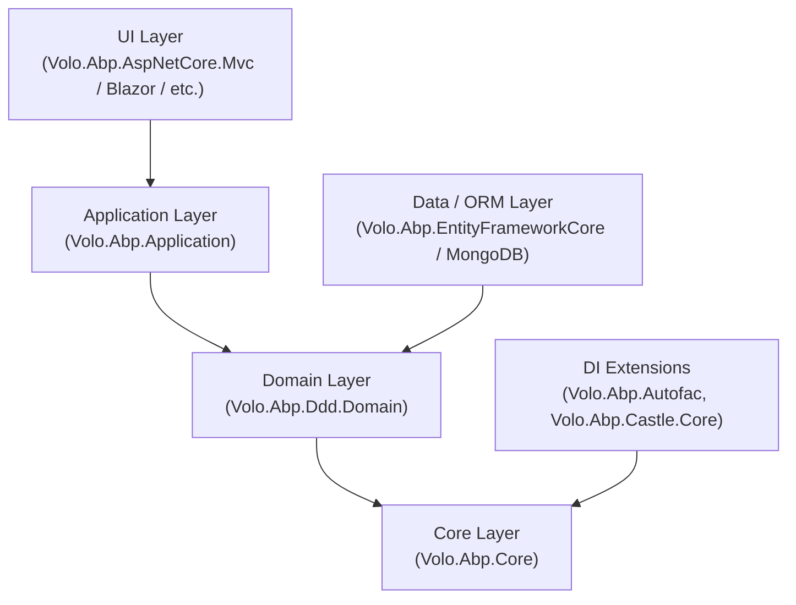

ABP Framework is an open-source ASP.NET Core application framework that provides a complete infrastructure for building modular, multi-tenant enterprise applications. This page covers what ABP is, the key architectural decisions baked into the framework, and how its package layers relate to one another — giving you the map you need before reading the deeper subsystem docs.

## Framework Classification

ABP is not a code generator or a CMS. It is a **runtime framework** that you depend on as a set of NuGet packages. Its core responsibilities are:

- Composing an application from independently versioned **modules** via a dependency graph
- Running a deterministic **lifecycle** (ConfigureServices → Initialize → Shutdown) across every loaded module
- Providing **convention-based dependency injection** on top of Microsoft's `IServiceCollection`
- Layering **Domain-Driven Design** building blocks (Entities, Repositories, Domain Services, Application Services) on top of those primitives
- Offering opt-in cross-cutting concerns: auditing, authorization, validation, event bus, multi-tenancy, localization, and more — each packaged as its own ABP module

The entry point to any ABP application is a single **startup module** type. Everything else is discovered by following that module's `[DependsOn]` attributes recursively.

## Key Architectural Decisions

<CardGroup cols={2}>
  <Card title="Startup-module-first" icon="flag">
    The application is bootstrapped from one concrete `AbpModule` subclass. All other modules are pulled in via `[DependsOn]`, not via assembly scanning of `bin/`.
  </Card>
  <Card title="Sync + async lifecycle duality" icon="arrows-rotate">
    Every lifecycle hook ships both a synchronous and an `Async` overload. `AbpModule` delegates sync calls to the async path, so only one implementation is needed.
  </Card>
  <Card title="IServiceCollection compatibility" icon="puzzle-piece">
    ABP's conventional registrar writes to standard `IServiceCollection`. Swapping in Autofac is a single line; the framework itself never breaks that contract.
  </Card>
  <Card title="Plugin-first extensibility" icon="plug">
    Modules that are not known at compile time can be loaded from a folder (`FolderPlugInSource`) or by explicit type (`TypePlugInSource`) and are treated identically to statically referenced modules.
  </Card>
</CardGroup>

## Layer Stack

The ABP package ecosystem is organized in layers. Higher layers depend on lower ones; you include only the layers you need.

| Layer | Key Package | What It Adds |
|---|---|---|
| **Core** | `Volo.Abp.Core` | Module system, lifecycle, conventional DI, options |
| **DDD Domain** | `Volo.Abp.Ddd.Domain` | Entities, Aggregates, Repositories, Domain Services |
| **Application** | `Volo.Abp.Application` | Application Services, DTOs, Object Mapping |
| **Data** | `Volo.Abp.EntityFrameworkCore` | EF Core repositories, DB migrations |
| **UI** | `Volo.Abp.AspNetCore.Mvc` | Razor Pages, API Controllers, filters |
| **DI** | `Volo.Abp.Autofac` | Property injection, Castle interceptors |

<Note>
`Volo.Abp.Core` is the only hard dependency. All other packages are ABP modules that plug in via `[DependsOn]` — you can use any subset of the stack.
</Note>

## Central Bootstrapping Types

| Type | Role |
|---|---|
| `AbpApplicationBase` | Abstract base for both internal-SP and external-SP application variants |
| `AbpApplicationFactory` | Static factory; produces `IAbpApplicationWithInternalServiceProvider` or `IAbpApplicationWithExternalServiceProvider` |
| `ModuleLoader` | Discovers all modules from the startup type + plugin sources; topological-sorts them |
| `ModuleManager` | Drives lifecycle contributors over the sorted module list at startup and shutdown |
| `DefaultConventionalRegistrar` | Scans each module's assemblies and registers types implementing marker interfaces |

## Navigation

<CardGroup cols={2}>
  <Card title="Architecture Overview" icon="sitemap" href="architecture-overview">
    Full startup sequence, DI registration pipeline, and subsystem cross-links.
  </Card>
  <Card title="Module System" icon="cubes" href="modularity/module-system">
    AbpModule, DependsOnAttribute, ModuleLoader internals, plugin sources.
  </Card>
  <Card title="Module Lifecycle" icon="rotate" href="modularity/module-lifecycle">
    The six lifecycle interfaces and how ModuleManager drives them.
  </Card>
  <Card title="Dependency Injection" icon="inject" href="modularity/dependency-injection">
    Conventional registration, marker interfaces, ExposeServicesAttribute, Autofac integration.
  </Card>
</CardGroup>
