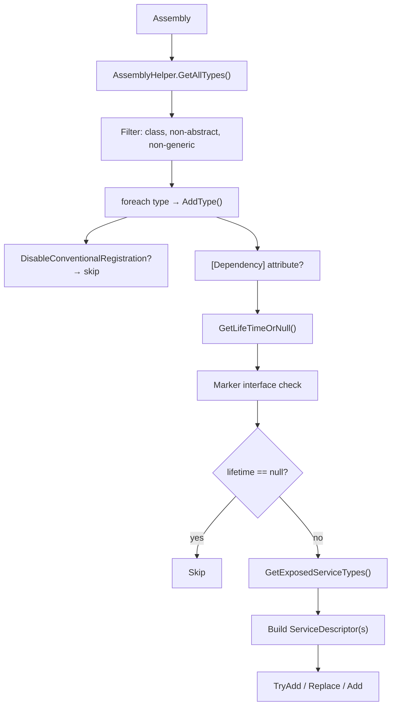

ABP's dependency injection layer sits on top of `Microsoft.Extensions.DependencyInjection` and automates the registration of services discovered from each module's assemblies. Instead of manually calling `services.AddTransient<IFoo, Foo>()` for every type, modules rely on **conventional registration**: a pipeline that scans assemblies, determines the service lifetime from marker interfaces or attributes, and writes `ServiceDescriptor` entries into `IServiceCollection`. An optional Autofac integration layer adds property injection and Castle Windsor–style interceptor support. This page covers every piece of that pipeline.

## The `IConventionalRegistrar` Contract

The base contract has three methods, moving from coarse to fine:

```csharp
// IConventionalRegistrar.cs
public interface IConventionalRegistrar
{
    void AddAssembly(IServiceCollection services, Assembly assembly);
    void AddTypes(IServiceCollection services, params Type[] types);
    void AddType(IServiceCollection services, Type type);
}
```

`ConventionalRegistrarBase` implements `AddAssembly` (which filters for concrete non-abstract non-generic classes and calls `AddTypes`) and `AddTypes` (which loops over types calling `AddType`). The only abstract member is `AddType` — subclasses implement the actual registration logic there.

ABP ships one concrete registrar: `DefaultConventionalRegistrar`.

## `DefaultConventionalRegistrar`

```csharp
// DefaultConventionalRegistrar.cs
public class DefaultConventionalRegistrar : ConventionalRegistrarBase
{
    public override void AddType(IServiceCollection services, Type type)
    {
        if (IsConventionalRegistrationDisabled(type))
        {
            return;
        }

        var dependencyAttribute = GetDependencyAttributeOrNull(type);
        var lifeTime = GetLifeTimeOrNull(type, dependencyAttribute);

        if (lifeTime == null)
        {
            return;   // type is not conventionally registered
        }

        var exposedServiceAndKeyedServiceTypes = GetExposedKeyedServiceTypes(type)
            .Concat(GetExposedServiceTypes(type).Select(t => new ServiceIdentifier(t)))
            .ToList();

        TriggerServiceExposing(services, type, exposedServiceAndKeyedServiceTypes);

        foreach (var exposedServiceType in exposedServiceAndKeyedServiceTypes)
        {
            var serviceDescriptor = CreateServiceDescriptor(
                type,
                exposedServiceType.ServiceKey,
                exposedServiceType.ServiceType,
                allExposingServiceTypes,
                lifeTime.Value
            );

            if (dependencyAttribute?.ReplaceServices == true)
                services.Replace(serviceDescriptor);
            else if (dependencyAttribute?.TryRegister == true)
                services.TryAdd(serviceDescriptor);
            else
                services.Add(serviceDescriptor);
        }
    }
}
```

### Lifetime Resolution Priority

`ConventionalRegistrarBase.GetLifeTimeOrNull` checks three sources in order:

```csharp
protected virtual ServiceLifetime? GetLifeTimeOrNull(Type type, DependencyAttribute? dependencyAttribute)
{
    return dependencyAttribute?.Lifetime
        ?? GetServiceLifetimeFromClassHierarchy(type)
        ?? GetDefaultLifeTimeOrNull(type);  // returns null by default
}
```

1. **`[Dependency(Lifetime = …)]` attribute** — highest priority, explicit override
2. **Marker interface** — `ITransientDependency`, `ISingletonDependency`, `IScopedDependency`
3. **`GetDefaultLifeTimeOrNull`** — override point in custom registrars; base returns `null`

If all three return `null`, the type is **not registered** at all.

## Marker Interfaces

The three marker interfaces are empty; their sole purpose is to trigger lifetime assignment:

```csharp
// ISingletonDependency.cs
public interface ISingletonDependency { }

// ITransientDependency.cs
public interface ITransientDependency { }

// IScopedDependency.cs
public interface IScopedDependency { }
```

Detection uses `IsAssignableFrom` inside `GetServiceLifetimeFromClassHierarchy`:

```csharp
protected virtual ServiceLifetime? GetServiceLifetimeFromClassHierarchy(Type type)
{
    if (typeof(ITransientDependency).GetTypeInfo().IsAssignableFrom(type))
        return ServiceLifetime.Transient;

    if (typeof(ISingletonDependency).GetTypeInfo().IsAssignableFrom(type))
        return ServiceLifetime.Singleton;

    if (typeof(IScopedDependency).GetTypeInfo().IsAssignableFrom(type))
        return ServiceLifetime.Scoped;

    return null;
}
```

<Note>
`ITransientDependency` is checked first. If a type somehow implements both `ITransientDependency` and `ISingletonDependency`, it will be registered as transient.
</Note>

## `DependencyAttribute` — Explicit Control

`DependencyAttribute` provides fine-grained control beyond lifetime:

```csharp
// DependencyAttribute.cs
public class DependencyAttribute : Attribute
{
    public virtual ServiceLifetime? Lifetime { get; set; }
    public virtual bool TryRegister { get; set; }     // uses services.TryAdd
    public virtual bool ReplaceServices { get; set; } // uses services.Replace

    public DependencyAttribute() { }
    public DependencyAttribute(ServiceLifetime lifetime) { Lifetime = lifetime; }
}
```

| Property | Behavior |
|---|---|
| `Lifetime` | Overrides marker interface; explicit `ServiceLifetime` value |
| `TryRegister = true` | Calls `services.TryAdd` — registration is skipped if a descriptor for the service type already exists |
| `ReplaceServices = true` | Calls `services.Replace` — replaces any existing descriptor for the service type |

**Example — replacing a framework service:**

```csharp
[Dependency(ReplaceServices = true)]
public class MyEmailSender : IEmailSender, ITransientDependency { ... }
```

## `ExposeServicesAttribute` — Controlling Which Interfaces Are Registered

By default, `ExposedServiceExplorer.GetExposedServices` applies a naming convention: if a class `FooService` implements an interface `IFooService`, the interface is exposed. `ExposeServicesAttribute` lets you declare this explicitly or override it:

```csharp
// ExposeServicesAttribute.cs
[AttributeUsage(AttributeTargets.Class, AllowMultiple = true)]
public class ExposeServicesAttribute : Attribute, IExposedServiceTypesProvider
{
    public Type[] ServiceTypes { get; }
    public bool IncludeDefaults { get; set; }  // adds convention-matched interfaces
    public bool IncludeSelf { get; set; }       // adds the concrete class itself

    public ExposeServicesAttribute(params Type[] serviceTypes)
    {
        ServiceTypes = serviceTypes ?? Type.EmptyTypes;
    }

    public Type[] GetExposedServiceTypes(Type targetType)
    {
        var serviceList = ServiceTypes.ToList();

        if (IncludeDefaults)
        {
            foreach (var type in GetDefaultServices(targetType))
                serviceList.AddIfNotContains(type);

            if (IncludeSelf)
                serviceList.AddIfNotContains(targetType);
        }
        else if (IncludeSelf)
        {
            serviceList.AddIfNotContains(targetType);
        }

        return serviceList.ToArray();
    }

    private static List<Type> GetDefaultServices(Type type)
    {
        // Matches IFooService for FooService, IGenericService<T> for GenericService<T>, etc.
        var serviceTypes = new List<Type>();
        foreach (var interfaceType in type.GetTypeInfo().GetInterfaces())
        {
            var interfaceName = interfaceType.IsGenericType
                ? interfaceType.Name.Left(interfaceType.Name.IndexOf('`'))
                : interfaceType.Name;

            if (interfaceName.StartsWith("I"))
                interfaceName = interfaceName.Right(interfaceName.Length - 1);

            if (type.Name.EndsWith(interfaceName, StringComparison.OrdinalIgnoreCase))
                serviceTypes.Add(interfaceType);
        }
        return serviceTypes;
    }
}
```

**Examples:**

```csharp
// Expose only IMyService (suppress convention matching)
[ExposeServices(typeof(IMyService))]
public class MyService : IMyService, ITransientDependency { }

// Expose convention-matched interfaces AND the concrete type
[ExposeServices(IncludeDefaults = true, IncludeSelf = true)]
public class MyService : IMyService, ITransientDependency { }
```

## Singleton/Scoped Redirect Descriptors

When a type is registered under multiple service keys (e.g., both `IMyService` and `MyService`) with a Singleton or Scoped lifetime, ABP creates **redirect descriptors** for all but one registration. This ensures all keys resolve to the **same instance** rather than creating duplicate objects:

```csharp
// ConventionalRegistrarBase.CreateServiceDescriptor (redirect path)
if (lifeTime.IsIn(ServiceLifetime.Singleton, ServiceLifetime.Scoped))
{
    var redirectedType = GetRedirectedTypeOrNull(
        implementationType, exposingServiceType, allExposingServiceTypes);

    if (redirectedType != null)
    {
        return ServiceDescriptor.Describe(
            exposingServiceType,
            provider => provider.GetService(redirectedType)!,
            lifeTime
        );
    }
}
```

## `DisableConventionalRegistrationAttribute`

Placing this attribute on a class completely suppresses conventional registration for that type. It is useful for abstract helpers, base classes, or types that register themselves manually:

```csharp
[DisableConventionalRegistration]
public class MySpecialType { }
```

## Assembly-Level Registration Flow



## Autofac Integration (`Volo.Abp.Autofac`)

ABP's default `IServiceCollection`-based DI does not support property injection or interceptors. The `Volo.Abp.Autofac` package fills that gap.

### Package Module

```csharp
// AbpAutofacModule.cs
[DependsOn(typeof(AbpCastleCoreModule))]
public class AbpAutofacModule : AbpModule { }
```

The module depends on `AbpCastleCoreModule` which provides Castle Windsor's dynamic proxy infrastructure used for interceptors.

### `AbpAutofacServiceProviderFactory`

Implements `IServiceProviderFactory<ContainerBuilder>`. It populates an Autofac `ContainerBuilder` from the `IServiceCollection` and builds an `AutofacServiceProvider`:

```csharp
// AbpAutofacServiceProviderFactory.cs
public class AbpAutofacServiceProviderFactory : IServiceProviderFactory<ContainerBuilder>
{
    private readonly ContainerBuilder _builder;

    public ContainerBuilder CreateBuilder(IServiceCollection services)
    {
        _services = services;
        _builder.Populate(services);   // calls AutofacRegistration.Populate
        return _builder;
    }

    public IServiceProvider CreateServiceProvider(ContainerBuilder containerBuilder)
    {
        return new AutofacServiceProvider(containerBuilder.Build());
    }
}
```

Register it in the host with:

```csharp
builder.UseServiceProviderFactory(
    new AbpAutofacServiceProviderFactory(new ContainerBuilder()));
```

### `ConfigureAbpConventions` Extension

When `AutofacRegistration.Populate` re-registers each `ServiceDescriptor`, it calls `ConfigureAbpConventions` on each registration builder:

```csharp
// AbpRegistrationBuilderExtensions.cs
public static IRegistrationBuilder<...> ConfigureAbpConventions<...>(
    this IRegistrationBuilder<...> registrationBuilder,
    ServiceDescriptor serviceDescriptor,
    IModuleContainer moduleContainer,
    ServiceRegistrationActionList registrationActionList,
    ServiceActivatedActionList activatedActionList,
    HashSet<Assembly>? nonModuleAssemblies = null)
    where TActivatorData : ReflectionActivatorData
{
    registrationBuilder = registrationBuilder.InvokeActivatedActions(activatedActionList, serviceDescriptor);

    var implementationType = registrationBuilder.ActivatorData.ImplementationType;
    registrationBuilder = registrationBuilder.EnablePropertyInjection(
        moduleContainer, implementationType, nonModuleAssemblies);
    registrationBuilder = registrationBuilder.InvokeRegistrationActions(
        registrationActionList, serviceType, implementationType, serviceDescriptor.ServiceKey);

    return registrationBuilder;
}
```

### Property Injection

Property injection is enabled only for types whose assembly belongs to a loaded ABP module:

```csharp
private static IRegistrationBuilder<...> EnablePropertyInjection<...>(
    this IRegistrationBuilder<...> registrationBuilder,
    IModuleContainer moduleContainer,
    Type implementationType,
    HashSet<Assembly>? nonModuleAssemblies)
    where TActivatorData : ReflectionActivatorData
{
    if (!implementationType
        .GetCustomAttributes(typeof(DisablePropertyInjectionAttribute), true)
        .IsNullOrEmpty())
    {
        return registrationBuilder;   // [DisablePropertyInjection] on class → skip
    }

    if (moduleContainer.Modules.Any(m => m.AllAssemblies.Contains(implementationType.Assembly)))
    {
        registrationBuilder = registrationBuilder
            .PropertiesAutowired(new AbpPropertySelector(false));
    }
    else
    {
        nonModuleAssemblies?.Add(implementationType.Assembly);
    }

    return registrationBuilder;
}
```

`AbpPropertySelector` extends Autofac's `DefaultPropertySelector` and additionally respects `[DisablePropertyInjection]` at the property level:

```csharp
public class AbpPropertySelector : DefaultPropertySelector
{
    public AbpPropertySelector(bool preserveSetValues) : base(preserveSetValues) { }

    public override bool InjectProperty(PropertyInfo propertyInfo, object instance)
    {
        return propertyInfo
                   .GetCustomAttributes(typeof(DisablePropertyInjectionAttribute), true)
                   .IsNullOrEmpty()
               && base.InjectProperty(propertyInfo, instance);
    }
}
```

<Tip>
Decorate a property with `[DisablePropertyInjection]` to prevent Autofac from injecting it even when the class is in a module assembly. This is commonly used for properties that are set manually or that should not be resolved from the container.
</Tip>

### Interceptor Registration Pipeline

When ABP features like auditing or validation register an interceptor, they call `OnServiceRegistredContext.Interceptors.Add<TInterceptor>()` from a `ServiceRegistrationActionList` callback. The `InvokeRegistrationActions` method fires those callbacks and, if any interceptors were collected, calls `AddInterceptors`:

```csharp
// Interface interceptors (proxy wraps the interface)
if (serviceType.IsInterface)
{
    registrationBuilder = registrationBuilder.EnableInterfaceInterceptors();
}
else
{
    // Class interceptors (requires virtual methods)
    (registrationBuilder as IRegistrationBuilder<TLimit,
        ConcreteReflectionActivatorData, TRegistrationStyle>)
        ?.EnableClassInterceptors();
}

foreach (var interceptor in interceptors)
{
    registrationBuilder.InterceptedBy(
        typeof(AbpAsyncDeterminationInterceptor<>).MakeGenericType(interceptor)
    );
}
```

`AbpAsyncDeterminationInterceptor<T>` is provided by `Volo.Abp.Castle.Core` and transparently handles both sync and async method interception using Castle DynamicProxy.

### Orphan Module Warning

`AutofacRegistration.Register` collects assemblies that were excluded from property injection (not in any module's `AllAssemblies`) and, after processing all descriptors, warns about any ABP module types found in those assemblies that were not in the `[DependsOn]` chain:

```csharp
// If an assembly has services registered but its module is not in the dependency chain,
// property injection (e.g. LazyServiceProvider) will not work for those types.
logger.LogWarning(
    $"Assembly '{assembly.GetName().Name}' has services registered in the DI container, " +
    $"but its ABP module '{type.FullName}' is not in the [DependsOn] chain. ...");
```

## Custom Conventional Registrar

To add a custom registrar (e.g., to register types by a different convention), inherit `ConventionalRegistrarBase` and add it to `AbpConventionalRegistrarOptions`:

```csharp
public class MyConventionalRegistrar : ConventionalRegistrarBase
{
    public override void AddType(IServiceCollection services, Type type)
    {
        // custom logic
    }
}

// In a module's ConfigureServices:
Configure<AbpConventionalRegistrarOptions>(options =>
{
    options.Registrars.Add<MyConventionalRegistrar>();
});
```

## See Also

<CardGroup cols={2}>
  <Card title="Module System" icon="cubes" href="/modularity/module-system">
    How assemblies are collected per module and passed to the conventional registrar.
  </Card>
  <Card title="Module Lifecycle" icon="rotate" href="/modularity/module-lifecycle">
    ConfigureServices phase where conventional registration runs.
  </Card>
</CardGroup>
