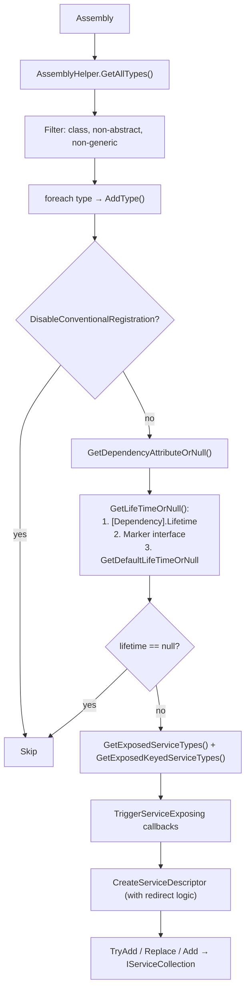

ABP's dependency injection layer sits on top of `Microsoft.Extensions.DependencyInjection` and automates the registration of services discovered from each module's assemblies. Instead of manually calling `services.AddTransient<IFoo, Foo>()` for every type, modules rely on **conventional registration**: a pipeline that scans assemblies, determines the service lifetime from marker interfaces or attributes, and writes `ServiceDescriptor` entries into `IServiceCollection`. An optional Autofac integration layer adds property injection and Castle Windsor–style interceptor support. This page covers every piece of that pipeline.

## The `IConventionalRegistrar` Contract

The base contract (`Volo.Abp.Core/Volo/Abp/DependencyInjection/IConventionalRegistrar.cs`) has three methods, moving from coarse to fine:

```csharp
public interface IConventionalRegistrar
{
    void AddAssembly(IServiceCollection services, Assembly assembly);
    void AddTypes(IServiceCollection services, params Type[] types);
    void AddType(IServiceCollection services, Type type);
}
```

`ConventionalRegistrarBase` (`Volo.Abp.Core/Volo/Abp/DependencyInjection/ConventionalRegistrarBase.cs`) implements `AddAssembly` and `AddTypes`; the only abstract member is `AddType`. `AddAssembly` filters for concrete non-abstract non-generic classes using `AssemblyHelper.GetAllTypes` and handles `ReflectionTypeLoadException` gracefully — partial type loads are logged and the successfully-loaded types are still processed.

ABP ships one concrete registrar: `DefaultConventionalRegistrar`.

## `DefaultConventionalRegistrar`

`Volo.Abp.Core/Volo/Abp/DependencyInjection/DefaultConventionalRegistrar.cs`:

```csharp
public class DefaultConventionalRegistrar : ConventionalRegistrarBase
{
    public override void AddType(IServiceCollection services, Type type)
    {
        if (IsConventionalRegistrationDisabled(type))
        {
            return;
        }

        var dependencyAttribute = GetDependencyAttributeOrNull(type);
        var lifeTime = GetLifeTimeOrNull(type, dependencyAttribute);

        if (lifeTime == null)
        {
            return;   // type is not conventionally registered
        }

        var exposedServiceAndKeyedServiceTypes = GetExposedKeyedServiceTypes(type)
            .Concat(GetExposedServiceTypes(type).Select(t => new ServiceIdentifier(t)))
            .ToList();

        TriggerServiceExposing(services, type, exposedServiceAndKeyedServiceTypes);

        foreach (var exposedServiceType in exposedServiceAndKeyedServiceTypes)
        {
            var allExposingServiceTypes = exposedServiceType.ServiceKey == null
                ? exposedServiceAndKeyedServiceTypes.Where(x => x.ServiceKey == null).ToList()
                : exposedServiceAndKeyedServiceTypes.Where(x => x.ServiceKey?.ToString() == exposedServiceType.ServiceKey?.ToString()).ToList();

            var serviceDescriptor = CreateServiceDescriptor(
                type,
                exposedServiceType.ServiceKey,
                exposedServiceType.ServiceType,
                allExposingServiceTypes,
                lifeTime.Value
            );

            if (dependencyAttribute?.ReplaceServices == true)
                services.Replace(serviceDescriptor);
            else if (dependencyAttribute?.TryRegister == true)
                services.TryAdd(serviceDescriptor);
            else
                services.Add(serviceDescriptor);
        }
    }
}
```

### Lifetime Resolution Priority

`ConventionalRegistrarBase.GetLifeTimeOrNull` checks three sources in order:

```csharp
protected virtual ServiceLifetime? GetLifeTimeOrNull(
    Type type, DependencyAttribute? dependencyAttribute)
{
    return dependencyAttribute?.Lifetime
        ?? GetServiceLifetimeFromClassHierarchy(type)
        ?? GetDefaultLifeTimeOrNull(type);  // returns null in base
}
```

| Priority | Source | Example |
|---|---|---|
| 1 (highest) | `[Dependency(Lifetime = …)]` attribute | `[Dependency(ServiceLifetime.Singleton)]` |
| 2 | Marker interface | `: ITransientDependency` |
| 3 | `GetDefaultLifeTimeOrNull` override | Custom registrar subclass |

If all three return `null`, the type is **not registered** at all.

## Marker Interfaces

The three marker interfaces are empty; their sole purpose is to signal a lifetime:

```csharp
// Volo.Abp.Core/Volo/Abp/DependencyInjection/ITransientDependency.cs
public interface ITransientDependency { }

// Volo.Abp.Core/Volo/Abp/DependencyInjection/ISingletonDependency.cs
public interface ISingletonDependency { }

// Volo.Abp.Core/Volo/Abp/DependencyInjection/IScopedDependency.cs
public interface IScopedDependency { }
```

Detection uses `IsAssignableFrom` inside `GetServiceLifetimeFromClassHierarchy`:

```csharp
protected virtual ServiceLifetime? GetServiceLifetimeFromClassHierarchy(Type type)
{
    if (typeof(ITransientDependency).GetTypeInfo().IsAssignableFrom(type))
        return ServiceLifetime.Transient;

    if (typeof(ISingletonDependency).GetTypeInfo().IsAssignableFrom(type))
        return ServiceLifetime.Singleton;

    if (typeof(IScopedDependency).GetTypeInfo().IsAssignableFrom(type))
        return ServiceLifetime.Scoped;

    return null;
}
```

<Note>
`ITransientDependency` is checked first. If a type implements both `ITransientDependency` and `ISingletonDependency`, it will be registered as transient.
</Note>

## `DependencyAttribute` — Explicit Control

`DependencyAttribute` (`Volo.Abp.Core/Volo/Abp/DependencyInjection/DependencyAttribute.cs`) provides fine-grained control:

```csharp
public class DependencyAttribute : Attribute
{
    public virtual ServiceLifetime? Lifetime { get; set; }
    public virtual bool TryRegister { get; set; }     // uses services.TryAdd
    public virtual bool ReplaceServices { get; set; } // uses services.Replace

    public DependencyAttribute() { }
    public DependencyAttribute(ServiceLifetime lifetime) { Lifetime = lifetime; }
}
```

| Property | Behavior |
|---|---|
| `Lifetime` | Overrides marker interface; explicit `ServiceLifetime` value |
| `TryRegister = true` | Calls `services.TryAdd` — registration is skipped if a descriptor for the service type already exists |
| `ReplaceServices = true` | Calls `services.Replace` — replaces any existing descriptor for the service type |

**Example — replacing a framework service:**

```csharp
[Dependency(ReplaceServices = true)]
public class MyEmailSender : IEmailSender, ITransientDependency { }
```

## Exposed Service Discovery

### Default Convention

When no `[ExposeServices]` attribute is present, `ExposedServiceExplorer.GetExposedServices`
(`Volo.Abp.Core/Volo/Abp/DependencyInjection/ExposedServiceExplorer.cs`) falls back to a default `ExposeServicesAttribute` with `IncludeDefaults = true` and `IncludeSelf = true`:

```csharp
private static readonly ExposeServicesAttribute DefaultExposeServicesAttribute =
    new ExposeServicesAttribute
    {
        IncludeDefaults = true,
        IncludeSelf = true
    };
```

This means: register the concrete class itself **plus** any interface whose name matches the class name by the stripping convention (`IFooService` → `FooService`).

### `ExposeServicesAttribute`

`Volo.Abp.Core/Volo/Abp/DependencyInjection/ExposeServicesAttribute.cs`:

```csharp
[AttributeUsage(AttributeTargets.Class, AllowMultiple = true)]
public class ExposeServicesAttribute : Attribute, IExposedServiceTypesProvider
{
    public Type[] ServiceTypes { get; }
    public bool IncludeDefaults { get; set; }  // adds convention-matched interfaces
    public bool IncludeSelf { get; set; }       // adds the concrete class itself

    public ExposeServicesAttribute(params Type[] serviceTypes)
    {
        ServiceTypes = serviceTypes ?? Type.EmptyTypes;
    }

    public Type[] GetExposedServiceTypes(Type targetType)
    {
        var serviceList = ServiceTypes.ToList();

        if (IncludeDefaults)
        {
            foreach (var type in GetDefaultServices(targetType))
                serviceList.AddIfNotContains(type);

            if (IncludeSelf)
                serviceList.AddIfNotContains(targetType);
        }
        else if (IncludeSelf)
        {
            serviceList.AddIfNotContains(targetType);
        }

        return serviceList.ToArray();
    }
}
```

The naming convention in `GetDefaultServices` strips a leading `I` from an interface name and checks whether the class name ends with the result (case-insensitive). For generic interfaces, only the base name before the backtick is used.

**Examples:**

```csharp
// Expose only IMyService (suppress default convention)
[ExposeServices(typeof(IMyService))]
public class MyService : IMyService, ITransientDependency { }

// Expose convention-matched interfaces AND the concrete type
[ExposeServices(IncludeDefaults = true, IncludeSelf = true)]
public class MyService : IMyService, ITransientDependency { }

// Expose a specific set of types plus convention defaults
[ExposeServices(typeof(ISpecialService), IncludeDefaults = true)]
public class MyService : IMyService, ISpecialService, ITransientDependency { }
```

### `ExposeKeyedServiceAttribute<TServiceType>` — Keyed Services

For .NET 8+ keyed DI, use `ExposeKeyedServiceAttribute<TServiceType>`:

```csharp
// Volo.Abp.Core/Volo/Abp/DependencyInjection/ExposeKeyedServiceAttribute.cs
[AttributeUsage(AttributeTargets.Class, AllowMultiple = true)]
public class ExposeKeyedServiceAttribute<TServiceType> : Attribute, IExposedKeyedServiceTypesProvider
    where TServiceType : class
{
    public ServiceIdentifier ServiceIdentifier { get; }

    public ExposeKeyedServiceAttribute(object serviceKey)
    {
        ServiceIdentifier = new ServiceIdentifier(serviceKey, typeof(TServiceType));
    }

    public ServiceIdentifier[] GetExposedServiceTypes(Type targetType)
    {
        return new[] { ServiceIdentifier };
    }
}
```

When a type has `IExposedKeyedServiceTypesProvider` attributes but **no** `IExposedServiceTypesProvider` attributes, `ExposedServiceExplorer.GetExposedServices` returns an empty list — preventing the default convention from also adding unkeyed registrations.

## Singleton/Scoped Redirect Descriptors

When a type is registered under multiple service types with a `Singleton` or `Scoped` lifetime, ABP creates **redirect descriptors** for all service types except one. This ensures all registrations resolve to the **same instance** rather than creating separate objects. The redirect target is determined by `GetRedirectedTypeOrNull`:

```csharp
// ConventionalRegistrarBase.cs
protected virtual ServiceDescriptor CreateServiceDescriptor(
    Type implementationType,
    object? serviceKey,
    Type exposingServiceType,
    List<ServiceIdentifier> allExposingServiceTypes,
    ServiceLifetime lifeTime)
{
    if (lifeTime.IsIn(ServiceLifetime.Singleton, ServiceLifetime.Scoped))
    {
        var redirectedType = GetRedirectedTypeOrNull(
            implementationType, exposingServiceType, allExposingServiceTypes);

        if (redirectedType != null)
        {
            return ServiceDescriptor.Describe(
                exposingServiceType,
                provider => provider.GetService(redirectedType)!,
                lifeTime
            );
        }
    }

    return ServiceDescriptor.Describe(exposingServiceType, implementationType, lifeTime);
}
```

`GetRedirectedTypeOrNull` redirects to the concrete implementation type if it appears in the exposed list, otherwise to the first compatible service type in the list. No redirect is created if there is only one exposed service type, or if the current type is the implementation type itself.

## `DisableConventionalRegistrationAttribute`

Placing this attribute on a class completely suppresses conventional registration for that type:

```csharp
// Volo.Abp.Core/Volo/Abp/DependencyInjection/DisableConventionalRegistrationAttribute.cs
public class DisableConventionalRegistrationAttribute : Attribute { }
```

```csharp
[DisableConventionalRegistration]
public class MySpecialType : ISomeInterface, ITransientDependency { }
```

This is useful for abstract helpers, base classes, or types that register themselves manually via module `ConfigureServices`.

## Assembly-Level Registration Flow



## Custom Conventional Registrar

To add a custom registrar, inherit `ConventionalRegistrarBase` and add it to `AbpConventionalRegistrarOptions`:

```csharp
public class MyConventionalRegistrar : ConventionalRegistrarBase
{
    public override void AddType(IServiceCollection services, Type type)
    {
        // custom logic — call base methods as needed
    }
}

// In a module's ConfigureServices:
Configure<AbpConventionalRegistrarOptions>(options =>
{
    options.Registrars.Add<MyConventionalRegistrar>();
});
```

All registrars in `AbpConventionalRegistrarOptions.Registrars` are called for every `services.AddAssembly(assembly)` invocation. The default registrar is always present; custom registrars are added on top of it.

## Autofac Integration (`Volo.Abp.Autofac`)

ABP's default `IServiceCollection`-based DI does not support property injection or interceptors. The `Volo.Abp.Autofac` package fills that gap.

### Package Module

```csharp
// Volo.Abp.Autofac/Volo/Abp/Autofac/AbpAutofacModule.cs
[DependsOn(typeof(AbpCastleCoreModule))]
public class AbpAutofacModule : AbpModule { }
```

The module depends on `AbpCastleCoreModule`, which provides Castle Windsor's dynamic proxy infrastructure used for interceptors.

### `AbpAutofacServiceProviderFactory`

`Volo.Abp.Autofac/Volo/Abp/Autofac/AbpAutofacServiceProviderFactory.cs` implements `IServiceProviderFactory<ContainerBuilder>`:

```csharp
public class AbpAutofacServiceProviderFactory : IServiceProviderFactory<ContainerBuilder>
{
    private readonly ContainerBuilder _builder;
    private IServiceCollection _services = default!;

    public AbpAutofacServiceProviderFactory(ContainerBuilder builder)
    {
        _builder = builder;
    }

    public ContainerBuilder CreateBuilder(IServiceCollection services)
    {
        _services = services;
        _builder.Populate(services);   // transfers IServiceCollection registrations to Autofac
        return _builder;
    }

    public IServiceProvider CreateServiceProvider(ContainerBuilder containerBuilder)
    {
        Check.NotNull(containerBuilder, nameof(containerBuilder));
        return new AutofacServiceProvider(containerBuilder.Build());
    }
}
```

Register it in the host with:

```csharp
builder.UseServiceProviderFactory(
    new AbpAutofacServiceProviderFactory(new ContainerBuilder()));
```

### `ConfigureAbpConventions` Extension

`Volo.Abp.Autofac/Autofac/Builder/AbpRegistrationBuilderExtensions.cs` exposes `ConfigureAbpConventions`, called during `AutofacRegistration.Populate` for each descriptor that has a reflection activator:

```csharp
public static IRegistrationBuilder<TLimit, TActivatorData, TRegistrationStyle>
    ConfigureAbpConventions<TLimit, TActivatorData, TRegistrationStyle>(
        this IRegistrationBuilder<TLimit, TActivatorData, TRegistrationStyle> registrationBuilder,
        ServiceDescriptor serviceDescriptor,
        IModuleContainer moduleContainer,
        ServiceRegistrationActionList registrationActionList,
        ServiceActivatedActionList activatedActionList,
        HashSet<Assembly>? nonModuleAssemblies = null)
    where TActivatorData : ReflectionActivatorData
{
    registrationBuilder = registrationBuilder.InvokeActivatedActions(activatedActionList, serviceDescriptor);

    var serviceType = registrationBuilder.RegistrationData.Services
        .OfType<IServiceWithType>().FirstOrDefault()?.ServiceType;
    if (serviceType == null) return registrationBuilder;

    var implementationType = registrationBuilder.ActivatorData.ImplementationType;
    if (implementationType == null) return registrationBuilder;

    registrationBuilder = registrationBuilder.EnablePropertyInjection(
        moduleContainer, implementationType, nonModuleAssemblies);
    registrationBuilder = registrationBuilder.InvokeRegistrationActions(
        registrationActionList, serviceType, implementationType, serviceDescriptor.ServiceKey);

    return registrationBuilder;
}
```

### Property Injection

Property injection is enabled only for types whose assembly belongs to a loaded ABP module and that do not carry `[DisablePropertyInjection]` at the class level:

```csharp
// EnablePropertyInjection (private, in AbpRegistrationBuilderExtensions.cs)
if (!implementationType.GetCustomAttributes(typeof(DisablePropertyInjectionAttribute), true).IsNullOrEmpty())
{
    return registrationBuilder;   // [DisablePropertyInjection] on class → skip
}

if (moduleContainer.Modules.Any(m => m.AllAssemblies.Contains(implementationType.Assembly)))
{
    registrationBuilder = registrationBuilder.PropertiesAutowired(new AbpPropertySelector(false));
}
else
{
    nonModuleAssemblies?.Add(implementationType.Assembly);
}
```

`AbpPropertySelector` (`Volo.Abp.Autofac/Volo/Abp/Autofac/AbpPropertySelector.cs`) extends Autofac's `DefaultPropertySelector` and additionally respects `[DisablePropertyInjection]` at the property level:

```csharp
public class AbpPropertySelector : DefaultPropertySelector
{
    public AbpPropertySelector(bool preserveSetValues) : base(preserveSetValues) { }

    public override bool InjectProperty(PropertyInfo propertyInfo, object instance)
    {
        return propertyInfo
                   .GetCustomAttributes(typeof(DisablePropertyInjectionAttribute), true)
                   .IsNullOrEmpty()
               && base.InjectProperty(propertyInfo, instance);
    }
}
```

`[DisablePropertyInjection]` (`Volo.Abp.Core/Volo/Abp/DependencyInjection/DisablePropertyInjectionAttribute.cs`) targets both classes (`AttributeTargets.Class`) and properties (`AttributeTargets.Property`), so it can suppress injection at either level.

<Tip>
Decorate a property with `[DisablePropertyInjection]` to prevent Autofac from injecting it even when the class is in a module assembly. This is commonly used for properties that are set manually or should not be resolved from the container.
</Tip>

### Interceptor Registration Pipeline

When ABP features like auditing or validation register an interceptor, they call `context.Interceptors.Add<TInterceptor>()` from a `ServiceRegistrationActionList` callback. `InvokeRegistrationActions` fires those callbacks and, if any interceptors were collected, calls `AddInterceptors`:

```csharp
// AddInterceptors (private, in AbpRegistrationBuilderExtensions.cs)
if (serviceType.IsInterface)
{
    registrationBuilder = registrationBuilder.EnableInterfaceInterceptors();
}
else
{
    // Class interceptors are disabled if IsClassInterceptorsDisabled or a selector matches
    if (serviceRegistrationActionList.IsClassInterceptorsDisabled ||
        serviceRegistrationActionList.DisabledClassInterceptorsSelectors
            .Any(selector => selector.Predicate(serviceType)))
    {
        return registrationBuilder;
    }

    (registrationBuilder as IRegistrationBuilder<TLimit,
        ConcreteReflectionActivatorData, TRegistrationStyle>)
        ?.EnableClassInterceptors();
}

foreach (var interceptor in interceptors)
{
    registrationBuilder.InterceptedBy(
        typeof(AbpAsyncDeterminationInterceptor<>).MakeGenericType(interceptor)
    );
}
```

`AbpAsyncDeterminationInterceptor<T>` is provided by `Volo.Abp.Castle.Core` and transparently handles both sync and async method interception using Castle DynamicProxy. Class interceptors require virtual methods; interface interceptors do not.

## Key Types Summary

| Type | File | Role |
|---|---|---|
| `IConventionalRegistrar` | `DependencyInjection/IConventionalRegistrar.cs` | Base contract for assembly/type scanners |
| `ConventionalRegistrarBase` | `DependencyInjection/ConventionalRegistrarBase.cs` | `AddAssembly`/`AddTypes` implementations, redirect logic |
| `DefaultConventionalRegistrar` | `DependencyInjection/DefaultConventionalRegistrar.cs` | Production registrar, wires lifetime + exposed types |
| `DependencyAttribute` | `DependencyInjection/DependencyAttribute.cs` | Override lifetime, `TryRegister`, `ReplaceServices` |
| `ExposeServicesAttribute` | `DependencyInjection/ExposeServicesAttribute.cs` | Declare which service types to register under |
| `ExposeKeyedServiceAttribute<T>` | `DependencyInjection/ExposeKeyedServiceAttribute.cs` | Register under a keyed service |
| `DisableConventionalRegistrationAttribute` | `DependencyInjection/DisableConventionalRegistrationAttribute.cs` | Opt out of conventional scanning |
| `ExposedServiceExplorer` | `DependencyInjection/ExposedServiceExplorer.cs` | Resolves final set of service types for a class |
| `ITransientDependency` | `DependencyInjection/ITransientDependency.cs` | Marker for transient lifetime |
| `ISingletonDependency` | `DependencyInjection/ISingletonDependency.cs` | Marker for singleton lifetime |
| `IScopedDependency` | `DependencyInjection/IScopedDependency.cs` | Marker for scoped lifetime |
| `AbpAutofacModule` | `Volo.Abp.Autofac/Volo/Abp/Autofac/AbpAutofacModule.cs` | Entry module for Autofac integration |
| `AbpAutofacServiceProviderFactory` | `Volo.Abp.Autofac/Volo/Abp/Autofac/AbpAutofacServiceProviderFactory.cs` | Builds Autofac container from `IServiceCollection` |
| `AbpPropertySelector` | `Volo.Abp.Autofac/Volo/Abp/Autofac/AbpPropertySelector.cs` | Respects `[DisablePropertyInjection]` on properties |
| `AbpRegistrationBuilderExtensions` | `Volo.Abp.Autofac/Autofac/Builder/AbpRegistrationBuilderExtensions.cs` | Property injection + interceptor wiring per registration |
| `DisablePropertyInjectionAttribute` | `DependencyInjection/DisablePropertyInjectionAttribute.cs` | Suppress Autofac property injection on class or property |

## See Also

<CardGroup cols={2}>
  <Card title="Module System" icon="cubes" href="/modularity/module-system">
    How assemblies are collected per module and passed to the conventional registrar.
  </Card>
  <Card title="Module Lifecycle" icon="rotate" href="/modularity/module-lifecycle">
    ConfigureServices phase where conventional registration runs.
  </Card>
</CardGroup>
