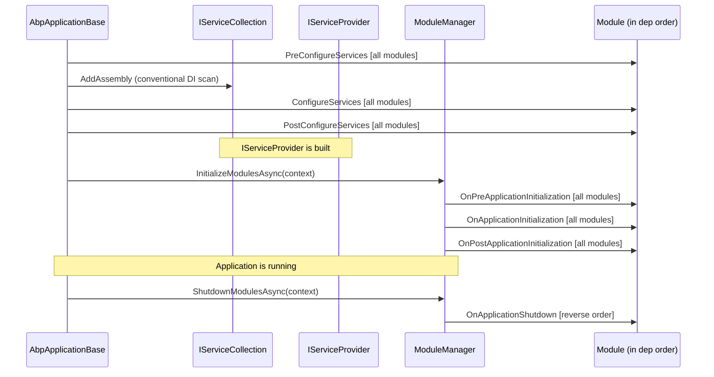

Every ABP module participates in a deterministic lifecycle that spans two distinct stages: a **services configuration stage** (before the DI container is built) and an **application initialization stage** (after the container is built). Each stage is subdivided into pre, main, and post phases, giving six hookable points in total. This page covers the interfaces that define those phases, the `IModuleLifecycleContributor` pattern that drives them, and the `ModuleManager` that orchestrates everything.

## The Six Lifecycle Interfaces

### Services Configuration Phase

These three interfaces are invoked by `AbpApplicationBase.ConfigureServicesAsync` while `IServiceCollection` is still mutable. The DI container does **not** exist yet.

| Interface | When | Typical use |
|---|---|---|
| `IPreConfigureServices` | Before any `ConfigureServices` call | Reserve options slots, pre-register required services |
| `IAbpModule` (via `ConfigureServices`) | Main configuration | Register module's own services, configure `IOptions<T>` |
| `IPostConfigureServices` | After all `ConfigureServices` calls | Override or finalize registrations set by other modules |

```csharp
// IPreConfigureServices.cs
public interface IPreConfigureServices
{
    Task PreConfigureServicesAsync(ServiceConfigurationContext context);
    void PreConfigureServices(ServiceConfigurationContext context);
}

// IPostConfigureServices.cs
public interface IPostConfigureServices
{
    Task PostConfigureServicesAsync(ServiceConfigurationContext context);
    void PostConfigureServices(ServiceConfigurationContext context);
}
```

`AbpModule` provides virtual no-op implementations for all three, and its async overloads delegate to the synchronous ones so a module only needs to override one:

```csharp
public virtual Task PreConfigureServicesAsync(ServiceConfigurationContext context)
{
    PreConfigureServices(context);
    return Task.CompletedTask;
}

public virtual void PreConfigureServices(ServiceConfigurationContext context) { }
```

<Warning>
`ServiceConfigurationContext` (and `ServiceConfigurationContext.Services`) is only valid during these three phases. ABP sets it to `null` after `PostConfigureServices` completes. Storing a reference to use later will cause a null-reference exception.
</Warning>

### Application Initialization Phase

These three interfaces are driven by `ModuleManager` after the DI container is built. An `ApplicationInitializationContext` carrying the scoped `IServiceProvider` is passed through.

| Interface | Namespace | When | Typical use |
|---|---|---|---|
| `IOnPreApplicationInitialization` | `Volo.Abp.Modularity` | Earliest init point | Seed data, warm caches |
| `IOnApplicationInitialization` | `Volo.Abp` | Main init | Configure ASP.NET Core pipeline (`app.UseXxx`) |
| `IOnPostApplicationInitialization` | `Volo.Abp.Modularity` | After all main init | Post-start validation, background jobs |

```csharp
// IOnPreApplicationInitialization.cs
public interface IOnPreApplicationInitialization
{
    Task OnPreApplicationInitializationAsync(ApplicationInitializationContext context);
    void OnPreApplicationInitialization(ApplicationInitializationContext context);
}

// IOnApplicationInitialization.cs
public interface IOnApplicationInitialization
{
    Task OnApplicationInitializationAsync(ApplicationInitializationContext context);
    void OnApplicationInitialization(ApplicationInitializationContext context);
}

// IOnPostApplicationInitialization.cs
public interface IOnPostApplicationInitialization
{
    Task OnPostApplicationInitializationAsync(ApplicationInitializationContext context);
    void OnPostApplicationInitialization(ApplicationInitializationContext context);
}
```

### Shutdown

```csharp
// IOnApplicationShutdown.cs
public interface IOnApplicationShutdown
{
    Task OnApplicationShutdownAsync(ApplicationShutdownContext context);
    void OnApplicationShutdown(ApplicationShutdownContext context);
}
```

Shutdown is driven in **reverse dependency order** — the startup module shuts down first, leaf dependencies last — which mirrors the natural stack-like unwinding expected when releasing resources.

## Full Lifecycle Sequence



## `IModuleLifecycleContributor` — The Contributor Pattern

Rather than hard-coding calls to lifecycle interfaces, ABP uses a **contributor** pattern. Each lifecycle phase is represented by a dedicated contributor class, and `ModuleManager` iterates the registered contributors over all modules:

```csharp
// IModuleLifecycleContributor.cs
public interface IModuleLifecycleContributor : ITransientDependency
{
    Task InitializeAsync(ApplicationInitializationContext context, IAbpModule module);
    void Initialize(ApplicationInitializationContext context, IAbpModule module);
    Task ShutdownAsync(ApplicationShutdownContext context, IAbpModule module);
    void Shutdown(ApplicationShutdownContext context, IAbpModule module);
}
```

Note that `IModuleLifecycleContributor` extends `ITransientDependency`, so every contributor is automatically registered as transient by the conventional registrar.

The abstract base class provides no-op defaults:

```csharp
// ModuleLifecycleContributorBase.cs
public abstract class ModuleLifecycleContributorBase : IModuleLifecycleContributor
{
    public virtual Task InitializeAsync(ApplicationInitializationContext context, IAbpModule module)
        => Task.CompletedTask;
    public virtual void Initialize(ApplicationInitializationContext context, IAbpModule module) { }
    public virtual Task ShutdownAsync(ApplicationShutdownContext context, IAbpModule module)
        => Task.CompletedTask;
    public virtual void Shutdown(ApplicationShutdownContext context, IAbpModule module) { }
}
```

## Default Lifecycle Contributors

Four contributors are registered by `AddCoreAbpServices` in `InternalServiceCollectionExtensions`:

```csharp
services.Configure<AbpModuleLifecycleOptions>(options =>
{
    options.Contributors.Add<OnPreApplicationInitializationModuleLifecycleContributor>();
    options.Contributors.Add<OnApplicationInitializationModuleLifecycleContributor>();
    options.Contributors.Add<OnPostApplicationInitializationModuleLifecycleContributor>();
    options.Contributors.Add<OnApplicationShutdownModuleLifecycleContributor>();
});
```

Each contributor pattern-matches the `IAbpModule` instance against the corresponding interface:

```csharp
// DefaultModuleLifecycleContributor.cs (excerpt)

public class OnApplicationInitializationModuleLifecycleContributor : ModuleLifecycleContributorBase
{
    public async override Task InitializeAsync(
        ApplicationInitializationContext context, IAbpModule module)
    {
        if (module is IOnApplicationInitialization onApplicationInitialization)
        {
            await onApplicationInitialization.OnApplicationInitializationAsync(context);
        }
    }

    public override void Initialize(ApplicationInitializationContext context, IAbpModule module)
    {
        (module as IOnApplicationInitialization)?.OnApplicationInitialization(context);
    }
}

public class OnApplicationShutdownModuleLifecycleContributor : ModuleLifecycleContributorBase
{
    public async override Task ShutdownAsync(
        ApplicationShutdownContext context, IAbpModule module)
    {
        if (module is IOnApplicationShutdown onApplicationShutdown)
        {
            await onApplicationShutdown.OnApplicationShutdownAsync(context);
        }
    }

    public override void Shutdown(ApplicationShutdownContext context, IAbpModule module)
    {
        (module as IOnApplicationShutdown)?.OnApplicationShutdown(context);
    }
}
```

The cast-and-check pattern means a module only participates in a phase if it actually implements the corresponding interface — modules that don't override `OnApplicationInitialization` incur no call overhead.

## `ModuleManager` — Driving the Contributors

`ModuleManager` resolves its contributor list from `AbpModuleLifecycleOptions` at construction time and caches them as an array:

```csharp
// ModuleManager.cs
public class ModuleManager : IModuleManager, ISingletonDependency
{
    private readonly IModuleContainer _moduleContainer;
    private readonly IEnumerable<IModuleLifecycleContributor> _lifecycleContributors;
    private readonly ILogger<ModuleManager> _logger;

    public ModuleManager(
        IModuleContainer moduleContainer,
        ILogger<ModuleManager> logger,
        IOptions<AbpModuleLifecycleOptions> options,
        IServiceProvider serviceProvider)
    {
        _moduleContainer = moduleContainer;
        _logger = logger;
        _lifecycleContributors = options.Value
            .Contributors
            .Select(serviceProvider.GetRequiredService)
            .Cast<IModuleLifecycleContributor>()
            .ToArray();
    }
}
```

<Note>
`ModuleManager` itself implements `ISingletonDependency`, so it is registered as a singleton by the conventional registrar when the `Volo.Abp.Core` assembly is scanned.
</Note>

### `InitializeModulesAsync`

```csharp
public virtual async Task InitializeModulesAsync(ApplicationInitializationContext context)
{
    foreach (var contributor in _lifecycleContributors)
    {
        foreach (var module in _moduleContainer.Modules)
        {
            try
            {
                await contributor.InitializeAsync(context, module.Instance);
            }
            catch (Exception ex)
            {
                throw new AbpInitializationException(
                    $"An error occurred during the initialize " +
                    $"{contributor.GetType().FullName} phase of the module " +
                    $"{module.Type.AssemblyQualifiedName}: {ex.Message}.", ex);
            }
        }
    }
    _logger.LogInformation("Initialized all ABP modules.");
}
```

The outer loop is **contributors**, the inner loop is **modules**. This means all modules complete one phase before the next phase begins — there is no per-module "run all phases then move to next module" behavior.

### `ShutdownModulesAsync`

```csharp
public virtual async Task ShutdownModulesAsync(ApplicationShutdownContext context)
{
    var modules = _moduleContainer.Modules.Reverse().ToList();
    foreach (var contributor in _lifecycleContributors)
    {
        foreach (var module in modules)
        {
            await contributor.ShutdownAsync(context, module.Instance);
        }
    }
}
```

The `Reverse()` ensures the startup module (last in the sorted list) shuts down first.

## `AbpModuleLifecycleOptions`

Custom contributors can be added by configuring `AbpModuleLifecycleOptions` in any module's `ConfigureServices`:

```csharp
public override void ConfigureServices(ServiceConfigurationContext context)
{
    Configure<AbpModuleLifecycleOptions>(options =>
    {
        options.Contributors.Add<MyCustomLifecycleContributor>();
    });
}
```

`AbpModuleLifecycleOptions.Contributors` is an `ITypeList<IModuleLifecycleContributor>`, which stores types rather than instances. `ModuleManager` resolves each type from DI at construction, so contributors can have their own constructor dependencies.

## Error Handling

Both `InitializeModulesAsync` and `ShutdownModulesAsync` wrap contributor calls in try/catch and rethrow as `AbpInitializationException` / `AbpShutdownException` respectively, preserving the original exception as inner and providing the failing module's assembly-qualified name in the message.

## See Also

<CardGroup cols={2}>
  <Card title="Module System" icon="cubes" href="/modularity/module-system">
    How modules are discovered, described, and topologically sorted before lifecycle begins.
  </Card>
  <Card title="Dependency Injection" icon="inject" href="/modularity/dependency-injection">
    Conventional service registration that runs during the ConfigureServices phase.
  </Card>
</CardGroup>
