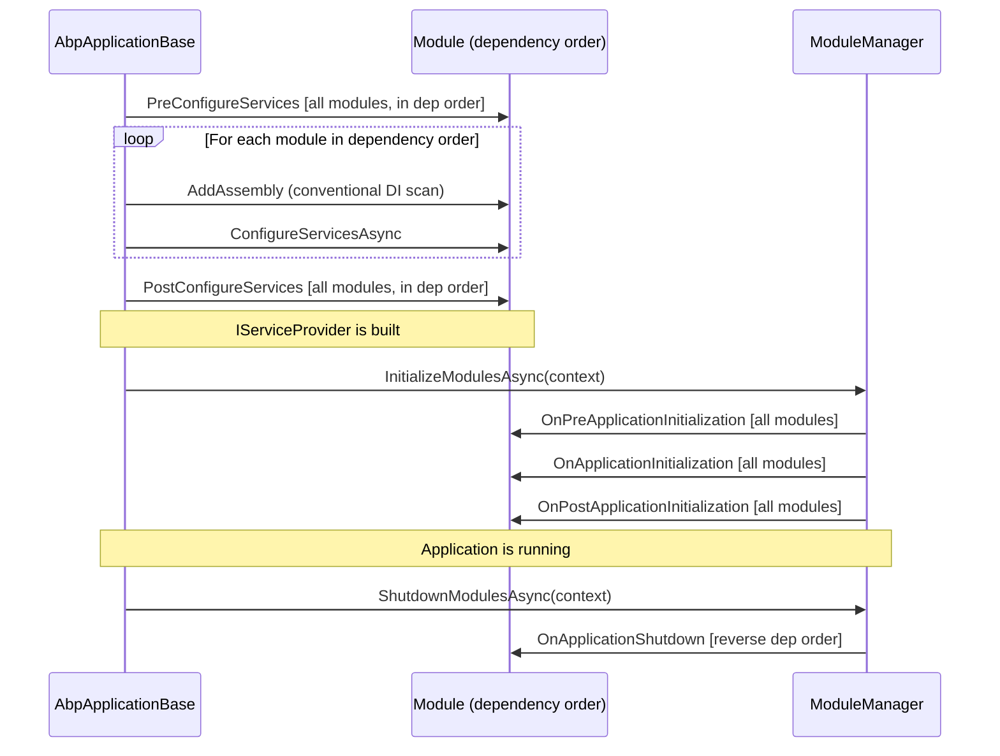

Every ABP module participates in a deterministic lifecycle that spans two distinct stages: a **services configuration stage** (before the DI container is built) and an **application initialization stage** (after the container is built). Each stage is subdivided into pre, main, and post phases, giving six hookable points in total. This page covers the interfaces that define those phases, the `IModuleLifecycleContributor` pattern that drives them, and the `ModuleManager` that orchestrates everything.

## The Six Lifecycle Interfaces

### Services Configuration Phase

These three interfaces are invoked by `AbpApplicationBase.ConfigureServicesAsync`
(`Volo.Abp.Core/Volo/Abp/AbpApplicationBase.cs`) while `IServiceCollection` is still mutable. The DI container does **not** exist yet.

| Interface | File | When | Typical use |
|---|---|---|---|
| `IPreConfigureServices` | `IPreConfigureServices.cs` | Before any `ConfigureServices` call | Reserve options slots, pre-register required services |
| `IAbpModule` (via `ConfigureServices`) | `IAbpModule.cs` | Main configuration; auto-scan runs just before each module's call | Register module's own services, configure `IOptions<T>` |
| `IPostConfigureServices` | `IPostConfigureServices.cs` | After all `ConfigureServices` calls | Override or finalize registrations set by other modules |

```csharp
// Volo.Abp.Core/Volo/Abp/Modularity/IPreConfigureServices.cs
public interface IPreConfigureServices
{
    Task PreConfigureServicesAsync(ServiceConfigurationContext context);
    void PreConfigureServices(ServiceConfigurationContext context);
}

// Volo.Abp.Core/Volo/Abp/Modularity/IPostConfigureServices.cs
public interface IPostConfigureServices
{
    Task PostConfigureServicesAsync(ServiceConfigurationContext context);
    void PostConfigureServices(ServiceConfigurationContext context);
}
```

`AbpModule` provides virtual no-op implementations for all three. Its async overloads delegate to the synchronous ones so a module only needs to override one form:

```csharp
// AbpModule.cs
public virtual Task PreConfigureServicesAsync(ServiceConfigurationContext context)
{
    PreConfigureServices(context);
    return Task.CompletedTask;
}

public virtual void PreConfigureServices(ServiceConfigurationContext context) { }
```

<Warning>
`ServiceConfigurationContext` (and `ServiceConfigurationContext.Services`) is only valid during these three phases. `AbpApplicationBase` sets it to `null!` on each module instance after `PostConfigureServices` completes. Storing a reference to use later will cause a null-reference exception.
</Warning>

### Auto-Scan Timing Within ConfigureServices

`AbpApplicationBase.ConfigureServicesAsync` runs the conventional registrar for each module's assemblies **in the same loop** as `ConfigureServicesAsync`. For each module (in dependency order), it first calls `Services.AddAssembly(assembly)` for each of the module's assemblies (unless `SkipAutoServiceRegistration` is set), then immediately calls `module.Instance.ConfigureServicesAsync(context)`. This means a module's own services are already registered in `IServiceCollection` by the time its `ConfigureServices` override runs.

### Application Initialization Phase

These three interfaces are driven by `ModuleManager` after the DI container is built. An `ApplicationInitializationContext` carrying the scoped `IServiceProvider` is passed through.

| Interface | File | When | Typical use |
|---|---|---|---|
| `IOnPreApplicationInitialization` | `IOnPreApplicationInitialization.cs` | Earliest init point | Seed data, warm caches |
| `IOnApplicationInitialization` | `IAbpModule.cs` (via `AbpModule`) | Main init | Configure ASP.NET Core pipeline (`app.UseXxx`) |
| `IOnPostApplicationInitialization` | `IOnPostApplicationInitialization.cs` | After all main init | Post-start validation, background jobs |

```csharp
// Volo.Abp.Core/Volo/Abp/Modularity/IOnPreApplicationInitialization.cs
public interface IOnPreApplicationInitialization
{
    Task OnPreApplicationInitializationAsync(ApplicationInitializationContext context);
    void OnPreApplicationInitialization(ApplicationInitializationContext context);
}

// Volo.Abp.Core/Volo/Abp/Modularity/IOnPostApplicationInitialization.cs
public interface IOnPostApplicationInitialization
{
    Task OnPostApplicationInitializationAsync(ApplicationInitializationContext context);
    void OnPostApplicationInitialization(ApplicationInitializationContext context);
}
```

`IOnApplicationInitialization` is implemented directly by `AbpModule`:

```csharp
public virtual void OnApplicationInitialization(ApplicationInitializationContext context) { }
public virtual Task OnApplicationInitializationAsync(ApplicationInitializationContext context)
{
    OnApplicationInitialization(context);
    return Task.CompletedTask;
}
```

### Shutdown

```csharp
// Volo.Abp.Core/Volo/Abp/Modularity/IOnApplicationShutdown.cs (via AbpModule)
public interface IOnApplicationShutdown
{
    Task OnApplicationShutdownAsync(ApplicationShutdownContext context);
    void OnApplicationShutdown(ApplicationShutdownContext context);
}
```

Shutdown is driven in **reverse dependency order** — the startup module shuts down first, leaf dependencies last — which mirrors the natural stack-like unwinding expected when releasing resources.

## Full Lifecycle Sequence

The sequence below shows the true ordering from `AbpApplicationBase`. All `PreConfigureServices` calls complete across all modules before any `ConfigureServices` call starts. Within the `ConfigureServices` pass, assembly scanning runs for each module immediately before that module's `ConfigureServicesAsync` is invoked.



## `IModuleLifecycleContributor` — The Contributor Pattern

Rather than hard-coding calls to lifecycle interfaces, ABP uses a **contributor** pattern. Each application-initialization phase is represented by a dedicated contributor class, and `ModuleManager` iterates the registered contributors over all modules:

```csharp
// Volo.Abp.Core/Volo/Abp/Modularity/IModuleLifecycleContributor.cs
public interface IModuleLifecycleContributor : ITransientDependency
{
    Task InitializeAsync(ApplicationInitializationContext context, IAbpModule module);
    void Initialize(ApplicationInitializationContext context, IAbpModule module);
    Task ShutdownAsync(ApplicationShutdownContext context, IAbpModule module);
    void Shutdown(ApplicationShutdownContext context, IAbpModule module);
}
```

Note that `IModuleLifecycleContributor` extends `ITransientDependency`, so every contributor is automatically registered as transient by the conventional registrar.

The abstract base class provides no-op defaults:

```csharp
// Volo.Abp.Core/Volo/Abp/Modularity/ModuleLifecycleContributorBase.cs
public abstract class ModuleLifecycleContributorBase : IModuleLifecycleContributor
{
    public virtual Task InitializeAsync(ApplicationInitializationContext context, IAbpModule module)
        => Task.CompletedTask;
    public virtual void Initialize(ApplicationInitializationContext context, IAbpModule module) { }
    public virtual Task ShutdownAsync(ApplicationShutdownContext context, IAbpModule module)
        => Task.CompletedTask;
    public virtual void Shutdown(ApplicationShutdownContext context, IAbpModule module) { }
}
```

## Default Lifecycle Contributors

Four contributors are registered by `AddCoreAbpServices` in
`Volo.Abp.Core/Volo/Abp/Internal/InternalServiceCollectionExtensions.cs`:

```csharp
services.Configure<AbpModuleLifecycleOptions>(options =>
{
    options.Contributors.Add<OnPreApplicationInitializationModuleLifecycleContributor>();
    options.Contributors.Add<OnApplicationInitializationModuleLifecycleContributor>();
    options.Contributors.Add<OnPostApplicationInitializationModuleLifecycleContributor>();
    options.Contributors.Add<OnApplicationShutdownModuleLifecycleContributor>();
});
```

All four are defined in `Volo.Abp.Core/Volo/Abp/Modularity/DefaultModuleLifecycleContributor.cs`. Each contributor pattern-matches the `IAbpModule` instance against the corresponding interface:

```csharp
public class OnApplicationInitializationModuleLifecycleContributor : ModuleLifecycleContributorBase
{
    public async override Task InitializeAsync(
        ApplicationInitializationContext context, IAbpModule module)
    {
        if (module is IOnApplicationInitialization onApplicationInitialization)
        {
            await onApplicationInitialization.OnApplicationInitializationAsync(context);
        }
    }

    public override void Initialize(ApplicationInitializationContext context, IAbpModule module)
    {
        (module as IOnApplicationInitialization)?.OnApplicationInitialization(context);
    }
}

public class OnApplicationShutdownModuleLifecycleContributor : ModuleLifecycleContributorBase
{
    public async override Task ShutdownAsync(
        ApplicationShutdownContext context, IAbpModule module)
    {
        if (module is IOnApplicationShutdown onApplicationShutdown)
        {
            await onApplicationShutdown.OnApplicationShutdownAsync(context);
        }
    }

    public override void Shutdown(ApplicationShutdownContext context, IAbpModule module)
    {
        (module as IOnApplicationShutdown)?.OnApplicationShutdown(context);
    }
}
```

The cast-and-check pattern means a module only participates in a phase if it actually implements the corresponding interface — modules that don't override `OnApplicationInitialization` incur no call overhead.

## `ModuleManager` — Driving the Contributors

`ModuleManager` (`Volo.Abp.Core/Volo/Abp/Modularity/ModuleManager.cs`) resolves its contributor list from `AbpModuleLifecycleOptions` at construction time and caches them as an array:

```csharp
public class ModuleManager : IModuleManager, ISingletonDependency
{
    private readonly IModuleContainer _moduleContainer;
    private readonly IEnumerable<IModuleLifecycleContributor> _lifecycleContributors;
    private readonly ILogger<ModuleManager> _logger;

    public ModuleManager(
        IModuleContainer moduleContainer,
        ILogger<ModuleManager> logger,
        IOptions<AbpModuleLifecycleOptions> options,
        IServiceProvider serviceProvider)
    {
        _moduleContainer = moduleContainer;
        _logger = logger;
        _lifecycleContributors = options.Value
            .Contributors
            .Select(serviceProvider.GetRequiredService)
            .Cast<IModuleLifecycleContributor>()
            .ToArray();
    }
}
```

<Note>
`ModuleManager` implements `ISingletonDependency`, so it is registered as a singleton by the conventional registrar when the `Volo.Abp.Core` assembly is scanned.
</Note>

### `InitializeModulesAsync`

The outer loop iterates contributors; the inner loop iterates modules. This means **all modules complete one phase before the next phase begins** — there is no per-module "run all phases then move to next module" behavior.

```csharp
public virtual async Task InitializeModulesAsync(ApplicationInitializationContext context)
{
    foreach (var contributor in _lifecycleContributors)
    {
        foreach (var module in _moduleContainer.Modules)
        {
            try
            {
                await contributor.InitializeAsync(context, module.Instance);
            }
            catch (Exception ex)
            {
                throw new AbpInitializationException(
                    $"An error occurred during the initialize " +
                    $"{contributor.GetType().FullName} phase of the module " +
                    $"{module.Type.AssemblyQualifiedName}: {ex.Message}. " +
                    $"See the inner exception for details.", ex);
            }
        }
    }
    _logger.LogInformation("Initialized all ABP modules.");
}
```

`InitializeModules` (sync overload) follows the same pattern using the synchronous contributor method.

### `ShutdownModulesAsync`

```csharp
public virtual async Task ShutdownModulesAsync(ApplicationShutdownContext context)
{
    var modules = _moduleContainer.Modules.Reverse().ToList();
    foreach (var contributor in _lifecycleContributors)
    {
        foreach (var module in modules)
        {
            try
            {
                await contributor.ShutdownAsync(context, module.Instance);
            }
            catch (Exception ex)
            {
                throw new AbpShutdownException(
                    $"An error occurred during the shutdown " +
                    $"{contributor.GetType().FullName} phase of the module " +
                    $"{module.Type.AssemblyQualifiedName}: {ex.Message}. " +
                    $"See the inner exception for details.", ex);
            }
        }
    }
}
```

The `Reverse()` ensures the startup module (last in the sorted list) shuts down first. Shutdown is invoked from `AbpApplicationBase.ShutdownAsync` inside a new DI scope.

## `AbpModuleLifecycleOptions`

`AbpModuleLifecycleOptions` (`Volo.Abp.Core/Volo/Abp/Modularity/AbpModuleLifecycleOptions.cs`) holds the ordered list of contributor types:

```csharp
public class AbpModuleLifecycleOptions
{
    public ITypeList<IModuleLifecycleContributor> Contributors { get; }

    public AbpModuleLifecycleOptions()
    {
        Contributors = new TypeList<IModuleLifecycleContributor>();
    }
}
```

`Contributors` is an `ITypeList<IModuleLifecycleContributor>`, which stores `Type` objects rather than instances. `ModuleManager` resolves each type from DI at construction using `serviceProvider.GetRequiredService`, so contributors can have constructor dependencies.

Custom contributors can be added by configuring `AbpModuleLifecycleOptions` in any module's `ConfigureServices`:

```csharp
public override void ConfigureServices(ServiceConfigurationContext context)
{
    Configure<AbpModuleLifecycleOptions>(options =>
    {
        options.Contributors.Add<MyCustomLifecycleContributor>();
    });
}
```

The order in `Contributors` controls the order phases are executed. The four built-in contributors are added in the order: `OnPreApplicationInitialization`, `OnApplicationInitialization`, `OnPostApplicationInitialization`, `OnApplicationShutdown`.

## Error Handling

Both `InitializeModulesAsync` and `ShutdownModulesAsync` wrap contributor calls in try/catch:

- Initialization errors are rethrown as `AbpInitializationException`
- Shutdown errors are rethrown as `AbpShutdownException`

Both preserve the original exception as `InnerException` and include the fully-qualified names of the failing contributor and module in the message.

## Writing a Custom Lifecycle Contributor

Inherit `ModuleLifecycleContributorBase` and override only the methods you need:

```csharp
public class MyLifecycleContributor : ModuleLifecycleContributorBase
{
    public override async Task InitializeAsync(
        ApplicationInitializationContext context, IAbpModule module)
    {
        if (module is IMyLifecycleHook hook)
        {
            await hook.OnMyPhaseAsync(context);
        }
    }
}

// Register in any module:
Configure<AbpModuleLifecycleOptions>(options =>
{
    options.Contributors.Add<MyLifecycleContributor>();
});
```

Because `IModuleLifecycleContributor` extends `ITransientDependency`, custom contributors are automatically registered by the conventional registrar — no manual `services.AddTransient` is required.

## See Also

<CardGroup cols={2}>
  <Card title="Module System" icon="cubes" href="/modularity/module-system">
    How modules are discovered, described, and topologically sorted before lifecycle begins.
  </Card>
  <Card title="Dependency Injection" icon="inject" href="/modularity/dependency-injection">
    Conventional service registration that runs during the ConfigureServices phase.
  </Card>
</CardGroup>
