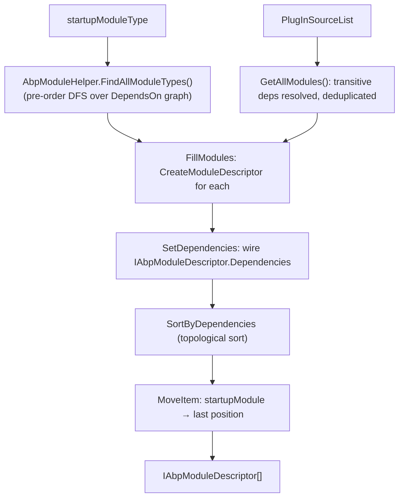

The ABP module system is the mechanism by which an application is composed from independently deployable units called modules. Every module is a class that inherits `AbpModule`, declares its dependencies with `[DependsOn]`, and exposes lifecycle hooks through virtual method overrides. `ModuleLoader` discovers all reachable modules from a startup type, builds descriptor objects, and topologically sorts them so that every dependency is initialized before its dependent. This page covers the full internals of those types.

## `IAbpModule` — The Minimal Contract

The simplest possible ABP module needs only to implement `IAbpModule`
(`Volo.Abp.Core/Volo/Abp/Modularity/IAbpModule.cs`):

```csharp
public interface IAbpModule
{
    Task ConfigureServicesAsync(ServiceConfigurationContext context);
    void ConfigureServices(ServiceConfigurationContext context);
}
```

The sync and async overloads coexist so that existing synchronous code does not require async plumbing. `AbpModule` provides default no-op implementations for both, plus all lifecycle interfaces.

## `AbpModule` — The Concrete Base Class

`AbpModule` (`Volo.Abp.Core/Volo/Abp/Modularity/AbpModule.cs`) is the class every real module inherits. It implements all six lifecycle interfaces and provides helper methods for `IOptions<T>` configuration:

```csharp
public abstract class AbpModule :
    IAbpModule,
    IOnPreApplicationInitialization,
    IOnApplicationInitialization,
    IOnPostApplicationInitialization,
    IOnApplicationShutdown,
    IPreConfigureServices,
    IPostConfigureServices
{
    protected internal bool SkipAutoServiceRegistration { get; protected set; }

    protected internal ServiceConfigurationContext ServiceConfigurationContext { get; internal set; }

    public virtual void ConfigureServices(ServiceConfigurationContext context) { }
    public virtual Task ConfigureServicesAsync(ServiceConfigurationContext context) { ... }
    public virtual void PreConfigureServices(ServiceConfigurationContext context) { }
    public virtual Task PreConfigureServicesAsync(ServiceConfigurationContext context) { ... }
    public virtual void PostConfigureServices(ServiceConfigurationContext context) { }
    public virtual Task PostConfigureServicesAsync(ServiceConfigurationContext context) { ... }
    public virtual void OnPreApplicationInitialization(ApplicationInitializationContext context) { }
    public virtual Task OnPreApplicationInitializationAsync(ApplicationInitializationContext context) { ... }
    public virtual void OnApplicationInitialization(ApplicationInitializationContext context) { }
    public virtual Task OnApplicationInitializationAsync(ApplicationInitializationContext context) { ... }
    public virtual void OnPostApplicationInitialization(ApplicationInitializationContext context) { }
    public virtual Task OnPostApplicationInitializationAsync(ApplicationInitializationContext context) { ... }
    public virtual void OnApplicationShutdown(ApplicationShutdownContext context) { }
    public virtual Task OnApplicationShutdownAsync(ApplicationShutdownContext context) { ... }
}
```

For every async override, `AbpModule` provides a default implementation that calls the synchronous version and returns `Task.CompletedTask`. Module authors override either the sync or the async form — they need not override both.

### `ServiceConfigurationContext` Access Guard

`ServiceConfigurationContext` is only valid while `ConfigureServices` / `Pre` / `Post` are executing. Accessing it at any other time throws:

```csharp
protected internal ServiceConfigurationContext ServiceConfigurationContext {
    get {
        if (_serviceConfigurationContext == null)
        {
            throw new AbpException(
                $"{nameof(ServiceConfigurationContext)} is only available in the " +
                $"{nameof(ConfigureServices)}, {nameof(PreConfigureServices)} and " +
                $"{nameof(PostConfigureServices)} methods.");
        }
        return _serviceConfigurationContext;
    }
    internal set => _serviceConfigurationContext = value;
}
```

`AbpApplicationBase.ConfigureServicesAsync` sets `ServiceConfigurationContext` on each module instance before calling the configuration phase, and resets it to `null!` after `PostConfigureServices` completes. Any field or property that stores a reference to `ServiceConfigurationContext` for later use will observe `null` after startup.

### `SkipAutoServiceRegistration`

Setting `SkipAutoServiceRegistration = true` in a module's constructor prevents `AbpApplicationBase.ConfigureServicesAsync` from calling `services.AddAssembly(assembly)` for that module's assemblies. Specifically, the loop in `AbpApplicationBase` is:

```csharp
if (!abpModule.SkipAutoServiceRegistration)
{
    foreach (var assembly in module.AllAssemblies)
    {
        if (!assemblies.Contains(assembly))
        {
            Services.AddAssembly(assembly);
            assemblies.Add(assembly);
        }
    }
}
```

This flag is useful for framework modules that register their services through other means (e.g., manually calling `AddXxx` extension methods) and want to avoid double-registration from the conventional registrar.

### `Configure<TOptions>` Helpers

`AbpModule` wraps `IServiceCollection.Configure<TOptions>` so module authors can call `Configure<MyOptions>(o => ...)` without needing to reference `ServiceConfigurationContext.Services` directly. Five overloads are provided:

```csharp
// Action-based
protected void Configure<TOptions>(Action<TOptions> configureOptions)
    where TOptions : class
{
    ServiceConfigurationContext.Services.Configure(configureOptions);
}

// Named options
protected void Configure<TOptions>(string name, Action<TOptions> configureOptions)
    where TOptions : class

// IConfiguration binding
protected void Configure<TOptions>(IConfiguration configuration)
    where TOptions : class

// IConfiguration + BinderOptions
protected void Configure<TOptions>(IConfiguration configuration, Action<BinderOptions> configureBinder)
    where TOptions : class

// Named + IConfiguration
protected void Configure<TOptions>(string name, IConfiguration configuration)
    where TOptions : class
```

`PreConfigure<TOptions>`, `PostConfigure<TOptions>`, and `PostConfigureAll<TOptions>` delegate to the corresponding `IServiceCollection` extension methods in the same way.

### Static Helpers

```csharp
public static bool IsAbpModule(Type type)
{
    var typeInfo = type.GetTypeInfo();
    return typeInfo.IsClass &&
           !typeInfo.IsAbstract &&
           !typeInfo.IsGenericType &&
           typeof(IAbpModule).GetTypeInfo().IsAssignableFrom(type);
}
```

`IsAbpModule` is used by `FolderPlugInSource` and `FilePlugInSource` when scanning assemblies for module types, and by `AbpModule.CheckAbpModuleType` which throws `ArgumentException` if the check fails.

## `DependsOnAttribute` — Declaring Dependencies

```csharp
// Volo.Abp.Core/Volo/Abp/Modularity/DependsOnAttribute.cs
[AttributeUsage(AttributeTargets.Class, AllowMultiple = true)]
public class DependsOnAttribute : Attribute, IDependedTypesProvider
{
    public Type[] DependedTypes { get; }

    public DependsOnAttribute(params Type[]? dependedTypes)
    {
        DependedTypes = dependedTypes ?? Type.EmptyTypes;
    }

    public virtual Type[] GetDependedTypes() => DependedTypes;
}
```

The attribute is `AllowMultiple = true`, so a single module can carry multiple `[DependsOn]` attributes. It implements `IDependedTypesProvider`, which means any custom attribute that also implements `IDependedTypesProvider` is treated identically by `AbpModuleHelper.FindDependedModuleTypes` — enabling custom dependency-declaration conventions.

**Example:**

```csharp
[DependsOn(
    typeof(AbpAspNetCoreMvcModule),
    typeof(BookStoreDomainModule))]
public class BookStoreWebModule : AbpModule { }
```

## `AdditionalAssemblyAttribute` — Extra Module Assemblies

A module can declare that additional assemblies belong to it by applying `[AdditionalAssembly]`:

```csharp
// Volo.Abp.Core/Volo/Abp/Modularity/AdditionalAssemblyAttribute.cs
[AttributeUsage(AttributeTargets.Class, AllowMultiple = true)]
public class AdditionalAssemblyAttribute : Attribute, IAdditionalModuleAssemblyProvider
{
    public Type[] TypesInAssemblies { get; }

    public AdditionalAssemblyAttribute(params Type[]? typesInAssemblies)
    {
        TypesInAssemblies = typesInAssemblies ?? Type.EmptyTypes;
    }

    public virtual Assembly[] GetAssemblies()
    {
        return TypesInAssemblies.Select(t => t.Assembly).Distinct().ToArray();
    }
}
```

`AbpModuleHelper.GetAllAssemblies` collects all `IAdditionalModuleAssemblyProvider` attributes on the module class and returns the union of those assemblies with the module's own primary assembly. This `AllAssemblies` array is stored in `AbpModuleDescriptor` and used by `AbpApplicationBase` to scan each assembly with the conventional registrar.

## `IAbpModuleDescriptor` — Runtime Representation

Once loaded, every module is represented by an `IAbpModuleDescriptor`
(`Volo.Abp.Core/Volo/Abp/Modularity/IAbpModuleDescriptor.cs`):

```csharp
public interface IAbpModuleDescriptor
{
    Type Type { get; }
    Assembly Assembly { get; }
    Assembly[] AllAssemblies { get; }   // includes AdditionalAssemblyAttribute assemblies
    IAbpModule Instance { get; }        // singleton instance
    bool IsLoadedAsPlugIn { get; }
    IReadOnlyList<IAbpModuleDescriptor> Dependencies { get; }
}
```

The concrete implementation `AbpModuleDescriptor`
(`Volo.Abp.Core/Volo/Abp/Modularity/AbpModuleDescriptor.cs`) validates its inputs at construction:

```csharp
public AbpModuleDescriptor(Type type, IAbpModule instance, bool isLoadedAsPlugIn)
{
    Check.NotNull(type, nameof(type));
    Check.NotNull(instance, nameof(instance));
    AbpModule.CheckAbpModuleType(type);   // enforces IsAbpModule check

    Type = type;
    Assembly = type.Assembly;
    AllAssemblies = AbpModuleHelper.GetAllAssemblies(type);
    Instance = instance;
    IsLoadedAsPlugIn = isLoadedAsPlugIn;
    _dependencies = new List<IAbpModuleDescriptor>();
}
```

`AddDependency(IAbpModuleDescriptor descriptor)` appends to the internal `_dependencies` list using `AddIfNotContains` to prevent duplicate entries. `Dependencies` is exposed as `ImmutableList<IAbpModuleDescriptor>` via `_dependencies.ToImmutableList()`.

## `AbpModuleHelper` — Static Discovery Utilities

`AbpModuleHelper` (`Volo.Abp.Core/Volo/Abp/Modularity/AbpModuleHelper.cs`) provides three static methods:

| Method | Purpose |
|---|---|
| `FindAllModuleTypes(Type startupModuleType, ILogger? logger)` | Pre-order depth-first traversal of `[DependsOn]` graph, deduplicating types |
| `FindDependedModuleTypes(Type moduleType)` | Direct dependency types from all `IDependedTypesProvider` attributes on one module |
| `GetAllAssemblies(Type moduleType)` | Union of the module's assembly and any `IAdditionalModuleAssemblyProvider`-declared assemblies |

`FindAllModuleTypes` logs each discovered type at `Debug` level with indentation proportional to depth, which is visible in the init log output.

## `ModuleLoader` — Discovery and Sorting

`ModuleLoader` (`Volo.Abp.Core/Volo/Abp/Modularity/ModuleLoader.cs`) is the workhorse. Its public entry point is `LoadModules`, which performs two steps:

```csharp
public IAbpModuleDescriptor[] LoadModules(
    IServiceCollection services,
    Type startupModuleType,
    PlugInSourceList plugInSources)
{
    Check.NotNull(services, nameof(services));
    Check.NotNull(startupModuleType, nameof(startupModuleType));
    Check.NotNull(plugInSources, nameof(plugInSources));

    var modules = GetDescriptors(services, startupModuleType, plugInSources);
    modules = SortByDependency(modules, startupModuleType);
    return modules.ToArray();
}
```

### Step 1 — `GetDescriptors`

```csharp
private List<IAbpModuleDescriptor> GetDescriptors(
    IServiceCollection services,
    Type startupModuleType,
    PlugInSourceList plugInSources)
{
    var modules = new List<AbpModuleDescriptor>();
    FillModules(modules, services, startupModuleType, plugInSources);
    SetDependencies(modules);
    return modules.Cast<IAbpModuleDescriptor>().ToList();
}
```

`FillModules` first calls `AbpModuleHelper.FindAllModuleTypes` which traverses the `[DependsOn]` graph from the startup module. Then plugin module types from `PlugInSourceList.GetAllModules()` are appended, skipping duplicates:

```csharp
protected virtual void FillModules(
    List<AbpModuleDescriptor> modules,
    IServiceCollection services,
    Type startupModuleType,
    PlugInSourceList plugInSources)
{
    var logger = services.GetInitLogger<AbpApplicationBase>();

    // All modules reachable from startupModuleType via [DependsOn]
    foreach (var moduleType in AbpModuleHelper.FindAllModuleTypes(startupModuleType, logger))
    {
        modules.Add(CreateModuleDescriptor(services, moduleType));
    }

    // Plugin modules (deduplicated)
    foreach (var moduleType in plugInSources.GetAllModules(logger))
    {
        if (modules.Any(m => m.Type == moduleType)) { continue; }
        modules.Add(CreateModuleDescriptor(services, moduleType, isLoadedAsPlugIn: true));
    }
}
```

Each module instance is created with `Activator.CreateInstance` and immediately registered in `IServiceCollection` as a singleton:

```csharp
protected virtual IAbpModule CreateAndRegisterModule(IServiceCollection services, Type moduleType)
{
    var module = (IAbpModule)Activator.CreateInstance(moduleType)!;
    services.AddSingleton(moduleType, module);
    return module;
}
```

`SetDependencies` wires each descriptor's `Dependencies` list from the already-built descriptor collection. If a declared dependency type was not found among the loaded descriptors, it throws `AbpException` with the assembly-qualified names of both the dependent and the missing dependency.

### Step 2 — `SortByDependency`

```csharp
protected virtual List<IAbpModuleDescriptor> SortByDependency(
    List<IAbpModuleDescriptor> modules,
    Type startupModuleType)
{
    var sortedModules = modules.SortByDependencies(m => m.Dependencies);
    sortedModules.MoveItem(m => m.Type == startupModuleType, modules.Count - 1);
    return sortedModules;
}
```

`SortByDependencies` is an extension method (from `Volo.Abp.Collections`) that implements a topological sort. After sorting, `MoveItem` guarantees the startup module is always **last**, so its lifecycle hooks execute after all of its dependencies.

<Warning>
Circular dependencies between modules are caught by the topological sort and result in an exception during application startup, not at runtime.
</Warning>

## Plugin Sources

Plugins are loaded through the `PlugInSourceList` collected in `AbpApplicationCreationOptions.PlugInSources`. Three built-in sources ship with `Volo.Abp.Core`:

### `FolderPlugInSource`

`Volo.Abp.Core/Volo/Abp/Modularity/PlugIns/FolderPlugInSource.cs` — loads all `.dll` files from a directory and extracts any types satisfying `AbpModule.IsAbpModule`:

```csharp
public class FolderPlugInSource : IPlugInSource
{
    public string Folder { get; }
    public SearchOption SearchOption { get; set; }  // TopDirectoryOnly by default
    public Func<string, bool>? Filter { get; set; } // optional file path filter

    public Type[] GetModules()
    {
        var modules = new List<Type>();
        foreach (var assembly in GetAssemblies())
        {
            foreach (var type in assembly.GetTypes())
            {
                if (AbpModule.IsAbpModule(type))
                    modules.AddIfNotContains(type);
            }
        }
        return modules.ToArray();
    }

    private List<Assembly> GetAssemblies()
    {
        var assemblyFiles = AssemblyHelper.GetAssemblyFiles(Folder, SearchOption);
        if (Filter != null) assemblyFiles = assemblyFiles.Where(Filter);
        return assemblyFiles
            .Select(AssemblyLoadContext.Default.LoadFromAssemblyPath)
            .ToList();
    }
}
```

Assemblies are loaded via `AssemblyLoadContext.Default`, so they share the default ALC and participate in normal type resolution.

### `FilePlugInSource`

`Volo.Abp.Core/Volo/Abp/Modularity/PlugIns/FilePlugInSource.cs` — accepts explicit assembly file paths and loads each via `AssemblyLoadContext.Default.LoadFromAssemblyPath`:

```csharp
public class FilePlugInSource : IPlugInSource
{
    public string[] FilePaths { get; }

    public FilePlugInSource(params string[]? filePaths)
    {
        FilePaths = filePaths ?? new string[0];
    }

    public Type[] GetModules()
    {
        var modules = new List<Type>();
        foreach (var filePath in FilePaths)
        {
            var assembly = AssemblyLoadContext.Default.LoadFromAssemblyPath(filePath);
            foreach (var type in assembly.GetTypes())
            {
                if (AbpModule.IsAbpModule(type))
                    modules.AddIfNotContains(type);
            }
        }
        return modules.ToArray();
    }
}
```

### `TypePlugInSource`

`Volo.Abp.Core/Volo/Abp/Modularity/PlugIns/TypePlugInSource.cs` — accepts explicit module types at construction time, useful in tests or when the plugin assembly is already loaded:

```csharp
public class TypePlugInSource : IPlugInSource
{
    private readonly Type[] _moduleTypes;

    public TypePlugInSource(params Type[]? moduleTypes)
    {
        _moduleTypes = moduleTypes ?? new Type[0];
    }

    public Type[] GetModules() => _moduleTypes;
}
```

### `IPlugInSource` Contract

All three sources implement `IPlugInSource`
(`Volo.Abp.Core/Volo/Abp/Modularity/PlugIns/IPlugInSource.cs`):

```csharp
public interface IPlugInSource
{
    Type[] GetModules();
}
```

The extension method `GetModulesWithAllDependencies` in `PlugInSourceExtensions` calls `AbpModuleHelper.FindAllModuleTypes` on each returned type to recursively resolve transitive plugin dependencies:

```csharp
// PlugInSourceExtensions.cs
public static Type[] GetModulesWithAllDependencies(this IPlugInSource plugInSource, ILogger logger)
{
    return plugInSource
        .GetModules()
        .SelectMany(type => AbpModuleHelper.FindAllModuleTypes(type, logger))
        .Distinct()
        .ToArray();
}
```

`PlugInSourceList.GetAllModules` calls `GetModulesWithAllDependencies` on every source and deduplicates the result.

<Tip>
When writing a custom `IPlugInSource`, implement only `GetModules()` and return direct module types. The framework resolves transitive dependencies automatically via `GetModulesWithAllDependencies`.
</Tip>

## Module Discovery Flow



## `ServiceConfigurationContext`

`ServiceConfigurationContext` (`Volo.Abp.Core/Volo/Abp/Modularity/ServiceConfigurationContext.cs`) is the object passed to all three service-configuration phases. It exposes:

| Member | Type | Purpose |
|---|---|---|
| `Services` | `IServiceCollection` | The live DI service collection |
| `Configuration` | `IConfiguration` | Lazily resolved from `Services` |
| `Items` | `IDictionary<string, object?>` | Arbitrary shared state between modules during configuration |
| `this[string key]` | `object?` | Indexer shortcut for `Items` |

Modules can use `Items` to pass context or flags to other modules without requiring custom services to already be registered:

```csharp
// In one module's PreConfigureServices
context["MyFlag"] = true;

// In another module's ConfigureServices
if (context["MyFlag"] is true) { ... }
```

## See Also

<CardGroup cols={2}>
  <Card title="Module Lifecycle" icon="rotate" href="/modularity/module-lifecycle">
    How the sorted descriptor list is driven through Pre/Initialize/Post/Shutdown phases.
  </Card>
  <Card title="Dependency Injection" icon="inject" href="/modularity/dependency-injection">
    How each module's assemblies are scanned and services registered conventionally.
  </Card>
</CardGroup>
