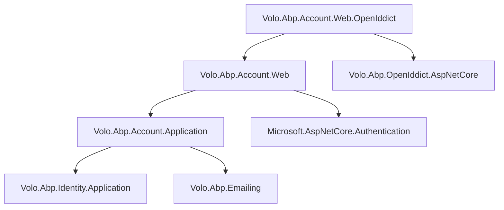

The Account module provides all user-facing authentication and self-service account management flows: registration, login (via the OpenIddict/IdentityServer authorization endpoint), password reset, email confirmation, profile editing, two-factor authentication, and external/social login. It is explicitly separated from the Identity module — Identity owns the domain model, Account owns the user-facing interaction layer built on top of it.

## Package Layout

<CardGroup cols={3}>
  <Card title="Application.Contracts" icon="cube">
    `Volo.Abp.Account.Application.Contracts` — `IAccountAppService`, `IProfileAppService`, `IDynamicClaimsAppService`, all request/response DTOs, permission definitions (`AccountPermissions`)
  </Card>
  <Card title="Application" icon="cube">
    `Volo.Abp.Account.Application` — concrete service implementations; `AccountAppService`, `ProfileAppService`, `DynamicClaimsAppService`; email template helpers in `Emailing/`
  </Card>
  <Card title="HttpApi / HttpApi.Client" icon="cube">
    `Volo.Abp.Account.HttpApi` — `AccountController` (`/api/account`), `ProfileController` (`/api/account/my-profile`); `.HttpApi.Client` for generated proxies
  </Card>
  <Card title="Web" icon="browser">
    `Volo.Abp.Account.Web` — Razor Pages UI: `/Account/Login`, `/Account/Register`, `/Account/ForgotPassword`, `/Account/Manage`, `/Account/ExternalLogin`
  </Card>
  <Card title="Web.OpenIddict" icon="browser">
    `Volo.Abp.Account.Web.OpenIddict` — Razor Pages that participate in the OpenIddict authorization endpoint pipeline; handles consent and device flows
  </Card>
  <Card title="Web.IdentityServer" icon="browser">
    `Volo.Abp.Account.Web.IdentityServer` — legacy Razor Pages for IdentityServer4 flows (deprecated in favour of OpenIddict variant)
  </Card>
  <Card title="Blazor variants" icon="browser">
    `Volo.Abp.Account.Blazor` and `.Blazor.MudBlazor` — Blazor-hosted account management pages (profile, password change, two-factor)
  </Card>
</CardGroup>

<Note>
The Account module has no Domain or Domain.Shared package. It holds no aggregate roots of its own — all persistence is delegated to the Identity module's `IdentityUserManager` and repositories.
</Note>

## Application Services

### IAccountAppService

```csharp
public interface IAccountAppService : IApplicationService
{
    Task<IdentityUserDto> RegisterAsync(RegisterDto input);
    Task SendPasswordResetCodeAsync(SendPasswordResetCodeDto input);
    Task<bool> VerifyPasswordResetTokenAsync(VerifyPasswordResetTokenInput input);
    Task ResetPasswordAsync(ResetPasswordDto input);
}
```

The concrete `AccountAppService` implementation:

```csharp
public virtual async Task<IdentityUserDto> RegisterAsync(RegisterDto input)
{
    await CheckSelfRegistrationAsync(); // throws if setting disabled

    var user = new IdentityUser(GuidGenerator.Create(),
        input.UserName, input.EmailAddress, CurrentTenant.Id);

    input.MapExtraPropertiesTo(user);    // extensibility hook

    (await UserManager.CreateAsync(user, input.Password)).CheckErrors();
    await UserManager.SetEmailAsync(user, input.EmailAddress);
    await UserManager.AddDefaultRolesAsync(user);

    return ObjectMapper.Map<IdentityUser, IdentityUserDto>(user);
}
```

`CheckSelfRegistrationAsync` reads the `Abp.Account.IsSelfRegistrationEnabled` setting; if false it throws a `UserFriendlyException`. The setting is configurable per-tenant.

### IProfileAppService

```csharp
[Authorize]
public interface IProfileAppService : IApplicationService
{
    Task<ProfileDto> GetAsync();
    Task<ProfileDto> UpdateAsync(UpdateProfileDto input);
    Task ChangePasswordAsync(ChangePasswordInput input);
    Task<bool> HasPasswordAsync();
    Task<bool> GetTwoFactorEnabledAsync();
    Task SetTwoFactorEnabledAsync(SetTwoFactorEnabledInput input);
    Task SendPhoneNumberChangeTokenAsync(SendPhoneNumberChangeTokenInput input);
    Task ChangePhoneNumberAsync(ChangePhoneNumberInput input);
}
```

`UpdateAsync` respects two Identity settings before mutating:
- `IdentitySettingNames.User.IsUserNameUpdateEnabled` — only changes username if enabled
- `IdentitySettingNames.User.IsEmailUpdateEnabled` — only changes email if enabled

### IDynamicClaimsAppService

```csharp
public interface IDynamicClaimsAppService : IApplicationService
{
    Task RefreshAsync();
}
```

Triggers invalidation of the `AbpDynamicClaimCacheItem` for the current user, causing the next request to re-read roles and claims from the database rather than the cookie. Called after profile or role changes to keep the client principal up to date without requiring a full re-login.

## HTTP API

All routes are under the `account` remote service area:

| Verb | Route | Purpose |
|---|---|---|
| `POST` | `/api/account/register` | Self-registration |
| `POST` | `/api/account/send-password-reset-code` | Initiate forgot-password flow |
| `POST` | `/api/account/verify-password-reset-token` | Validate reset token (AJAX pre-check) |
| `POST` | `/api/account/reset-password` | Submit new password with reset token |
| `GET` | `/api/account/my-profile` | Read own profile |
| `PUT` | `/api/account/my-profile` | Update own profile |
| `POST` | `/api/account/my-profile/change-password` | Change password |
| `GET` | `/api/account/my-profile/two-factor-enabled` | Check 2FA status |
| `PUT` | `/api/account/my-profile/two-factor-enabled` | Toggle 2FA |
| `POST` | `/api/account/my-profile/send-phone-number-change-token` | Initiate phone change |
| `POST` | `/api/account/my-profile/change-phone-number` | Confirm phone change |
| `POST` | `/api/account/dynamic-claims/refresh` | Invalidate dynamic claims cache |

## Razor Pages (Account.Web)

The `Volo.Abp.Account.Web` package provides Razor Pages that render the traditional MVC-style authentication UI:

```
Pages/Account/
├── Login.cshtml(.cs)           — username/password form, 2FA step, external login buttons
├── Register.cshtml(.cs)        — registration form (gated by IsSelfRegistrationEnabled)
├── ForgotPassword.cshtml(.cs)  — email input for reset-code dispatch
├── ResetPassword.cshtml(.cs)   — new password form with token validation
├── EmailConfirmation.cshtml    — landing page after clicking the confirmation link
├── Manage.cshtml(.cs)          — profile picture, display name (profile management entry)
├── ExternalLogin.cshtml(.cs)   — OAuth callback handler
└── Logout.cshtml(.cs)          — sign-out handler
```

Each page model inherits `AccountPageModel`, which provides `UserManager`, `SignInManager`, and `AccountAppService` as protected properties.

## OpenIddict Integration Package

`Volo.Abp.Account.Web.OpenIddict` overrides several Login/Logout pages and adds new pages required by the OpenIddict server pipeline:

| Page | Purpose |
|---|---|
| `Login` (override) | Calls back into OpenIddict's authorization endpoint after credential validation |
| `Logout` (override) | Participates in OpenIddict's logout endpoint for single sign-out (front-channel) |
| `Consent` | Renders the consent UI for `explicit` consent-type applications |
| `Device` | Device authorization flow — shows the user code entry screen |
| `DeviceConfirmation` | Confirmation page shown after user approves device flow |

<Warning>
You must reference either `Volo.Abp.Account.Web.OpenIddict` **or** `Volo.Abp.Account.Web.IdentityServer` in your host project — never both. The two packages override the same Razor Pages and will conflict.
</Warning>

## Settings

`AccountSettingNames` defines:

| Setting Name | Default | Purpose |
|---|---|---|
| `Abp.Account.IsSelfRegistrationEnabled` | `true` | Gate on the public registration endpoint |
| `Abp.Account.EnableLocalLogin` | `true` | Show or hide username/password login form |

Both are tenant-overridable, allowing per-tenant policies (e.g., some tenants use only SSO).

## Module Dependencies



## Integration Points

### Email Templates

`IAccountEmailer` sends two categories of email:
- **Password reset** — `AccountEmailTemplateNames.PasswordReset` localization key, containing a time-limited token link
- **Email confirmation** — `AccountEmailTemplateNames.EmailConfirmation` localization key

Override `IAccountEmailer` to customize the template content or delivery mechanism (e.g., SendGrid, SES).

### External Login Providers

The Login page enumerates `SignInManager.GetExternalAuthenticationSchemesAsync()` to render social login buttons. Each scheme is a standard ASP.NET Core authentication handler added in `ConfigureServices`. No ABP-specific interface is required — any `IAuthenticationHandler` registered under the `ExternalCookie` scheme is picked up automatically.

### Security Logging

Successful logins, failed attempts, password changes, and two-factor events are written to `IdentitySecurityLog` via `IdentitySecurityLogManager`. The Account module records events with the identity string `"Identity.Application"` and action constants from `IdentitySecurityLogActionConsts`.
