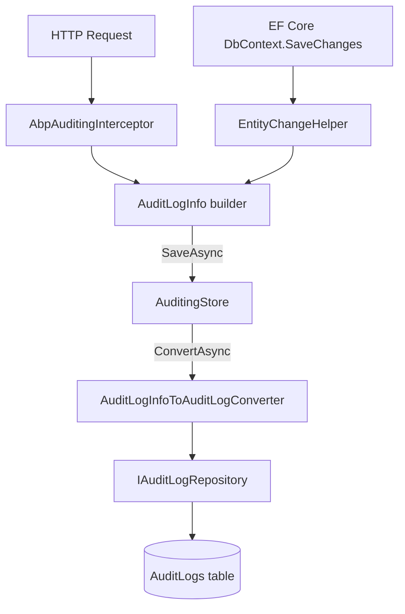
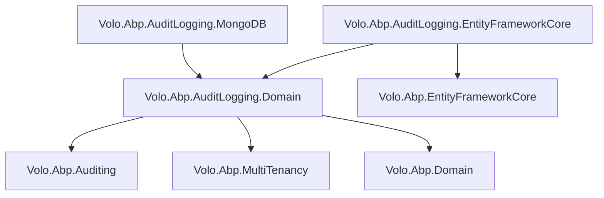

The Audit Logging module provides the persistence layer for ABP's auditing system. The framework package `Volo.Abp.Auditing` intercepts requests and entity mutations in memory, builds `AuditLogInfo` objects, then hands them to `IAuditingStore`. This module supplies the concrete `AuditingStore` implementation that converts `AuditLogInfo` DTOs into `AuditLog` + `EntityChange` + `AuditLogAction` aggregates and writes them to a relational or document database.

## Package Layout

<CardGroup cols={2}>
  <Card title="Domain.Shared" icon="cube">
    `Volo.Abp.AuditLogging.Domain.Shared` — `AuditLogConsts`, `EntityChangeConsts`, `EntityPropertyChangeConsts`, error codes, localization resources
  </Card>
  <Card title="Domain" icon="cube">
    `Volo.Abp.AuditLogging.Domain` — `AuditLog`, `EntityChange`, `EntityPropertyChange`, `AuditLogAction` entities; `IAuditLogRepository`, `AuditingStore`, `AuditLogInfoToAuditLogConverter`
  </Card>
  <Card title="EntityFrameworkCore" icon="database">
    `Volo.Abp.AuditLogging.EntityFrameworkCore` — `AbpAuditLoggingDbContext`, EF Core `IAuditLogRepository` implementation, migration history table configuration
  </Card>
  <Card title="MongoDB" icon="database">
    `Volo.Abp.AuditLogging.MongoDB` — MongoDB collection mapping, `IAuditLogRepository` with filter/sort expressions for the same rich query surface
  </Card>
</CardGroup>

<Note>
There is no Application, HttpApi, or Web package in the open-source Audit Logging module. The HTTP API and management UI are provided by the commercial ABP suite. The open-source layer only handles domain + persistence.
</Note>

## Domain Model

### AuditLog

`AuditLog` is the top-level aggregate root, decorated with `[DisableAuditing]` to prevent infinite recursion if the auditing system itself triggered entity changes:

```csharp
[DisableAuditing]
public class AuditLog : AggregateRoot<Guid>, IMultiTenant
{
    public virtual string ApplicationName { get; set; }
    public virtual Guid? UserId { get; protected set; }
    public virtual string UserName { get; protected set; }
    public virtual Guid? TenantId { get; protected set; }
    public virtual string TenantName { get; protected set; }
    public virtual Guid? ImpersonatorUserId { get; protected set; }
    public virtual string ImpersonatorUserName { get; protected set; }
    public virtual Guid? ImpersonatorTenantId { get; protected set; }
    public virtual string ImpersonatorTenantName { get; protected set; }
    public virtual DateTime ExecutionTime { get; protected set; }
    public virtual int ExecutionDuration { get; protected set; }    // milliseconds
    public virtual string ClientIpAddress { get; protected set; }
    public virtual string ClientName { get; protected set; }        // client application name
    public virtual string ClientId { get; set; }                    // OAuth2 client_id
    public virtual string CorrelationId { get; set; }
    public virtual string BrowserInfo { get; protected set; }
    public virtual string HttpMethod { get; protected set; }
    public virtual string Url { get; protected set; }
    public virtual int? HttpStatusCode { get; set; }
    public virtual string Exceptions { get; protected set; }
    public virtual string Comments { get; protected set; }

    // Owned collections
    public virtual ICollection<EntityChange> EntityChanges { get; protected set; }
    public virtual ICollection<AuditLogAction> Actions { get; protected set; }
}
```

Field lengths are capped by constants in `AuditLogConsts` (e.g., `MaxUrlLength`, `MaxUserNameLength`, `MaxBrowserInfoLength`, `MaxClientNameLength`, `MaxClientIdLength`, `MaxCommentsLength`) using `Truncate()` extensions in the constructor.

### AuditLogAction

Records a single application service method invocation within the request:

```csharp
public class AuditLogAction : Entity<Guid>
{
    public virtual Guid AuditLogId { get; protected set; }
    public virtual string ServiceName { get; protected set; }     // class name
    public virtual string MethodName { get; protected set; }
    public virtual string Parameters { get; protected set; }      // JSON-serialized args
    public virtual DateTime ExecutionTime { get; protected set; }
    public virtual int ExecutionDuration { get; protected set; }  // milliseconds
}
```

### EntityChange

Tracks a single entity Create/Update/Delete event within the request, with fine-grained property diffs:

```csharp
[DisableAuditing]
public class EntityChange : Entity<Guid>, IMultiTenant, IHasExtraProperties
{
    public virtual Guid AuditLogId { get; protected set; }
    public virtual Guid? TenantId { get; protected set; }
    public virtual DateTime ChangeTime { get; protected set; }
    public virtual EntityChangeType ChangeType { get; protected set; }  // Created|Updated|Deleted
    public virtual string EntityId { get; protected set; }
    public virtual string EntityTypeFullName { get; protected set; }
    public virtual ICollection<EntityPropertyChange> PropertyChanges { get; protected set; }
    public virtual ExtraPropertyDictionary ExtraProperties { get; protected set; }
}
```

The constructor accepts an `EntityChangeInfo` DTO (from `Volo.Abp.Auditing`) and maps it, truncating `EntityTypeFullName` *from the beginning* (`TruncateFromBeginning`) to preserve the class name when the full namespace is too long.

### EntityPropertyChange

The finest-grained record — one row per changed property per entity per request:

```csharp
public class EntityPropertyChange : Entity<Guid>
{
    public virtual Guid EntityChangeId { get; protected set; }
    public virtual string PropertyName { get; protected set; }
    public virtual string PropertyTypeFullName { get; protected set; }
    public virtual string OriginalValue { get; protected set; }
    public virtual string NewValue { get; protected set; }
}
```

## AuditingStore — IAuditingStore Implementation

`AuditingStore` is registered as `ITransientDependency` and implements `IAuditingStore` from `Volo.Abp.Auditing`:

```csharp
public class AuditingStore : IAuditingStore, ITransientDependency
{
    public virtual async Task SaveAsync(AuditLogInfo auditInfo)
    {
        if (!Options.HideErrors)
        {
            await SaveLogAsync(auditInfo);
            return;
        }
        try { await SaveLogAsync(auditInfo); }
        catch (Exception ex)
        {
            Logger.LogWarning("Could not save the audit log object: " + Environment.NewLine + auditInfo.ToString());
            Logger.LogException(ex, LogLevel.Error);
        }
    }

    protected virtual async Task SaveLogAsync(AuditLogInfo auditInfo)
    {
        // Uses a new outer UoW to ensure the audit log is committed even if
        // the request UoW was rolled back due to an exception
        using (var uow = UnitOfWorkManager.Begin(true))
        {
            await AuditLogRepository.InsertAsync(
                await Converter.ConvertAsync(auditInfo));
            await uow.CompleteAsync();
        }
    }
}
```

The `using (UnitOfWorkManager.Begin(true))` call creates a **new, independent unit of work** (the `true` argument makes it require a new transaction). This ensures audit logs are persisted even when the main request transaction rolls back due to an application error.

`AbpAuditingOptions.HideErrors = true` (default) swallows audit-write failures silently — recommended for production to avoid breaking requests due to audit table issues.

## AuditLogInfoToAuditLogConverter

`IAuditLogInfoToAuditLogConverter` converts the in-memory `AuditLogInfo` graph into the database entities. The default implementation resolves `IAbpApplication.ApplicationName` for `AuditLog.ApplicationName`, truncates all fields to their maximum lengths, and iterates `EntityChanges` and `Actions` to create the owned entity instances.

## Repository Interface

`IAuditLogRepository` exposes a rich query API supporting the commercial ABP Suite's audit log UI:

```csharp
public interface IAuditLogRepository : IRepository<AuditLog, Guid>
{
    Task<List<AuditLog>> GetListAsync(
        string sorting = null, int maxResultCount = 50, int skipCount = 0,
        DateTime? startTime = null, DateTime? endTime = null,
        string httpMethod = null, string url = null, string clientId = null,
        Guid? userId = null, string userName = null, string applicationName = null,
        string clientIpAddress = null, string correlationId = null,
        int? maxExecutionDuration = null, int? minExecutionDuration = null,
        bool? hasException = null, HttpStatusCode? httpStatusCode = null,
        bool includeDetails = false,
        CancellationToken cancellationToken = default);

    Task<long> GetCountAsync(/* same filters */);

    Task<Dictionary<DateTime, double>> GetAverageExecutionDurationPerDayAsync(
        DateTime startDate, DateTime endDate, CancellationToken cancellationToken = default);

    Task<EntityChange> GetEntityChange(Guid entityChangeId, /* ... */);

    Task<List<EntityChange>> GetEntityChangeListAsync(
        string sorting = null, int maxResultCount = 50, int skipCount = 0,
        Guid? auditLogId = null, DateTime? startTime = null, DateTime? endTime = null,
        EntityChangeType? changeType = null,
        string entityId = null, string entityTypeFullName = null,
        bool includeDetails = false, CancellationToken cancellationToken = default);

    Task<List<EntityChangeWithUsername>> GetEntityChangesWithUsernameAsync(
        string entityId, string entityTypeFullName, /* ... */);
}
```

`GetEntityChangesWithUsernameAsync` is a convenience join that returns `EntityChangeWithUsername` — a projection combining the change record with the acting user's name, useful for entity history views.

`GetAverageExecutionDurationPerDayAsync` aggregates response times per day for dashboards. EF Core and MongoDB backends both implement it with native aggregation queries.

## Relationship to Volo.Abp.Auditing



`Volo.Abp.Auditing` (the framework package) is responsible for:
- Intercepting application service calls via `AbpAuditingInterceptor`
- Tracking entity changes via `IAuditingHelper` / `EntityChangeHelper`
- Building `AuditLogInfo` in-memory

This module (`Volo.Abp.AuditLogging`) is responsible solely for converting that DTO and writing it to the database. The separation means you can replace the storage backend without touching the interception logic.

## EF Core Schema

The `AbpAuditLoggingDbContext` configures:

| Table | Key columns |
|---|---|
| `AbpAuditLogs` | `Id`, `TenantId`, `UserId`, `ExecutionTime`, `HttpStatusCode`, `Url`, `CorrelationId`, `ClientId` |
| `AbpAuditLogActions` | `Id`, `AuditLogId`, `ServiceName`, `MethodName` |
| `AbpEntityChanges` | `Id`, `AuditLogId`, `EntityTypeFullName`, `EntityId`, `ChangeType` |
| `AbpEntityPropertyChanges` | `Id`, `EntityChangeId`, `PropertyName`, `OriginalValue`, `NewValue` |

Indexes: `AuditLogId` FK on actions and entity changes; composite index on `(TenantId, UserId, ExecutionTime)` for common dashboard queries.

## Module Dependencies


