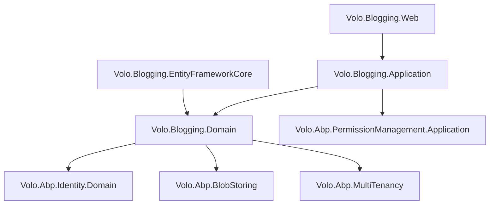

The Blogging module is a standalone, full-featured blogging application that ships with ABP. It predates the CMS Kit module and provides a ready-to-use Razor Pages blogging UI complete with Markdown editor, comment threads, tagging, and social sharing. Unlike CMS Kit's modular building-block approach, Blogging is a self-contained application module with its own domain model, Razor Pages views, and admin back-end.

## Package Layout

<CardGroup cols={3}>
  <Card title="Domain.Shared" icon="cube">
    `Volo.Blogging.Domain.Shared` — `PostConsts`, `BlogConsts`, `CommentConsts`, `TagConsts`, error codes, localization resources, `BloggingRemoteServiceConsts`
  </Card>
  <Card title="Domain" icon="cube">
    `Volo.Blogging.Domain` — `Blog`, `Post`, `Comment`, `Tag`, `PostTag` entities; `IBlogRepository`, `IPostRepository`; `BloggingDomainModule`
  </Card>
  <Card title="Application.Contracts" icon="cube">
    `Volo.Blogging.Application.Contracts` — `IBlogAppService`, `IPostAppService`, `ICommentAppService`, `ITagAppService`, `IFileAppService`, `IMemberAppService`; all request/response DTOs
  </Card>
  <Card title="Application.Contracts.Shared" icon="cube">
    `Volo.Blogging.Application.Contracts.Shared` — DTOs shared between the public and admin application contract layers
  </Card>
  <Card title="Application" icon="cube">
    `Volo.Blogging.Application` — concrete service implementations
  </Card>
  <Card title="HttpApi / HttpApi.Client" icon="cube">
    `Volo.Blogging.HttpApi` — controllers under `/api/blogging`; `.HttpApi.Client` for generated proxies
  </Card>
  <Card title="EntityFrameworkCore / MongoDB" icon="database">
    `Volo.Blogging.EntityFrameworkCore` — `BloggingDbContext` with `Blogs`, `BlogPosts` (as `Posts`), `BlogComments`, `BlogTags`, `BlogPostTags` tables; MongoDB equivalents
  </Card>
  <Card title="Web" icon="browser">
    `Volo.Blogging.Web` — Razor Pages: blog list, single post view, Markdown editor, comment rendering, tag cloud, social sharing widgets
  </Card>
  <Card title="Admin packages" icon="shield">
    `Volo.Blogging.Admin.Application`, `Volo.Blogging.Admin.Application.Contracts`, `Volo.Blogging.Admin.HttpApi`, `Volo.Blogging.Admin.HttpApi.Client`, `Volo.Blogging.Admin.Web`
  </Card>
</CardGroup>

## Domain Model

### Blog

```csharp
public class Blog : FullAuditedAggregateRoot<Guid>
{
    [NotNull]
    public virtual string Name { get; protected set; }       // display name

    [NotNull]
    public virtual string ShortName { get; protected set; }  // URL slug, e.g. "tech"

    [CanBeNull]
    public virtual string Description { get; set; }
}
```

`ShortName` is the path segment used in routing (e.g., `/blog/tech/my-post`). Unlike the CmsKit `Blog`, the Blogging module's `Blog` uses `ShortName` rather than a normalized `Slug`.

### Post

`Post` is the main article aggregate. Note that it uses `Url` rather than `Slug` for the URL-friendly identifier, and owns a `Collection<PostTag>` for the tag relationship:

```csharp
public class Post : FullAuditedAggregateRoot<Guid>
{
    public virtual Guid BlogId { get; protected set; }

    [NotNull]
    public virtual string Title { get; protected set; }

    [NotNull]
    public virtual string Url { get; protected set; }    // URL segment for the post

    [NotNull]
    public virtual string CoverImage { get; set; }

    [CanBeNull]
    public virtual string Content { get; set; }          // Markdown content

    [CanBeNull]
    public virtual string Description { get; set; }

    public virtual int ReadCount { get; protected set; }

    public virtual Collection<PostTag> Tags { get; protected set; }
}
```

Domain behaviors:

```csharp
// Atomic tag management via owned collection
post.AddTag(tagId);
post.RemoveTag(tagId);

// Read count increment (no locking — acceptable eventual consistency)
post.IncreaseReadCount();
```

`PostCacheItem` provides a cached read model. `PostCacheInvalidator` listens to `EntityChangedEventData<Post>` events and invalidates the cache when a post is saved or deleted.

`PostChangedEvent` is a local domain event fired after post mutations — consumed by services that need to react to content changes (e.g., search indexers).

### Comment

Threaded comments with reply support:

```csharp
// From domain source structure
public class Comment : FullAuditedAggregateRoot<Guid>
{
    public virtual Guid BlogPostId { get; protected set; }
    public virtual string Text { get; protected set; }
    public virtual Guid? RepliedCommentId { get; protected set; }
    public virtual Guid CreatorId { get; set; }
}
```

Unlike CmsKit's `Comment` (which is polymorphic across entity types via `EntityType`/`EntityId`), the Blogging `Comment` is hardcoded to `BlogPostId`.

### Tag and PostTag

`Tag` is a simple named entity scoped to the blogging module:

```csharp
public class Tag : FullAuditedAggregateRoot<Guid>
{
    public virtual string Name { get; protected set; }
    public virtual int UsageCount { get; set; }  // denormalized count for tag cloud
}
```

`PostTag` is the junction entity:

```csharp
public class PostTag : Entity
{
    public virtual Guid PostId { get; protected set; }
    public virtual Guid TagId { get; protected set; }
}
```

`UsageCount` on `Tag` is a denormalized counter incremented/decremented when `PostTag` rows are added or removed. This avoids an aggregate query for tag cloud rendering.

### BloggingUser

Local replica of `IdentityUser` for cross-module data isolation, analogous to `CmsKit.CmsUser`. Synchronized via Identity distributed events.

## Repository Interfaces

```csharp
public interface IBlogRepository : IBasicRepository<Blog, Guid>
{
    Task<Blog> FindByShortNameAsync(string shortName, CancellationToken ct = default);
}

public interface IPostRepository : IBasicRepository<Post, Guid>
{
    Task<List<Post>> GetListAsync(
        int skipCount, int maxResultCount, Guid blogId,
        string filter = null, CancellationToken ct = default);

    Task<List<Post>> GetListByBlogIdAndTagNameAsync(
        Guid blogId, string tagName, CancellationToken ct = default);

    Task<Post> GetPostByUrlAsync(Guid blogId, string url, CancellationToken ct = default);
}
```

## Application Services

<CardGroup cols={2}>
  <Card title="IBlogAppService" icon="rss">
    List all blogs; get by short name. Read-only on the public surface.
  </Card>
  <Card title="IPostAppService" icon="file-lines">
    List posts (by blog, by tag); get single post; create/update/delete (requires auth). Hit `IncreaseReadCount` on GET.
  </Card>
  <Card title="ICommentAppService" icon="comments">
    Get comments for a post (threaded); create comment (requires auth); update/delete own comment.
  </Card>
  <Card title="ITagAppService" icon="tags">
    Get popular tags for a blog; search tags for auto-complete.
  </Card>
  <Card title="IFileAppService" icon="file-image">
    Upload images/files for blog post content (blob storage backend); returns a URL for inline embedding.
  </Card>
  <Card title="IMemberAppService" icon="user">
    Get blogger profile (username, avatar, post count) for author pages.
  </Card>
</CardGroup>

## Admin Module

`Volo.Blogging.Admin.*` provides back-office management:

| Admin Service | Purpose |
|---|---|
| `IBlogManagementAppService` | Create/update/delete blogs; configure blog settings |

Admin HTTP API routes: `/api/blogging/management/blogs` with `GET`/`POST`/`PUT`/`DELETE` methods. Admin UI adds a "Blogs" menu item under the administration section in Razor Pages Web.

## HTTP API Routes

| Verb | Route | Purpose |
|---|---|---|
| `GET` | `/api/blogging/blogs` | List all blogs |
| `GET` | `/api/blogging/blogs/{id}` | Single blog by id |
| `GET` | `/api/blogging/posts` | Paged post list |
| `GET` | `/api/blogging/posts/{id}` | Single post |
| `POST` | `/api/blogging/posts` | Create post |
| `PUT` | `/api/blogging/posts/{id}` | Update post |
| `DELETE` | `/api/blogging/posts/{id}` | Delete post |
| `GET` | `/api/blogging/comments` | Comments for a post |
| `POST` | `/api/blogging/comments` | Create comment |
| `PUT` | `/api/blogging/comments/{id}` | Edit own comment |
| `DELETE` | `/api/blogging/comments/{id}` | Delete comment |
| `GET` | `/api/blogging/tags` | Popular tags for a blog |
| `POST` | `/api/blogging/files/image` | Upload image |

## Distinction from CMS Kit Blog Feature

Both modules model blogs and posts but serve different purposes:

| Aspect | Blogging Module | CMS Kit Blog Feature |
|---|---|---|
| **Maturity** | Older, standalone module | Newer building-block |
| **UI** | Full Razor Pages blogging UI out of the box | Building blocks; UI must be assembled |
| **Comment model** | `BlogPostId` (hardcoded) | Polymorphic via `EntityType`/`EntityId` |
| **Slug field** | `Url` (no normalization) | `Slug` (via `SlugNormalizer`) |
| **Tag count** | Denormalized `UsageCount` on `Tag` | No denormalization |
| **Post status** | No status workflow | `Draft → WaitingForReview → Published` |
| **Global feature gate** | `BloggingModule.Enable/Disable` (module-level) | `CmsKitFeatures.BlogsFeature` (global feature) |
| **Recommendation** | Applications needing a ready-made blog | Applications building custom content pipelines |

<Note>
The ABP team recommends new projects use CMS Kit's blog feature rather than the standalone Blogging module, as CMS Kit's modular design is more composable. The Blogging module is maintained for backwards compatibility.
</Note>

## Module Dependencies



## Integration Points

### Blob Storage for Images

`IFileAppService.UploadAsync` saves the file binary to `IBlobContainer<BloggingFileContainerDefinition>`. The container name is `"blogging-files"`. Configure the blob provider:

```csharp
options.Containers.Configure<BloggingFileContainerDefinition>(c =>
{
    c.UseFileSystem(fs => fs.BasePath = "/var/blogfiles");
});
```

### PostChangedEvent

`PostChangedEvent` (local, `ILocalEventBus`) is fired after any post create/update/delete. Subscribe to invalidate search indexes or CDN caches:

```csharp
public class SearchIndexer : ILocalEventHandler<PostChangedEvent>, ITransientDependency
{
    public async Task HandleEventAsync(PostChangedEvent eventData)
    {
        await _searchService.IndexPostAsync(eventData.PostId);
    }
}
```

### Permission Definitions

`BloggingPermissions` defines:
- `BloggingPermissions.Posts.Create` / `.Update` / `.Delete`
- `BloggingPermissions.Comments.Create` / `.Update` / `.Delete`
- `BloggingPermissions.Blogs.Manage` (admin only)

These integrate with ABP's permission management — role/user grants are stored in `AbpPermissionGrants` via the Permission Management module.
