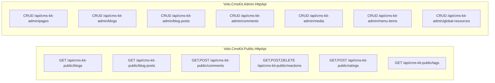
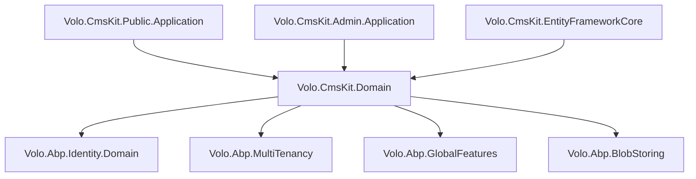

CMS Kit is ABP's modular content management toolkit. Rather than providing a monolithic CMS, it packages individual content primitives — pages, blogs, comments, reactions, ratings, tags, media, menus — as independently activatable features. Each feature can be enabled or disabled via ABP's Global Feature system, and each feature's HTTP API is split into a *Public* surface (consumer-facing, anonymous-accessible) and an *Admin* surface (authenticated management).

## Package Layout

<CardGroup cols={3}>
  <Card title="Domain.Shared" icon="cube">
    `Volo.CmsKit.Domain.Shared` — consts per entity (`BlogConsts`, `PageConsts`, etc.), `CmsKitFeatures` names, `BlogPostStatus` enum, localization resources
  </Card>
  <Card title="Domain" icon="cube">
    `Volo.CmsKit.Domain` — all aggregate roots and domain services organized by feature folder: `Blogs/`, `Pages/`, `Comments/`, `Reactions/`, `Ratings/`, `Tags/`, `MediaDescriptors/`, `Menus/`, `GlobalResources/`, `MarkedItems/`
  </Card>
  <Card title="Public API" icon="globe">
    `Volo.CmsKit.Public.Application`, `Volo.CmsKit.Public.Application.Contracts`, `Volo.CmsKit.Public.HttpApi`, `Volo.CmsKit.Public.HttpApi.Client`, `Volo.CmsKit.Public.Web`
  </Card>
  <Card title="Admin API" icon="shield">
    `Volo.CmsKit.Admin.Application`, `Volo.CmsKit.Admin.Application.Contracts`, `Volo.CmsKit.Admin.HttpApi`, `Volo.CmsKit.Admin.HttpApi.Client`, `Volo.CmsKit.Admin.Web`
  </Card>
  <Card title="Common API" icon="cube">
    `Volo.CmsKit.Common.Application`, `Volo.CmsKit.Common.Application.Contracts`, `Volo.CmsKit.Common.HttpApi`, `Volo.CmsKit.Common.HttpApi.Client`, `Volo.CmsKit.Common.Web` — shared DTOs and services used by both Public and Admin
  </Card>
  <Card title="Aggregate" icon="cube">
    `Volo.CmsKit.Application`, `Volo.CmsKit.HttpApi`, `Volo.CmsKit.Web` — meta-packages that reference both Public and Admin variants
  </Card>
  <Card title="EntityFrameworkCore / MongoDB" icon="database">
    `Volo.CmsKit.EntityFrameworkCore` — `CmsKitDbContext` with all feature tables; `Volo.CmsKit.MongoDB` for document storage
  </Card>
</CardGroup>

## Domain Model

### Page

`Page` is a URL-addressed content page with optional custom script/style and a layout reference:

```csharp
public class Page : FullAuditedAggregateRoot<Guid>, IMultiTenant, IHasEntityVersion
{
    public virtual string Title { get; protected set; }
    public virtual string Slug { get; protected set; }     // normalized via SlugNormalizer
    public virtual string Content { get; protected set; }
    public virtual string Script { get; protected set; }
    public virtual string Style { get; protected set; }
    public virtual bool IsHomePage { get; protected set; }
    public virtual string LayoutName { get; protected set; }
    public virtual PageStatus Status { get; protected set; } // Draft | Published
}
```

`PageManager` enforces slug uniqueness via `IPageRepository.FindBySlugAsync` and manages the `IsHomePage` constraint — only one page may be designated as home at a time (throws `MultipleHomePageException` otherwise).

### Blog and BlogPost

`Blog` is the channel/category aggregate:

```csharp
public class Blog : FullAuditedAggregateRoot<Guid>, IMultiTenant
{
    public virtual string Name { get; protected set; }
    public virtual string Slug { get; protected set; }  // URL-safe identifier, e.g. "tech-news"
    public virtual Guid? TenantId { get; protected set; }
}
```

`BlogPost` is the article aggregate. It carries a status machine (`Draft → WaitingForReview → Published`):

```csharp
public class BlogPost : FullAuditedAggregateRoot<Guid>, IMultiTenant, IHasEntityVersion
{
    public virtual Guid BlogId { get; protected set; }

    [NotNull]
    public virtual string Title { get; protected set; }

    [NotNull]
    public virtual string Slug { get; protected set; }

    // ShortDescription is optional (can be null)
    public virtual string ShortDescription { get; protected set; }

    public virtual string Content { get; protected set; }
    public virtual Guid? CoverImageMediaId { get; set; }
    public virtual Guid? TenantId { get; protected set; }
    public Guid AuthorId { get; set; }
    public virtual CmsUser Author { get; set; }
    public virtual BlogPostStatus Status { get; set; }  // Draft|WaitingForReview|Published
    public virtual int EntityVersion { get; protected set; }
}
```

`BlogPostManager` enforces per-blog slug uniqueness (throws `BlogPostSlugAlreadyExistException`). `BlogFeatureManager` gates per-blog feature toggles (Comments, Reactions, Rating) independently for each `Blog`.

### Comment

`Comment` supports threaded discussions attached to any entity type (not just blog posts) via the `EntityType` + `EntityId` polymorphic reference:

```csharp
public class Comment : AggregateRoot<Guid>, IHasCreationTime, IMustHaveCreator, IMultiTenant
{
    public virtual Guid? TenantId { get; protected set; }
    public virtual string EntityType { get; protected set; }  // e.g. "BlogPost"
    public virtual string EntityId { get; protected set; }    // target entity id as string
    public virtual string Text { get; protected set; }
    public virtual Guid? RepliedCommentId { get; protected set; }
    public virtual Guid CreatorId { get; set; }
    public virtual DateTime CreationTime { get; set; }
    public virtual string Url { get; set; }                   // optional external URL
    public virtual string IdempotencyToken { get; set; }      // duplicate-submission guard
    public virtual bool? IsApproved { get; private set; }     // null=pending, true=approved, false=rejected
}
```

`Comment` uses `Approve()`, `Reject()`, and `WaitForApproval()` methods to transition the `IsApproved` state. This supports comment moderation workflows.

`ICommentEntityTypeDefinitionStore` maintains a whitelist of entity types that are allowed to have comments. The default implementation reads from `CmsKitCommentOptions.EntityTypes` which modules register into.

### UserReaction

Emoji/thumbs-up reactions on any commentable entity, one record per (user, entityType, entityId, reactionName):

```csharp
public class UserReaction : BasicAggregateRoot<Guid>, IHasCreationTime, IMustHaveCreator, IMultiTenant
{
    public virtual string EntityType { get; protected set; }
    public virtual string EntityId { get; protected set; }
    public virtual string ReactionName { get; protected set; }
    public virtual Guid CreatorId { get; set; }
    public virtual Guid? TenantId { get; protected set; }
}
```

`ReactionDefinition` objects (not DB entities) define the available emoji/reaction names per entity type. `DefaultReactionDefinitionStore` reads from `CmsKitReactionOptions.EntityTypes`. `ReactionManager` enforces uniqueness (a user can only have one reaction per entity).

### Rating

Star ratings (1–5) per entity, one record per (user, entityType, entityId):

```csharp
public class Rating : BasicAggregateRoot<Guid>, IHasCreationTime, IMustHaveCreator
{
    public virtual string EntityType { get; protected set; }
    public virtual string EntityId { get; protected set; }
    public virtual short StarCount { get; protected set; }  // 1–5, validated in SetStarCount
    public virtual Guid CreatorId { get; set; }
    public virtual Guid? TenantId { get; protected set; }
}
```

`RatingManager.SetRatingAsync` upserts — creates a new `Rating` or updates the star count on an existing one for the same user/entity combination.

### Tag and EntityTag

`Tag` defines a named label scoped to an entity type:

```csharp
public class Tag : FullAuditedAggregateRoot<Guid>, IMultiTenant
{
    public virtual string EntityType { get; protected set; }  // "BlogPost", "Page", etc.
    public virtual string Name { get; protected set; }
}
```

`EntityTag` is the junction entity linking tags to specific entity instances (e.g., `BlogPost` with ID `xyz` → `Tag` "abp"). `EntityTagManager` handles attach/detach and validates that the entity type is registered as taggable in `CmsKitTagOptions`.

### MediaDescriptor

Stores metadata about uploaded media files. The file binary is stored by the `IBlobContainer<CmsKitMediaContainerDefinition>` blob provider — `MediaDescriptor` only records the file's metadata:

```csharp
// Domain structure (source)
public class MediaDescriptor : FullAuditedAggregateRoot<Guid>, IMultiTenant
{
    public virtual string EntityType { get; protected set; }
    public virtual string Name { get; protected set; }
    public virtual string MimeType { get; protected set; }
    public virtual long Size { get; protected set; }
    public virtual Guid? TenantId { get; protected set; }
}
```

### MenuItem (Menus)

`MenuItem` models a navigation menu tree. Each item has a type (URL, Route, Page), optional icon, ordering, and optional target.

### GlobalResource

`GlobalResource` stores global CSS/JavaScript snippets injected into every page via Razor Pages `<script>` / `<style>` sections.

## Public vs Admin API Split

The Public/Admin split is a first-class architectural concern:



Public endpoints are generally anonymous-accessible (controlled per-entity-type via `PolicySpecifiedDefinition`). Admin endpoints require `CmsKit.Pages.Create`, `CmsKit.Blogs.Update`, etc. permissions.

The two surfaces use **separate application service interfaces**. For example:
- `Volo.CmsKit.Public.Application.Contracts` → `IBlogPostPublicAppService` (list/get for anonymous consumers)
- `Volo.CmsKit.Admin.Application.Contracts` → `IBlogPostAdminAppService` (full CRUD for administrators)

## Global Features

CmsKit uses ABP's `GlobalFeatureManager` to allow features to be compiled out at startup. Each feature is a class name constant in `CmsKitFeatures`:

| Global Feature Name | Controls |
|---|---|
| `CmsKitFeatures.BlogsFeature` | Blog + BlogPost entities and controllers |
| `CmsKitFeatures.PagesFeature` | Page entity and controllers |
| `CmsKitFeatures.CommentsFeature` | Comment entity and controllers |
| `CmsKitFeatures.ReactionsFeature` | UserReaction entity and controllers |
| `CmsKitFeatures.RatingsFeature` | Rating entity and controllers |
| `CmsKitFeatures.TagsFeature` | Tag + EntityTag entities and controllers |
| `CmsKitFeatures.MediaDescriptorsFeature` | MediaDescriptor + blob upload |
| `CmsKitFeatures.MenusFeature` | MenuItem entity and controllers |
| `CmsKitFeatures.GlobalResourcesFeature` | GlobalResource entity and controllers |

Activation in a module class:

```csharp
GlobalFeatureManager.Instance.Modules.CmsKit().EnableAll();

// Or selectively:
GlobalFeatureManager.Instance.Modules.CmsKit(kit =>
{
    kit.Pages.Enable();
    kit.Blogs.Enable();
    kit.Comments.Enable();
});
```

<Warning>
Global features are evaluated at application startup before DI container construction. Features disabled here are not registered in DI — there is no way to toggle them at runtime without restarting the process.
</Warning>

## Per-Blog Feature Toggles

Within the Blogs feature, CmsKit supports per-blog activation of Comments, Reactions, and Rating via `BlogFeature` entities:

```csharp
public class BlogFeature : Entity<Guid>, IMultiTenant
{
    public virtual Guid BlogId { get; protected set; }
    public virtual string FeatureName { get; protected set; }  // "Reactions", "Comments", etc.
    public virtual bool IsEnabled { get; set; }
    public virtual Guid? TenantId { get; protected set; }
}
```

`BlogFeatureManager.SetAsync(blogId, featureName, isEnabled)` writes to `IBlogFeatureRepository`. The default for new blogs is provided by `IDefaultBlogFeatureProvider` (configurable via `DefaultBlogFeatureProvider`).

## Module Dependencies



## Integration Points

### SlugNormalizer

`SlugNormalizer.Normalize(string slug)` converts arbitrary input to URL-safe lowercase slugs (spaces → hyphens, accents stripped). Used by `Page`, `Blog`, and `BlogPost` `SetSlug` methods. Custom normalization can be injected by replacing `ISlugNormalizer` in DI.

### CmsUser

`CmsUser` is a local replica of the `IdentityUser` stored in the CmsKit database. It is synchronized from `IdentityUser` via event handler and used for author info on blog posts and comments — avoiding joins across module database boundaries in multi-DB setups.

### Media Blob Container

File uploads go through ABP's blob-storing abstraction. The container name is `CmsKitMediaContainerDefinition.ContainerName`. Configure the blob provider in `AbpBlobStoringOptions`:

```csharp
options.Containers.Configure<CmsKitMediaContainerDefinition>(c =>
{
    c.UseFileSystem(fs => fs.BasePath = "/var/media");
    // or: c.UseAzure(...), c.UseAws(...)
});
```
