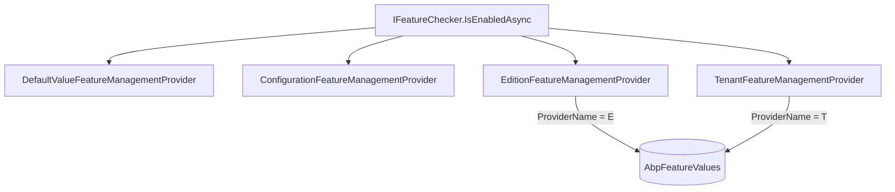
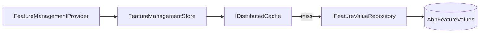
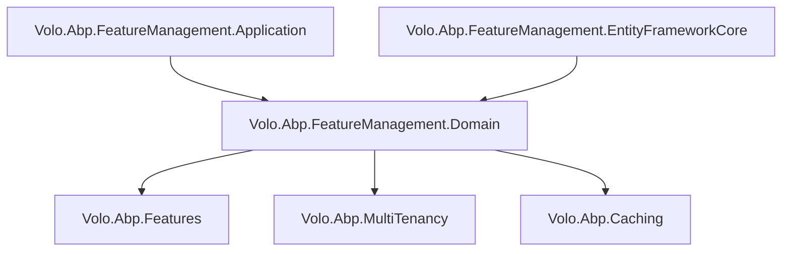

The Feature Management module provides persistent, scoped control over feature flags and value-based feature toggles. It implements ABP's `IFeatureStore` interface so that `IFeatureChecker` and `IFeatureManager` in the framework layer can read whether a feature is enabled per-tenant, per-edition, or globally, while this module handles storage, caching, and the management API.

## Package Layout

<CardGroup cols={3}>
  <Card title="Domain.Shared" icon="cube">
    `Volo.Abp.FeatureManagement.Domain.Shared` — `FeatureManagementOptions`, constants, error codes, shared localization
  </Card>
  <Card title="Domain" icon="cube">
    `Volo.Abp.FeatureManagement.Domain` — `FeatureValue`, `FeatureDefinitionRecord`, `FeatureGroupDefinitionRecord` entities; `IFeatureValueRepository`, `IFeatureManager`, `FeatureManager`, `FeatureManagementProvider`, `TenantFeatureManagementProvider`, `EditionFeatureManagementProvider`, `FeatureStore`, `DynamicFeatureDefinitionStore`, `StaticFeatureSaver`
  </Card>
  <Card title="Application.Contracts" icon="cube">
    `Volo.Abp.FeatureManagement.Application.Contracts` — `IFeatureAppService`, DTOs, permissions
  </Card>
  <Card title="Application" icon="cube">
    `Volo.Abp.FeatureManagement.Application` — `FeatureAppService` implementation
  </Card>
  <Card title="HttpApi / HttpApi.Client" icon="cube">
    `Volo.Abp.FeatureManagement.HttpApi` — `FeaturesController` (`/api/feature-management/features`); `.HttpApi.Client` for proxies
  </Card>
  <Card title="EntityFrameworkCore / MongoDB" icon="database">
    EF Core: `AbpFeatureManagementDbContext` with `AbpFeatureValues`, `AbpFeatureDefinitionRecords`, `AbpFeatureGroupDefinitionRecords` tables
  </Card>
  <Card title="Web / Blazor" icon="browser">
    `Volo.Abp.FeatureManagement.Web` — Feature management modal used in the Tenant Management UI; `.Blazor`, `.Blazor.Server`, `.Blazor.WebAssembly`, `.Blazor.MudBlazor` variants
  </Card>
</CardGroup>

## Domain Model

### FeatureValue

```csharp
public class FeatureValue : Entity<Guid>, IAggregateRoot<Guid>
{
    [NotNull]
    public virtual string Name { get; protected set; }         // feature definition name

    [NotNull]
    public virtual string Value { get; internal set; }         // "true"/"false" or arbitrary string

    [NotNull]
    public virtual string ProviderName { get; protected set; } // "T" | "E" | etc.

    [CanBeNull]
    public virtual string ProviderKey { get; protected set; }  // tenantId | editionId | null
}
```

Feature values are always serialized as strings, regardless of the feature's underlying value type (`ToggleStringValueType`, `FreeTextStringValueType`, `SelectionStringValueType`). The value type is part of the `FeatureDefinition` (in-memory), not the stored value.

### FeatureDefinitionRecord / FeatureGroupDefinitionRecord

These entities persist feature definitions to the database, enabling the same dynamic definition store pattern used by Permission Management and Setting Management:

- `StaticFeatureSaver` runs at startup and upserts all in-memory `FeatureDefinition` objects into `AbpFeatureDefinitionRecords`
- `DynamicFeatureDefinitionStore` loads and caches them via `IDynamicFeatureDefinitionStoreInMemoryCache`
- `StaticFeatureDefinitionChangedEventHandler` handles the distributed event to invalidate the in-memory cache across all instances

## Repository Interface

```csharp
public interface IFeatureValueRepository : IBasicRepository<FeatureValue, Guid>
{
    Task<FeatureValue> FindAsync(
        string name, string providerName, string providerKey,
        CancellationToken cancellationToken = default);

    Task<List<FeatureValue>> FindAllAsync(
        string name, string providerName, string providerKey,
        CancellationToken cancellationToken = default);

    Task<List<FeatureValue>> GetListAsync(
        string providerName, string providerKey,
        CancellationToken cancellationToken = default);

    Task DeleteAsync(
        string providerName, string providerKey,
        CancellationToken cancellationToken = default);
}
```

`FindAllAsync` (plural) returns all values matching a name pattern across provider keys — used for edition-inheritance lookups where multiple tenant overrides of the same feature need to be compared.

## Provider Chain Architecture

`IFeatureManagementProvider` implementations are registered in `FeatureManagementOptions.Providers` in priority order:



### Abstract Base: FeatureManagementProvider

`FeatureManagementProvider` delegates to `IFeatureManagementStore` (the caching layer over `IFeatureValueRepository`):

```csharp
public abstract class FeatureManagementProvider : IFeatureManagementProvider
{
    public abstract string Name { get; }

    protected virtual Task<string> NormalizeProviderKeyAsync(string providerKey)
        => Task.FromResult(providerKey);

    // HandleContextAsync is called before value retrieval to switch ambient tenant/scope
    public virtual Task<IAsyncDisposable> HandleContextAsync(
        string providerName, string providerKey)
        => Task.FromResult<IAsyncDisposable>(NullAsyncDisposable.Instance);
}
```

### TenantFeatureManagementProvider

Stores tenant-specific feature overrides. Its `HandleContextAsync` switches `ICurrentTenant` to the target tenant before value retrieval — ensuring that any downstream code during the check runs in the correct tenant context:

```csharp
public class TenantFeatureManagementProvider : FeatureManagementProvider
{
    public override string Name => TenantFeatureValueProvider.ProviderName; // "T"

    public override Task<IAsyncDisposable> HandleContextAsync(
        string providerName, string providerKey)
    {
        if (providerName == Name && Guid.TryParse(providerKey, out var tenantId))
        {
            var disposable = CurrentTenant.Change(tenantId);
            return Task.FromResult<IAsyncDisposable>(
                new AsyncDisposeFunc(() => { disposable.Dispose(); return Task.CompletedTask; }));
        }
        return base.HandleContextAsync(providerName, providerKey);
    }
}
```

### EditionFeatureManagementProvider

Used in SaaS scenarios where tenants belong to an *edition* (e.g., Free, Pro, Enterprise) that defines a baseline feature set. `ProviderName = "E"`, `ProviderKey = editionId`. Individual tenants can override edition defaults by writing a `TenantFeatureValue`.

### DefaultValueFeatureManagementProvider

Returns the `FeatureDefinition.DefaultValue` — no database access, just in-memory lookup. Always last in the chain, ensuring a value is always returned.

### ConfigurationFeatureManagementProvider

Reads from `IConfiguration["FeatureManagement:Features:<FeatureName>"]` — useful for environment-specific overrides in `appsettings.json` without database access.

## IFeatureManager (Domain Service)

```csharp
public interface IFeatureManager
{
    Task<string> GetOrNullAsync(string name, string providerName, string providerKey, bool fallback = true);

    Task<List<FeatureNameValue>> GetAllAsync(string providerName, string providerKey, bool fallback = true);

    Task<FeatureNameValueWithGrantedProvider> GetOrNullWithProviderAsync(
        string name, string providerName, string providerKey, bool fallback = true);

    Task<List<FeatureNameValueWithGrantedProvider>> GetAllWithProviderAsync(
        string providerName, string providerKey, bool fallback = true);

    Task SetAsync(string name, string value, string providerName, string providerKey, bool forceToSet = false);

    Task DeleteAsync(string providerName, string providerKey);
}
```

- `fallback = true` walks down the provider chain if the requested scope has no value, returning the effective value instead of null.
- `forceToSet = false` (default) skips writing when the value would be identical to the inherited default.
- `GetOrNullWithProviderAsync` / `GetAllWithProviderAsync` return `FeatureNameValueWithGrantedProvider` which includes which provider in the chain actually provided the value.

Extension methods in `TenantFeatureManagerExtensions` and `EditionFeatureManagerExtensions` provide scope-specific wrappers:

```csharp
// TenantFeatureManagerExtensions
await featureManager.SetForTenantAsync(tenantId, MyFeatures.DarkMode, "true");

// EditionFeatureManagerExtensions
await featureManager.SetForEditionAsync(editionId, MyFeatures.MaxUsers, "100");
```

## FeatureManagementStore & Caching

`IFeatureManagementStore` sits between `IFeatureManager`/`FeatureManagementProvider` and the repository, adding a distributed cache layer:



Cache keys: `fv:{providerName},{providerKey},{featureName}`. `FeatureValueCacheItemInvalidator` listens to `EntityChangedEventData<FeatureValue>` to evict stale entries.

## Application Service & HTTP API

`IFeatureAppService` exposes a resource-oriented pair of operations, parameterised by provider name and key (same pattern as Permission Management):

```csharp
public interface IFeatureAppService : IApplicationService
{
    Task<GetFeatureListResultDto> GetAsync(string providerName, string providerKey);
    Task UpdateAsync(string providerName, string providerKey, UpdateFeaturesDto input);
    Task DeleteAsync(string providerName, string providerKey);
}
```

### HTTP Endpoints

| Verb | Route | Purpose |
|---|---|---|
| `GET` | `/api/feature-management/features?providerName=T&providerKey={tenantId}` | Get features for a scope |
| `PUT` | `/api/feature-management/features?providerName=T&providerKey={tenantId}` | Bulk-update features for a scope |
| `DELETE` | `/api/feature-management/features?providerName=T&providerKey={tenantId}` | Reset scope to defaults |

The `GET` response includes, for each feature, its current value and whether the value is inherited from a parent scope (e.g., edition) or explicitly set. This drives the feature management modal in the Tenant Management UI.

## Module Dependencies



## Integration Points

### Plugging into IFeatureValueProvider

The framework's `IFeatureValueProvider` pipeline (in `Volo.Abp.Features`) is separate from `IFeatureManagementProvider`. The module registers `FeatureStore` as an `IFeatureValueProvider` via ABP's `AbpFeatureOptions.ValueProviders` list. At runtime:

1. `IFeatureChecker.IsEnabledAsync("MyFeature")` calls each `IFeatureValueProvider`
2. `FeatureStore` (registered by this module) queries `IFeatureManagementStore`
3. Providers are checked in order: User, Tenant, Edition, GlobalFeatureValueProvider (CmsKit), DefaultValue

### CmsKit Global Feature Toggle

`Volo.CmsKit.Domain` registers a `GlobalFeatureValueProvider` that reads from `GlobalFeatureManager` in-memory flags. This is separate from the database-backed feature management described here — it controls whether entire CmsKit sub-features (Comments, Reactions, etc.) are compiled in. Both systems co-exist in the provider chain.

### Tenant Deletion

Call `IFeatureManager.DeleteAsync("T", tenantId.ToString())` to purge all per-tenant feature value rows when a tenant is removed.
