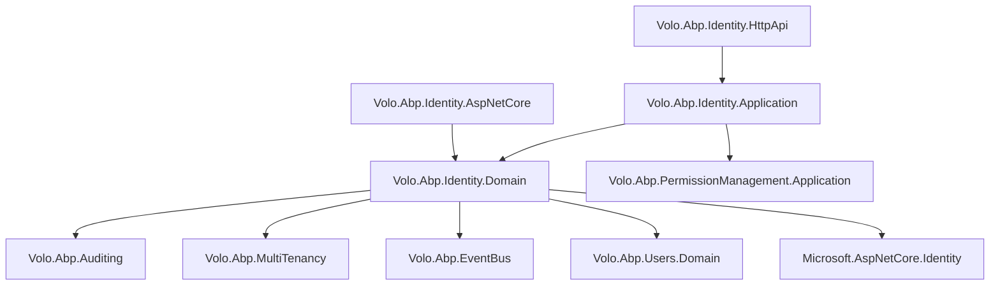

The Identity module is the foundational building block for user and role management in ABP applications. It wraps ASP.NET Core Identity with ABP conventions — DDD aggregates, multi-tenancy, distributed events, security logging, and a full HTTP API — while remaining swappable against custom implementations through its repository and service interfaces.

## Package Layout

<CardGroup cols={3}>
  <Card title="Domain.Shared" icon="cube">
    `Volo.Abp.Identity.Domain.Shared` — constants, enums, `IdentityConsts`, shared settings names (`IdentitySettingNames`), localization resources
  </Card>
  <Card title="Domain" icon="cube">
    `Volo.Abp.Identity.Domain` — aggregate roots, domain managers (`IdentityUserManager`, `IdentityRoleManager`, `OrganizationUnitManager`), repository interfaces, data seeders
  </Card>
  <Card title="Application.Contracts" icon="cube">
    `Volo.Abp.Identity.Application.Contracts` — `IIdentityUserAppService`, `IIdentityRoleAppService`, DTOs, permission definitions
  </Card>
  <Card title="Application" icon="cube">
    `Volo.Abp.Identity.Application` — concrete app service implementations wired to domain managers
  </Card>
  <Card title="HttpApi / HttpApi.Client" icon="cube">
    `Volo.Abp.Identity.HttpApi` — `IdentityUserController` (`/api/identity/users`), `IdentityRoleController` (`/api/identity/roles`); `.HttpApi.Client` for generated HTTP client proxies
  </Card>
  <Card title="AspNetCore" icon="cube">
    `Volo.Abp.Identity.AspNetCore` — ASP.NET Core Identity service registrations, `AbpUserClaimsPrincipalFactory`, `IdentityUserStore`, `IdentityRoleStore`
  </Card>
  <Card title="EntityFrameworkCore / MongoDB" icon="database">
    EF Core: `AbpIdentityDbContext` with Identity tables. MongoDB: collection-per-aggregate mapping
  </Card>
  <Card title="Web" icon="browser">
    `Volo.Abp.Identity.Web` — Razor Pages UI for user and role management
  </Card>
  <Card title="Blazor variants" icon="browser">
    `Volo.Abp.Identity.Blazor`, `.Blazor.Server`, `.Blazor.WebAssembly`, `.Blazor.MudBlazor` — Blazor Server/WASM/MudBlazor management pages
  </Card>
</CardGroup>

## Domain Model

### IdentityUser

`IdentityUser` is the central aggregate root, inheriting `FullAuditedAggregateRoot<Guid>` and implementing both `IUser` (ABP shared user contract) and `IHasEntityVersion` (optimistic-concurrency version counter).

```csharp
public class IdentityUser : FullAuditedAggregateRoot<Guid>, IUser, IHasEntityVersion
{
    public virtual Guid? TenantId { get; protected set; }
    public virtual string UserName { get; protected internal set; }

    [DisableAuditing]
    public virtual string NormalizedUserName { get; protected internal set; }

    [CanBeNull]
    public virtual string Name { get; set; }

    [CanBeNull]
    public virtual string Surname { get; set; }

    public virtual string Email { get; protected internal set; }

    [DisableAuditing]
    public virtual string NormalizedEmail { get; protected internal set; }

    public virtual bool EmailConfirmed { get; protected internal set; }

    [DisableAuditing]
    public virtual string PasswordHash { get; protected internal set; }

    [DisableAuditing]
    public virtual string SecurityStamp { get; protected internal set; }

    public virtual bool IsExternal { get; set; }

    [CanBeNull]
    public virtual string PhoneNumber { get; protected internal set; }

    public virtual bool PhoneNumberConfirmed { get; protected internal set; }
    public virtual bool IsActive { get; protected internal set; }
    public virtual bool TwoFactorEnabled { get; protected internal set; }
    public virtual DateTimeOffset? LockoutEnd { get; protected internal set; }
    public virtual bool LockoutEnabled { get; protected internal set; }
    public virtual int AccessFailedCount { get; protected internal set; }
    public virtual bool ShouldChangePasswordOnNextLogin { get; protected internal set; }
    public virtual int EntityVersion { get; protected set; }
    public virtual DateTimeOffset? LastPasswordChangeTime { get; protected set; }
    public virtual DateTimeOffset? LastSignInTime { get; protected set; }
    public virtual bool Leaved { get; protected set; }

    // Owned collections — loaded via includes
    public virtual ICollection<IdentityUserRole> Roles { get; protected set; }
    public virtual ICollection<IdentityUserClaim> Claims { get; protected set; }
    public virtual ICollection<IdentityUserLogin> Logins { get; protected set; }
    public virtual ICollection<IdentityUserToken> Tokens { get; protected set; }
    public virtual ICollection<IdentityUserOrganizationUnit> OrganizationUnits { get; protected set; }
    public virtual ICollection<IdentityUserPasswordHistory> PasswordHistories { get; protected set; }
    public virtual ICollection<IdentityUserPasskey> Passkeys { get; protected set; }
}
```

Key domain behaviors on the aggregate (no direct `DbContext` calls):

- `AddRole(Guid roleId)` / `RemoveRole` / `IsInRole` — mutates the `Roles` collection
- `AddClaim(IGuidGenerator, Claim)` / `AddClaims` / `ReplaceClaim` / `RemoveClaim` — ID generation stays inside the aggregate
- `AddLogin(UserLoginInfo)` / `RemoveLogin` — external login provider associations
- `SetToken` / `FindToken` / `RemoveToken` — per-provider authentication tokens
- `AddOrganizationUnit(Guid)` / `RemoveOrganizationUnit` / `IsInOrganizationUnit` — OU membership
- `AddPasswordHistory(string)` — previous password hash for password-reuse policy
- `AddPasskey(byte[] credentialId, IdentityPasskeyData)` / `FindPasskey` / `RemovePasskey` — WebAuthn FIDO2 credential support
- `SetLeaved(bool)` — marks user as having left a tenant without deleting the record
- `SetIsActive`, `SetShouldChangePasswordOnNextLogin`, `SetLastPasswordChangeTime`, `SetLastSignInTime` — guarded setters for protected properties

<Note>
Properties like `PasswordHash`, `SecurityStamp`, `NormalizedUserName`, and `NormalizedEmail` carry `[DisableAuditing]` to prevent them from appearing in audit trails.
</Note>

### IdentityRole

```csharp
public class IdentityRole : AggregateRoot<Guid>, IMultiTenant, IHasEntityVersion, IHasCreationTime
{
    public virtual Guid? TenantId { get; protected set; }
    public virtual string Name { get; protected internal set; }

    [DisableAuditing]
    public virtual string NormalizedName { get; protected internal set; }

    public virtual bool IsDefault { get; set; }   // auto-assigned to new users
    public virtual bool IsStatic { get; set; }    // cannot be deleted/renamed
    public virtual bool IsPublic { get; set; }    // visible to other users
    public virtual int EntityVersion { get; protected set; }
    public virtual DateTime CreationTime { get; protected set; }
    public virtual ICollection<IdentityRoleClaim> Claims { get; protected set; }
}
```

`ChangeName` adds both a local event (`IdentityRoleNameChangedEvent`) and a distributed ETO (`IdentityRoleNameChangedEto`) so other services can react without coupling.

### OrganizationUnit

`OrganizationUnit` models a tree hierarchy using a hierarchical code string (e.g., `"00001.00042.00005"`):

```csharp
public class OrganizationUnit : FullAuditedAggregateRoot<Guid>, IMultiTenant, IHasEntityVersion
{
    public virtual Guid? ParentId { get; internal set; }
    public virtual string Code { get; internal set; }       // "00001.00042"
    public virtual string DisplayName { get; set; }
    public virtual ICollection<OrganizationUnitRole> Roles { get; protected set; }
}
```

Static helpers `CreateCode`, `AppendCode`, `CalculateNextCode`, and `GetParentCode` encode all hierarchical arithmetic in pure C# with no database lookups.

### Supporting Entities

| Entity | Purpose |
|---|---|
| `IdentityClaimType` | Definition of custom claim types (string, int, bool, DateTime) |
| `IdentitySecurityLog` | Audit of login/logout/password-change events |
| `IdentitySession` | Tracks active sessions for single-device logout |
| `IdentityLinkUser` | Links accounts across tenants or providers |
| `IdentityUserDelegation` | Grants one user the ability to impersonate another |
| `IdentityUserPasswordHistory` | Previous password hashes for password-reuse policy |
| `IdentityUserPasskey` | WebAuthn FIDO2 credential storage |

## Domain Services

### IdentityUserManager

`IdentityUserManager` extends ASP.NET Core's `UserManager<IdentityUser>` and is registered as a domain service. It injects ABP-specific dependencies alongside the standard Identity stack:

```csharp
public class IdentityUserManager : UserManager<IdentityUser>, IDomainService
{
    protected IIdentityRoleRepository RoleRepository { get; }
    protected IIdentityUserRepository UserRepository { get; }
    protected IOrganizationUnitRepository OrganizationUnitRepository { get; }
    protected ISettingProvider SettingProvider { get; }
    protected IDistributedEventBus DistributedEventBus { get; }
    protected IDistributedCache<AbpDynamicClaimCacheItem> DynamicClaimCache { get; }
    // ...
}
```

Notable methods beyond standard `UserManager<T>`:
- `SetOrganizationUnitsAsync(IdentityUser, Guid[])` — replaces all OU memberships atomically
- `GetByIdAsync` — throws `EntityNotFoundException` instead of returning null
- `AddDefaultRolesAsync` — assigns all roles with `IsDefault = true` to a new user

### IdentityRoleManager

Wraps `RoleManager<IdentityRole>` and enforces constraints like disallowing deletion of static roles.

### OrganizationUnitManager

Handles tree-code assignment, move operations (requires recalculating all descendant codes), and role/user assignments to OUs.

### IdentityClaimTypeManager

CRUD for custom claim type definitions; validates that claim type names are unique.

### IdentitySecurityLogManager

Writes `IdentitySecurityLog` entries. Configured via `AbpSecurityLogOptions`. The default store persists to the same DB as the Identity tables.

### IdentityLinkUserManager

Manages cross-tenant and cross-provider user account linking. Allows a user to be linked to multiple accounts (e.g., the same person across different tenants).

### IdentityUserDelegationManager

Creates and revokes `IdentityUserDelegation` records, which allow one user to act on behalf of another for a specified time window.

## Application Services

<CardGroup cols={2}>
  <Card title="IIdentityUserAppService" icon="users">
    CRUD for users; get roles; set roles; get/set OUs; lock/unlock; two-factor toggle; send email confirmation
  </Card>
  <Card title="IIdentityRoleAppService" icon="shield">
    CRUD for roles; get all (for role-picker UIs); get users in role
  </Card>
  <Card title="IOrganizationUnitAppService" icon="sitemap">
    CRUD for OUs; move; add/remove members; add/remove roles
  </Card>
  <Card title="IIdentityClaimTypeAppService" icon="tag">
    CRUD for claim types; enforces unique name constraint
  </Card>
  <Card title="IIdentitySecurityLogAppService" icon="clock-rotate-left">
    Paginated query of security logs with filtering by action/user/date
  </Card>
  <Card title="IIdentitySessionAppService" icon="desktop">
    List and revoke active sessions; used by "manage devices" UI
  </Card>
</CardGroup>

## HTTP API

All controllers live under the `identity` remote service area:

| Verb | Route | Purpose |
|---|---|---|
| `GET` | `/api/identity/users` | Paged user list |
| `GET` | `/api/identity/users/{id}` | Single user |
| `POST` | `/api/identity/users` | Create user |
| `PUT` | `/api/identity/users/{id}` | Update user |
| `DELETE` | `/api/identity/users/{id}` | Delete user |
| `GET` | `/api/identity/users/{id}/roles` | Roles for a user |
| `GET` | `/api/identity/roles` | Paged role list |
| `GET` | `/api/identity/roles/all` | Full (unpaged) role list |
| `POST` | `/api/identity/roles` | Create role |
| `PUT` | `/api/identity/roles/{id}` | Update role |
| `DELETE` | `/api/identity/roles/{id}` | Delete role |

`IdentityUserIntegrationController` under `/integration-api/identity/users` exposes internal look-up endpoints consumed by other ABP modules (e.g., Permission Management) rather than by the end-user UI. It uses a separate route prefix (`integration-api`) to allow different authorization policies from the public API.

## Module Dependencies



## Integration Points

### Settings Defined

`AbpIdentitySettingDefinitionProvider` registers settings under `IdentitySettingNames`:

- **Password policy** — `RequiredLength`, `RequireDigit`, `RequireUppercase`, `RequireSpecialChar`
- **Lockout** — `LockoutEnabled`, `MaxFailedAccessAttempts`, `LockoutDuration`
- **Signin** — `RequireConfirmedEmail`, `RequireConfirmedPhoneNumber`
- **User** — `IsUserNameUpdateEnabled`, `IsEmailUpdateEnabled`
- **OrganizationUnit** — `MaxUserMembershipCount`

### Distributed Events Published

| ETO | Trigger |
|---|---|
| `IdentityRoleNameChangedEto` | `IdentityRole.ChangeName()` |
| `UserEto` (via ABP Users) | User created/updated/deleted |

### External Login Provider Extension

Implement `IExternalLoginProvider` (or `IExternalLoginProviderWithPassword` for providers that accept credentials) and register it in `ExternalLoginProviderDictionary`. `IdentityUserManager` iterates registered providers during login to authenticate against external identity sources without ASP.NET Core cookie schemes.

### Dynamic Claims

`IdentityDynamicClaimsPrincipalContributor` reads live role/claim data from the database and injects them into the `ClaimsPrincipal` at request time, bypassing stale cookie claims. Results are cached via `IdentityDynamicClaimsPrincipalContributorCache` (invalidated on user update via `UserEntityUpdatedOrDeletedEventHandler`).
