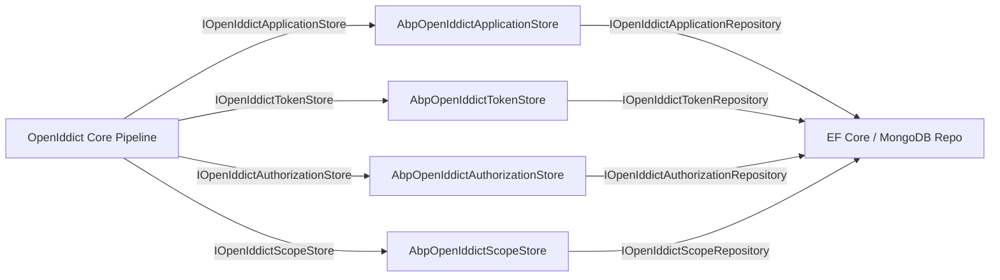
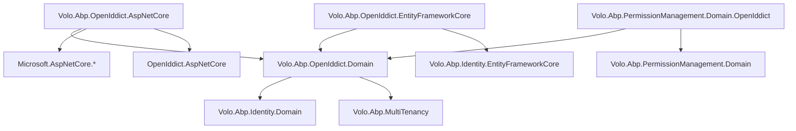

The OpenIddict module wires the [OpenIddict](https://github.com/openiddict/openiddict-core) OAuth 2.0 / OpenID Connect server library into ABP's domain-driven infrastructure. It replaces the older IdentityServer4-based module and provides persistence for the four core OpenIddict object types — applications, scopes, tokens, and authorizations — through ABP's repository pattern backed by either Entity Framework Core or MongoDB.

## Package Layout

<CardGroup cols={3}>
  <Card title="Domain.Shared" icon="cube">
    `Volo.Abp.OpenIddict.Domain.Shared` — constants, `AbpOpenIddictDbProperties`, localization resources shared across all layers
  </Card>
  <Card title="Domain" icon="cube">
    `Volo.Abp.OpenIddict.Domain` — four aggregate roots, ABP store adapters (`AbpOpenIddictApplicationStore` etc.), cache implementations, `TokenCleanupBackgroundWorker`, data-seed base class
  </Card>
  <Card title="AspNetCore" icon="cube">
    `Volo.Abp.OpenIddict.AspNetCore` — OpenIddict server/validation pipeline registrations, ABP middleware integration, grant handlers (authorization code, client credentials, device, PKCE, refresh token, password)
  </Card>
  <Card title="EntityFrameworkCore" icon="database">
    `Volo.Abp.OpenIddict.EntityFrameworkCore` — `AbpOpenIddictDbContext`, EF Core repository implementations, `IOpenIddictApplicationRepository`, `IOpenIddictTokenRepository`, etc.
  </Card>
  <Card title="MongoDB" icon="database">
    `Volo.Abp.OpenIddict.MongoDB` — MongoDB collection mapping and repository implementations
  </Card>
  <Card title="Permission.Domain.OpenIddict" icon="shield">
    `Volo.Abp.PermissionManagement.Domain.OpenIddict` — `ClientPermissionManagementProvider` that allows granting permissions directly to OAuth2 client IDs
  </Card>
</CardGroup>

<Note>
There is no Application/HttpApi layer in the OpenIddict module itself. Management of applications and scopes is exposed through ABP's back-office UI packages (e.g., the ABP Suite–generated admin pages) or via the OpenIddict management APIs in the commercial suite. The open-source module ships only domain + persistence + server pipeline.
</Note>

## Domain Model

### OpenIddictApplication

Represents an OAuth2 / OIDC client registration. Stored as a `FullAuditedAggregateRoot<Guid>`:

```csharp
public class OpenIddictApplication : FullAuditedAggregateRoot<Guid>
{
    public virtual string ClientId { get; set; }
    public virtual string ClientSecret { get; set; }   // hashed by manager
    public virtual string ClientType { get; set; }     // "public" | "confidential"
    public virtual string ApplicationType { get; set; }
    public virtual string ConsentType { get; set; }    // "explicit" | "implicit" | "external"
    public virtual string DisplayName { get; set; }
    public virtual string DisplayNames { get; set; }   // JSON: localized names
    public virtual string Permissions { get; set; }    // JSON array of granted endpoints/grants
    public virtual string RedirectUris { get; set; }   // JSON array
    public virtual string PostLogoutRedirectUris { get; set; }
    public virtual string Requirements { get; set; }   // e.g. PKCE requirement
    public virtual string Settings { get; set; }
    public virtual string JsonWebKeySet { get; set; }
    public virtual string FrontChannelLogoutUri { get; set; }
}
```

All multi-value fields (URIs, permissions, display names) are JSON-serialized strings — OpenIddict's core library handles serialization/deserialization through its manager abstraction.

### OpenIddictScope

Defines an OAuth2 scope that can be granted to clients:

```csharp
public class OpenIddictScope : FullAuditedAggregateRoot<Guid>
{
    public virtual string Name { get; set; }           // unique scope identifier
    public virtual string DisplayName { get; set; }
    public virtual string Description { get; set; }
    public virtual string Resources { get; set; }      // JSON array of audience resource names
    public virtual string Properties { get; set; }
}
```

### OpenIddictAuthorization

Records a user's consent grant, linking a subject (user ID) to an application and a set of scopes:

```csharp
public class OpenIddictAuthorization : AggregateRoot<Guid>
{
    public virtual Guid? ApplicationId { get; set; }
    public virtual string Subject { get; set; }   // user identifier
    public virtual string Scopes { get; set; }    // JSON array
    public virtual string Status { get; set; }    // "valid" | "redeemed" | "revoked"
    public virtual string Type { get; set; }      // "permanent" | "ad-hoc"
    public virtual DateTime? CreationDate { get; set; }
}
```

### OpenIddictToken

Stores issued tokens (access tokens, refresh tokens, authorization codes, device codes):

```csharp
public class OpenIddictToken : AggregateRoot<Guid>
{
    public virtual Guid? ApplicationId { get; set; }
    public virtual Guid? AuthorizationId { get; set; }
    public virtual string Type { get; set; }           // "access_token" | "refresh_token" | ...
    public virtual string Status { get; set; }         // "valid" | "redeemed" | "revoked"
    public virtual string Subject { get; set; }
    public virtual string Payload { get; set; }        // reference token payload (encrypted)
    public virtual string ReferenceId { get; set; }    // hashed reference ID
    public virtual DateTime? CreationDate { get; set; }
    public virtual DateTime? ExpirationDate { get; set; }
    public virtual DateTime? RedemptionDate { get; set; }
}
```

## Store Architecture

OpenIddict's core library interacts with persistence through **store interfaces** (`IOpenIddictApplicationStore<T>`, `IOpenIddictTokenStore<T>`, etc.). ABP provides concrete implementations that delegate to ABP repositories:



`AbpOpenIddictStoreBase<TStore, TModel, TEntity, TRepository>` provides the shared plumbing: `Guid`-to-`string` ID conversion via `AbpOpenIddictIdentifierConverter`, optimistic concurrency exception handling through `IOpenIddictDbConcurrencyExceptionHandler`, and object-to-model mapping via AutoMapper.

Each entity has a companion **cache** (`AbpOpenIddictApplicationCache`, `AbpOpenIddictTokenCache`, etc.) that wraps the store in ABP's `IDistributedCache`, reducing database round-trips during token validation.

## Manager Extensions

ABP derives custom managers from OpenIddict's built-in ones:

| Manager | Base | Purpose |
|---|---|---|
| `AbpApplicationManager` | `OpenIddictApplicationManager<T>` | Adds ABP-specific application descriptor support (`AbpApplicationDescriptor`) |
| `AbpTokenManager` | `OpenIddictTokenManager<T>` | Hooks into ABP's UoW to ensure token operations participate in the current unit of work |
| `AbpAuthorizationManager` | `OpenIddictAuthorizationManager<T>` | Same UoW integration |
| `AbpScopeManager` | `OpenIddictScopeManager<T>` | Same UoW integration |

## Token Cleanup

Expired and revoked tokens accumulate over time. `TokenCleanupBackgroundWorker` runs on a configurable interval and calls `TokenCleanupService`:

```csharp
// TokenCleanupOptions defaults
public class TokenCleanupOptions
{
    public int CleanupPeriod { get; set; } = 3_600_000; // 1 hour in ms
    public int CleanupCount { get; set; } = 2_000;       // max tokens removed per run
    public bool IsCleanupEnabled { get; set; } = true;
}
```

The worker only runs on the host process (not inside tenants) to avoid duplicate cleanup across the multi-tenant boundary.

## Data Seeding

`OpenIddictDataSeedContributorBase` provides the base class for seeding initial client registrations. Applications implement `CreateClientAsync(AbpApplicationDescriptor descriptor)` in their data seed contributor:

```csharp
public class MyOpenIddictDataSeedContributor : OpenIddictDataSeedContributorBase
{
    protected override async Task CreateApplicationsAsync()
    {
        // Create or update the web client
        await CreateClientAsync(new AbpApplicationDescriptor
        {
            ClientId = "MyApp_Web",
            ClientType = OpenIddictConstants.ClientTypes.Confidential,
            ConsentType = OpenIddictConstants.ConsentTypes.Implicit,
            // ...
        });
    }
}
```

## Replacing IdentityServer4

Prior to ABP v6.x, `Volo.Abp.IdentityServer` was the default OAuth2 server. The migration path:

<Steps>
  <Step title="Replace packages">
    Remove `Volo.Abp.IdentityServer.*` packages; add `Volo.Abp.OpenIddict.*` equivalents in each project layer.
  </Step>
  <Step title="Update module dependencies">
    Replace `AbpIdentityServerDomainModule` with `AbpOpenIddictDomainModule` and `AbpOpenIddictAspNetCoreModule` in module classes.
  </Step>
  <Step title="Migrate database">
    OpenIddict uses different table names (`OpenIddictApplications`, `OpenIddictTokens`, etc.) vs IdentityServer's `Clients`, `ApiResources` tables. A migration script or a fresh EF migration is required.
  </Step>
  <Step title="Re-seed clients">
    Update data seed contributors to use `AbpApplicationDescriptor` / `AbpOpenIddictDataSeedContributorBase` instead of IdentityServer's `IdentityServerDataSeedContributor`.
  </Step>
  <Step title="Update Account.Web">
    Switch from `Volo.Abp.Account.Web.IdentityServer` to `Volo.Abp.Account.Web.OpenIddict`.
  </Step>
</Steps>

## Module Dependencies



## Integration Points

### ClientPermissionManagementProvider

`Volo.Abp.PermissionManagement.Domain.OpenIddict` registers `ClientPermissionManagementProvider`, which stores `PermissionGrant` records with `ProviderName = "C"` (client) and `ProviderKey = <clientId>`. This enables granting API permissions directly to a machine-to-machine OAuth2 client without a user.

### Events

OpenIddict itself raises no ABP distributed events. Token lifecycle changes (creation, revocation, redemption) are managed synchronously inside the OpenIddict pipeline. Applications that need to react to token events can hook into OpenIddict's event system via `IOpenIddictServerHandler<T>` rather than ABP's `IDistributedEventBus`.
