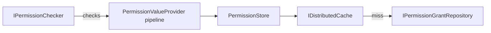
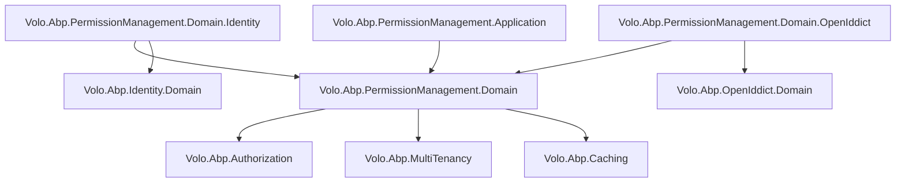

The Permission Management module bridges ABP's authorization framework (which defines *what* permissions exist) and the runtime storage that records *which principals have been granted those permissions*. It persists `PermissionGrant` records and exposes them through a layered provider architecture — with built-in providers for roles, users, and OAuth2 clients — while keeping the core `IPermissionChecker` in the framework layer completely decoupled from storage.

## Package Layout

<CardGroup cols={3}>
  <Card title="Domain.Shared" icon="cube">
    `Volo.Abp.PermissionManagement.Domain.Shared` — constants, `PermissionManagementOptions`, `PermissionManagementErrorCodes`, shared localization
  </Card>
  <Card title="Domain" icon="cube">
    `Volo.Abp.PermissionManagement.Domain` — `PermissionGrant`, `PermissionDefinitionRecord`, `PermissionGroupDefinitionRecord` entities; `PermissionManager`, `PermissionStore`, `DynamicPermissionDefinitionStore`, serializer, data seeder
  </Card>
  <Card title="Application.Contracts" icon="cube">
    `Volo.Abp.PermissionManagement.Application.Contracts` — `IPermissionAppService`, DTOs, permission definitions for the management UI itself
  </Card>
  <Card title="Application" icon="cube">
    `Volo.Abp.PermissionManagement.Application` — `PermissionAppService` implementation
  </Card>
  <Card title="HttpApi / HttpApi.Client" icon="cube">
    `Volo.Abp.PermissionManagement.HttpApi` — `PermissionsController` (`/api/permission-management/permissions`); `.HttpApi.Client` for proxies
  </Card>
  <Card title="EntityFrameworkCore / MongoDB" icon="database">
    EF Core: `AbpPermissionManagementDbContext` with `AbpPermissionGrants`, `AbpPermissionDefinitionRecords`, `AbpPermissionGroupDefinitionRecords` tables
  </Card>
  <Card title="Identity providers" icon="shield">
    `Volo.Abp.PermissionManagement.Domain.Identity` — `RolePermissionManagementProvider`, `UserPermissionManagementProvider`, and their resource-permission equivalents
  </Card>
  <Card title="OpenIddict providers" icon="shield">
    `Volo.Abp.PermissionManagement.Domain.OpenIddict` — `ClientPermissionManagementProvider` for OAuth2 client permissions
  </Card>
  <Card title="Web / Blazor" icon="browser">
    `Volo.Abp.PermissionManagement.Web` — Permission management modal; `.Blazor`, `.Blazor.Server`, `.Blazor.WebAssembly` variants
  </Card>
</CardGroup>

## Domain Model

### PermissionGrant

`PermissionGrant` is the single persistence entity in this module — one row per (permission, providerName, providerKey, tenantId) combination:

```csharp
public class PermissionGrant : Entity<Guid>, IMultiTenant
{
    public virtual Guid? TenantId { get; protected set; }

    [NotNull]
    public virtual string Name { get; protected set; }         // e.g. "AbpIdentity.Users"

    [NotNull]
    public virtual string ProviderName { get; protected set; } // "R" | "U" | "C"

    [CanBeNull]
    public virtual string ProviderKey { get; protected internal set; } // role name | user id | client id
}
```

The combination `(Name, ProviderName, ProviderKey, TenantId)` has a unique index in both EF Core and MongoDB mappings.

### PermissionDefinitionRecord / PermissionGroupDefinitionRecord

These two entities persist dynamically-added permission definitions to the database. This enables:
- **Microservice scenarios** where each service defines its own permissions but all are managed centrally
- **Runtime permission addition** without redeploying the host

`StaticPermissionSaver` runs at startup and synchronises in-memory `PermissionDefinition` objects (registered via `PermissionDefinitionProvider`) into these database records. `DynamicPermissionDefinitionStore` reads them back, with an in-memory cache backed by `IDynamicPermissionDefinitionStoreInMemoryCache`.

## Repository Interface

```csharp
public interface IPermissionGrantRepository : IBasicRepository<PermissionGrant, Guid>
{
    Task<PermissionGrant> FindAsync(
        string name,
        string providerName,
        string providerKey,
        CancellationToken cancellationToken = default);

    Task<List<PermissionGrant>> GetListAsync(
        string providerName,
        string providerKey,
        CancellationToken cancellationToken = default);

    Task<List<PermissionGrant>> GetListAsync(
        string[] names,
        string providerName,
        string providerKey,
        CancellationToken cancellationToken = default);
}
```

The bulk `GetListAsync(string[] names, ...)` overload is used by the provider `CheckAsync` path to fetch multiple permission checks in a single query.

## Permission Manager

`IPermissionManager` is the domain service used by the application layer and UI to read and write grants:

```csharp
public interface IPermissionManager
{
    Task<PermissionWithGrantedProviders> GetAsync(
        string permissionName, string providerName, string providerKey);

    Task<MultiplePermissionWithGrantedProviders> GetAsync(
        string[] permissionNames, string providerName, string providerKey);

    Task<List<PermissionWithGrantedProviders>> GetAllAsync(
        string providerName, string providerKey);

    Task SetAsync(
        string permissionName, string providerName,
        string providerKey, bool isGranted);

    Task<PermissionGrant> UpdateProviderKeyAsync(
        PermissionGrant permissionGrant, string providerKey);

    Task DeleteAsync(string providerName, string providerKey);
}
```

`SetAsync` delegates to the appropriate `IPermissionManagementProvider` implementation to persist (or remove) the grant.

## Permission Management Provider Chain

The provider pattern is the core extension mechanism. Each provider is registered in `PermissionManagementOptions.ManagementProviders`:

```mermaid
graph TD
    PM[PermissionManager.SetAsync]
    PM --> RP[RolePermissionManagementProvider]
    PM --> UP[UserPermissionManagementProvider]
    PM --> CP[ClientPermissionManagementProvider]
    RP -->|ProviderName = "R"| DB[(PermissionGrants)]
    UP -->|ProviderName = "U"| DB
    CP -->|ProviderName = "C"| DB
```

### Abstract Base: PermissionManagementProvider

```csharp
public abstract class PermissionManagementProvider : IPermissionManagementProvider
{
    public abstract string Name { get; }  // "R", "U", or "C"

    public virtual async Task<MultiplePermissionValueProviderGrantInfo> CheckAsync(
        string[] names, string providerName, string providerKey)
    {
        // Only processes requests where providerName == this.Name
        if (providerName != Name)
            return new MultiplePermissionValueProviderGrantInfo(names);

        var grants = await PermissionGrantRepository
            .GetListAsync(names, providerName, providerKey);

        // Map results
        foreach (var permissionName in names)
        {
            var isGrant = grants.Any(x => x.Name == permissionName);
            result[permissionName] = new PermissionValueProviderGrantInfo(isGrant, providerKey);
        }
        return result;
    }
}
```

### RolePermissionManagementProvider

Checks grants for the `"R"` provider. When the request comes in for a *user* (provider `"U"`), it also resolves the user's roles via `IUserRoleFinder` and merges in role-level grants — this is the cross-provider inheritance that makes role-based permissions cascade to users:

```csharp
public class RolePermissionManagementProvider : PermissionManagementProvider
{
    public override string Name => RolePermissionValueProvider.ProviderName; // "R"

    public override async Task<MultiplePermissionValueProviderGrantInfo> CheckAsync(
        string[] names, string providerName, string providerKey)
    {
        // Direct role grants
        if (providerName == Name)
            grants.AddRange(await repo.GetListAsync(names, providerName, providerKey));

        // Role grants inherited by user
        if (providerName == UserPermissionValueProvider.ProviderName
            && Guid.TryParse(providerKey, out var userId))
        {
            var roleNames = await UserRoleFinder.GetRoleNamesAsync(userId);
            foreach (var roleName in roleNames)
                grants.AddRange(await repo.GetListAsync(names, Name, roleName));
        }
        // ...
    }
}
```

### UserPermissionManagementProvider

Stores and retrieves user-specific grants (`ProviderName = "U"`, `ProviderKey = userId.ToString()`). These grants are additive on top of role grants.

### ClientPermissionManagementProvider

Registered by `Volo.Abp.PermissionManagement.Domain.OpenIddict`. Stores grants for OAuth2 machine-to-machine clients (`ProviderName = "C"`, `ProviderKey = clientId`). Used to authorize API-to-API calls.

## Permission Store (Runtime Check Path)

`PermissionStore` implements `IPermissionValueProvider` from the authorization framework. It is the bridge between ABP's `IPermissionChecker` and this module's `PermissionGrant` table:



Cache keys are structured as `pn:{providerName},{providerKey},{permissionName},{tenantId}`. `PermissionGrantCacheItemInvalidator` listens to `EntityChangedEventData<PermissionGrant>` (EF Core change tracking events) and invalidates affected cache entries.

## Application Service & HTTP API

`IPermissionAppService` exposes operations for managing standard and resource-level permissions:

```csharp
public interface IPermissionAppService : IApplicationService
{
    // Standard permission grant management
    Task<GetPermissionListResultDto> GetAsync(string providerName, string providerKey);
    Task<GetPermissionListResultDto> GetByGroupAsync(string groupName, string providerName, string providerKey);
    Task UpdateAsync(string providerName, string providerKey, UpdatePermissionsDto input);

    // Resource-level permission management
    Task<GetResourceProviderListResultDto> GetResourceProviderKeyLookupServicesAsync(string resourceName);
    Task<SearchProviderKeyListResultDto> SearchResourceProviderKeyAsync(string resourceName, string serviceName, string filter, int page);
    Task<GetResourcePermissionDefinitionListResultDto> GetResourceDefinitionsAsync(string resourceName);
    Task<GetResourcePermissionListResultDto> GetResourceAsync(string resourceName, string resourceKey);
    Task<GetResourcePermissionWithProviderListResultDto> GetResourceByProviderAsync(string resourceName, string resourceKey, string providerName, string providerKey);
    Task UpdateResourceAsync(string resourceName, string resourceKey, UpdateResourcePermissionsDto input);
    Task DeleteResourceAsync(string resourceName, string resourceKey, string providerName, string providerKey);
}
```

### HTTP Endpoints

| Verb | Route | Purpose |
|---|---|---|
| `GET` | `/api/permission-management/permissions?providerName=R&providerKey=admin` | Get permissions for a principal |
| `PUT` | `/api/permission-management/permissions?providerName=R&providerKey=admin` | Bulk-update grants for a principal |

The `GET` response includes, for each permission, which provider currently grants it (`GrantedProviders`). This powers the permission management modal in the UI, which shows checkboxes with tooltips indicating whether a given permission is inherited via a role.

The `PUT` body sends a flat array of `{ name, isGranted }` objects. The application service iterates them and calls `IPermissionManager.SetAsync` for each that differs from the current state.

## Resource-Level Permissions

Beyond global permission grants, the module also supports **resource permissions** — grants scoped to a specific entity instance (e.g., permission on document ID `xyz`):

- `ResourcePermissionGrant` — same shape as `PermissionGrant` but with an additional `ResourceId` field
- `IResourcePermissionGrantRepository` / `IResourcePermissionManager` — CRUD and check operations
- `ResourcePermissionManagementProvider` — provider implementation; providers are looked up via `IResourcePermissionProviderKeyLookupService`

<Tip>
Resource-level permissions are useful for content-management scenarios where the same `Document.Edit` permission is granted to different users for different document IDs, without proliferating role definitions.
</Tip>

## Module Dependencies


